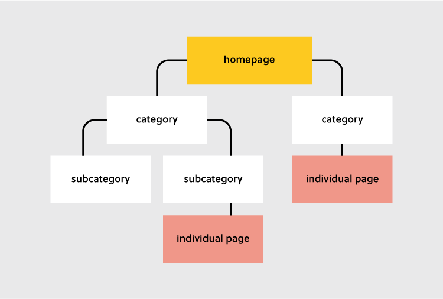
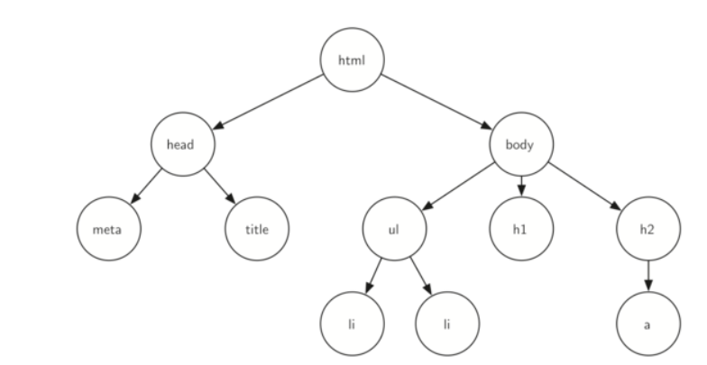
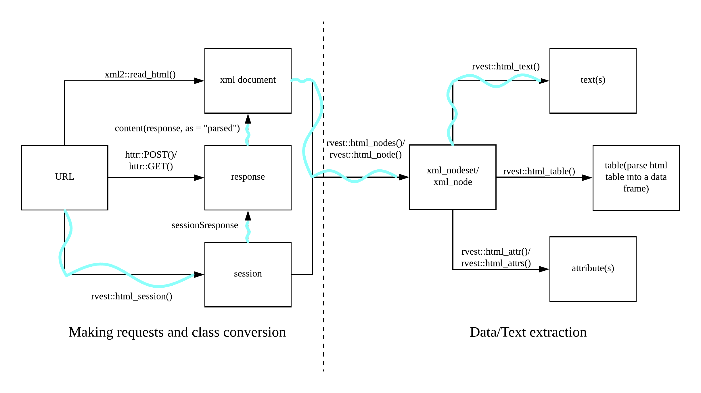
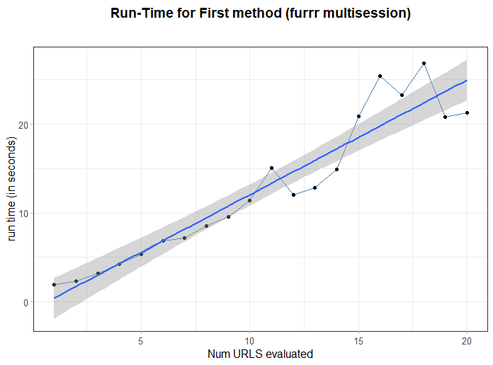
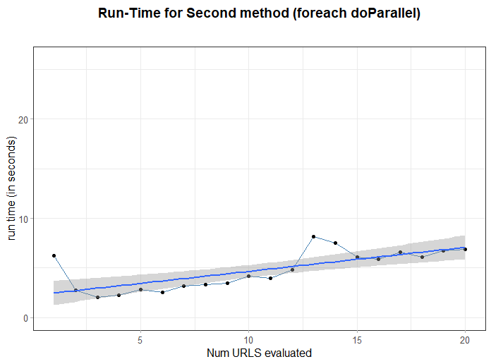

# Scraping {#scraping}


```{r, echo=FALSE, warning=FALSE}
library(knitr)
opts_chunk$set(tidy.opts=list(width.cutoff=80),tidy=TRUE)
```


## What is Web Scraping 

Web Scraping is a techniques that involves informatics and statistics aimed at extracting data from static or dynamic internet web pages. It can be done automatically and simultaneously as well as by a scheduler that palns its execution at a given time. Due to the absence of API's to call regarding Milan Real Estate rental markets, this practice has to be forcly applied. The reason behind that and personal hope is to open source the scraping API so that in the future further analysis will be available without putting effort in gathering data fresh data.
_Content distribution is managed by HTTP protocols, which are a common standard to connect web clients. Web browsers (i.e. one among the others web clients) download the content and parses them making possible to read them_The athomical unit of measurement in scraping is the url, which are the locations where this data exchanges abstractly happens._ [ questo in API infra ]
Data/content in webpages is the most of the times well organized and accessible by urls. This is made possible by the effort put into building both the _website structure_ and the _content architecture_. For website structure it is meant the way urls, pointing to webpages, are arranged throughout the website.
Website structure constitutes a _first dimension_ of hierarchy. Some popular structures examples might regard social-networks where posts can be scrolled down within a single page named the wall. Scrolling down might end due to fewer posts, but the perception is a never-ending webpage associated to a single url. Instead personal profiles are dedicated to a specified unique url and even in profiles posts are allocated into a sub domain and might be scrolled down arranged by time since the day of social subscription. Online newspapers display their articles in the front wall and by accessing to one of them all the related following articles sometimes can be reached by an arrow, pointing right or left. Articles can also be suggested and the more the website is explored the more articles are likely to be seen twice within the same session. It will soon end up into a suggestion loop that it will recursively shows the same contents; recursive structures are popular in newspaper-type websites. Online Retailers as Amazon, based on filters, groups inside a single webpage (i.e. page n° 1) a fixed set of items, having their dedicated personal url attached to them. Furthermore Amazon offers the opportunity to skip to the following page (i.e. page n° 2), searching for another different and fixed set of items and so on until the last page/url. Generally website structures try to reflect both the user expectations with respect to the product on the website and the design expression of the web developer. For these reasons for each websites usage category exists a multitude of content architectures. For each content architectures there are multiple front end languages which are destinated to multiple end users. In the future expectations are tailor made webpages on users with respect to its personal preferences. Moreover web design in scraping plays an important role since the more sophisticated graphical technologies are implied, the harder will be to scrape information. 



A _second dimension_ of hierarchy is brought by content architecture in the name of the language used for content creation and organization i.e. HTML. HTML stands for Hyper Text Markup Language and ... 
HTML drives the hierarchy structure that is then generalized to the website structure. According to this point of view the hierarchical website structure is a consequence of the content architecture by means of HTML language ( _arborescence_: direction from root to leaves).
CSS language stands for Cascading Style Sheets and takes care of the style of the webpage. The combination of HTML and CSS offers a wide flexibility in building web sites, once again expressed by the vast amount of different designs on the web. Some websites' components also might be tuned by Javascript language, which in the context of scraping adds a further layer of difficulty. As a matter of fact since Javascript components are dynamic within the webpage, scraping requires specialized libraries to enable different parser to get the content. CSS allows the scraper to target a class of objects in the web page that shares same style (e.g. same css query) so that each element that belongs to the class (i.e. share same style) can be gathered. This practice provides enormous advantages since by CSS a set of objects can be obtained within a single function call. 
First and Second dimension of the scraping problem imply hierarchy, a simple way to approach the problem is to represent it through already known data structures. One way to imagine hierarchy in both of the two dimensions are graph based data structures named as **Rooted Trees**. By analyzing the first dimension through the lenses of Rooted trees it is possible to compress the whole problem into the general graph based jargon [@Graph-Diestel]. Rooted trees must start with a root node which is the domain of the web page. Each _Node_ is a url destination and each _Edge_ is the connection between nodes. Connections have been made possible in the website by nesting urls inside webpages so that within a single webpage the user can access to a number of other related links. Furthermore, as an extension to the rooted tree framework a general graph theory component is introduced, i.e. the _Weight_. Each edge is associated to a weight whose interpretation is the run time cost to walk from a node to its conncted other nodes (e.g. from a url to the other). In addition the content inside each node takes the name of payload, which ultimately is the scope of the scraping processes. The walk from node 17 to node 8 in figure below (even though that is the case of a binary rooted tree) is called path and it represented as an ordered list of nodes connected by edges. In this context each node can have both a fixed and variable outgoing sub-nodes that are called _Children_ . When root trees have a fixed set of children are called _k-ary_ rooted trees. A node is said to be _Parent_ to other nodes when it is connected to them by outgoing edge, in right figure below "head" is the parent of nodes "title" and "meta". Nodes in the tree that shares the same parent node are said _Siblings_, "head" and "body" are siblings in figure \@ref(tree_html). Moreover _Subtrees_ are a set of nodes and edges comprised of a parent and its descendants e.g. node "body" with all of its descendants might constitute a subtree. The concept of subtree in both of the dimensions plays crucial role in cutting run time scraping processes and fake headers provision (see section \@ref(spoofing)). If the website strucuture is locally reproducible and the content architecture within webpages tends to be equal, then functions for a single subtree might be extended to the rest of others subtrees that are siblings to the same parent node. Local reproducibility is a property according to which starting from a single url all the related urls can be inferred from a pattern. Equal content architecture throughout different single links means to have sort of standard shared-within advs criteria that each single rental advertisement has to refer. In addition two more metrics have might better describe the tree: _level_ and _height_. The level of a node $\mathbf{L}$ counts the number of edges on the path from the root node to $\mathbf{L}$. The height is the maximum level for any node in the tree, from now on $\mathbf{H}$. What is worth to be anticipating is that functions are not going to be applied directly to siblings in the more general rooted tree. Instead it would be better segmenting the highest level rooted tree into a sequence of single subtrees whose roots are the siblings for reasons explained in section \@ref(spoofing).



###  Immobiliare.it Webscraping website structure

The structure of the website resembles the one encountered for the popular online retailer Amazon. According to the query filters (e.g. number of rooms 5, price less than 600 p.m. etc), the url is shaped so that each further filter added is appended at the end to the domain url `https://www.immobiliare.it/` root node (see figure below). Once filters are all applied to the root domain this constitutes the new url root domain node that might have this appereance: `https://www.immobiliare.it/affitto-case/milano/?criterio=rilevanza&superficieMinima=60`.  Since this is true only for page n°1 and contains the first 25 advs all the remaining siblings nodes corresponding to next pages have to be generated. Here comes handy the Local reproducibility property introduced in the previous section. The rest of the siblings, i.e. the ones belonging to page 2 (with the attached 25 advs) and to page 3 can be generated by appending `&pag=n` at the end of the url, where n is the page number reference (from now on referred as _pagination_). For page number 4 the exact url that points to the web page, being equal the filters from above, is  `https://www.immobiliare.it/affitto-case/milano/?criterio=rilevanza&superficieMinima=60&pag=4`. Author customary choice is to stop pagination up to 300 pages since spatial data can not be to large due to computational burdens. Moreover thanks to the reverse engineer applied to url building tree height $\mathbf{H}$ is pruned, so the parsing part is cut short. At this point pagination has generated a list of siblings urls whose children number is fixed (i.e. 25 per page). That makes those trees k-ary, where k is 25 indicating the number of children. K-ary trees with equal content structure shared across siblings allow to design a single function to call that could be mapped to all the other siblings. In addition in order to further disassemble the website and making available the whole set of single rental advertisement links for each page (ranging from 1 to 300) a specific function has been made. As a consequence a single function call `scrape_href()` can grab all the links inside page 1. The function is then iterated along all the previously generated siblings (i.e. pages) obtaining a collection of all the single ads links belonging to the set of pages generated. 


### Immobiliare.it Webscraping content architecture with `rvest`

To start a general scraping function it is required a target url (i.e. the filtered root node url). Then a `html_session` nested list object is opened by specifying the url and  the request data that the user need to send to the web server (see left part to dashed line image \@ref(workflow)). Information to be attached to the web server request will be further explored later, tough they are mainly three: User Agents, emails references and proxy servers. `html_session` objects contains a number of useful information such as: the url, the response, coockies, session times etc. Once the connection is established (request response 200) all the following operations rely on the opened session, in other words for the time being in the session the user will be authorized with the before-provided characteristics through the request.
The list object contains mostly the html content of the webpage and that is where data needs to be parsed and collected. The list as said can disclose other interesting metadata that might be interesting but is beyond the scope of the analysis.
The workflow below schematize what scraping is doing:



In the right part of the dashed vertical line is represented a sequence of `rvest` functions that follow a general step by step text comprehension rules. `rvest` first handles parsing the html content of the web page within the session object `read_html()`, secondly looking for a single node `html_nodes()` through CSS. CSS is the way to tell `rvest` to point to a precise node in the webpage and this is brought by query. Thirdly it converts the content into readable text with `html_text()`. The entire process can be also thought as an autoencoder, where adding decoding layer after layer on top of the starting url, it can be reached the final requested payload data wanted. The reason why the process appear straightforward and simple relies in the blending with `rvest` by the pipe `%>%` operator. Below it is shown a function that exemplifies scrapping the price.

```{r genscraping, tidy=FALSE, linewidth = 70}
scrapeprice.imm = function(session) {
  
  opensess = read_html(session)
  price  = opensess %>% 
    html_nodes(css =".im-mainFeatures__title") %>% 
    html_text() %>%
    str_trim() 
  
  if(is.null(price) || identical(price, character(0))) {
    price2 = opensess %>%
      html_nodes(css ='.im-features__value , .im-features__title') %>% 
      html_text() %>%
      str_trim()
    
    if ("prezzo" %in% price2) {
      pos = match("prezzo",price2)
      return(price2[pos+1])  %>% 
        str_replace_all(c("€"="","\\."="")) %>% 
        str_extract( "\\-*\\d+\\.*\\d*") %>%  
        str_replace_na() %>% 
        str_replace("NA", "Prezzo Su Richiesta")
    } else {
      return(NA_character_)
    }
  } else {
    return(price) %>% 
      str_replace_all(c("€"="","\\."="")) %>% 
      str_extract( "\\-*\\d+\\.*\\d*") %>%  
      str_replace_na() %>% 
      str_replace("NA", "Prezzo Su Richiesta")
      
  }
  
}
```

The function takes as a single argument a session object which is initialized in one other function. Then It reads the inner html content in the session storing the information into an obj called the `opensess`. Another obj is created, namely price, right after the pipe operator a css query into the html is called. The css query `.im-mainFeatures__title` points to a precise data stored in immobiliare web page header, right below the main title. Expectation are that price is a one-element chr vector, containing the price and some other unnecessary characters. Then the algorithm enters into the first `if` statement. The handler checks if the object `price` is empty. If it doesn't the algorithm jumps to the end of the algorithm and returns the cleaned quantity. But If it does it takes again the `opensess` and redirect to a second css query `.im-features__value , .im-features__title` where price, once again in the webpage, could be found. Please note that This is all done within the same session, so no more request additional information has to be sent. Since the latter css query points to data stored inside a list, for the time being the newly created obj price2 is a list containing various information. Then the algorithm flow enters into the second `if` statement that checks whether the `"prezzo"` is matched the list or not, if it does it returns the +1 position index element with respect to the "prezzo" positioning. This happens because data in price2 list are stored by couples sequentially, e.g. [title, "Appartamento Sempione", energy class, "G", "prezzo", 1200/al mese]. When it returns the element corresponding to +1 position index it applies also some data wrangling with `stringr` package to keep out overabundant characters. The function then escapes in the else statement by setting `price2 = NA_Character_` once no css query could be finding the price information. the _character-string_ type has to be imposed due to fact that later they can not be bind. In other words if the function is evaluated for a url and returns the price quantity, but then is evaluated for url2 and outputs NA (no character) then results can not be combined into dataframe due to different types.

Once all the functions have been created they need to be called together and then data coming after them need to be combined. This is done by `get,data.catsing()` which at first checks the validity of the url, then takes the same url as input and filters it as a session object. Then simultaneously all the functions are called and then combined. All this happens inside a `foreach` parallel loop called by `scrape.all.info()` 


```{r scrapeallinfo, tidy = FALSE, linewidth = 70, eval = FALSE, echo = TRUE, size = "tiny"}
scrape.all.info = function(url = "https://www.immobiliare.it/affitto-case...",
                           vedi = FALSE, 
                           scrivi = FALSE, 
                           silent = FALSE){
  if (silent) {
    start = as_hms(Sys.time()); cat('Starting the process...\n\n')
    message('\nThe process has started in',format(start,usetz = TRUE))  
  }
  # open parallel multisession
  cl = makeCluster(detectCores()-1) #using max cores - 1 for parallel processing
  registerDoParallel(cl)
  start = as_hms(Sys.time())
  
  if (silent) {
    message('\n\nStart all the requests at time:', format(start,usetz = T))  
  }
  ALL = foreach(i = seq_along(links),
                .packages = lista.pacchetti,
                .combine = "bind_rows",
                .multicombine = FALSE,
                .export ="links" ,
                .verbose = TRUE,
                .errorhandling='pass') %dopar% {
                  source("utils.R")
                  sourceEntireFolder("functions_singolourl")
                  get.data.catsing = function(singolourl){
                    
                    # dormi()
                    # 
                    if(!is_url(singolourl)){
                      stop(paste0("The following url does not seem either to exist or it is invalid", singolourl))
                    }
                    
                    session = html_session(singolourl, user_agent(agents[sample(1)]))
                    if (class(session) == "session") {
                      session = session$response  
                    }
                      
                    id         = tryCatch({scrapehouse.ID(session)},
                                          error = function(e){ message("some problem occured in scrapehouse.ID") })
                    lat        = tryCatch({scrapelat.imm(session)},
                                          error = function(e){ message("some problem occured in scrapelat.imm") })
                    long       = tryCatch({scrapelong.imm(session)},
                                          error = function(e){ message("some problem occured in scrapelong.imm") })
                    location   = tryCatch({take.address(session)},
                                          error = function(e){ message("some problem occured in take.address") })
                    condom     = tryCatch({scrapecondom.imm(session)},
                                          error = function(e){ message("some problem occured in scrapecondom.imm") })
                    buildage   = tryCatch({scrapeagebuild.imm(session)},
                                          error = function(e){ message("some problem occured in scrapeagebuild.imm") })
                    
                  ...
                  
                   combine = tibble(ID        = id,
                                     LAT       = lat, 
                                     LONG      = long,
                                     LOCATION  = location,
                                     CONDOM    = condom,
                                     BUILDAGE  = buildage,
                                    
                  ...
                  
                  
                  return(combine) 
                  }
  stopCluster(cl)
  return(ALL)
}
```

The skeleton constitutes a standard format adopted for many other scraping function used in the analysis. Being equal the css query what it changes is the matching term, i.e. "numero camere" instead of "prezzo" to look for how many rooms there are in the house. This is true for all the information contained in the list accessed by the fixed css query. Those that are not they are a few and they do not need to be scraped. 
In addition some other functions outputs need to undergo to further heavy cleaning steps in order to be usable As a consequence oh that functions need also to be broken down by pieces into many single .R files whose names correspond to each important information.
Below it is printed the tree structure folder that composes the main elements of the scraping procedure. It can be notices that the two folders, namely functions_singolourl and functions_url enclose all the single functions that allows to grab single information from session. Folders with a customized function are then sourced within the two main functions, scrape.all and scrape.all.info so data can be extracted.

```
 levelName
1  immobiliare.it-WebScraping     
2   ¦--functions_singolourl       
3   ¦   ¦--0scrapesqfeetINS.R     
4   ¦   ¦--0scrapenroomINS.R      
5   ¦   ¦--0scrapepriceINS.R      
6   ¦   ¦--0scrapetitleINS.R      
7   ¦   ¦--ScrapeAdDate.R         
8   ¦   ¦--ScrapeAge.R            
9   ¦   ¦--ScrapeAgeBuilding.R    
10  ¦   ¦--ScrapeAirConditioning.R
11  ¦   ¦--ScrapeAptChar.R        
12  ¦   ¦--ScrapeCatastInfo.R     
13  ¦   ¦--ScrapeCompart.R        
14  ¦   ¦--ScrapeCondom.R         
15  ¦   ¦--ScrapeContr.R          
16  ¦   ¦--ScrapeDisp.R           
17  ¦   ¦--ScrapeEnClass.R        
18  ¦   ¦--ScrapeFloor.R          
19  ¦   ¦--ScrapeHasMulti.R       
20  ¦   ¦--ScrapeHeating.R        
21  ¦   ¦--ScrapeHouseID.R        
22  ¦   ¦--ScrapeHouseTxtDes.R    
23  ¦   ¦--ScrapeLAT.R            
24  ¦   ¦--ScrapeLONG.R           
25  ¦   ¦--ScrapeLoweredPrice.R   
26  ¦   ¦--ScrapeMetrature.R      
27  ¦   ¦--ScrapePhotosNum.R      
28  ¦   ¦--ScrapePostAuto.R       
29  ¦   ¦--ScrapePropType.R       
30  ¦   ¦--ScrapeReaReview.R      
31  ¦   ¦--ScrapeStatus.R         
32  ¦   ¦--ScrapeTotPiani.R       
33  ¦   ¦--ScrapeType.R           
34  ¦   °--take_location.R        
35  ¦--scrapeALL.R                
36  ¦--scrapeALLINFO.R            
37  ¦--functions_url              
38  ¦   ¦--ScrapeHREF.R           
39  ¦   ¦--ScrapePrice.R          
40  ¦   ¦--ScrapePrimaryKey.R     
41  ¦   ¦--ScrapeRooms.R          
42  ¦   ¦--ScrapeSpace.R          
43  ¦   °--ScrapeTitle.R          
44  ¦--libs.R                     
45  ¦--utils.R                    
46  ¦--README.Rmd                 
47  ¦--README.md                  
48  °--simulations                
49      ¦--rt_match_vs_forloop.R  
50      °--runtime_simul.R
```


##  Scraping Best Practices and Robottxt{#best-practices}

Robots.txt files are (rivedi citation) a way to kindly ask webbots, spiders, crawlers, wanderers and the like to access or not access certain parts of a webpage. The de facto ‘standard’ never made it beyond a informal “Network Working Group INTERNET DRAFT”. Nonetheless, the use of robots.txt files is widespread (e.g. https://en.wikipedia.org/robots.txt, https://www.google.com/robots.txt) and bots from Google, Yahoo and the like will adhere to the rules defined in robots.txt files, although their _interpretation_ of those rules might differ.

Robots.txt files are plain text and always found at the root of a website's domain. The syntax of the files in essence follows a fieldname: value scheme with optional preceding user-agent: ... lines to indicate the scope of the following rule block. Blocks are separated by blank lines and the omission of a user-agent field (which directly corresponds to the HTTP user-agent field) is seen as referring to all bots. # serves to comment lines and parts of lines. Everything after # until the end of line is regarded a comment. Possible field names are: user-agent, disallow, allow, crawl-delay, sitemap, and host. For further notions [@robotstxt, @google:robottxt]

Some interpretation problems:

- finding no robots.txt file at the server (e.g. HTTP status code 404) implies that everything is permitted
- subdomains should have there own robots.txt file if not it is assumed that everything is allowed
- redirects involving protocol changes - e.g. upgrading from http to https - are followed and considered no domain or subdomain change - so whatever is found at the end of the redirect is considered to be the - robots.txt file for the original domain
- redirects from subdomain www to the doamin is considered no domain change - so whatever is found at the end of the redirect is considered to be the robots.txt file for the subdomain originally requested

For the thesis purposes it has been designed a dedicated function to inspect whether the domain requires specific actions or prevents some activity on thw target website. The following `checkpermission()` function has been integrated inside the scraping architecture and it is called once at the very beginning.

```{r, warning=FALSE}
library(robotstxt)
dominio = "immobiliare.it"

checkpermission = function(dom) {
  
  robot = robotstxt(domain = dom)
  vd = robot$check()[1]
  if (vd) {
    cat("\nrobot.txt for",dom, "is okay with scraping!")
  } else {cat("\nrobot.txt does not like what you're doing")
    ## stop()
  }
}
checkpermission(dominio)
```


Further improvements in this direction came from the `polite` package [@polite] which combines the power of the `robotstxt`, the `ratelimitr` to rate-limiting requests and the `memoise` for response caching. This package is wrapped up around 3 simple but effective ideas: 

> The three pillars of a polite session are seeking permission, taking slowly and never asking twice.

The three pillars constitute the Ethical web scraping manifesto [@densmore_2019] which are common
shared practises that are aimed to self regularize scrapers. This has not nothing to do with law but since many scrapers themselves, as website administrators or analyst, have fought with bots.
Bots might fake out real client logs and might stain analytics, so here it is born the choice to fine common ground and politely ask for permission.

## User agents, Proxies, Handlers 

HTTP requests to the website server by web clients come with some mandatory information packed in it. The process according to which HTTP protocols allow to exchange information can be easily thought with an  everyday real world analogy. As a generic person A rings the door's bell of person B's house. A comes to B door with its personal information, its name, surname, where he lives etc. At this point B may either answer to A requests by opening the door and let him enter given the set of information he has, or it may not since B is not sure of the real intentions of A. This typical everyday situation in nothing more what happens billions of times on the internet everyday, the user (in the example above A) is interacting with a server website (part B) sending packets of information. If a server does not trust the information provided by the user, if the requests are too many, if the requests seems to be scheduled due to fixed sleeping time, a server can block requests. In certain cases it can even forbid the user log to the website. The language the two parties exchanges are coded in numbers that ranges from 100 to 511, each of which has its own specific significance. A popular case of this type of interaction occurs when users are not connected to internet so the server responds 404, page not found. Servers are built with a immune-system like software that raises barriers and block users to prevent dossing or other illegal practices.


This procedure is a day to day issue to people that are trying to collect information from websites. Google performs it everyday with its spider crawlers, which are very sophisticated bots that scrapes over a enormous range of websites. This challenge can be addressed in multiple ways, there are some specific Python packages that overcome this issue. The are also certain types of scraping as the Selenium web driver automation that simulates browser automation. Selenium allows the user not to be easily detected by the server immune system and peaceful. Precautions have not been taken lightly, and a simple but effective approach is proposed.

### User agents Spoofing{#spoofing}

A user agent [@whoishostingthis.com] is a string of characters in each web browser that serves as an identification agent. The user agent permits the web server to be able to identify the user operating system and the browser. Then, the web server uses the exchanged information to determine what content should be presented to particular operating systems and web browsers on a series of devices. The user agent string contains the user application or software, the operating system (and their versions), the web client, the web client’s version, and the web engine responsible for the content display (such as AppleWebKit). The user agent string is sent in form of a HTTP request header. Since the User Agents acts as middle man between the client request and the server response what it would be better doing is to actively faking it so that each time a web browser presents himself to a web server it has a different specifications, different web client, different operating system and so on.

The simple approach followed was building a vector of samples of different existing and updated User Agents (UA). Then whenever a request from a web browser is served to a web server 1 random sample string is drawn from the user agents deck. So each time the user is sending the requests it appears to have a different "identity". Below the user agents rotating pool:

```{r, size = "tiny"}
set.seed(27)
agents =  c('Mozilla/5.0 (Windows NT 6.1; WOW64) AppleWebKit/537.36 (KHTML, like Gecko) Chrome/83.0.4103.116 Safari/537.36',
            'Mozilla/5.0 (Windows NT 10.0; WOW64) AppleWebKit/537.36 (KHTML, like Gecko) Chrome/83.0.4103.116 Safari/537.36',
            'Mozilla/5.0 (Windows NT 10.0; Win64; x64) AppleWebKit/537.36 (KHTML, like Gecko) Chrome/83.0.4103.116 Safari/537.36',
            'Mozilla/5.0 (Macintosh; Intel Mac OS X 10_12_1) AppleWebKit/602.2.14 (KHTML, like Gecko) Version/10.0.1 Safari/602.2.14',
            'Mozilla/5.0 (Windows NT 10.0; WOW64) AppleWebKit/537.36 (KHTML, like Gecko) Chrome/54.0.2840.71 Safari/537.36',
            'Mozilla/5.0 (Macintosh; Intel Mac OS X 10_12_1) AppleWebKit/537.36 (KHTML, like Gecko) Chrome/54.0.2840.98 Safari/537.36',
            'Mozilla/5.0 (Macintosh; Intel Mac OS X 10_11_6) AppleWebKit/537.36 (KHTML, like Gecko) Chrome/54.0.2840.98 Safari/537.36',
            'Mozilla/5.0 (Windows NT 6.1; WOW64) AppleWebKit/537.36 (KHTML, like Gecko) Chrome/54.0.2840.71 Safari/537.36',
            'Mozilla/5.0 (Windows NT 6.1; Win64; x64) AppleWebKit/537.36 (KHTML, like Gecko) Chrome/54.0.2840.99 Safari/537.36',
            'Mozilla/5.0 (Windows NT 10.0; WOW64; rv:50.0) Gecko/20100101 Firefox/50.0')
agents[sample(1)]

```


An improvement to this could be further using rotating proxies. A proxy server acts as a gateway between the web user and the web server. It’s an intermediary server himself, separating end clients from the websites they are browsing. Proxy servers provide varying layers of functionality, security, and privacy are some of the examples.
While the user is exploiting a proxy server, internet traffic flows through the proxy server on its way to the server you requested. The request then comes back through that same proxy server and then the proxy server forwards the data received from the website to you.
Many proxy servers are offered in a paid version so in this case since security barriers of the target website are not high they will not be implemented. It has to be mentioned that many online services are providing free proxies but the turnaround of this solutions are many, two of them are:
- Proxies to be free are widely shared among people, so as long as someone has used them for illegal purposes the user is inheriting their mistakes when caught.
- Some of those proxies, pretty all the ones coming from low ranked websites, are tracked so there might be a user privacy violation issue.

### Handlers

During scraping many difficulties might be met. Starting from the things that have been previously explained at the chapter start. Some of them are: a varying url structure so that the html tree hierarchies are changed, payloads are not correctly parsed with respect to previous scraping sessions. ending with the ones that have just been said a few lines ago. Handlers and trycatch error workarounds are explicitly built in this sense. The continuous testing of the scraping functioning while developing has required the maintainer to track where the error occurs. A few numbers: the "agglomerative" function `get.data.catsing()` triggers more than 36 scrapping functions that are going to catch 36 different data pieces. If one of them went missing then the other one would be missing too. Then when row-data is binded together one entry column might not exists making the process fail.  
Then the solution to that is to call inside the aggolmerative function as much as trycatch as many scrapping functions are involved. The trycatch can leverage the gap by introducing a specified quantity and alerting that something went wrong. On top of that many other handlers are called throughout the procedure:

- `get_ua()` verifies that the user agent coming from the session request is not the default one

```{r, eval=FALSE, echo=TRUE}
get_ua = function(sess) {
  stopifnot(is.session(sess))
  stopifnot(is_url(sess$url))
  ua = sess$response$request$options$useragent
  return(ua)
}
```


- `is_url()` verifies that the url input needed has the canonic form. This is done by a REGEX query.

```{r, size="tiny", linewidth = 70, tidy=TRUE}

is_url = function(url){
  re = "^(?:(?:http(?:s)?|ftp)://)(?:\\S+(?::(?:\\S)*)?@)?(?:(?:[a-z0-9\u00a1-\uffff](?:-)*)*(?:[a-z0-9\u00a1-\uffff])+)(?:\\.(?:[a-z0-9\u00a1-\uffff](?:-)*)*(?:[a-z0-9\u00a1-\uffff])+)*(?:\\.(?:[a-z0-9\u00a1-\uffff]){2,})(?::(?:\\d){2,5})?(?:/(?:\\S)*)?$"
  grepl(re, url)
}
```


- `.get_delay()` checks through the robotxt file if a delay between each request is kindly welcomed.

```{r, linewidth = 70, tidy=FALSE, eval=FALSE, echo=TRUE}
.get_delay = function(domain) {
  
  message(sprintf("Refreshing robots.txt data for %s...", domain))
  
  cd_tmp = robotstxt::robotstxt(domain)$crawl_delay
  
  if (length(cd_tmp) > 0) {
    star = dplyr::filter(cd_tmp, useragent=="*")
    if (nrow(star) == 0) star = cd_tmp[1,]
    as.numeric(star$value[1])
  } else {
    10L
  }
  
}

get_delay =  memoise::memoise(.get_delay)
```

### Parallel Computing

Since are opened as many sessions as single links and since for each link are going to be called many functions computations can take a while. Reporting it into numbers in order to get a usable dataset 300 pages are considered, which at their own time contains 25 links per page, for which almost 34 different functions are called. For the sake of the analysis and the app this should not bother the end user because scraping tasks are performed daily by a scheduler and a single day is sufficient amount of runtime. In any case functions are optimized following optimization criteria. Run time is crucial when dealing with active web pages and time to market in real estate is very important, here comes the need to have always fresh data. A way to secure fresh new data is to have lightweight computation on a single machine o heavy computation spread among a pool of different machines, in this case multi-threaded sessions.  All the following runtime examinations are performed on the `scrape` functions a lightweight version of the final scraping API function. A first attempt was using `furrr` package [@furrr] which enables mapping through a list with the `purrr`, along with a `future` parallel backend. The approach has shows decent results, but its run time drastically increases when more requests are sent. This leads to a preventive conclusion about the computational complexity: it has to be at least linear. Empirical demonstrations have been made:

```{r, message=FALSE, eval=FALSE, linewidth = 70 }
library(furrr)

vecelaps = c()
start = c()
end = c()
for (i in 1:len(list.of.pages.imm[1:20])) {
  start[i] = Sys.time()
  cat("\n\n run iteration",i,"over 20 total\n")
  list.of.pages.imm[1:i] %>% 
    furrr::future_map(get.data.caturl, .progress = T) %>% 
    bind_rows()
  
  end[i] = Sys.time()
  vecelaps[i] = end[i]-start[i]
}

```

```{r, eval=FALSE, linewidth = 70, tidy=FALSE}
furrrmethod = tibble(start,
                      end,
                      vettoelaps)

# ggplot (themed) run time meausurament method 1
p = ggplot(furrrmethod,aes(x=1:20, y=vettoelaps)) +
  geom_line( color="steelblue") + 
  geom_point() +
  xlab("Num URLS evaluated") +
  ylab("run time (in seconds)") +
  ggtitle("Run-Time for First method (furrr multisession)") +
  stat_smooth(method=lm) +
  theme_nicco()
p

```





On the x-axis the number of urls which are evaluated together, on y axis the run time taken measured in seconds. Iteration after iteration the urls considered are increased by a unity. Looking at the smooth curve in between confidence lines a first guess might be linear time $\mathbf{O}(n)$, where n are the links considered.

A second attempt tried to explore the `foreach` package [@foreach]. This interesting package enables a new looping construct for executing R code in an iterative way. The main reason for using the `foreach` package is that it supports *parallel execution*, that is, it can execute those repeated operations on multiple processors/cores on the computer, or on multiple nodes of a cluster. The construction is straightforward:

- start clusters on processors cores
- define the iterator, in this case i = to the elements that are going to be looped through
- `.packages`: Inherits the packages that are used in the tasks define below
- `.combine`: Define the combining function that bind results at the end (say cbind, rbind or tidyverse::bind_rows). It has to be a string.
- `.errorhandling`: specifies how a task evaluation error should be handle.
- `%dopar%`: the dopar keyword suggests foreach with parallelization method
- then the function within the elements are iterated
- close clusters

One major important thing concerns the fact that th function within iterators repeats itself should be standalone. For standalone it is meant that the body function should be defined inside, as it would be a an empty environment. As a matter of fact packages has to be taken inside each time, and if the function is not defined inside body (or is not source from some other locations) the clusters can not operate and an error is printed.

```{r eval=FALSE, linewidth = 70, tidy= FALSE}
cl = makeCluster(detectCores()-1) 
registerDoParallel(cl)

vettoelaps1 = c()
start1 = c()
end1 = c()
for (j in 1:len(list.of.pages.imm[1:20])) {
  start1[j] = Sys.time()
  cat("\n\n run iteration",j,"over 20 total\n")
  foreach(i = seq_along(list.of.pages.imm[1:j]),
          .packages = lista.pacchetti,
          .combine = "bind_rows",
          .errorhandling='pass') %dopar% {
            source("main.R")
            x = get.data.caturl(list.of.pages.imm[i])
            }
  end1[j] = Sys.time()
  vettoelaps1[j] = end1[j] -start1[j]
}
stopCluster(cl)
```




It can be seen quite easily that the curve now is flattened and first guess is logarithmic time $\mathbf{O}(log(n))$. 

A further improvement could be obtained using a new package called `doAzureParallel` which is built on top of foreach. doAzureParallel enables different Virtual Machines operates parallel computing throughout Microsoft Azure cloud, but this comes at a substantial monetary cost. This would be a perfect match given that parallel methods seen before accelerates the number of requests sent among different processors or cluster, even though actually what it is really needed it is something that separates session. Unleashing Virtual Machines permits from one hand to further increase computational power and the number of potential requests, from the other it can splits requests among different user agents (a pool for each VM) masquerading even better the scraping automation. 


## Further Improvements{#challenges}

The main challenge remains unsolved since each single elements has been finely optimized but API continues to be unstable. What it can not be optimized are the system ad choices to change the layout of the page or to change the url structure (allocation of datain the web page). The way the API is designed really facilitates responsive fast debugging but this can not be by any means automatized. The API necessitates frequently to resort to continuous integration (i.e. CI) review to verify the working status. Moreover Error messages can not really be undestood sometimes, this is due to functions that are called within a parallel beckend that does not allow [refererenza su stack overflow di errore di print] to print error on console. So each time an error occur the "main" functions needs to be taken out of from the foreach cluster and evaluated in isolation where the loop stops. This is trivial and time consuming but for the time being no solutions have been provided. 

## Legal Challenges (ancora non validato)

"Data that are online and public are always available for all" is never a good answer to the question "Can I use those web data to my scope". [Immobiliare.it](https://www.immobiliare.it/) is not providing any open source data from its own database neither it is planning to do so in the future. It has not even provided a paid API through which might be possible to perform analysis.
A careful reading of thier terms has been done to get this service running without any legal consequence, as a reference further information can be collected in their specialized section [@here](https://www.immobiliare.it/terms/) Nevertheless the golden standard for scraping was respected since the robottxt file talks clearly permitting any action as demonstrated above. So if it might be the case of misuse of their intellectual their property, it will be also the case of misunderstanding between servers response and immobiliare.it intent to preserve their own intellectual property.
What it has been really surprising are the low barriers to request information to their severs with respect to other online players. Best practices are applied and delayed requests have been sent to normalized traffic congestion in compliance to anti-dossing rules. But scraping criteria followed are fully based on common shared best practises  (see section \@ref(best-practices)), and not any sort of agreements between parties (i.e. general terms and agreements). As a result a possible approach could be applying scraping procedures without any prevention. It would not surely cause any sort of disservice for the website but in the long run when scrapers are few, but in the long run it will cause delays as soon as subjects will increase. Totally different was the approach proposed by Idealista.com, which is a comparable to immobiliare.it. Idealista does block requests if they are not in compliance with their servers predefined ones. User agents in this case must be rotated quite frequently and as soon as a request does not fall within the pool of user agents (i.e. is labled as web bot) it is immediately blocked and 404 response is sent back. 

- Idealista content is composed by Javascript so and html parser can no get that.
- Idealista blocks also certain web browser that have a demonstrated "career" in scraping procedures.

All of this leads to accept that entry barriers to scrape are for sure higher than the one faced for Immobiliare. The reticence to share data could be a reflex on how big idealista is; as a matter of fact it has a heavy market presence in some of the Europe real estates country as Spain and France. So what they thought was to raise awareness on scraping procedure that in a certain way can hurt their business. This has been validated by the fact that prior filtering houses on their website a checkbox has to be signed. The checkbox make the user sign an agreement on their platform according to which data can not be misused and it belongs their intellectual property.


