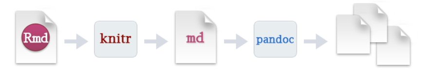
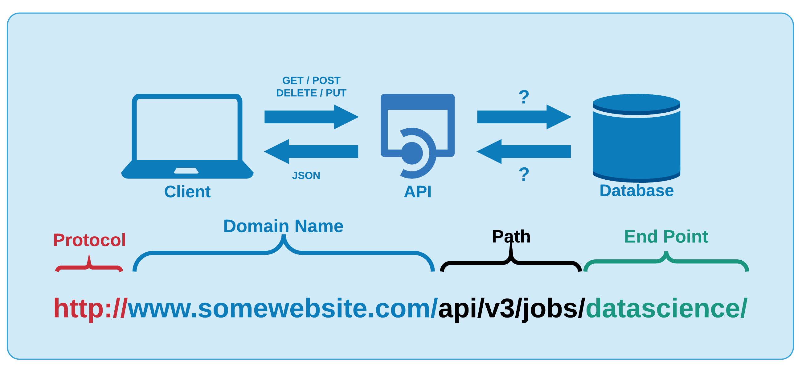
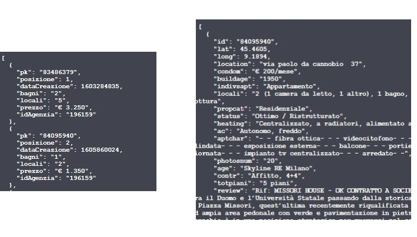
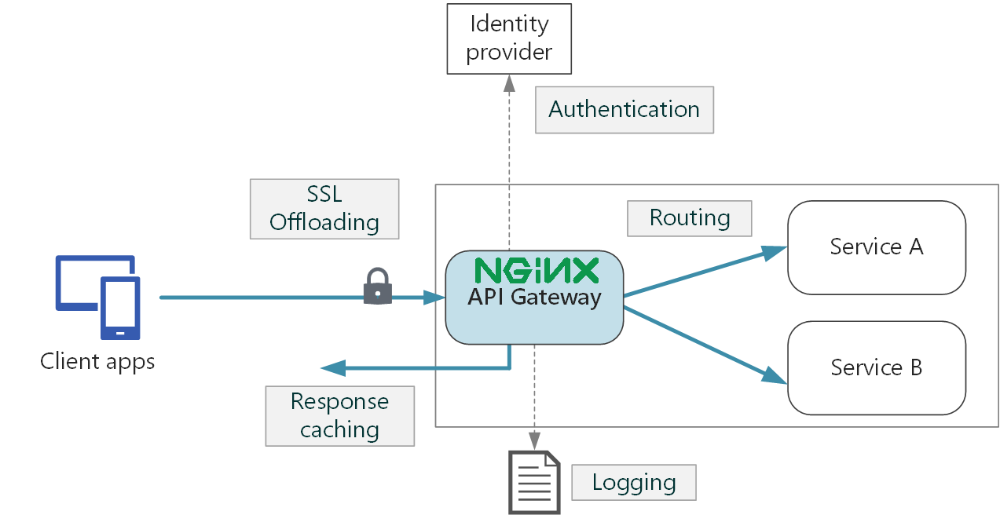
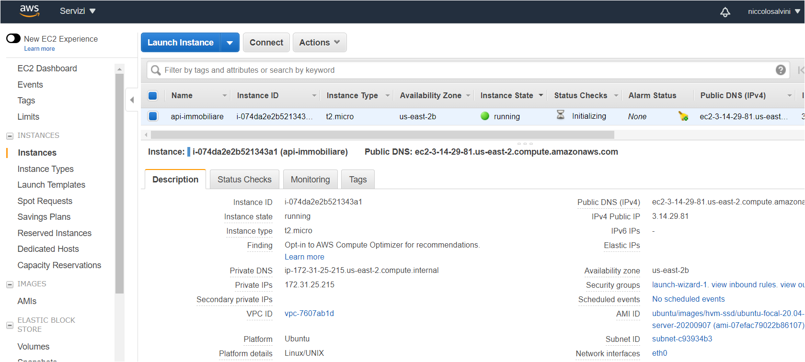

# API Technology Stack {#Infrastructure}

<!--  You can label chapter and section titles using `{#label}` after them, e.g., we can reference Chapter \@ref(intro). If you do not manually label them, there will be automatic labels anyway, e.g., Chapter \@ref(methods).-->

The previous chapter has encapsulated the main concepts behind the design of consistent, secure, and fast scraping functions with R. In truth challenges not only regard scraping per se, but also the way and how many times the service has to interact with different clients. To tell the truth, the fact that functions are compressed into scripts does not imply that are shareable and portable. As a consequence when they are executed they also need to be at first understood and secondly loaded into R, implying higher and lower dependencies, and that requires a considerably huge effort. Moreover results are actually computed, whether in parallel or not, with local machines resources that are limited in many senses. In the end files might get lost, improperly modified and security is not guaranteed. 
From a restricted personal usage perspective what has been done since now is totally feasible. But in a large-scale orientation where different stakeholders should gather massive amount of data, then a unsuitable service may cause an enormous waste of time.
The following chapter tries to capture the essence and its specific context usage of each single technology involved considering the aforementioned issues. In parallel it highlights the _fil rouge_ that guides the chronological order according to which the stack has been developed.
The recipe proposed serves a RESTful Plumber API (an R framework) with 2 endpoints each of which calls Parallel scraping functions settled down in section \@ref(scraping). Precautions regards sanitization of users input, anti-Dossing strategies and logs monitoring. The software environment is containerized in a Docker container and _Composed_ with a further container housing NGINX proxy server. Orchestration of container services is managed with Docker Compose. NGINX and SSL certificates bring HTTPSecure communication restricted with authentication. An AWS free tier EC2 server hosts the orchestration of containers and the IP is made Elastic. Furthermore the software development is made automatic with a straightforward composition of cloud services that ignites sequential building when local changes are pushed to cloud repository.

Technologies involved:

- GitHub version control and CI
<!-- - Scheduler cron job, section \@ref(scheduler) -->
<!-- - MongoDB ATLAS database -->
- Plumber REST API, section \@ref(plumberapi)
- Docker containers and compose, section \@ref(docker)
- NGINX reverse proxy, section \@ref(nginx)
- HTTPS and SSL certificates \@ref(HTTPS)
- AWS EC2 \@ref(aws)


As a further note each single part of this thesis is oriented to the service inspiring criteria of portability, containerization and Continous Integration (CI).
The document creation with RMarkdown [@rmarkdown1] begins with a.Rmd file containing a combination of markdown code and R code chunks. The .Rmd file in figure \@ref(fig:rmarkdowndin) is supplied to knitr, executing all the R code chunks ultimately creating a fresh markdown document (.md) that contains text, the R code and its product. The markdown file is then processed by Pandoc [@pandoc] who generates a full fledged web page, PDF, MS Word document, slide show, handbook, book, dashboard or other formats. 
The bookdown package [@bookdown2] is built on top of the R markdown (http://rmarkdown.rstudio.com) and bears in mind the simplicity of the Markdown syntax as well as several other output format types (in this case HTML PDF). Moreover it displays features such as multimedia HTML output, numbering and cross reference numbers, insert parts/appendices and import GitBook styles (https://www.gitbook.com) making it suited for creating elegant and attractive technical documentation (i.e. html books). Gitbooks format (author's choice) enables UI buttons open a pull requests (massively helpful for reviewing) on the documents or directly sharing contents on social media. Gitbooks are highly flexible in terms of style, up to the limit of css allowing to do so.
Gitbook's Deployment happens through a service [Netflify](https://www.netlify.com/) which grabs the product of the Bookdown compilation and renders it down its own domain. Netflify + GitHub Actions approach enhances CI pipelines, so that each time the content is pushed to the GitHub repository (for author's purposes or external reviewer contributions) tests are ran and the integrity of the code is kept safe.




<!-- ## Scheduler{#scheduler} -->

<!-- ```{definition, scheduler, name = "Scheduler"} -->
<!-- A Scheduler in a process is a component on a OS that allows the computer to decide which activity is going to be executed. In the context of multi-programming it is thought as a tool to keep CPU occupied as much as possible. -->
<!-- ``` -->

<!-- As an example it can trigger a process while some other is still waiting to finish. There are many type of scheduler and they are based on the frequency of times they are executed considering a certain closed time neighbor. -->

<!-- - Short term scheduler: it can trigger and queue the "ready to go" tasks -->
<!--   - with pre-emption  -->
<!--   - without pre-emption -->

<!-- The ST scheduler selects the process and It gains control of the CPU by the dispatcher. In this context we can define latency as the time needed to stop a process and to start a new one.  -->

<!-- - Medium term scheduler  -->
<!-- - Long term scheduler -->

<!-- for some other useful but beyond the scope references, such as the scheduling algorithm the reader can refer to [@wiki:scheduler]. -->

<!-- ### Cron Jobs -->
<!-- ```{definition, cronjob, name ="Cronjob"} -->
<!-- Cron job is a software utility which acts as a time-based job scheduler in Unix-like OS. Linux users that set up and maintain software environments exploit cron to schedule their day-to-day routines to run periodically at fixed times, dates, or intervals. It typically automates system maintenance but its usage is very flexible to whichever needed. It is lightweight and it is widely used since it is a common option for Linux users. -->
<!-- ``` -->
<!-- The tasks by cron are driven by a crontab file, which is a configuration file that specifies a set of commands to run periodically on a given schedule. The crontab files are stored where the lists of jobs and other instructions to the cron daemon are kept. -->
<!-- Each line of a crontab file represents a job, and the composition follows the syntax in figure \@ref(fig:crontab) -->

<!--  -->

<!-- Each line of a crontab file represents a job. This example runs a shell named scheduler.sh at 23:45 (11:45 PM) every Saturday. .sh commands can update mails and other minor routines. -->

<!-- 45 23 * * 6 /home/oracle/scripts/scheduler.sh -->

<!-- Some rather unusual scheduling definitions for crontabs can be found in this reference [@wiki:cronjob]. Crontab's syntax completion can be made easier through [this](https://crontab.guru/) GUI.   -->

<!-- The cron job needs to be ran on scraping fucntions at 11:30 PM every single day. The get_data.R script first sources an endpoint function, then it applies the function with fixed parameters. Parameters describe the url specification, so that each time the scheduler runs the get_data.R collects data from the same source. Day after day .json files are generated and then stored into a NOSQL *mongoDB* database whose credentials are public. Data are collected on a daily basis with the explicit aim to track day-by-day changes both in the new entries an goners in rental market, and to investigate the evolution of price differentials over time. Spatio-Temporal modeling is still quite unexplored, data is saved for future used. Crontab configuration for daily 11:30 PM schedules has this appearance: -->

<!-- 30 11 * * * /home/oracle/scripts/get_data.R -->

<!-- To a certain extent what it has been already presented since now might fit for personal use. A scheduler can daily execute the scraping script and can generate a .csv file. Later the same .csv file can be parsed into an application and analysis can be locally reported. The solution proposed is totally _not feasible_ in a production environment, since in order to be executed a vast number files has to be sourced and a number of functions should be routinely called. For these reasons the present architecture can not be shared. The solution adopted tries to minimize the analyst/scientist involvement into scraping procedures by offering a compact and fast (due to Parallel execution) service that manages all the processes without having to know how scraping under the hood is working.  -->

## RESTful API 

```{definition, api, name ="API", echo =T}
API stands for application programming interface and it is a set of definitions and protocols for building and integrating application software. Most importantly APIs let a product or a service communicate with other products and services without having to know how they’re implemented.
```
API may be considered as a mediator between users or clients sending a request, left part figure \@ref(fig:apigenstru) and the web resource or services they want (returning back a response) middle part figure \@ref(fig:apigenstru). It also acts as means of exchanging resources and knowledge with an entity, as databases left part figure \@ref(fig:apigenstru) preserving protection, control and authentication, such as who gets access to what.
There are many types of APIs that exploit different media and architectures to communicate with apps or services.
```{definition, rest,name = "REST", echo= T}
The specification REST stands for **RE**presentational **S**tate **T**ransfer and is a set of _architectural principles_. 
```

If a client request is made using a REST API, a representation of the resource state is passed to a requestor or _endpoint_ [@what_is_a_rest_api]. This information is returned in one of the formats of multiple formats using _HTTP_: JSON, HTML, XLT, Python, PHP or simple text. JSON is the most common programming language to use because it is language agnostic [-@what_is_a_rest_api] and easy to interpretable both for people and machines.
REST architecture depends upon HTTP, as a matter of fact REST API inherits from HTTP the stateless property, second pillar in \@ref(HTTPmethod). Calling a REST API (producing a request) demands composing a well defined URL lower part in figure \@ref(fig:apigenstru), whose semantic is able to uniquely identify the resource or a group of resources (sending back a response) along with the most common HTTP methods, as GET, PUT, POST, DELETE.



When an API adheres to REST \@ref(def:rest) principles is said RESTful. Principles are:

- A client-server architecture made up of clients, servers, and resources, with requests managed through HTTP method.
- Stateless client-server communication, meaning no client information is stored between requests and each request is separate and disconnected.
- Cacheable data that streamlines client-server interactions.
- A uniform interface between components so that information is transferred in a standard form. This requires that:
    - resources requested are identifiable and separate from the representations sent to the client.
    - resources can be manipulated by the client via the representation they receive because the representation contains enough information to do so.
    - self-descriptive messages returned to the client have enough information to describe how the client should process it.
- A layered system that organizes each type of server (those responsible for security, load-balancing, etc.) involved the retrieval of requested information into hierarchies, invisible to the client.

RESTful APIs receives HTTP request inputs and elaborates them through endpoints. Endpoints are the final step in the process of submitting an API request and they can interpreted as the responsibles for generating a response [-@plumber]. Further documentation and differences between HTTP and REST API are beyond the scope, indeed a summary can be found to this [link](https://docs.aws.amazon.com/it_it/apigateway/latest/developerguide/http-api-vs-rest.html).
Open and popular RESTful API examples are: 

- BigQuery API: A data platform for customers to create, manage, share and query data.
- YouTube Data API v3: The YouTube Data API v3 is an API that provides access to YouTube data, such as videos, playlists, and channels.
- Skyscanner Flight Search API: The Skyscanner API lets you search for flights & get flight prices from Skyscanner's database of prices, as well as get live quotes directly from ticketing agencies.
- Openweathermap API: current weather data for any location on Earth including over 200,000 cities.


### Plumber HTTP API{#plumberapi}

Plumber is a R framework [@plumber], allowing users to construct HTTP APIs simply by adding decoration comment to the existing R code, in this context to scraping code. Decorations are a special type of comments that suggests to Plumber where and when the API specifications start. Below is reported a toy API with 3 endpoints inspired by the original documentation. Endpoints in the following code chunk are identifiable by the three distinguishing comment blocks, separated by the aforementioned decorations. http API specifications require the user to set the endpoint description (first comment), to specify the parameters role and input type (second), and the http method i.e. GET, POST followed by the endpoints invokation verb e.g. echo, plot, sum (third).

```{r plumber, eval=FALSE}
# plumber.R

#* Echo back the input
#* @param msg The message to echo
#* @get /echo
function(msg = "") {
  list(msg = paste0("The message is: '", msg, "'"))
}

#* Plot a histogram
#* @param n the number of samples
#* @serializer png
#* @get /plot
function(n = 10) {
  rand <- rnorm(n = n)
  hist(rand)
}

#* Return the sum of two numbers
#* @param a The first number to add
#* @param b The second number to add
#* @post /sum
function(a, b) {
  as.numeric(a) + as.numeric(b)
}
```

Once HTTP api calls are sent to machines belonging to a single server or a network of servers, whether it is public or private they converge through endpoints. Endpoints execute functions involving the parameters specified through the call and by default response is JSON type. The first endpoint "echo" invocation simply _echoes_ back the text that it was sent. The second endpoints generates a histogram _plot_ i.e. .png file based on a Normally distributed sample whose observation number are "n". The third endpoint calculates the _sum_ of a couple of number attached to the call. Scraping function are then implemented within the API framework and arguments becomes parameters for an incoming request. Many more options may induce plumber endpoints to respond in the preferred fashion, in any case are beyond the scope of the analysis.
Exposing APIs on a private network or on a public server security is a major issue. Concerns and thought process therefore must adapt accordingly. There are several variables and consequent attacks that should be considered while creating Plumber APIs, but the focus will differ depending on the API audience. For example if APIs are offered without authentication on the Internet, potential vulnerabilities should seriously convince the api maintainer to properly account each of them. Three in the context of the analysis are critical:

- Sanitization
- Denial Of Service (DoS)
- Logging

### Sanitization{#sanitize}

Whenever APIs accept input from a random user this is directly injected into functions through endpoints, therefore the worst case scenario should be prepared. In the context of the analysis users are required to specify to the endpoints arguments such as cities, zones, number of pages and many others. Chances are that users might either misspell inputs or use different encoding (accents) or rather use capital letters when functions are capital sensitive. Endpoints should take account of the behavior by sanitizing whatever it comes into the function. The process at first requires an intense and creative investigation on what it can be misused and how. Then Secondly new functional inputs are defined so that they take the user generated input and give back a sanitized version inside the function. In the code chunk below are shown a couple of examples of sanitization of inputs:

```{r sanitization, echo=TRUE, eval=FALSE, tidy=TRUE}
tipo <- tolower(type) %>% str_trim()
citta <- tolower(city) %>%
  iconv(to = "ASCII//TRANSLIT") %>%
  str_trim()
macroozone <- tolower(macrozone) %>%
  iconv(to = "ASCII//TRANSLIT") %>%
  str_trim()
```

Inputs make their entrance into functions through arguments "type", "city" and "macrozone" and are immediately preprocessed. They are in sequence converted to lower cases, then extra spaces are trimmed, in the end accents are flattened. 

### Denial Of Service (DoS){#DoS}

Denial-of-service attacks (DoS) are used to temporarily shut down a server or service through traffic congestion. A DoS scenario could be triggered accidentally by a malicious user requesting the server for an infinite looping task. Other scenarios might depict a malicious hacker who uses a large number of machines to repeatedly make time consuming requests to occupy the server, this is the case of DDoS (Distributed Denial of Service). DoS or DDoS attacks may also induce anomalies and deprives system resources, which in the context of hosting services may result in astronomical fees charged. Dos attack as a conseuquence may also induce distorted website/API logs analytics, leading to distorted reports.
A simple but effective approach tries to limit and stop the number of request sent:

```{r dossing, echo=TRUE,  eval=FALSE}
if (npages > 300 & npages > 0) {
  msg <- "Don't DoS me!"
  res$status <- 500 # code num: Bad request
  stop(list(error = jsonlite::unbox(msg)))
}
```

The code chunk above intercepts DoS attacks by limiting to 300 the number of pages to be server to the API. Furthermore it converts outputs error messages printed on console into JSON format and then pass them as output. This simplify distinguishing malicious attacks from a type errors. DDoS attacks are secured by SSL certificates and Authentication covered later in the chapter.

### Logging{#logging}

Plumber uses "filters" that can be resorted to describe a "pipeline" for processing incoming request. This enables API maintainers to separate complex logic into discrete, comprehensible steps. Usually, before trying to find an endpoint that satisfies a request, Plumber passes the request through the _filters_. When APIs are called, requests pass through filters one at a time and Plumber forwards i.e. `forward()` the request to the next filter untill the endpoints. Filters applications ranges from excluding client request based on request parameters or may offer also a thin layer of authentication. Filters might also be used as a logging for requests where logging, i.e. the act of keeping a log [@], is recording events in an operating system or running software from other users of communication software, or messages among different subjects. 
A request log filter might have this appearance:

```{r logging, echo=TRUE, eval=FALSE}
#* Log information
#* @filter logging
function(req) {
  cat(
    as.character(Sys.time()), "-",
    req$HTTP_USER_AGENT, "@",
    req$REMOTE_ADDR, "\n",
    req$QUERY_STRING, "\n"
  )
  plumber::forward()
}
```

The above filter parses the request through the default request argument `req`, then it prints out messages about the incoming User Agent (i.e. `HTTP_USER_AGENT`) (section \@ref(spoofing)), the `REMOTE_ADDR` which is the IP address of the client making the request [-@plumber] and the `QUERY_STRING` that records the parameters directly sent the endpoint. This helps to traceback clients activity on the API as well as detecting misuse.


### RESTful API docs{#docs} 

The service disposes of 2 endpoints */fastscrape* , */completescrape*. Parameters, aligned next to the endpoint name in figure \@ref(fig:swagger), are the same for both of the endpoints since they rely on the same reverse engineering url algorithm \@ref(fig:pseudocode3), exaplined in section \@ref(reverse). Moreover Plumber APIs are natively wrapped up around Swagger UI helping development team or end users to imagine and communicate with the resources of the API without any discharge logic [@swaggerUI]. The OpenAPI (formerly referred to as Swagger), with the visual documentation facilitates backend implementation and client side consumption, as well as being automatically created by the APIs specification (parameters, endpoints...). Some of the major assets in Swagger UI are: The user interface works in any environment, whether locally or web and it is suited for all main browsers.
Rest API documentation can be reached to the API address in the `/__docs__/` path, in the upper navigation bar of figure \@ref(fig:swagger). A further parameter argument, namely `thesis` into both of the endpoint has been added in order to make the API calls reproducible by providing to the scarping function a pre-compiled url to scrape.


An API call might look like the following for both of the endpoint, further details (apart from the minimal requirements in the Swagger UI) are found in the api documentation at the GitHub repository @NiccoloS11.




## Docker{#docker}

The API up to this point needs a dedicated lightweight software environment that minimizes dependencies both improving performances and enabling _cloud computing_ coverage. A fast growing technology known as _Docker_ might extend these capabilities.
```{definition,docker,name = "Docker and Containers", echo = T}
_Docker_ [@docker] is a software technology to create and deploy applications using containers.
_Docker containers_ are a standard unit of software (i.e. software boxes) where everything needed for applications, such as libraries or dependencies can be run reliably and quickly. Containers are also portable, in the sense that they can be taken from one computing environment to the following without further adaptations.
```
Containers can be thought as a software abstraction that groups code and dependencies together. One critical advantage of containers is that multiple containers can run on the same machine with the same OS along with their specific dependencies (docker compose). Each container can run its own isolated process in the user space, so that each task/application is exhaustively and complementary to the other. The fact that containers are treated singularly enables a collaborative framework that it also simplifies bugs isolation. 

Actually _Docker containers_ are the build stage of _Docker Images_. Docker images therefore are the starting point to containerize a software environment. They are built up from a series of software layers each of which represents an instruction in the image’s _Dockerfile_ [-@docker_documentation_2020] . In addition images can be open sourced and reused through Docker Hub.
_Docker Hub_ is a web service provided by Docker for searching and sharing container images with other teams or developers in the community. Docker Hub can authorize third party applications as GitHub entailing an collaborative image version control, this would be critical for software development as disguised in section (\@ref(sdwf)).

<!-- ### Why Docker{#econdocker} -->

<!-- [Indeed](https://it.indeed.com/), an employment-related search engine, released an article on 2019 displaying changing trends from 2015 to 2019 in Technology Job market, a summary of those changes is in figure \@ref(fig:indeedstats). Many changes are relevant in key technologies. Two among the others technologies (i.e. docker and Azure, arrow pointed) have experienced a huge growth and both refer to the certain demand input: _containers_ and _cloud computing_. -->
<!-- The landscape of Data Science is changing from reporting to application building: -->
<!-- In 2015 - Businesses reports drive better decisions. -->
<!-- In 2020 - Businesses need apps to empower better decision making at all levels. -->

<!--  -->

<!-- For all the things said what docker is bringing to business are [@red_hat_customer_portal]: -->

<!-- - _Speed application deployment_ : containers include the minimal run time requirements of the application, reducing their size and allowing them to be deployed quickly. -->
<!-- - _Portability across machines_ : an application and all its dependencies can be bundled into a single container that is independent from the host version of Linux kernel, platform distribution, or deployment model. This container can be transferred to another machine that runs Docker, and executed there without compatibility issues. -->
<!-- - _Version control and component reuse_ : you can track successive versions of a container, inspect differences, or roll-back to previous versions. Containers reuse components from the preceding layers, which makes them noticeably lightweight. In addition due to Docker Hub it is possible to establish a connection between Git and DockerHub. Vesion -->
<!-- - _Sharing_ : you can use a remote repository to share your container with others. It is also possible to configure a private repository hosted on Docker Hub. -->
<!-- - _Lightweight footprint and minimal overhead_ : Docker images are typically very small, which facilitates rapid delivery and reduces the time to deploy new application containers. -->
<!-- - _Fault isolation_ :Docker reduces effort and risk of problems with application dependencies. Docker also freezes the environment to the preferred packages version so that it guarantees continuity in deployment and isolate the container from system fails coming from package version updates. -->

<!-- The way to tell docker which system requirements are needed in the newly born software is a _Dockerfile_. -->

### REST-API container{#dockerfile}

Docker can build containers from images by reading instructions from a Dockerfile. A Dockerfile is a text document that contains the commands/rules a generic user could call on the CLI to assemble an image. Executing the command `docker build` from working directory the user can trigger the build. Building consists of executing sequentially several command-line instructions that specifies the software environment. As a matter of fact the concept of containers takes inspiration by the fact that many single software layers are stacked up over at the following. An open source project named [rocker](https://www.rocker-project.org/images/) already disposes of a group of pre-set task-specific image configurations from which further custom dockerfile can be built on top of. 
Therefore images are overwritten with higher level dependencies i.e. package libraries, since lower levels Linux dependencies are already partially handled. Indeed as in \@ref(sdwf) an automatic development workflow is proposed that triggers the building of the image when changes are pushed to github.

The custom Dockerfile in figure \@ref(fig:dockerfile)) is able to build the rest-api container:


Each line from the Dockerfile has its own specific role:

- `FROM rocker/tidyverse:latest` : The command imports from rocker project a pre set config guration containing the latest version of base-R along with the tidyverse [@tidyverse] R packages collection.

- `MAINTAINER Niccolo Salvini "niccolo.salvini27@gmail.com"` : The command tags the maintainer and its e-mail contact information.

- `RUN apt-get update && apt-get install -y \ libxml2-dev \ libudunits2-dev` : The command update and install remaining OS Linux dependencies required to run Plumber and rvest.

- `RUN R -e "install.packages(c('tictoc','here','...',dependencies=TRUE)` : The command install all the further lower level libraries required to execute the files. Since some packages have inner dependencies the option `dependencies=TRUE` is necessary. 

- `COPY /scraping` : The command tells Docker to copy into the container files in /scraping folder (where API specs are)

- `WORKDIR /scraping` : The command tells Docker to set /scraping as working directory

- `EXPOSE 8000` :  The commands instructs Docker engine that the container listens on the specified network ports 8000 at runtime. Default _transportation_ layer is TCP. 

- `ENTRYPOINT ["Rscript", "main.R"]` : the command tells docker engine to execute the file main.R where are contained the Plumber router options (i.e. host and port specifications).

## NGINX reverse Proxy Server and Authorization{#nginx}

Proxy server in this context offers the opposite angle for the exact same security problem. As a matter of fact the downside is that they can be exploited for the same reason for which they have been criticized at the end of section (\@ref(spoofing)). Reverse Proxy server are a special type of gateway \@ref(def:proxy) that is usually located behind a private network firewall to route client requests to the corresponding backend server [@nginxDocs]. An reverse proxy offers an extra abstraction and control level to ensure that network traffic flows smoothly between clients and servers. NGINX as it can be inferred by its official documentation empowers traffic flows by:

- _Load balancing_: A reverse proxy server will stand guard in front of back end servers and redirect requests across a group of servers in a way that maximizes speed and capacity usage as well as not overloading the server. When a server crashes, the load balancer redirects traffic to the other online servers (note required since traffic is not expected to be enormous).

- _Web acceleration_: A reverse proxies can condense input and output data by caching frequently requested information. This assists traffic between clients and servers avoiding to request data more than once. They can also apply SSL encryption, which improves their performance by eliminating loads form web servers.

- _Security and anonymity_: A reverse proxy server protects identities and serves as an additional protection against security threats seen in sub-sections (\@ref(sanitize), \@ref(Dos))  by intercepting requests before they reach end server.

When a user calls the API, NGINX acts as a gateway asking for credentials and registering log data (HTTP identification headers). If the request has already been asked then cached response is returned. If it does not then the request is routed to the endpoint, service A and B in figure \@ref(fig:nginxfun). Endpoints elaborate the request into the response, which flows back at first to the gateway and then finally to the client. Logging data can be feeded to a dashboard monitoring traffic and API exposure.



Then without any further software installation, the developer can simply make use of the latest NGINX open sourced image to build the NGINX proxy server within the same image. A further configuration file should manage NGINX inner settings that links volumes, ports and IPs, but details are beyond the scope of the analysis.

## Docker-Compose

Compose is a multi-container Docker framework to define and run complex application and services, that means isolated stand alone containers can communicate one to each other. The orchestration of containers is managed through a .yaml file docker-compose.yml that configures the whole set of facilities designed for the services. Services are then build with a single docker command `docker-compose up` on the basis of the instruction yaml file. Compose also enables _Volumes_, which are used in Docker for **data persistence** [@dockervolumes]. VOlumes allows to keep data secured from docker stop or delete containers. Docker Volumes ina nutshell works as the linkage between a physical file system path (folders, directories) plugged/**mounted** into the virtual container file system path. 
The main properties for Composition as in documentation [@docker_documentation_2020] regards:

- _A central host in multiple isolated environments_: Compose provides a label for a project to distinguish environments. The default project name is the directory path.
- _Preserve data volumes (which are the preferred Docker mechanism to consume data generated and used by containers) when building containers_: Compose maintains all of the services' Volumes. When Docker-compose is running, it transfers the Volumes from the old container into the new container when it detects containers from previous runs. This method guarantees that no Volume data produced is lost.
- _Only recreate containers that have changed_: Compose caches the configuration and re-use the same containers when it reboot a service which hasn't changed. Re-use containers means it provides really fast improvements to the environment when developing complex services.
- _Variables and moving a composition between environments_: Compose supports file variables which might be used to adjust any composition to various environments or users.


The first line defines the versions according to which Compose orchestrates containers. Services are two, the rest-api and NGINX. The former whose name is restful-api builds the container starting from the Dockerfile contained into the rest_api path specified as in \@ref(dockerfile). The first service also mounts Volumes from shared_data to itself in the virtual container file path. Port 8000 opened (\@ref(dockerfile)) is linked to the 7000 one. Restarting set to "always" secures the latest container version. 
The latter service is NGINX \@ref(nginx) which proxies traffic from 80 and 443 based on .conf file whose specifications are beyond the scope of the analysis. Volumes makes sure that specifications are arranged in the default path choice. The option depends_on defines the chrono-logical condition accroding to which containers should be run and then composed.

## HTTPS(ecure) and SSL certificates{#HTTPS}

Communication even though properly secured and distributed with NGINX is still not encrypted so sensitive data are still being exposed. HTTP Secured (HTTPS) is a product of HTTP combined with SSL/TLS (Secure Sockets Layer/Transportation Security Layer) protocol rather than a protocol itself. HTTPS is strictly appropriate when transmitting sensitive data such as banking or on-line buying. Its importance is highlighted by the fact that nowadays is rather more common to find HTTPS than HTTP. The Secured method encrypts all contacts between the client and the server, figure \@ref(fig:httpsmeth). The HTTPS scheme in actual is "HTTPS" and its default port is 443 (that should be exposed too in the dockerfile). SSL runs as a sublayer of the _application_ layer (a further internet layer, refer to section \@ref(HTTPmethod)), this ensures that HTTP messages are encrypted prior being transmitted to the server (SSL Offloading box in figure \@ref(fig:nginxfun)) whether it is a proxy server or directly a web server.


<!-- [resource1](https://qunis.de/how-to-make-a-dockerized-plumber-api-secure-with-ssl-and-basic-authentication/) -->
<!-- [resource2](https://www.rinproduction.com/it/posts/003-web-r-platform-with-https/) -->
From a port communication point of view at first NGINX container listens to on port 80 and that it is where all requests should relay to IP_macchine_address:8000. As a result the RESTful API is published on Port 80 instead of 8000. Secondly it listens on the SSL port 443 and points to the key and certificate files that have been created in the Dockerfile. 

## AWS EC2 instance{#aws}

From henceforth the software container environment can be reproduced regardless of the mounted OS. Scalability and accessibility is worked out by exporting orchestrated containers on a web server. There are many hosting services options that varies primary on the budget and consequently on the API audience. A flexible cloud provider combined with NGINX load balancing _ceteris paribus_ may offer a stable and reliable service for a reasonable price, even considering a bad-case scenario where requests are many and insistent.
```{definition,aws, name = "AWS EC2", echo = T}
Amazon Elastic Compute Cloud (EC2) is a web service that contributes to a secure, flexible computing capacity in the AWS cloud. EC2 allows to rent as many virtual servers as needed with customized capacity, security and storage.

```
AWS EC2 represents a popular hosting option, most importantly this path is already narrowed by many open source contributors. The selected target is a AWS free tier t3.micro whose specifications are: 2 vCPU (Virtual CPU), 1 GB memory and a mounted Ubuntu distribution OS. Moreover T3 instances are known to provide device, memory, and network resource balance and have been developed for applications that experience transient spikes in use with modest CPU use. They are designed especially to serve low-latency interactive applications, small and medium databases, virtual desktops, development environments, code repositories, and business-critical applications, therefore they suit the needs.
Prior any new instance initialization AWS offers to tune servers' set up options. Networking and VPC are chosen to be left as is since they can always be updated at need. Storage is increased to 30 GB which represents the free tier eligibility upper limit. Indeed security at first needs to account for a SSH connection that allows communication with the server i.e. open port 22. Secondly it should account for port openings accordingly to NGINX configuration file and rest-api dockerfile (\@ref(dockerfile)), port 80 (default for TCP) and 443 (HTTPS default) are opened. Once the instance is running the server can be accessed through SSH behind authentication. 

<!--  -->

<!-- At this point instance is prepared to run and in a few minutes is deployed. Key pairs, if never done before, are generated and a .pem file is saved and securely stored. Key pairs are a mandatory step to log into the Ubuntu server via SSH. SSH connection in Windows OS can be handled with [PuTTY](https://www.putty.org/), which is a SSH and telnet client designed for Windows. At first PuTTYgen, a PuTTY extensions, has to convert the key pair .pem  file into a .ppk extension (otherwise PuTTY can not read it). Once .ppk is converted is immediately sourced in the authorization panel. If everything works and authentication is verified then the Ubuntu server CLI appears and interaction with the server is made possible.  -->
<!-- Once the CLI pops out some Linux libraries to check file structure ("tree") and Docker are installed. Then a connection with Docker hub is established providing user login credentials. From the Hub repository the container image is pulled on the machine and is then executed with the docker RUN command.  -->
<!-- AWS automatically assign to the server a unique Public DNS address which is going to be the REST API url to call.  -->

## Software CI/CD Workflow{#sdwf}

Software changes can happen quite often due to the dynamic nature of the RESTful API's target website. This requires a modern stack of cloud technologies to update, revert and quickly deploy software versions, or even integrate software architecture. As a consequence the software CI/CD manages minor changes with local commits to the project, which are then directly pushed through git to the open GitHub repository, upper left quadrant \@ref(fig:sfmap). The repository directly communicates with an DockerHub repository that sequentially triggers the compose-up command of the compose.yml file, and through that the docker images whenever any changes are pushed, upper right quadrant \@ref(fig:sfmap). Images are tagged and cached so that versions are controlled and Software build avoids to rerun containers that have not suffered any change. Debugging is constrained to logs generated by docker engine. Furthermore the build stage in R since 2019 required long time due to package compiling, but since the appearance of Rstudio [package manager](https://packagemanager.rstudio.com/client/#/) which includes beta support for pre-compiled R packages they can be installed 3 times faster [@nolispmanager].
When newer images are available they can be pulled from the EC2 server and rerun in detached mode. Massive software changes are managed through GitHub branches, even though it must be kept in mind to swith lautomatic building brench. The Ec2 server is associated to an Elastic IPs address allowing to reuse the address for external databases connections and DNS services as Cloudflare (for SSL certificates). Moreover elastic IPs are effective when the EC2 server stands in need of upgrading or downgrading or when the server may fail, thus restoring and apply the IP address for a new server. 


## Further SF Integrations

A more robust code can be obtained embedding recent R software development frameworks as `Golem` @colin_fay_2020 into the existing structure, anyway this requires a complete restyle of the existing code architecture. The framework stimulates the usage of _modules_ to enhance reusable codes. In addition for the way it is done it forces through automatic actions, articulated into a sequence of rules to follow, to organize code and dependencies aimed at saving time to DevOps teams. It has also a labour-saving function to build custom dockerfiles based on the dependecies organized throughout the building framework. 
Moreover according to the latest R-API literature, code should be veveloped as R packages as in @plungr, allowing to use inner **TDD** (i.e.Test-Driven Development @TDD_2004) mechanism with @testthat as pointed out in @colin_fay_2020 section 4.2.
