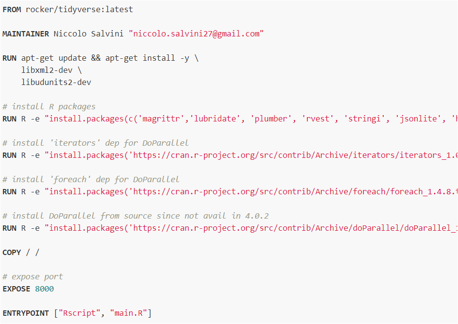
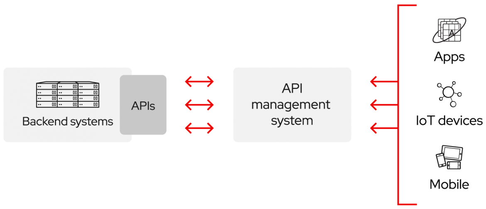

# Infrastructure {#Infrastructure}

<!--  You can label chapter and section titles using `{#label}` after them, e.g., we can reference Chapter \@ref(intro). If you do not manually label them, there will be automatic labels anyway, e.g., Chapter \@ref(methods).-->
  
  
In order to provide a fast, portable and integrated product to the end user It has been designed a quite straightforward software architecture. We have already seen the scraping functions and how they are built around the concept of easy flexibility and debugging. This is due to the fact that they should extract something that is dynamic, it is not sure that it will be as the day before. The data we are trying to grab might have been moved somewhere else throughout the website. Or it might have placed extra expression inside the node we are inspecting ("$" sign following the monthly rental price) . A very often occurring example regards the way information concerning the house are represented in the website. Considering the september 2018 january 2020 time span the design of the website has changed a vast number of times. Since both the design and the scrapping functions relies on the HTML skelethon and CSS queries. As soon as something changes in the website the other files needs to be readjusted to be consistent with the content and so back and forth. The debugging handlers nested in the functions helps the maintainer to grasp what it is not working properly where the error occur. 
The same inner philosophy has been applied to the software architecture chosen for this project.
First of all the wide range of open source solutions (back-end and front-end) and documentation on this has made many analyst and data scientist almost full stack developer. This was also due to the fact that RStudio has set very well oriented guidelines spending a lot of effort giving its users an easy, integrated and interconnected environment. By that it is meant that recently the RStudio community has developed, on top of many different others, an entire package dedicated to REST APIs (Plumber [@plumber]). MOreover developers in RStudio and its contributors have created an entire new paradigm called Shiny [@shiny], a popular web app development package, that forces the user to have front-end and back-end technologies tied up in the same IDE (RStudio) and with a unique language to deal with. The front end file (for simplicity named UI.R) contains the UI's layout and the style and also other javascripts components. On the other hand the server file (named after server.R) absorbs the back-end, under the hood, code and makes the UI intercact and respond to the user.
This comes at a cost of flexibility and customization since Shiny could not easily handle too many embellishments (even though potentially can). Nevertheless a unique environment makes integration with other technologies easier and most of all introduces the analyst to a full stack approach. Many open source projects are gravitating around the Shiny framework with the aim to extend its capabilities. One example is a newly created package called reactR [@reactR] that allows user to implement the power of React.js into the shiny UI front end. All of this is possible, once again, by the R community but a greater contribution come from digging up the right path along which everything by open source comes natural. (parallelo con la vigna e l'albero che la sostiene e indirizza)
The carrier idea for this project is to have parallelized scraping functions called daily by a scheduler producing and subsequently storing a .csv file in a MySQL /cartoDB database. They are all tought to be containerized in a Linux (Ubuntu distr) docker container hosted in a AWS EC2 server. Then in a second container a Shiny app is placed, this one pipes in data from the former infrastructure and apply the statistical model stored (by an API call) in its server.R part.

The main technologies implied are:

- Scheduler cron job
- Docker containers
- Shiny 
- Plumber REST API 
- AWS (Amazon Web Services) EC2
- CartoDB

On top of that even each single part of this thesis has been made stand alone and can be easily accessed and modified through this [link](https://niccolosalvini.github.io/Thesis/). The pdf (theis) version of the gitbook can be obtained by clicking the download button that can be seen in figure below. A Latex engine (Xelatex) wrapped into the website compiles a sequence of Markdown documents converting them into .html (the book's chapters) which are formatted by rules grouped in a .yml file. All the documents are pushed to a Github repository with git. By a simple trick, since all the files are static html, they can be displayed through GH pages as it is a website. All of this has been possible thanks to Bookdown [@bookdown1] once again a R well documented package [@bookdown2] to build interactive books along with RMarkdown [@rmarkdown1].

An empirical observation of immobiliare.it has suggested that houses rents advertisement are continuously added and then removed during the day. Fresh data is needed to have updated analysis since the scope in here is to offer realtime considerations. Something should be automated periodically in order to address the issue. Moreover, as rule of thumb, a daily data extraction might be a good option for some reasons. It can intercept price variations with a relatively small time lag, It can also display some sort of pattern in time that would help the reader/user to select the perfect choice. As a consequence a daily .csv file is generated and directly collected into a Db folder arranged by time
The solutiond proposed takes care of the issue by making the scraping script generating the .csv be executed by a scheduler.

## Scheduler

A Scheduler in a process is a component on a OS that allows the computer to decide which activity is going to be executed. In the context of multi-programming it is thought as a tool to keep CPU occupied as much as possible. As an example it can trigger a process while some other is still waiting to finish. There are many type of scheduler and they are based on the frequency of times they are executed considering a certain closed time neighbor.

- Short term scheduler: it can trigger and queue the "ready to go" tasks
  - with pre-emption 
  - without pre-emption

The ST scheduler selects the process and It gains control of the CPU by the dispatcher. OIn this context we can define latency as the time needed to stop a process and to start a new one. 

- Medium term scheduler 
- Long term scheduler

for some other useful but beyond the scope information, such as the scheduling algorithm the reader can refer to [@wiki:scheduler].

The scheduler in this context cosists in a .sh (shell file, sort of text file) composed by a set of instructions that are being executed by the computer on daily basis. This file has to be in the same WD (  working directory) of the project in order to make it working. Some common issues can occur when new files coming after the execution of the scheduled main script are generated, but the path isnt explicitly specified. This can lead to the partial or incomplete generation of the file since the shell file is executed within the folder but is triggered by some other location on the computer.
Each OS has its own scheduler and syntax to call it. Since we are interested in Ubuntu machines the scheduler is said to be a cron job. Later it will be clear why Ubuntu is the option to pursue.

**va parafrasato**

### Cron Jobs

The software utility cron also known as cron job is a time-based job scheduler in Unix-like computer operating systems. Users that set up and maintain software environments use cron to schedule jobs (commands or shell scripts) to run periodically at fixed times, dates, or intervals. It typically automates system maintenance or administration—though its general-purpose nature makes it useful for things like downloading files from the Internet and downloading email at regular intervals. 

The actions of cron are driven by a crontab (cron table) file, a configuration file that specifies shell commands to run periodically on a given schedule. The crontab files are stored where the lists of jobs and other instructions to the cron daemon are kept. Users can have their own individual crontab files and often there is a system-wide crontab file (usually in /etc or a subdirectory of /etc) that only system administrators can edit.

Each line of a crontab file represents a job, and looks like this:

Each line of a crontab file represents a job. This example runs a shell program called scheduler.sh at 23:45 (11:45 PM) every Saturday.

45 23 * * 6 /home/oracle/scripts/scheduler.sh

Some rather unusual scheduling definitions and syntax for cronjobs can be found in this reference [@wiki:cronjob] 

The cron job applied to the script needs to be ran at 11:30 PM everyday. It has that forms: 
---> qui immagine

**va parafrasato**

For now the computational power comes from the machine on which the system is installed. A smarter solution takes into consideration that the former infrastructure has its own limits. Major limits comprehend run time since at the same moment the machine runs locally both the scraping functions and the app computations. This to a certain extent might fit for personal use but as data increases all the system risks to fail. It is also totally local so the analysis can not be shared with anyone. This problem can be addressed with a technology that has seen a huge growth in its usage in the last few years: Docker containers.

## Docker Container 

**from docker **
In 2013, Docker introduced what would become the industry standard for containers. A container is a standard unit of software that packages up code and all its dependencies so the application runs quickly and reliably from one computing environment to another. A Docker container image is a lightweight, standalone, executable package of software that includes everything needed to run an application: code, runtime, system tools, system libraries and settings.

### What is Docker

Container images become containers at runtime and in the case of Docker containers - images become containers when they run on Docker Engine. Available for both Linux and Windows-based applications, containerized software will always run the same, regardless of the infrastructure. Containers isolate software from its environment and ensure that it works uniformly despite differences for instance between development and staging.

Docker leveraged existing computing concepts around containers and specifically in the Linux world. Docker's technology is unique because it focuses on the requirements of developers and systems operators to separate application dependencies from infrastructure.

A question might come up about why a Virtual Machine could not be a preferable container for our specified task. Well, Containers and virtual machines have similar resource isolation and allocation benefits, but function differently because containers virtualize the operating system instead of hardware. Containers are more portable and efficient.

**from docker **

### Why Docker is a top skill

**va parafrasato from Matt Dancho**   

Indeed, the popular employment-related search engine, released an article this past Tuesday showing changing trends from 2015 to 2019 in “Technology-Related Job Postings”. We can see a number of changes in key technologies - One that we are particularly interested in is the 4000% increase in Docker.

The landscape of Data Science is changing [@Skills_Explorer] from reporting to application building:

In 2015 - Businesses need reports to make better decisions
In 2020 - Businesses need apps to empower better decision making at all levels of the organization
This transition is challenging the Data Scientist to learn new technologies to stay relevant…

As a matter of fact, it is no longer sufficient to just know machine learning algorithms. Future data workers need to know how to put machine learning into production as quickly as possible to meet the business needs. This can be done either integrating existing technologies, or build a solid, portable and scalable infrastructure.
To do so, we need to learn from the Programmers the basics of Software Engineering that can help in our quest to unleash data science at scale and unlock business value.

### Dockerfile 

Docker can build images automatically by sort of interpreting the instructions from a Dockerfile. A Dockerfile is a text format document that contains all the commands/rules a generic user could call on the CLI command line to assemble an image. Executing the command from shell in docker build users can trigger the building that executes several command-line instructions in chronological succession of steps.
The Dockerfile used to trigger the build of the docker image has this following set of instructions:

- `FROM rocker/r-ver:4.0.0` : the command imports an image already written by the rocker team (authored contributors for the R docker project) that contains the base-R version 4.0.0. Since recently with the 4.0 version the RStudio team has created a repository management server for its packages to organize and centralize R packages (offline access and checkpoints). This will shorten the installation time and secure packages since they all can be freezed into a version that make the whole system works.

- `RUN R -e "install.packages(c('plumber','tibble','magrittr','rvest','tidyr','...',dependencies=TRUE)` : the command install all the packages required to execute the files (R files) containerized for the scraping. Since all the packages have their represctive and shared dependencies the option `dependencies=TRUE` must be set boolean TRUE. 

- `EXPOSE 8000` :  the commands instructs Docker that the container listens on the specified network ports at runtime. It is possible to specify whether the port exposed listens on UDP or TCP, the default is TCP.

- `ENTRYPOINT ["Rscript", "main.R"]` : the command tells docker to execute the Rscript extension file main.R that triggers the API building.

**va parafrasato from Matt Dancho**

### What are the main Advantages for Docker

**from RedHat **

Docker brings in an API for container management [@red_hat_customer_portal], an image format and a possibility to use a remote registry for sharing containers. This scheme benefits both developers and system administrators with advantages such as:

- _Rapid application deployment_ : containers include the minimal run time requirements of the application, reducing their size and allowing them to be deployed quickly.
- _Portability across machines_ :an application and all its dependencies can be bundled into a single container that is independent from the host version of Linux kernel, platform distribution, or deployment model. This container can be transfered to another machine that runs Docker, and executed there without compatibility issues.
- _Version control and component reuse_ : you can track successive versions of a container, inspect differences, or roll-back to previous versions. Containers reuse components from the preceding layers, which makes them noticeably lightweight.
- _Sharing_ : you can use a remote repository to share your container with others. It is also possible to configure a private repository hosted on Docker Hub.
- _Lightweight footprint and minimal overhead_ : Docker images are typically very small, which facilitates rapid delivery and reduces the time to deploy new application containers.
- _Simplified maintenance_ :Docker reduces effort and risk of problems with application dependencies.

So, Docker technology is a more granular, controllable, microservices-based approach that places greater value on efficiency.

**from RedHat **

## API 

**va parafrasato**

  
The scraping functions, in the way they are designed, can produce two .csv extension (if the boolean `write = TRUE`) files that at some point should be joined by a primary key. But for the sake of 
In order to give the possibility to have a daily updated saptial analysis on data we need to continously have fresh data. In the website data come and go, as products in a marketplace, so the main idea is to have something that catches the new added and deletes what it is already taken.
Nowadays we have many open source, nearly cost free, techonlogies that allow us to have corporate grade applications that can be orizontally scaled at need. Most of them come with great docuemntation and ready to use examples that flatten the learning curve.
The first choice that has to be made is: either to provide a .csv file day by day with all the data to feed the application, or we exploit some portable and fast solutions as API.

**va parafrasato**

## What an API is

API is a set of definitions and protocols for building and integrating application software. API stands for application programming interface.

APIs let your product or service communicate with other products and services without having to know how they’re implemented. This can simplify app development, saving time and money. When you’re designing new tools and products—or managing existing ones—APIs give flexibility; simplify design, administration, and use; and provide opportunities for innovation.

APIs are sometimes thought of as contracts, with documentation that represents an agreement between parties: If party 1 sends a remote request structured a particular way, this is how party 2’s software will respond.

Because APIs simplify how developers integrate new application components into an existing architecture, they help business and IT teams collaborate. Business needs often change quickly in response to ever shifting digital markets, where new competitors can change a whole industry with a new app. In order to stay competitive, it's important to support the rapid development and deployment of innovative services. Cloud-native application development is an identifiable way to increase development speed, and it relies on connecting a microservices application architecture through APIs.

**(va prafrasato)**

Since website are continuously changed for many reasons API philosophy results in the smartest choice since it makes easy to access data and flex API endpoints to the needle.

