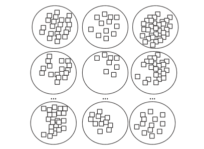
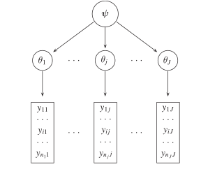
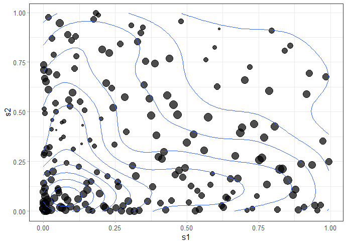

---
output:
  pdf_document: default
  html_document: default
---
# INLA {#inla}

```{r, include=FALSE}
knitr::opts_chunk$set(
  warning = FALSE,  
  strip.white = TRUE,
  message = FALSE,
  cache = FALSE,
  echo = FALSE
)

# libraries are in libs.R
# source(here::here("libs.R"))

library(INLA, warn.conflicts = F, quietly = T)
library(brinla, warn.conflicts = F, quietly = T)
library(magrittr, warn.conflicts = F, quietly = T)
library(knitr, warn.conflicts = F, quietly = T)
library(latex2exp, warn.conflicts = F, quietly = T)
library(ggplot2, warn.conflicts = F, quietly = T)
library(patchwork, warn.conflicts = F, quietly = T)

theme_nicco2 = function (base_size = 11, base_family = "") {
  theme_bw() %+replace% 
    theme(
      text = element_text(family = "sans", size = 12),
      plot.title = ggplot2::element_text(size = 18, colour = "#454545",hjust = 0.5, margin = ggplot2::margin(b = 10)),
      panel.background  = element_blank(),
      panel.grid.major = ggplot2::element_line(linetype = "dotted",colour = "#454545",size = 0.3),
      panel.grid.minor = ggplot2::element_blank(),
      axis.ticks = element_line(colour = "grey70", size = 0.2),
      axis.line = ggplot2::element_line(color = "#454545", size = 0.3),
      plot.background = element_rect(fill="white", colour=NA),
      panel.border = element_rect(linetype = "blank", fill = NA),
      legend.background = element_rect(fill="transparent", colour=NA),
      legend.key = element_rect(fill="transparent", colour=NA),
      strip.background = ggplot2::element_rect(fill = "transparent",colour = NA),
      axis.title = ggplot2::element_text(size = 13, colour = "#454545",hjust = 0.95),
      axis.text = ggplot2::element_text(size = 10, colour = "#212121"),
      strip.text = ggplot2::element_text(size = 12, colour = "#454545", 
                                         margin = ggplot2::margin(10, 10, 
                                                                  10, 10, 
                                                                  "pt"))
    )
}


theme_nicco = function (base_size = 11, base_family = "") {
  theme_bw() %+replace% 
    theme(
      text = element_text(family = "sans", size = 12),
      plot.title = element_text(face = "bold", size = 14, margin=margin(0,0,30,0)),
      panel.background  = element_blank(),
      axis.ticks = element_line(colour = "grey70", size = 0.2),
      plot.background = element_rect(fill="white", colour=NA),
      panel.border = element_rect(linetype = "blank", fill = NA),
      legend.background = element_rect(fill="transparent", colour=NA),
      legend.key = element_rect(fill="transparent", colour=NA)
    )
}
```

Bayesian estimation methods - by MCMC [@mcmc] and MC simulation techniques - are usually much harder than Frequentist calculations [@wang2018bayesian]. This unfortunately is also more critical for spatial and spatio-temporal model settings [@Cameletti2012] where matrices dimensions and densities (in the sense of prevalence of values throughout the matrix) start becoming unfeasible. 
The computational aspect refers in particular to the ineffectiveness of linear algebra operations with large dense covariance matrices that in aforementioned settings scale to the order $\mathcal{O}(n^3)$.
INLA [@Rue2009; @Rue2017] stands for Integrated Nested Laplace Approximation and constitutes a faster and accurate deterministic algorithm whose performance in time indeed scale to the order $\mathcal{O}(n)$. INLA is alternative and by no means substitute [@YT:Rue] to traditional Bayesian Inference methods. INLA focuses on Latent Gaussian Models LGM [-@wang2018bayesian], which are a rich class including many regressions models, as well as support for spatial and spatio-temporal.
INLA turns out to shorten model fitting time for essentially two reasons related to clever LGM model settings, such as: Gaussian Markov random field (GMRF) offering sparse matrices representation and Laplace approximation to approximate posterior marginals' integrals with proper search strategies.
In the end of the chapter it is presented the R-INLA project and the package focusing on the essential aspects.
Further notes: the chronological steps followed in the methodology presentation retraces the canonical one by @Rue2009, which according to the author's opinion is the most effective and the default one for all the related literature. The approach is more suitable and remains quite unchanged since it is top-down, which naturally fits the hierarchical framework imposed in INLA. The GMRF theory section heavily relies on @GMRFRue.    
Notation is imported from @Blangiardo-Cameletti and integrated with @Bayesian_INLA_Rubio, whereas examples are drawn from @wang2018bayesian. Vectors and matrices are typeset in bold i.e. $\boldsymbol{\beta}$, so each time they occur they have to be considered such as the _ensamble_ of their values, whereas the notation $\beta_{-i}$ denotes all elements in $\boldsymbol{\beta}$ but $\beta_{-i}$.
$\pi(\cdot)$ is a generic notation for the density of its arguments and $\tilde\pi(\cdot)$ has to be intended as its Laplace approximation. Furthermore Laplace Approximations mathematical details, e.g. optimal grid strategies and integration points, are overlooked instead a quick intuition on Laplace functioning is offered in the appendix \@ref(laplaceapprox).

## The class of Latent Gaussian Models (LGM){#LGM}

Bayesian theory is straightforward, but it is not always simple to measure posterior and other quantities of interest [@wang2018bayesian]. There are three ways to obtain a posterior estimate: by _Exact_ estimation, i.e. operating on conjugate priors, but there are relatively few conjugate priors which are also employed in simple models. By _Sampling_  through generating samples from the posterior distributions with MCMC methods [@metropolis; @hastings] later applied in Bayesian statistics by @gelfand1990sampling. MCMCs have improved over time due to inner algorithm optimization as well as both hardware and software progresses, nevertheless for certain model combinations and data they either do not converge or take an unacceptable amount of time [-@wang2018bayesian]. By _Approximation_ through numerical integration and INLA can count on a strategy leveraging on three elements: _LGMs_, _Gaussian Markov Random Fields_ (GMRF) and _Laplace Approximations_ and this will articulates the steps according to which the arguments are treated. LGMs despite their anonymity are very flexible and they can host a wide range of models as regression, dynamic, spatial, spatio-temporal [@Cameletti2012]. LGMs necessitate further three interconnected elements: **Likelihood**, **Latent field** and **Priors**.
To start it can be specified a generalization of a linear predictor $\eta_{i}$ which takes into account both linear and non-linear effects on covariates:

\begin{equation}
  \eta_{i}=\beta_{0}+\sum_{m=1}^{M} \beta_{m} x_{m i}+\sum_{l=1}^{L} f_{l}\left(z_{l i}\right)
(\#eq:linearpredictor)
\end{equation}

where $\beta_{0}$ is the intercept, $\boldsymbol{\beta}=\left\{\beta_{1}, \ldots, \beta_{M}\right\}$ are the coefficients that quantifies the linear effects of covariates $\boldsymbol{x}=\left({x}_{1}, \ldots, {x}_{M}\right)$ and $f_{l}(\cdot), \forall l \in 1 \ldots L$ are a set of random effects defined in terms of a $\boldsymbol{z}$ set of covariates $\boldsymbol{z}=\left(z_{1}, \ldots, z_{L}\right)$ e.g. Random Walks [@GMRFRue], Gaussian Processes [@besag1995conditional], such models are termed as General Additive Models i.e. GAM or Generalized Linear Mixed Models GLMM [@wang2018bayesian].
For the response $\mathbf{y}=\left(y_{1}, \ldots, y_{n}\right)$ it is specified an _exponential family_ distribution function whose mean $\mu_i$ (computed as its expectation $\left.E\left(\mathbf{y}\right)\right)$) is linked via a link function $\mathscr{g}(\cdot)$ to $\eta_{i}$ in eq. \@ref(eq:linearpredictor), i.e. $\mathscr{g}\left(\mu_i\right)=\eta_{i}$. At this point is possible to group all the latent (in the sense of unobserved) inference components into a variable, said **latent field** and denoted as $\boldsymbol{\theta}$ such that: $\boldsymbol{\theta}=\left\{\beta_{0}, \boldsymbol{\beta}, f\right\}$, where each single observation $i$ is connected to a $\theta_{i}$ combination of parameters in $\boldsymbol{\theta}$. 
The latent parameters $\boldsymbol{\theta}$ actually may depend on some hyper-parameters $\boldsymbol{\psi} = \left\{\psi_{1}, \ldots, \psi_{K}\right\}$. Then, given $\mathbf{y}$, the joint probability distribution function conditioned to both parameters and hyper-parameters, assuming _conditional independence_, is expressed by the **likelihood**:

\begin{equation}
  \pi(\boldsymbol{\mathbf{y}} \mid \boldsymbol{\theta}, \boldsymbol{\psi})=\prod_{i\ = 1}^{\mathbf{I}} \pi\left(y_{i} \mid \theta_{i}, \boldsymbol{\psi}\right)
(\#eq:jpd)
\end{equation}

The conditional independence assumption grants that for a general couple of conditionally independent $\theta_j$ and $\theta_i$, where $i \neq j$, the joint conditional distribution is factorized by $\pi\left(\theta_{i}, \theta_{j} \mid \theta_{-i, j}\right)=\pi\left(\theta_{i} \mid \theta_{-i, j}\right) \pi\left(\theta_{j} \mid \theta_{-i, j}\right)$ [@Blangiardo-Cameletti], i.e. the likelihood in eq:\@ref(eq:jpd). The assumption constitutes a building block in INLA since as it will be shown later it will assure that there will be 0 patterns encoded inside matrices, implying computational benefits.
<!-- The conditional independence assumption [@GMRFRue] (i.e. $\pi\left(\theta_{i}, \theta_{j} \mid \theta_{-i, j}\right)=\pi\left(\theta_{i} \mid \theta_{-i, j}\right) \pi\left(\theta_{j} \mid \theta_{-i, j}\right)$), states that the joint conditional distribution is given by the product of all the independent parameters i.e. the likelihood. -->
Note also that the product index $i$ ranges from 1 to $\mathbf{I}$, i.e.  $\mathbf{I} = \left\{1 \ldots n \right\}$. In the case when an observations are missing, i.e. $i \notin \mathbf{I}$, INLA automatically discards missing values from the model estimation -@Bayesian_INLA_Rubio, this would be critical during missing values imputation sec. \@ref(missassimp).
At this point, as required by LGM, are needed to be imposed _Gaussian priors_ on each linear effect and each model covariate that have either a univariate or _multivaried normal_ density in order to make the additive $\eta_i$ Gaussian [-@wang2018bayesian].
An example might clear up the setting requirement: let us assume to have a Normally distributed response and let us set the goal to specify a Bayesian Generalized Linear Model (GLM). Then the linear predictor can have this appearance $\eta_{i}=\beta_{0}+\beta_{1} x_{i 1}, \quad i=1, \ldots, n$, where $\beta_{0}$ is the intercept and $\beta_{1}$ is the slope for a general covariate $x_{i1}$. While applying LGM are **needed** to be specified Gaussian priors on $\beta_{0}$ and $\beta_{1}$, such that: $\beta_{0} \sim N\left(\mu_{0}, \sigma_{0}^{2}\right)$ and $\beta_{1} \sim N\left(\mu_{1}, \sigma_{1}^{2}\right)$, for which the latent linear predictor $\eta_i$ is $\eta_{i} \sim N\left(\mu_{0}+\mu_{1} x_{i 1}, \sigma_{0}^{2}+\sigma_{1}^{2} x_{i 1}^{2}\right)$. It can be illustrated by some linear algebra [-@wang2018bayesian] that $\boldsymbol{\eta}=\left(\eta_{1}, \ldots, \eta_{n}\right)^{\prime}$ is a Gaussian Process with mean structure $\mu$ and covariance matrix $\boldsymbol{Q^{-1}}$. The hyperparameters $\sigma_{0}^{2}$ and
$\sigma_{1}^{2}$ are to be either fixed or estimated by taking hyperpriors on them. In this context $\boldsymbol{\theta}=\left\{\beta_{0}, \beta_{1}\right\}$ can group all the latent components and $\boldsymbol{\psi} = \left\{\sigma_{0}^{2},\sigma_{1}^{2}\right\}$ is the vector of **Priors**. 
<!-- Moreover there exists a special class of LG, namely Gaussian Markov random field (GMRF), which is very effective and versatile in modeling paricular effects in LGMs. -->
For what it can be noticed there is a clear hierarchical relationship for which three different levels are seen: a _higher_ level represented by the exponential family distribution function on $\mathbf{y}$, given the latent parameter and the hyper parameters. The _medium_ by latent Gaussian random field with density function given some other hyper parameters. The _lower_ by the joint distribution or a product of several distributions for which priors can be specified
So letting be $\boldsymbol{\mathbf{y}}=\left(y_{1}, \ldots, y_{n}\right)^{\prime}$ at the _higher_ level it is assumed an exponential family distribution function given a first set of hyper-parameters $\boldsymbol\psi_1$, usually referred to measurement error precision @Blangiardo-Cameletti). Therefore as in \@ref(eq:jpd), 

\begin{equation}
  \pi(\boldsymbol{\mathbf{y}} \mid \boldsymbol{\theta}, \boldsymbol{\psi_1})=\prod_{i\ = 1}^{\mathbf{I}} \pi\left(y_{i} \mid \theta_{i}, \boldsymbol{\psi_1}\right)
(\#eq:higher)
\end{equation}

At the _medium_ level it is specified on the latent field $\boldsymbol\theta$ a latent Gaussian random field (LGRF), given $\boldsymbol\psi_2$ i.e. the rest of the hyper-parameters,

\begin{equation}
  \pi(\boldsymbol{\theta} \mid \boldsymbol{\psi_2})=(2 \pi)^{-n / 2}| \boldsymbol{Q(\psi_2)}|^{1 / 2} \exp \left(-\frac{1}{2} \boldsymbol{\theta}^{\prime} \boldsymbol{Q(\psi_2)} \boldsymbol{\theta}\right)
(\#eq:medium)
\end{equation}

where $\boldsymbol{Q(\psi_2)}$ denotes positive definite matrix and $|\cdot|$ its determinant. $\prime$ is the transpose operator. The matrix $\boldsymbol{Q(\psi_2)}$ is called the _precision matrix_ that outlines the underlying dependence structure of the data, and its inverse $\boldsymbol{Q(\cdot)}^{-1}$ is the covariance matrix [@wang2018bayesian]. In the spatial setting this would be critical since by a specifying a multivariate Normal distribution of eq. \@ref(eq:medium) it will become a GMRF. Due to conditional independence GMRF precision matrices are sparse and through linear algebra and numerical method for sparse matrices model fitting time is saved [@GMRFRue].
In the _lower_ level priors are collected togheter $\boldsymbol\psi_ =\{ \boldsymbol\psi_1\, \boldsymbol\psi_2\}$ for which are specified either a single prior distribution or a joint prior distribution as the product of its independent priors. 
Since the end goal is to find the joint posterior for $\boldsymbol\theta$ and $\boldsymbol\psi$, then given priors $\boldsymbol\psi$ it possible to combine expression \@ref(eq:higher) with \@ref(eq:medium) obtaining: 

\begin{equation}
\pi(\boldsymbol{\theta}, \boldsymbol{\psi} \mid \mathbf{y})\propto  \underbrace{\pi(\boldsymbol{\psi})}_{\text {priors}} \times \underbrace{\pi(\boldsymbol\theta \mid \boldsymbol\psi)}_{\text {LGRM}} \times \underbrace{\prod_{i=1}^{\mathbf{I}} \pi\left(\mathbf{y} \mid \boldsymbol\theta, \boldsymbol{\psi}\right)}_{\text {likelihood }}
(\#eq:formallgm)
\end{equation}

Which can be further solved following [@Blangiardo-Cameletti] as:

\begin{equation}
\begin{aligned}
\pi(\boldsymbol{\theta}, \boldsymbol{\psi} \mid y) & \propto \pi(\boldsymbol{\psi}) \times \pi(\boldsymbol{\theta} \mid \boldsymbol{\psi}) \times \pi(\mathbf{y} \mid \boldsymbol{\theta}, \boldsymbol{\psi}) \\
& \propto \pi(\boldsymbol{\psi}) \times \pi(\boldsymbol{\theta} \mid \boldsymbol{\psi}) \times \prod_{i=1}^{n} \pi\left(y_{i} \mid \theta_{i}, \boldsymbol{\psi}\right) \\
& \propto \pi(\boldsymbol{\psi}) \times|\boldsymbol{Q}(\boldsymbol{\psi})|^{1 / 2} \exp \left(-\frac{1}{2} \boldsymbol{\theta}^{\prime} \boldsymbol{Q}(\boldsymbol{\psi}) \boldsymbol{\theta}\right) \times \prod_{i}^{n} \exp \left(\log \left(\pi\left(y_{i} \mid \theta_{i}, \boldsymbol{\psi}\right)\right)\right)
\end{aligned}
(\#eq:finallgm)
\end{equation}


From final  eq: \@ref(eq:finallgm) is derived Bayesian inference and INLA through Laplace can approximate posterior parameters distributions. Sadly, INLA cannot effectively suit all LGM's. In general INLA depends upon the following supplementary assumptions [-@wang2018bayesian]:

- The hyper-parameter number $\boldsymbol\psi$ should be unpretentious, normally between 2 and 5, but not greater than 20.
- When the number of observation is considerably high ($10^4$ to $10^5$), then the LGMR $\boldsymbol\theta$ must be a Gaussian Markov random field (GMRF).

## Gaussian Markov Random Field (GMRF){#gmrf}

In the order to make INLA working efficiently the latent field $\boldsymbol\theta$ must not only be Gaussian but also Gaussian Markov Random Field (from now on GMRF). A GMRF is a genuinely simple structure: It is just random vector following a multivariate normal (or Gaussian) distribution [@GMRFRue]. However It is more interesting to research a restricted set of GMRF for which are satisfied the conditional independence assumptions (section \@ref(LGM)), from here the term "Markov". Expanding the concept of conditional independece let us assume to have a vector $\boldsymbol{\mathbf{x}}=\left(x_{1}, x_{2}, x_{3}\right)^{T}$ where $x_1$ and $x_2$ are conditionally independent given $x_3$, i.e. $x_{1} \perp x_{2} \mid x_3$. With that said if the objective is $x_3$, then uncovering $x_2$ gives no information on $x_1$. The joint density for $\boldsymbol{\mathbf{x}}$ is

\begin{equation}
  \pi(\boldsymbol{\mathbf{x}})=\pi\left(x_{1} \mid x_{3}\right) \pi\left(x_{2} \mid x_{3}\right) \pi\left(x_{3}\right)
(\#eq:pix)
\end{equation}

Now let us assume a more general case of AR(1) exploiting the possibilities of defining $f_{1}(\cdot)$ function through the eq. \@ref(eq:linearpredictor). AR(1) is an _autoregressive model_ of order 1 specified on the latent linear predictor $\boldsymbol\eta$ (notation slightly changes using $\eta$ instead of $\theta$ since latent components are few), with constant variance $\sigma_{\eta}^{2}$ and standard normal errors [-@GMRFRue; -@wang2018bayesian]. The model may have following expression:

$$
\eta_t=\phi \eta_{t-1}+\epsilon_{t}, \quad \epsilon_{t} \stackrel{\mathrm{iid}}{\sim} \mathcal{N}(0,1), \quad|\phi|<1
$$
Where $t$ pedix is the time index and $\phi$ is the correlation in time. The conditional form of the previous equation can be rewritten when $t = 2 \ldots n$:

$$
\eta_{t} \mid \eta_{1}, \ldots, \eta_{t-1} \sim \mathcal{N}\left(\phi \eta_{t-1}, \sigma_{\eta}^{2}\right)
$$
Then let us also consider the marginal distribution for each $\eta_i$, it can be proven to be Gaussian with mean 0 and variance $\sigma_{\eta}^{2} /\left(1-\phi^{2}\right)$ [-@wang2018bayesian]. Moreover the covariance between each general $\eta_{i}$ and $\eta_{j}$ is defined as $\sigma_{\eta}^{2} \rho^{|i-j|} /\left(1-\rho^{2}\right)$ which vanishes the more the distance $|i-j|$ increases. 
Therefore $\boldsymbol\eta$ is a Gaussian Process, whose proper definition is in \@ref(def:gp), with mean structure of *0s* and covariance matrix $\boldsymbol{Q}^{-1}$ i.e. $\boldsymbol{\eta} \sim N(\mathbf{0}, \boldsymbol{Q}^{-1})$. $\boldsymbol{Q}^{-1}$ is an $n \times n$ dense matrix that complicates computations. 
But by a simple trick it is possible to recognize that AR(1) is a special type of GP with sparce precision matrix which is evident by showing the joint distribution for $\boldsymbol\eta$ 

$$
\pi(\boldsymbol{\eta})=\pi\left(\eta_{1}\right) \pi\left(\eta_{2} \mid \eta_{1}\right) \pi\left(\eta_{3} \mid \eta_{1}, \eta_{2}\right) \cdots \pi\left(\eta_{n} \mid \eta_{n-1}, \ldots, \eta_{1}\right)
$$
whose precision matrix compared to its respective covariance matrix is:


with zero entries outside the diagonal (right panel fig. \@ref(fig:precisionmat)) and first off-diagonals [-@GMRFRue]. 
The conditional independence assumption makes the precision matrix tridiagonal since for generals $\eta_i$ and $\eta_j$ are conditionally independent for $|i − j| > 1$, given all the rest. In other words $\boldsymbol{Q}$ is sparse since given all the latent predictors in $\boldsymbol\eta$,  then $\eta_t$ depends only on the preceding $\eta_{t-1}$. For example in \@ref(eq:conditinal), let assume to have $\eta_2$ and $\eta_4$, then:


\begin{equation} 
\begin{split}
  \pi\left(\eta_{2}, \eta_{4} \mid \eta_{1}, \eta_{3}\right) &=\pi\left(\eta_{2} \mid \eta_{1}\right) \pi\left(\eta_{4} \mid \eta_{1}, \eta_{2}, \eta_{3}\right) \\
  & =\pi\left(\eta_{2} \mid \eta_{1}\right) \pi\left(\eta_{4} \mid \eta_{3}\right)
\end{split}
(\#eq:conditinal)
\end{equation} 


For which the conditional density of $\eta_2$ does only depend on its preceding term i.e. $\eta_1$. The same inner reasoning can be done for $\eta_4$, which strictly depends on $\eta_3$ and vice versa.
Therefore ultimately it is possible to produce a rather formal definition of a GMRF:

```{definition, gmrf, name ="GMRF", echo = TRUE}
A latent gaussian random field (LGRM) e.g. $\boldsymbol\eta$ is said a GMRF if it has a multivariate Normal density with additional conditional independence (also called the “Markov property”) [@wang2018bayesian].
```


<!-- <!-- PROVA DA QUA  -->

<!-- To start, for some observations $\mathbf{y}=\left(y_{1}, \ldots, y_{n}\right)$, it is convenient to specify an _exponential family_ distribution function which is characterized by some parameters $\phi_{i}$ (usually expressed by the mean $\left.E\left(y_{i}\right)\right)) and other hyper-parameters $\psi_{k} ,\forall k \in \ 1\ldots K$ [-@Blangiarod-Cameletti]. The parameters $\phi_{i}$ can be defined as an additive _latent linear predictor_ $\eta_{i}$ [@Krainski-Rubio], through a _link function_ $g(\cdot)$, i.e. $g\left(\phi_{i}\right)=\eta_{i}$. A generalization of the linear predictor takes into account both linear and non-linear effects on covariates: -->

<!-- Then it has to be specified an associated likelihood and many options are available [@Bayesian_INLA_Rubio; wang2018bayesian], the default choice is _Gaussian model_. -->

<!-- $$ -->
<!-- \eta_{i}=\beta_{0}+\sum_{m=1}^{M} \beta_{m} x_{m i}+\sum_{l=1}^{L} f_{l}\left(z_{l i}\right) -->
<!-- $$ -->

<!-- where $\beta_{0}$ is the intercept, $\boldsymbol{\beta}=\left\{\beta_{1}, \ldots, \beta_{M}\right\}$ are the coefficients that quantifies the linear effects of covariates $\boldsymbol{x}=\left({x}_{1}, \ldots, {x}_{M}\right)$ and $f_{l}(\cdot), \forall l \in 1 \ldots L$ are a set of random effects defined in terms of a $\boldsymbol{z}$ set of covariates $\boldsymbol{z}=\left(z_{1}, \ldots, z_{L}\right)$ (e.g. rw, ar1) [@Blangiardo-Cameletti]. As a consequence of the extended possibilities of combining mixed effects into LGMs, they contain a wide range of models e.g. GLM, GAM, GLMM, linear models and spatio-temporal models. This constitutes one of the main advantages of INLA algorithm, since it can fit many different models and integrate older ones with newer parameters. Furthermore INLA contributors recently are extending the methodology to many different areas of application and integrating the LG class with many other random effects _miss lit Martins et al., 2013 _. -->
<!-- With that said all the latent field components can be grouped into a variable denoted with $\boldsymbol{\theta}$ such that: $\boldsymbol{\theta}=\left\{\beta_{0}, \boldsymbol{\beta}, f\right\}$ whose distribution depends on the hyper-parameter $\boldsymbol{\psi}$. The analogue can be repeated for hyper-parameters obtaining $\boldsymbol{\psi} = \left\{\psi_{1}, \ldots, \psi_{K}\right\}$.  -->
<!-- Then the probability distribution function conditioned to both parameters and hyper parameters is: -->

<!-- $$ -->
<!-- y_{i} \mid \boldsymbol{\theta}, \boldsymbol{\psi} \sim \pi\left(y_{i} \mid \boldsymbol{\theta},\boldsymbol{\psi}\right) -->
<!-- $$ -->

<!-- Since data $\left(y_{1}, \ldots, y_{n}\right)$ is drawn by the same distribution family but it is also conditioned to parameters which are said _conditional independent_ [@GMRFRue] (i.e. $\pi\left(\theta_{i}, \theta_{j} \mid \theta_{-i, j}\right)=\pi\left(\theta_{i} \mid \theta_{-i, j}\right) \pi\left(\theta_{j} \mid \theta_{-i, j}\right)$) , then the joint distribution is given by the product of all the independent parameters i.e. the likelihood. Note that the product index $i$ ranges from 1 to $n$, i.e.  $\mathbf{I} = \left\{1 \ldots n \right\}$. -->
<!-- In the case when an observation is missing, i.e. $i \notin \mathbf{I}$, INLA automatically discards missing values from the model estimation -@Bayesian_INLA_Rubio, this would be critical during missing values imputation \@ref(missassimp). -->
<!-- The likelihood expression is, where $\boldsymbol\theta^{\prime}$ is the transposed version of $\boldsymbol\theta$ and the $|\cdot|$ is the determinant: -->

<!-- \begin{equation} -->
<!-- \pi(\boldsymbol{y} \mid \boldsymbol{\theta}, \boldsymbol{\psi})=\prod_{i \in \mathbb{I}} \pi\left(y_{i} \mid \theta^{\prime}_{i}, \boldsymbol{\psi}\right) -->
<!-- (\#eq:likelihood) -->
<!-- \end{equation} -->

<!-- Each data point is connected to a single combination $\theta_{i}$ in the $\boldsymbol{\theta}$ _latent field_. In fact the latent aspect of the field regards the undergoing existence of many parameter combination. Furthermore hyper-parameters are by definition independent, in other words $\boldsymbol{\psi}$ is the product of many univariate priors [@Bayesian_INLA_Rubio]. A Multivariate Normal distribution prior is imposed on the latent field $\boldsymbol{\theta}$ such that it is centered in 0 with precision matrix $\boldsymbol{Q(\psi)}$ (the inverse of the covariance matrix $\boldsymbol{Q}^{-1}(\boldsymbol{\psi})$)  depending only on $\boldsymbol{\psi}$ hyper-parameter vector i.e., $\boldsymbol{\theta} \sim \operatorname{Normal}\left(\mathbf{0}, \boldsymbol{Q}^{-1}(\boldsymbol{\psi})\right)$. As a notation remark some authors choose to keep the covariance matrix expression as $\boldsymbol{Q}$ and its inverse precision matrix as $\boldsymbol{Q}^{-1}$, equation \@ref(eq:gmrf). Using the covariance instead of precision is strongly not encouraged essentially for two reasons: the first is a practical one and regards the default hyper-parameter argument option in R INLA library, which adopts precision matrix notation. While the second accounts [@GMRFRue] the relationship between conditional independence and the -->
<!-- zero structure of the precision matrix, left in figure \@ref(fig:precvscov), that is dense in the covariance matrix, right in figure \@ref(fig:precvscov) notation case. -->

<!--  -->


<!-- The exponential family density function can be rewritten as:  -->

<!-- \begin{equation} -->
<!-- \pi(\boldsymbol{\theta} \mid \boldsymbol{\psi})=(2 \pi)^{-n / 2}| \boldsymbol{Q(\psi)}|^{1 / 2} \exp \left(-\frac{1}{2} \boldsymbol{\theta} \boldsymbol{Q(\psi)} \boldsymbol{\theta}\right) -->
<!-- (\#eq:gmrf) -->
<!-- \end{equation} -->

<!-- The conditional independence assumption on each $\theta_i$ element of the latent field $\boldsymbol{\theta}$ leads $\boldsymbol{Q^{-1}(\psi)}$ to be a sparse precision matrix since for a general pair of combinations $\theta_{i}$ and $\theta_{j}$, when $ i \neq j$, the resulting element in the precision matrix is 0 i.e. $\theta_{i} \perp \theta_{j} \mid \theta_{-i, j} \Longleftrightarrow Q_{i j}(\boldsymbol{\psi})=0$ -@Blangiardo-Cameletti, where the notation $x_{-i}$ denotes all elements in $\boldsymbol{x}$ but $x_{-i}$.  -->
<!-- A probability distribution whose characteristics are the aforementioned is named  _Gaussian Markov random field_ (**GMRF**). GMRF as a matter of fact are Gaussian Variables with _Markov properties_ encoded in the precision matrix $\boldsymbol{Q}$ [@Rue2009]. The computational gain of doing inference with a GMRF is directly related to the sparse precision matrix $\boldsymbol{Q}$ structure. In fact, it can be done using numerical methods for the sparse matrices in linear algebras, leading to a substantial computational benefit [@Cameletti2012], [@GMRFRue], for the specific algorithms. -->
<!-- Once priors distributions are specified both for$\boldsymbol{\theta}$ and $\boldsymbol{\psi}$, then the joint posterior distribution is obtained by the product of the _GMRF_ \@ref(eq:gmrf) density, the _likelihood_ \@ref(eq:likelihood) and the hyper-parameter prior distribution: -->

<!-- $$ -->
<!-- \pi(\boldsymbol{\theta}, \boldsymbol{\psi} \mid y)\propto  \underbrace{\pi(\boldsymbol{\psi})}_{\text {prior }} \times \underbrace{\pi(\theta \mid \psi)}_{\text {GMRF }} \times \underbrace{\prod_{i=1}^{n} \pi\left(y_{i} \mid \theta_{i}, \boldsymbol{\psi}\right)}_{\text {likelihood }} -->
<!-- $$ -->
<!-- Which can be further rewritten as in [@Blangiardo-Cameletti] as: -->

<!-- $$ -->
<!-- \begin{aligned} -->
<!-- \pi(\boldsymbol{\theta}, \boldsymbol{\psi} \mid y) & \propto \pi(\boldsymbol{\psi}) \times \pi(\boldsymbol{\theta} \mid \boldsymbol{\psi}) \times \pi(y \mid \boldsymbol{\theta}, \boldsymbol{\psi}) \\ -->
<!-- & \propto \pi(\boldsymbol{\psi}) \times \pi(\boldsymbol{\theta} \mid \boldsymbol{\psi}) \times \prod_{i=1}^{n} \pi\left(y_{i} \mid \theta_{i}, \boldsymbol{\psi}\right) \\ -->
<!-- & \propto \pi(\boldsymbol{\psi}) \times|\boldsymbol{Q}(\boldsymbol{\psi})|^{1 / 2} \exp \left(-\frac{1}{2} \boldsymbol{\theta}^{\prime} \boldsymbol{Q}(\boldsymbol{\psi}) \boldsymbol{\theta}\right) \times \prod_{i}^{n} \exp \left(\log \left(\pi\left(y_{i} \mid \theta_{i}, \boldsymbol{\psi}\right)\right)\right) -->
<!-- \end{aligned} -->
<!-- $$ -->

<!-- In the end joining exponents by their multiplicative property -->

<!-- \begin{equation} -->
<!-- \pi(\boldsymbol{\theta}, \boldsymbol{\psi} \mid y) \propto \pi(\psi) \times|\boldsymbol{Q}(\boldsymbol{\psi})|^{1 / 2} \exp \left(-\frac{1}{2} \boldsymbol{\theta}^{\prime} \boldsymbol{Q}(\boldsymbol{\psi}) \boldsymbol{\theta}+\sum^{n} \log \left(\pi\left(y_{i} \mid \theta_{i}, \boldsymbol{\psi}\right)\right)\right) -->
<!-- (\#eq:jointpostdistr) -->
<!-- \end{equation} -->


## INLA Laplace Approximations{#approx}

The goals of the Bayesian inference are the marginal posterior distributions for each of the elements of the latent field. INLA is not going to try to approximate the whole joint posterior marginal distribution from expression \@ref(eq:finallgm) i.e. $\pi(\boldsymbol{\theta} \mid \boldsymbol{\psi}, \boldsymbol{\mathbf{y}})$, in fact if it would (two-dimensional approx) it will cause a high biased approximations since it fail to capture both location and skewness in the marginals. Instead INLA algorithm will try to estimate the posterior marginal distribution for each $\theta_{i}$ in the latent parameter $\boldsymbol{\theta}$, for each hyper-parameter prior $\psi_{k} \in \boldsymbol\psi$ (back to the $\boldsymbol\theta$ latent field notation). The mathematical intuition behind Laplace approximation is contained in the appendix in sec. \@ref(laplaceapprox).
Therefore the key focus of INLA is to approximate with Laplace only densities that are near-Gaussian [-@wang2018bayesian] or replacing very nested dependencies with their more comfortable conditional distribution which ultimately are "more Gaussian" than the their joint distribution.
Into the LGM framework let us assume to observe $n$ counts, i.e. $\mathbf{y} = y_i = 1,2, \ldots, n$ drawn from Poisson distribution whose mean is $\lambda_i, \forall i \in \mathbf{I}$. Then a the link function $\mathscr{g}(\cdot)$ is the $\log()$ and relates $\lambda_i$ with the linear predictor and so the latent filed $\theta$, i.e. $\log(\lambda_i)=\theta_{i}$. The hyper-parameters are $\boldsymbol\psi = (\tau, \rho)$ with their covariance matrix structure.
<!-- $$ -->
<!-- Q_{\theta}=\tau\left(\begin{array}{cc} -->
<!-- 1 & -\rho \\ -->
<!-- -\rho & 1 -->
<!-- \end{array}\right) -->
<!-- $$ -->
$$
Q_{\psi}=\boldsymbol\tau\begin{bmatrix}
1 & - \rho & - \rho^{2} & - \rho^{3} & \ldots & - \rho^{n} &  \\
- \rho & 1 & - \rho & - \rho^{2} & - \rho^{3} & - \rho^{n-1} & \\
- \rho^{2} & - \rho & 1 & - \rho & - \rho^{2} & - \rho^{n-2} &  \\
- \rho^{3} & - \rho^{2} & - \rho & 1 & - \rho & - \rho^{n-3} &  \\
- \ldots & - \rho^{3} & - \rho^{2} & - \rho & 1 & - \rho &  \\
- \rho^{n} & - \rho^{n-1} & - \rho^{n-2} & - \rho^{n-3} & - \rho & 1 \\
\end{bmatrix}
$$

Let us also to assume once again to model  $\boldsymbol\theta$ with an AR(1).
Then fitting the model into the LGM, at first requires to specify an exponential family distribution function, i.e. Poisson on the response $\mathbf{y}$.
then the _higher_ level (recall last part sec. \@ref(LGM)) results in: 

$$
\pi(\boldsymbol{\mathbf{y}} \mid \boldsymbol{\theta} , \boldsymbol{\psi}) \propto\prod_{i=1}^{\mathbf{I}} \frac{ \exp \left(\theta_{i} y_{i}-e^{\theta_{i}}\right) }{y_{i} !}
$$

Then the _medium_ level is for the latent Gaussian Random Field a multivariate gaussian distribution $\boldsymbol{\psi}_{i} \sim \operatorname{MVN}_{2}(\mathbf{0}, \boldsymbol{Q}_{\boldsymbol{\psi}})$: 

$$
\pi(\boldsymbol{\theta} \mid \boldsymbol{\psi}) \propto\left|\boldsymbol{Q}_{\boldsymbol{\psi}}\right|^{1 / 2} \exp \left(-\frac{1}{2} \boldsymbol{\theta}^{\prime} \boldsymbol{Q}_{\boldsymbol{\psi}} \boldsymbol{\theta}\right)
$$
and the _lower_, where it is specified a joint prior distribution for $\boldsymbol\psi = (\tau, \rho)$, which is $\pi(\boldsymbol\psi)$. Following eq.\@ref(eq:formallgm) then: 

\begin{equation}
\pi(\boldsymbol{\theta}, \boldsymbol{\psi} \mid \mathbf{y})\propto  \underbrace{\pi(\boldsymbol{\psi})}_{\text {priors}} \times \underbrace{\pi(\boldsymbol\theta \mid \boldsymbol\rho)}_{\text {LGRM}} \times \underbrace{\prod_{i=1}^{\mathbf{I}} \pi\left(\mathbf{y} \mid \boldsymbol\theta, \boldsymbol{\tau}\right)}_{\text {likelihood }}
(\#eq:poissonlgm)
\end{equation}

Then recalling the goal for Bayesian Inference, i.e.approximate posterior marginals for $\pi\left(\theta_{i} \mid \mathbf{y}\right)$ and $\pi\left(\tau \mid \boldsymbol{\mathbf{y}}\right)$ and $\pi\left(\rho \mid \boldsymbol{\mathbf{y}}\right)$. First difficulties regard the fact that Laplace approximations on this model implies the product of a Gaussian distribution and a non-gaussian one. As the INLA key point suggest, the algorithm starts by rearranging the problem so that the "most Gaussian" are computed at first. 
Ideally the method can be generally subdivided into three tasks. At first INLA attempts to approximate $\tilde{\pi}(\boldsymbol{\psi} \mid \boldsymbol{\mathbf{y}})$ as the joint posterior of  ${\pi}(\boldsymbol{\psi} \mid \boldsymbol{\mathbf{y}})$. Then subsequently will try to approximate $\tilde{\pi}\left(\theta_{i} \mid \boldsymbol\psi, \mathbf{y}\right)$ to their conditional marginal distribution fro $\theta_i$. In the end explores $\tilde{\pi}(\boldsymbol{\psi} \mid \boldsymbol{\mathbf{y}})$ with numerical methods for integration.
The corresponding integrals to be approximated are:

- for task 1: $\pi\left(\psi_{k} \mid \boldsymbol{\mathbf{y}}\right)=\int \pi(\boldsymbol{\psi} \mid \boldsymbol{\mathbf{y}}) \mathrm{d} \boldsymbol{\psi}_{-k}$
- for task 2: $\pi\left(\theta_{i} \mid \boldsymbol{\mathbf{y}}\right)=\int \pi\left(\theta_{i}, \boldsymbol{\psi} \mid \boldsymbol{\mathbf{y}}\right) \mathrm{d} \boldsymbol{\psi}=\int \pi\left(\theta_{i} \mid \boldsymbol{\psi}, \boldsymbol{\mathbf{y}}\right) \pi(\boldsymbol{\psi} \mid \boldsymbol{\mathbf{y}}) \mathrm{d} \boldsymbol{\psi}$

As a result the approximations for the marginal posteriors are at first: 

\begin{equation}
\tilde{\pi}\left(\theta_{j} \mid \boldsymbol{\mathbf{y}}\right)=\int \tilde{\pi}(\boldsymbol{\theta} \mid \boldsymbol{\mathbf{y}}) d \boldsymbol{\theta}_{-j}
(\#eq:postapproxprior)
\end{equation}

and then,

\begin{equation}
\tilde{\pi}\left(\theta_{i} \mid \boldsymbol{\mathbf{y}}\right) \approx \sum_{j} \tilde{\pi}\left(\theta_{i} \mid \boldsymbol{\psi}^{(j)}, \boldsymbol{\mathbf{y}}\right) \tilde{\pi}\left(\boldsymbol{\psi}^{(j)} \mid \boldsymbol{\mathbf{y}}\right) \Delta_{j}
(\#eq:postapproxlatent)
\end{equation}


Where in the integral in \@ref(eq:postapproxlatent) $\{\boldsymbol{\psi}^{(j)}\}$ are some relevant integration points and $\{\Delta_j\}$ are  weights associated to the set of hyper-parameters ina grid.   [@Blangiardo-Cameletti].
In other words the bigger the $\Delta_{j}$ weight the more relevant are the integration points. Details on how INLA finds those points is beyond the scope, an indeep resource if offered by @wang2018bayesian in sec. 2.3.

<!-- ### Approximating $\pi(\boldsymbol{\theta} \mid \boldsymbol{y})$ -->

<!-- provo da qui -->

<!-- INLA is not going to try to estimate the whole joint posterior distribution from expression \@ref(eq:finallgm). Instead it will try to estimate the posterior marginal distribution for each $\theta_{i}$ combination in the latent parameter $\boldsymbol{\theta}$, given the hyper parameter priors specification $\psi_{k}$. Proper estimation methods through Laplace Approximation and search strategies however are beyond the scope of the analysis, further excellent references focused on the task are Rubio -@Bayesian_INLA_Rubio in section 2.2.2, Blangiardo & Cameletti -@Blangiardo-Cameletti in section 4.7.2 and 2.3 in @wang2018bayesian -->
<!-- The goal of Laplace approximation in this context is to approximate marginal posterior integrals each latent parameter $\theta_{i}$ in $\boldsymbol\theta$ in the most efficient and effective way as possible- -->

<!-- \begin{equation} -->
<!--   \pi(\theta_{i} \mid \boldsymbol{y})=\int \pi(\boldsymbol{\theta}, \boldsymbol{\psi} \mid \mathbf{y}) \pi(\boldsymbol{\psi} \mid \mathbf{y}) d \psi -->
<!-- (\#eq:latentparam) -->
<!-- \end{equation} -->

<!-- As well as the marginal posterior distribution for each hyper-parameter $\psi_{k} \in \boldsymbol\psi$, -->

<!-- \begin{equation} -->
<!--   \pi\left(\psi_{k} \mid y\right)=\int \pi(\boldsymbol{\psi} \mid y) d \psi_{-k} -->
<!--   (\#eq:hyperparam) -->
<!-- \end{equation} -->

<!-- <!-- Inla computes the posetrior marginals sfor the poster. the terms inside the integrals are approcimated usign laplaece and nad then thsi integrals can be integrate d numericcally by methods. One you have posterior distribution you can compute quantities of interest like means or quantiles.  -->

<!-- Both of the integrals in \@ref(eq:hyperparam) and \@ref(eq:latentparam) are integrated over the $\boldsymbol\psi$, as a result am approximation of the joint posterior distribution is desired [@Krainski2018]. Following the notation by Rue [-@Rue2009] the integral approximations for hyper-parameters are $\tilde\pi\left(\boldsymbol{\psi} \mid \boldsymbol{y}\right)$ and are plugged in \@ref(eq:latentparam) to obtain the approximation for the posterior marginal of the latent parameter.  -->

<!-- $$ -->
<!-- \tilde{\pi}\left(\theta_{i} \mid y\right) \approx \sum_{j} \tilde{\pi}\left(\theta_{i} \mid \boldsymbol{\psi}^{(j)}, y\right) \tilde{\pi}\left(\boldsymbol{\psi}^{(j)} \mid y\right) \Delta_{j} -->
<!-- $$ -->
<!-- where $\Delta_{j}$ are the weights associated with a set of $\psi_{k}$ in a grid [@Krainski2018]. The estimate of $\tilde\pi\left(\boldsymbol{\psi} \mid \boldsymbol{y}\right)$ can be determined in various ways. In order to minimize numerical error @Rue2009 also addresses how this approximation should be. -->


<!-- - step 1: compute the Laplace approximation $\tilde\pi\left(\boldsymbol{\psi} \mid \boldsymbol{y}\right)$  for each hyper parameters marginal: $\tilde\pi\left(\psi_{k} \mid \boldsymbol{y}\right)$ -->
<!-- - step 2: compute Laplace approximation $\tilde{\pi}\left(\theta_{i} \mid \boldsymbol{\psi}, \boldsymbol{y}\right)$ marginals for the parameters given the hyper parameter approximation in step 1: $\tilde{\pi}\left(\theta_{i} \mid \boldsymbol{y}\right) \approx \int \tilde{\pi}\left(\theta_{i} \mid \boldsymbol{\psi}, \boldsymbol{y}\right) \underbrace{\tilde{\pi}(\boldsymbol{\psi} \mid \boldsymbol{y})}_{\text {Estim. in step 1 }} \mathrm{d} \psi$ -->

<!-- Then plugging approximation in the integral observed in \@ref(eq:latentparam) it is obtained: -->

<!-- $$ -->
<!-- \tilde{\pi}\left(\theta_{i} \mid y\right) \approx \int \tilde{\pi}\left(\theta_{i} \mid  \boldsymbol{\psi}, y\right) \tilde{\pi}(\boldsymbol{\psi} \mid y) \mathrm{d} \psi -->
<!-- $$ -->

<!-- In the end INLA by its default approximation strategy through  _simplified Laplace approximation_  uses the following numerical approximation to compute marginals:  -->

<!-- $$ -->
<!-- \tilde{\pi}\left(\theta_{i} \mid y\right) \approx \sum_{j} \tilde{\pi}\left(\theta_{i} \mid \boldsymbol{\psi}^{(j)}, y\right) \tilde{\pi}\left(\boldsymbol{\psi}^{(j)} \mid y\right) \Delta_{j} -->
<!-- $$ -->

<!-- where {$\boldsymbol{\psi}^{(j)}$} are a set of values of the hyper param $\psi$ grid used for numerical integration, each of which associated to a specific weight $\Delta_{j}$. The more the weight $\Delta_{j}$ is heavy the more the integration point is relevant. Details on how INLA finds those points is beyond the scope, but the strategy and grids seraches are offered in the appendix follwing both Rubio and Blangiardo. -->


<!-- ### further approximations (prolly do not note include) -->

<!-- INLA focus on this specific integration points by setting up a regular grid about the posterior mode of $\psi$ with CCD (central composite design) centered in the mode [@Bayesian_INLA_Rubio]. -->

<!--  -->

<!-- The approximation $\tilde{\pi}\left(\theta_{i} \mid y\right)$ can take different forms and be computed in different ways. @Rue2009 also discuss how this approximation should be in order to reduce the numerical error [@Krainski-Rubio]. -->

<!-- Following @Bayesian_INLA_Rubio, approximations of the joint posterior for the hyper paramer $\tilde\pi\left(\psi_{k} \mid \boldsymbol{y}\right)$  is used to compute the marginals for the latent effects and hyper parameters in this way:  -->

<!-- $$ -->
<!-- \left.\tilde{\pi}(\boldsymbol{\psi} \mid \mathbf{y}) \propto \frac{\pi(\boldsymbol{\theta}, \boldsymbol{\psi}, y)}{\tilde{\pi}_{G}(\boldsymbol{\theta} \mid \boldsymbol{\psi}, y)}\right|_{\boldsymbol{\theta}=\boldsymbol{\theta}^{*}(\boldsymbol{\psi})} -->
<!-- $$ -->

<!-- In the previous equation $\tilde{\pi}_{G}(\boldsymbol{\theta} \mid \boldsymbol{\psi}, y)$ is a gaussian approximation to the full condition of the latent effect ${\theta}^{*}(\boldsymbol{\psi})$ is the mode for a given value of the hyper param vector $\boldsymbol{\psi}$  -->

<!-- At this point there exists three types of approximations for $\pi\left(\boldsymbol{\theta} \mid \boldsymbol{\psi}, y\right)$ -->

<!-- - first with a gaussian approximation, estimating mean $\mu_{i}(\boldsymbol{\psi})$ and variance $\sigma_{i}^{2}(\boldsymbol{\psi})$.  -->
<!-- - second using the _Laplace Approximation._  -->
<!-- - third using _simplified Laplace Approximation_ -->

<!-- (rivedere meglio) -->

<!-- prova questo setting  -->

<!-- ### Hierarchical Bayesian models{#hiermod} -->

<!-- Spatial Models are characterized by many parameters which in turn are tuned by other hyper-parameters. Traditionally Bayesian hierarchical models are not widely adopted since they have high computational burdens, indeed they can handle very complex interactions via random components, especially when dealing with spatio temporal data @Ling.  Blangiardo e Cameletti -@Blangiardo-Cameletti tried to approach the problem from a different angle offering an intuitive solution on how hierarchy relates different levels parameters. This is done by reversing the problem and starting from data back to parameters, instead the other way round. So taking a few steps back the problem can be reformulated by starting from grouping observation into categories and then trying to impose a hierarchical structure on data based on the categories. As a result observations might fall into different categories, underlining their natural characteristics, such as: some of them might belong to category _levels_ like males or females, married or not-married. Moreover diving into the specific problem house prices can be faceted by which floor they belong or whether they are assigned to different energy classes and many others more. As an example Blangiardo and Cameletti example consider grouping data according to just a single 9 _levels_ category. Data for the reasons stated before can be organized such that each single observation (squares in figure below) belongs to its respective mutually exclusive and collectively exhaustive category (circles in figure).   -->

<!--  -->

<!-- Furthermore data can be partitioned into two meta-categories, _fist level_ and _second level_,  highlighting the parameter and hyper paramter chain roles. _First level_ are identified by sampling observations which are drawn by the same probability distribution (squares) . _Second level_ (circles) are categories and might be associated to a set of parameters $\theta=\left\{\theta_{1}, \ldots, \theta_{J}\right\}$. -->
<!-- Since the structure is hierarchical, a DAG (Directed Acyclical Graph) -@Blangiardo-Cameletti representation might sort out ideas. If categories are represented by different $\theta_{j}$ nodes and edges (arrows in the figure) are the logical belonging condition to the category then a single parameter $\theta$ model has the right figure form:  -->

<!--    -->

<!-- To fully take into account the hierarchical structure of the data the model should also consider further lelvels. Since $\left\{\theta_{1}, \ldots, \theta_{J}\right\}$ are assumed to come from the same distribution $\pi(\theta_{j})$, then they are also assumed to be sharing information [@Blangiardo-Cameletti], (left figure).  When a further parameter $\boldsymbol{\psi}=\left\{\psi_{1}, \ldots, \psi_{K}\right\}$ is introduced, for which a prior distribution is specified, then the conditional distribution of $\boldsymbol{\theta}$ given $\boldsymbol{\psi}$ is: -->

<!-- $$ -->
<!-- \pi\left(\theta_{1}, \ldots, \theta_{J} \mid \boldsymbol{\psi}\right)=\int \prod_{j=1}^{J} \pi\left(\theta_{j} \mid \psi\right) \pi(\psi) \mathrm{d} \psi -->
<!-- $$ -->
<!-- This is possible thanks to the conditional independence property already encountered in chapter \@ref(inla), which means that each single $\theta$ is conditional independent given $\psi$ -->
<!-- This structure can extended to allow more than two levels of hierarchy since the marginal prior distributions of $\theta$ can be decomposed into the product of their conditional priors distributions given some hyper parameter $\psi$ as well as their prior distribution $\pi(\psi)$. -->

<!-- $$ -->
<!-- \pi(\boldsymbol{\theta})=\int \pi\left(\boldsymbol{\theta} \mid \boldsymbol{\psi}_{1}\right) \pi\left(\boldsymbol{\psi}_{1} \mid \boldsymbol{\psi}_{2}\right) \ldots \pi\left(\boldsymbol{\psi}_{L-1} \mid \boldsymbol{\psi}_{L}\right) \pi\left(\boldsymbol{\psi}_{L}\right) \mathrm{d} \boldsymbol{\psi}_{1} \ldots \mathrm{d} \boldsymbol{\psi}_{L} -->
<!-- $$ -->

<!-- $\boldsymbol{\psi}_{l}$ identifies the hyper pram for the $l_{th}$ level of hierarchy. Each further parameter level $\psi$ is conditioned to its previous in hierarchy level $l-1$ so that the parameter hierarchy chain is respected and all the linear combinations of parameters are carefully evaluated. The *Exchangeability* property enables to have higher $H$ nested DAG (i.e. add further $L$ levels) and to extend the dimensions in which the problem is evaluated, considering also time together with space. From a theoretical point of view there are no constraints to how many $L$ levels can be included in the model, but as a drawback the more the model is nested the more it suffers in terms of interpretability and computational power. Empirical studies have suggest that three levels are the desired amount since they offer a good bias vs variance trade-off. -->

<!-- ## INLA as a Hierarchical Model{#inlahier} -->

<!-- INLA setting presented in section \@ref(approx) can be reorganized following a _Hierarchical structure_ which allows to handle different level parameters in a more compact and coherent way. -->
<!-- Since each of the element of the latent field $\boldsymbol{\theta}$ defined in section \@ref(LGM), which groups all the latent components, is assumed to be similar to each of the other. And since each element comes from a distribution $\pi\left(\theta_{j} \mid \psi\right)$ sampled with the same hyper parameters, $\boldsymbol \psi$. Then there are at least two different levels of the analysis. One lower that regards the $\theta_j$  depending on the one higher the $\boldsymbol\psi$. -->
<!-- The fact that $\theta_j$ are generated by the same distribution authorizes each $\theta_j$ and $\theta_i$ ($i \neq j$) to _exchange_ information, which it is totally different from model settings seen before since they were totally independent. As an example under the frequentist assumption of iid samples the joint prior distribution for $\boldsymbol\theta$ can be rewritten in terms of the product of the each marginal distributions, i.e _likelihood_: -->

<!-- $$ -->
<!-- \pi\left(\theta_{1}, \ldots, \theta_{J}\right)=\prod_{j=1}^{J} \pi\left(\theta_{j}\right)=\pi(\theta)^{J} -->
<!-- $$ -->
<!-- Indeed when a hierarchical structure is imposed on the parameters $\boldsymbol\theta$ each single one is said _Exchangeable_ to the other with respect to the same random generating process. All the $\theta_j$ share the same distribution characterized by the hyper-parameters $\boldsymbol\psi$. -->

<!-- \begin{equation} -->
<!--   \pi\left(\theta_{1}, \ldots, \theta_{J} \mid \psi\right)=\int \prod_{j=1}^{J} \pi\left(\theta_{j} \mid \psi\right) \pi(\psi) \mathrm{d} \psi -->
<!-- (\#eq:exchange) -->
<!-- \end{equation} -->


<!-- One of the major benefits of expressing hierarchy through integral in \@ref(eq:exchange) is the fact that levels can be extended to more than, say 3 (spatio-temporal models [@PACI2017149]). -->
<!-- Then when a Hierarchical structure is imposed on INLA at first, following \@ref(LGM), it is required to specify a probability distribution for $\boldsymbol{y} = \left(y\left(s_{1}\right), \ldots, y\left(s_{n}\right)\right)=\left(y_{1}, \ldots, y_{n}\right)$. A Gaussian distribution for simplicity is chosen. -->

<!-- As a _first level_ parameters are picked up an **exponential family** sampling distribution (i.e. Normally distributed, Gamma one other choice), which is _exchangeable_ with respect to the $\boldsymbol{\theta}=\left\{\beta_{0}, \boldsymbol{\beta}, f\right\}$ *latent field*  and hyper parameters $\boldsymbol{\psi_{1}}$, which includes also the ones coming from the latent Matérn GP process $w_{i}$. The Spatial Guassian Process is centered in 0 and with Matérn covariance function as $\tau^2$. $w_{i}$ addresses the spatial autocorrelation between observation through a Matérn covariance function $\mathcal{C}(\cdot | \boldsymbol\psi_{1})$ which in turn is tuned by hyper param included in $\boldsymbol{\psi_1}$. Moreover the $w_{i}$ surface has to be passed in the formula method definition \@ref(example) via the `f()` function, so that INLA takes into cosideration the spatial component.  -->


<!-- $$ -->
<!-- \boldsymbol{y} \mid \boldsymbol{\theta}, \boldsymbol{\psi}_{1} \sim \mathrm{N}\left(\beta_{0}+ (\mathbf{X}_{i})^{\prime}\boldsymbol{\beta} + w_{i} ,  \tau^2 I_{n}\right)=\prod_{i=1}^{n} \mathrm{N}\left(y_{i} \mid \theta_{i}, \psi_{1}\right) -->
<!-- $$ -->

<!-- Then at the _second level_ the latent field $\boldsymbol{\theta}$ is characterized by a Normal distribution given the remaining hyper parameters $\boldsymbol{\psi}_2$, recall the covariance matrix $\boldsymbol{Q}^{-1}(\boldsymbol{\psi_{2}})$, depending on $\boldsymbol{\psi_{2}}$ hyperparameters, is handled now by a Matérn covariace function depeding on its hyperparamter. This is done in order to map the GP spatial surface into a GMRF by SPDE solutions.   -->

<!-- $$ -->
<!-- \boldsymbol{\theta} \mid \boldsymbol{\psi}_{2} \sim \mathrm{N}\left(\boldsymbol{0}, \mathcal{C}( \cdot , \cdot  \mid \boldsymbol{\psi}_{2})\right) -->
<!-- $$ -->

<!-- In the end hyper parameters $\boldsymbol{\psi}=\left\{\boldsymbol{\psi_{1}}, \boldsymbol{\psi}_{2}\right\}$ having some specified prior distribution i.e. $\boldsymbol{\psi} \sim \pi(\boldsymbol{\psi})$, -->


<!-- ## R-INLA{#rinla} -->

<!-- INLA library and algorithm is developed by the R-INLA project whose package is available on their website at their [source repository](https://www.r-inla.org/download-install). Users can also enjoy on INLA website (newly restyled) a forum where daily discussion group are opened and an active community is keen to answer. Moreover It also contains a number of reference books, among which some of them are fully open sourced. INLA is available for any operating system and and it is built on top of other libraries still not on CRAN.  -->
<!-- The core function of the package is `inla()`and it works as many other regression functions like `glm()`, `lm()` or `gam()`. Inla function takes as argument the _model formula_ i.e. the linear predictor for which it can be specified a number of linear and non-linear effects on covariates as seen in eq. \@ref(eq:linearpredictor), the whole set of available effects are obtained with the command `names(inla.models()$latent)`. Furthermore it requires to specify the dataset and its respective likelihood family, equivalently `names(inla.models()$likelihood)`. -->
<!-- Many other methods in the function can be added through lists, such as `control.family` and `control.fixed` which let the analyst specifying parameter and hyper-paramenters priors family distributions and control hyper parameters. They come in the of nested lists when parameters and hyper paramenters are more than 2, when nothing is specified the default option is non-informativeness. -->
<!-- Inla output objects are inla.dataframe summary-lists-type containing the results from model fitting for which a table is given in figure \@ref(fig:summartable). -->

<!--  -->

<!-- <!-- For example following @Blangiardo-Cameletti if the goal is to apply INLA to a normally i.i.d. (identipende and identically distributed) response $\mathbf{y}$ whose conditional distribution given the parameters and hyper parameters is $y_{i} \mid \mu, \sigma^{2} \sim \operatorname{Normal}\left(\mu, \sigma^{2}\right)$. If are specified different prior specification for $\mu$ and $\psi = \frac{1}{\sigma^2}$, formalizing distributions: --> 

<!-- <!-- $$ --> 
<!-- <!-- \begin{array}{l} --> 
<!-- <!-- \mu \sim \operatorname{Normal}\left(\mu_{0}, \sigma_{0}^{2}\right) \\ --> 
<!-- <!-- \psi \sim \operatorname{Gamma}(a, b) --> 
<!-- <!-- \end{array} --> 
<!-- <!-- $$ --> 
<!-- <!-- Then the LGM framework that INLA would exploit would start at first by the _higher_ level, i.e. the likelihood: --> 

<!-- <!-- $$ --> 
<!-- <!-- \boldsymbol{\mathbf{y}} \mid \theta, \psi \sim \prod_{i=1}^{\mathbf{I}} \operatorname{Normal}(\theta, 1 / \psi) --> 
<!-- <!-- $$ --> 
<!-- <!-- than the _medium_ level for the LGRF:  --> 


<!-- For example following @wang2018bayesian if the goal is to apply INLA and to fit an LGM then, assume to have a Poisson distributed response, whose support is $x \in\{0,1,2,3, \ldots\}$ and for _rate_ $\lambda$ parameter $\lambda \in \mathbb{R}^{+}$ and offset $T_i = \{5, 4, 10, 12\}$. Offset accounts the population sample size and gives a convenient way to model relative counts, e.g. per-year, per-state. -->
<!-- The link function $\mathbf{g}(\cdot)$ is exponential, such that the mean structure is linked to the linear predictor by the relation $\lambda_{i}=\exp \left(\eta_{i}\right)$: -->

<!-- $$ -->
<!-- y_{i} \mid \eta_{i} \sim \operatorname{Poisson}\left(T_{i} \lambda_{i}\right) -->
<!-- $$ -->
<!-- Let also suppose as that the latent parameter $\theta =  \{ \eta_{1}, \ldots, \eta_{50} \}$ follows an AR(1) process as in section \@ref(gmrf) with correlation in time $\phi$ -->


<!--        PORV APORV APORVA  PORV A PORV APO R VAPO R VAPORV APORV APORVA PORVPO RVAPO RVAPOR VAPOR VvAA  PORVA             -->


## R-INLA package{#rinla}

INLA library and algorithm is developed by the R-INLA project whose package is available on their website at their [source repository](https://www.r-inla.org/download-install). Users can also enjoy on INLA website (recently restyled) a dedicated forum where discussion groups are opened and an active community is keen to answer. Moreover It also contains a number of reference books, among which some of them are fully open sourced. INLA is available for any operating system and it is built on top of other libraries still not on CRAN. 
The core function of the package is `inla()`and it works as many other regression functions like `glm()`, `lm()` or `gam()`. Inla function takes as argument the _model formula_ i.e. the linear predictor for which it can be specified a number of linear and non-linear effects on covariates as seen in eq. \@ref(eq:linearpredictor), the whole set of available effects are obtained with the command `names(inla.models()$latent)`. Furthermore it requires to specify the dataset and its respective likelihood family, equivalently `names(inla.models()$likelihood)`.
Many other methods in the function can be added through lists, such as `control.family` and `control.fixed` which let the analyst specifying parameter and hyper-paramenters priors family distributions and control hyper parameters. They come in the of nested lists when parameters and hyper paramenters are more than 2, when nothing is specified the default option is non-informativeness.
Inla output objects are inla.dataframe summary-lists-type containing the results from model fitting for which a table is given in figure \@ref(fig:summartable).


SPDEtoy dataset $\mathbf{y}$ are two random variables that simulates points location in two coordinates $s_1$ and $s_2$.

```{r spatplot, fig.cap="SPDEtoy bubble plot, author's source"}
data("SPDEtoy")
library(latex2exp)
sp1 = ggplot(SPDEtoy, aes(x=s1, y=s2, color = y)) +
  geom_point(aes(size=y), alpha = 0.7,show.legend = F) +
  geom_density_2d(show.legend = F) +
  ## inserisci scale colour
  labs(x = TeX("$\\s_1$"),
       y = TeX("$\\s_2$")
       )+
  theme_nicco2()
sp1


```


<!--  -->

Imposing an LGM model requires at first to select as a _higher_ hierarchy level a likelihood model for $\mathbf{y}$ i.e. Gaussian (by default),  and a model formula (eq. \@ref(eq:linearpredictor)), i.e. $\eta_{i}=\beta_{0}+\beta_{1} s_{1 i}+\beta_{2} s_{2 i}$, which link function $\mathbf{g}$ is identity. There are not Non-linear effects effect on covariates in $\eta $ nevertheless they can be easily added with `f()` function. Note that this will allow to integrate random effects i.e. spatial effects inside the model. Secondly in the _medium_ step a LGRF on the latent parameters $\boldsymbol\theta$. In the _lower_ end some priors distributions $\boldsymbol\psi$ which are Uniform for the intercept indeed Gaussian vagues (default) priors i.e. centered in 0 with very low standard deviation. Furthermore the precision hyper parameter $\tau$ which accounts for the variance of the latent GRF, is set as Gamma distributed with parameters $\alpha = 1$ and $\beta = 0.00005$ (default). Note that models are sensitive to prior choices (sec. \@ref(priorsspec)), as a consequence if necessary later are revised.
A summary of the model specifications are set below:


\begin{equation} 
\begin{split}
y_{i} & \sim N\left(\mu_{i}, \tau^{-1}\right), i=1, \ldots, 200 \\
\mu_{i} &=\beta_{0}+\beta_{1} s_{1 i}+\beta_{2} s_{2 i} \\
\beta_{0} & \sim \text { Uniform } \\
\beta_{j} & \sim N\left(0,0.001^{-1}\right), j=1,2 \\
\tau & \sim G a(1,0.00005)
\end{split}
\end{equation} 


Then the model is fitted within `inla()` call, specifying the formula, data and the exponential family distribution.

```{r comput_INLA, echo=TRUE}
formula = y ~ s1 + s2
m0 = inla(formula, data = SPDEtoy, family = "gaussian")
```

The table below offers summary of the posterior marginal values for intercept and covariates' coefficients, as well as precision. Marginals distributions both for parameters and hyper-parameters can be conveniently plotted as in figure \@ref(fig:marginalsplot). From the table it can also be seen that the mean for $s_2$ is negative, so the Norther the y-coordinate, the less is response. That is factual looking at the SPDEtoy contour plot in figure \@ref(fig:spatplot) where bigger bubbles are concentrated around the origin.


```{r table_INLA, results='asis'}
knitr::kable(m0$summary.fixed, booktabs = T)
```


```{r postplot, fig.cap="Linear predictor marginals, plot recoded in `ggplot2`, author's source"}

plot_s1 = ggplot(as.data.frame(m0$marginals.fixed$s1)) +
  geom_line(aes(x = x, y = y)) +
  ylab (TeX("$\\pi(\\,\\beta_1 \\, |\\,  \\mathbf{y})\\,$")) +
  xlab (TeX("$\\beta_1$")) +
  theme_nicco()

plot_s2 = ggplot(as.data.frame(m0$marginals.fixed$s2)) +
  geom_line(aes(x = x, y = y)) +
  ylab(TeX("$\\pi(\\,\\beta_2 \\, | \\, \\mathbf{y}\\,$)")) +
  xlab(TeX("$\\beta_2$"))+
  theme_nicco()

plot_beta0 = ggplot(as.data.frame(m0$marginals.fixed$`(Intercept)`)) +
  geom_line(aes(x = x, y = y)) +
  ylab (TeX("$\\pi(\\,\\beta_0 \\,|\\, \\mathbf{y}\\,)$")) + 
  xlab (TeX("$\\beta_0$")) +
  theme_nicco()

plot_tau = ggplot(as.data.frame(m0$marginals.hyperpar$`Precision for the Gaussian observations` )) +
  geom_line(aes(x = x, y = y)) +
  ylab (TeX("$\\pi(\\,\\tau \\,|\\, \\mathbf{y}\\,)$")) + 
  xlab (TeX("$\\tau$")) +
  theme_nicco()


(plot_s1 + plot_s2)  /
(plot_beta0 + plot_tau)

```


<!--  -->

In the end R-INLA enables also r-base fashion function to compute statistics on marginal posterior distributions for the density, distribution as well as the quantile function respectively with `inla.dmarginal`, `inla.pmarginal` and `inla.qmarginal`. One option which allows to compute the higher posterior density credibility interval `inla.hpdmarginal` for a given covariate's coefficient, such that $\int_{q_{1}}^{q_{2}} \tilde{\pi}\left(\beta_{2} \mid \boldsymbol{y}\right) \mathrm{d} \beta_{2}=0.90$ (90% credibility), whose result is in table below.

```{r higer_posterior_density_interval,fig.cap="Higer Posterior desity interval for "}
hpdm = inla.hpdmarginal(0.90,m0$marginals.fixed$s2)
knitr::kable(
  hpdm, 
  booktabs = TRUE
)
```

Note that the interpretation is more convoluted [-@wang2018bayesian] than the traditional frequentist approach: in Bayesian statistics $\beta_{j}$ comes from probability distribution, while frequenstists considers $\beta_{j}$ as fixed unknown quantity whose estimator (random variable conditioned to data) is used to infer the value -@Blangiardo-Cameletti.  


