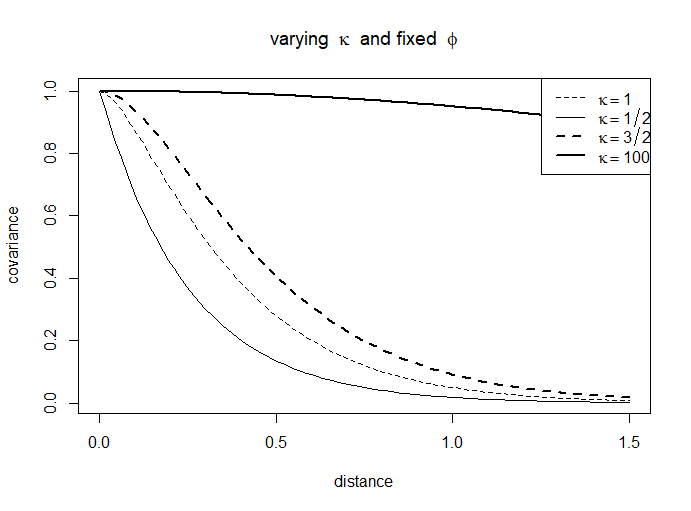

# Point Referenced Data Modeling {#prdm}

Geostatistical data are a collection of samples of geo type data indexed by coordinates (e.g. latlong, eastings and northings) that originate from a spatially continuous phenomenon [@Moraga2019]. Data as such can monitor a vast range of phenomena, as an example disease cancer detection [@Bell2006] at several sites, COVID19 spread in China [@Li_Li_Ding_Hu_Chen_Wang_Peng_Shen_2020], PM pollution concentration in a North-Italian region Piemonte [@Cameletti2012]. Moreover house prices variation, as observed in @Bayesian_INLA_Rubio, where selling prices smoothly vary between closer neighborhoods. All the Examples taken before might document a spatial nature of data according to which closer observations can display similar values, this phenomenon is named spatial autocorrelation. Spatial autocorrelation conceptually originates from geographer Waldo Tobler whose famous quote, known as first law of geography, inspires geostatisticians:

> "Everything is related to everything else, 
> but near things are more related than distant things"
>
>  `r tufte::quote_footer('--- Waldo R. Tobler')`

Spatial models are explicitly designed to take into account this behavior and can separate spatial patterns from simply random spatial variance. 
Spatial data can be partitioned into three spatial data type whose modeling tools are specific with respect to their category.

- Areal Data
- **Point Referenced Data**
- Point Pattern Data


<!-- Potrei mettere lealfet interattivo ma si rovina nella conversione latex
rimane da provare:
- salvarlo come oggetto html e poi plottarlo
- cambiare providers con uno più semplice
- evitare markers difficile

questa immagine sotto è troppo grande, occupa tutta una pagina del PDF
-->


REST API seen in chapter \@ref(Infrastructure) extracts point referenced data, so modeling methodologies described in this analysis will exclusively take into account point referenced oriented techniques.
In order to extend the notion from discrete measurements (i.e. point referenced) to a continuous spatial surface a stochastic process, namely Gaussian Process, has to be introduced and constrained according to convenient properties. GP are then evaluated with a specific covariance function, i.e. Matèrn. The reason why Matérn is selected as candidate for covariance function will be much more clear in the next chapter \@ref(spde). 
Hedonic Price Models are at first introduced and then a brief literature review is offered. Hedonic Prices brings to this work the theoretical basis but they do not suggest estimation methods, which are essentially the major issue in geostatistics. For this reason Hedonic Models are exploited into a spatial bayesian regression framework with the aim to apply INLA (seen in chpater \@ref(inla)) methodology. 
At first standard Bayesian regression is presented as introduction, then the spatial component in the form of a GP is added to the model. Many parameters are considered so far, as a consequence a hierarchy structure is imposed. To this extent an entire section is dedicated to hierarchy which simplifies model building and methodology understanding as well as allowing to bring in many different parameters that come from different levels through the exchangeability property. 
As a matter of fact parameters originate from the Gaussian latent field, but also from  Matérn covariance function tuning hyper parameters.
Then INLA is applied and a GMRF representation of GP is...
Spatial kriging is essential to predict the process at new locations so that the spatial surface can be plotted and analyzed. 
In the end models have to be checked and verified with resampling schemes which are once again specific to the data type and the scope of the analysis.


_(forse mettere alla fine come further developments)_
As a side note Spatial data can also be measured according to a further dimension which is the Time. Latest literature suggests that spatio temporal models are the most accurate, as a consequence it might be interesting to research time correlation between subsequent spatial data time points, a valuable reference is offered in @PACI2017149. This will not take an enormous effort due ti the fact that on a daily basis REST API generates data which are stored as .json file on a DB. Future research on this data might consider the idea to include the time component in the model.


## Gaussian Process (GP){#GP}

For simplicity lets consider $y$ point of interest observations $y\left(\boldsymbol{s}_{1}\right),y\left(\boldsymbol{s}_{2}\right), \ldots, y\left(\boldsymbol{s}_{n}\right)$
from a random spatial process $Y$, such that: $Y\left(\boldsymbol{s}_{1}\right),Y\left(\boldsymbol{s}_{2}\right), \ldots, Y\left(\boldsymbol{s}_{n}\right)$ observed at location $\boldsymbol{s}_{1}, \ldots, \boldsymbol{s}_{n}$. In the context of geostatistical data each observation has to be considered as a partial realization of an unobserved random spatial process.
$\left\{Y(s): s \in D \subset \mathbb{R}^{2}\right\}$, where surface $D$ is a subset of r-dimensional Euclidean space $\mathbb{R}^{r}$. 
Moreover When $r = 1$ it is the most simple stochastic process widely explored in literature i.e. time series process. However geostatistical data always have $r = 2$ (i.e. lat and long, eastings and northings) or eventually $r = 3$, when elevation data is available. The stochastic process $Y$ is observed in a fixed set of "monitoring stations" and inference can be done regarding moments of the realized process. This information are essential to build a spatially continuous surface over the y-studied variable in order to predict the phenomenon at locations not yet observed.  


```{definition,GP,name="GP definition"}
A collection of $n$ random variables, such as $Y(s_{1}), Y(s_{2}) , \ldots, Y(s_{n})$ that are _valid_ spatial processes are said to be a **GP** if for any set of spatial index $n$ and for each set of corresponding locations $\left\{y\left(s_{1}\right), \ldots, y\left(s_{n}\right)\right\}$  follows a multivariate _Gaussian_ distribution with mean $\boldsymbol{\mu}=\left\{\mu\left(s_{1}\right), \ldots, \mu\left(s_{n}\right)\right\}$ and covariance matrix $\mathbf{Q}^{-1}_{i,j}, \forall i \neq j$
```

Even tough sometimes it is more convenient to express the covariance matrix as its inverse i.e. precision matrix $\boldsymbol{Q}_{i,j}$ [@Blangiardo-Cameletti]. The covariance matrix relates each observation to each of the others through a covariance function defined as $\mathcal{C}(\cdot)$.


GP in the spatial context must check two important properties in order to exploit INLA, even though both of these assumptions can be relaxed:

* **Stationary**.
* **Isotropy**.


**Stationarity** in a stochastic process can be _strong_, _weak_ or _intrinsic_. The strong property forces the distribution of the process $\left\{y\left(s_{1}\right), \ldots, y\left(s_{n}\right)\right\}$ for any given spatial index $n$ and its correspondent location sets $s_{1,\ldots,n}$ to be the same as the one in $\left\{y\left(s_{1}+\boldsymbol{h}\right), \ldots, y\left(s_{n}+\boldsymbol{h}\right)\right\}$, where $h$ is a number belonging to $R^{2}$. 
On the other hand the weak property ensures that if the GP mean moment is constant over the study domain $\mu(\mathbf{s}) \equiv \mu$ (e.g. $E[Y(s)]=\mu, \forall s \in D$) then the covariance functions does depend only on the distance (euclidean $\left\|s_{i}-s_{j}\right\|$ distance) between each couple points.
Weak stationarity consequences are the most interesting: It does not matter whether observations are placed either in a specific region, nor the direction towards they are oriented, the covariance functions $\mathcal{C}(h)$ can summarize the process through the separation vector $\mathbf{h}$ i.e. $\mathcal{C}(\mathbf{s}, \mathbf{s}+\mathbf{h})=\mathcal{C}(\mathbf{h}), \forall \mathbf{h} \in \mathbb{R}^{r}$ [@Banerjee-Gelfand]. In other words weak stationarity in GP implies being invariant under _translation_ [-@Krainski-Rubio]. The relationship between strong and weak is not bijective since being strong implies also being weak, but the opposite is not always true for non-Gaussian process.
Furthermore through the intrinsic stationary property it is meant that $E[Y(\mathbf{s}+\mathbf{h})-Y(\mathbf{s})]=0$, the second moment of the latter expression can be written as $E[Y(\mathbf{s}+\mathbf{h})-Y(\mathbf{s})]^{2}$ leading to $\operatorname{Var}(Y(\mathbf{s}+\mathbf{h})-Y(\mathbf{s}))$. Last expression is called _variogram_ and can be expressed with $2 \gamma(\mathbf{h})$, even tough its half,i.e. $\gamma(\mathbf{h})$, is more interpretable, namely _semivariogram_ [@Cressie_2015].

Semivariograms are characterized by mainly 3 tuning parameters:

- _range_ $\sigma^{2}$: At some offset distance, the variogram values will stop changing and reach a sort of “plateau”. The distance at which the effect occurs is called the range $\frac{\Delta\gamma(\mathrm{h})}{h} \approx 0$.
- _sill_ $\tau^{2}$: The “plateau” value at which the variogram stops changing $\frac{\Delta\gamma(\mathrm{h})}{h} = 0$.
- _nugget_ $\tau^{2}+\sigma^{2}$: The discontinuity at the origin. Although this theoretically should be zero, sampling error and short scale variability can cause it to be non-zero $\gamma(\mathrm{0})$.

 


presi i dati con le relative distanze euclidee a coppie di punti si binnano le distanze grazie ad un offset ottenendo i valori per il semivariogram. ottenuti i valori si fitta il semivargiogram a quei valori, un modo  è la likelihood. A questo punto si calcolano le tre grandezze nugget sill e range per poi poter far uscire le funzioni di covarianza. 

<!-- <!-- non so se tenere -->

<!-- da qui -->

<!-- -->
<!-- Furthermore since it is assumed to be true by the intrinsic stationary property that $E[Y(\mathbf{s}+\mathbf{h})-Y(\mathbf{s})]=0$, the second moment of the latter expression can be written as $E[Y(\mathbf{s}+\mathbf{h})-Y(\mathbf{s})]^{2}$ leading to $\operatorname{Var}(Y(\mathbf{s}+\mathbf{h})-Y(\mathbf{s}))$. Last expression is called _variogram_ and can be expressed with $2 \gamma(\mathbf{h})$, even tough its half,i.e. $\gamma(\mathbf{h})$, is more interpretable, namely _semivariogram_ [@Cressie_2015]. -->
<!-- The intuition behind the variogram is that the difference in value between two near points $Y(\mathbf{s}+\mathbf{h})$ and $Y(\mathbf{h})$ is expected to be small with respect to the ones farther ( _ergodicity_ of the spatial process  @Banerjee-Gelfand ), in compliance with the first law of geography by Tobler:  -->


<!-- > "Everything is related to everything else,  -->
<!-- > but near things are more related than distant things" -->
<!-- > -->
<!-- >  `r tufte::quote_footer('--- Waldo R. Tobler')` -->


<!-- Semivariograms are an efficient tool to asses spatial continuity and contiguity but they are theoretical. However semivariograms can be fitted into existing data giving birth to empirical semivariograms which are then plotted against their separation vector. The plot can be used to verify the null hypothesis of spatial independence and variability of the process. The below expression is the empirical semivariogram functional form: -->

<!-- $$\hat{\gamma}(t)=\frac{1}{2}|N(t)| \sum_{\left(\mathbf{s}_{i}, \mathbf{s}_{j}\right) \in N(t)}\left(Y\left(\mathbf{s}_{i}\right)-Y\left(\mathbf{s}_{j}\right)\right)^{2}$$ -->


<!-- where $N(t)$ is the set of location pairs such that $\left\|\mathbf{s}_{i}-\mathbf{s}_{j}\right\|=t$ and so $|N(t)|$ is the number of pairs in the set. As already guessed before empirical semivariogram values are expected to be small at short pairs distance and tends to increase when distance increases. The rational behind is that similar observations are expected to lay close together (small $h$) leading to lower semivariogram values ($\gamma(\mathbf{h})$), as opposite farther pairs obervations (big $h$) tend to be different and associated to greater semivariogram values. Flat semivariogram might indicate small spatial variance, since whether separation $h$ increases or not, semivariogram values remains the same $\frac{\Delta\gamma(\mathbf{h})}{\Delta\mathbf{h}}\approx0$. Semivariograms might be implied earlier in the modeling process to to evaluate the presence of any spatial pattern. Then they are also implied in the model checking stage with the aim to asses if any spatial pattern is still present in the residuals.  -->

<!--  -->

<!-- <!-- a qui --> 

The process is said to be **Isotropic** if the covariance function depends only on the between-points distance $\left\|\mathbf{h}\right\|$ so it is invariant under _rotation_ [-@Krainski-Rubio]. A further way of seeing the property is that Isotropy implies concentric decaying contours that resemble the vanishing of spatial dependence, and so covariance values too. 
then if the last assumption does not hold and direction towards point are distant from each other matters within the spatial domain $D$, then is said to be **Anisotropic**. 
Formalizing the results:

$$\mathcal{C}(\mathbf{h})=\mathcal{C}(\|\mathbf{h}\|)$$


## Spatial Covariance Function

The covariance function $\mathcal{C}(\cdot)$ ensures that all the values that are close together in input space will produce output values that are close together. $\mathcal{C}(\cdot)$ needs to inherits the _validity_ characteristics from the random spatial process, furthermore it has to be _positive definite_. 
In addition covariance function  must share characteristic properties of functions, such as:

(cerca di capire queste...)

 - Multiply valid covariance functions (summing independent random variables)
 - Mixing covariance functions (mixing distributions)
 - Convolving covariance functions, this will be very important ...
 
<!-- Below a generalized version for two random $i$th $j$th observations: -->

<!-- \begin{equation} -->
<!-- \operatorname{Cov}\left(y\left(s_{i}\right), y\left(s_{j}\right)\right) -->
<!-- (\#eq:cov) -->
<!-- \end{equation} -->

Covariance functions under stationary and isotropic GPs displays two important properties: they are constant in mean within $D$ i.e. $\mathcal{C}(\mathbf{s}, \mathbf{s}+\mathbf{h})=\mathcal{C}(\mathbf{h}), \forall \mathbf{h} \in \mathbb{R}^{r}$ and they depends on distance vector $\mathbf{h}$, not direction i.e. $\mathcal{C}(\mathbf{h})=\mathcal{C}(\|\mathbf{h}\|)$
There are many covariance functions and ways to relate distant points on a spatial domain $D$. Typically the choice of the Covariance can depend either on data or the scope of the analysis. Covariance functions are wrapped into special hyper parameters which are mainly three:

1. _Range_: At some offset distance, the variogram values will stop changing and reach a “plateau”. The distance at which this occurs is called the range.
2. _Sill_: The “plateau” value at which the variogram stops changing.
3. _Nugget_: The discontinuity at the origin. Although this theoretically should be zero, sampling error and short scale variability can cause it to be non-zero

(espressione della covariance function insieme a alle $\sigma^2$ come:  $C(\mathbf{s}+\mathbf{h}, \mathbf{s} \mid \theta)=\sigma^{2} \mathbf{R}(\|h\| ; \phi)$)
spiega anche queste due sotto


$$
\mathbf{w}=\left(w\left(\mathbf{s}_{1}\right), \ldots, w\left(\mathbf{s}_{n}\right)\right)^{\prime} \sim \mathrm{N}\left(\mathbf{0}, \sigma^{2} \mathbf{R}(\phi)\right) \text { where } \left.\mathbf{R}(\phi)_{i j}=\rho\left(\left\|\mathbf{s}_{i}-\mathbf{s}_{j}\right\| ; \phi\right)\right)
$$


$\Sigma_{\theta}=\sigma^{2} \mathbf{R}(\phi)+\tau^{2} I_{n}$


A summary of the most used covariance functions are presented below.

$$
\begin{aligned}
&\text { Exponential } \quad \mathcal{C}(\mathbf{h})=\left\{\begin{array}{cl}
\tau^{2}+\sigma^{2} & \text { if }  h=0 \\
\sigma^{2} \exp (-\phi h) & \text { if } h>0 
\end{array}\right.\\
&\text { Gaussian } \quad \mathcal{C}(\mathbf{h})=\left\{\begin{array}{cl}
\tau^{2}+\sigma^{2} & \text { if } h=0 \\
\sigma^{2} \exp \left(-\phi^{2} h^{2}\right) & \text { if } h>0 
\end{array}\right. \\
&\text { Matérn } \quad \mathcal{C}(\mathbf{h})=\left\{\begin{array}{cl}
\tau^{2}+\sigma^{2} & \text { if } h=0 \\
\frac{\sigma^{2}}{2^{\nu-1} \Gamma(\nu)}(\phi h)^{\nu} K_{\nu}(\phi h) & \text { if } h>0
\end{array}\right.
\end{aligned}
$$

### Matérn Covariance Function{#Matern}

Matérn is special since when it is used together with a stationary and isotropic GP, the SPDE approach can provide a GMRF representation of the same process, chapter \@ref(spde) discloses this fundamental property.
Matérn can also be accounted as the most used in geostatistics [@Krainski2018] and [@Bayesian_INLA_Rubio] and is tuned mainly by two parameters, a scaling one $\kappa>0$, usually set equal to the range by the relation $\sigma^{2}=\frac{\sqrt{8 \lambda}}{\kappa}$) and a smoothing one $\nu>0$.  A _stationary_ and _isotropic_ Matérn covariance function has this form:


$$
\mathcal{C}(\mathbf{h})=\left\{\begin{array}{ll}
\tau^{2}+\sigma^{2} & \text { if } h=0 \\
\frac{\sigma^{2}}{2^{\nu-1} \Gamma(\nu)}(\phi t)^{\nu} K_{\nu}(\phi t) & \text { if } h>0
\end{array}\right.
$$

 $\Gamma(\nu)$ is a Gamma function depending on $\nu$ values, $K_{\nu}(\cdot)$ is a modified Bessel function of second kind. The smoothness parameter $\nu$ in the figure below takes 4 different values showing the potentiality of Matérn to relates distances to covariance values. When $\nu = 1$ ... When $\nu = 1/2$ it becomes the exponential covariance function, When $\nu = 3/2$ it uncovers a convenient closed form, when $\nu \approx \infty$, in this case for representation purposes $\nu = 80$ it becomes Gaussian covariance function.





ancora di più su matern, forse di più in spde 

<!-- By decomposing it into a more granular form and cosidering two generic locations $\mathbf{S}_{i}$  and $\mathbf{S}_{j}$, -->

<!-- $$ -->
<!-- \operatorname{Cor}_{Matérn}\left(U\left(\mathbf{s}_{i}\right), U\left(\mathbf{s}_{j}\right)\right)=\frac{2^{1-\nu}}{\Gamma(\nu)}\left(\kappa\left\|\mathbf{s}_{i}-\mathbf{s}_{j}\right\|\right)^{\nu} K_{\nu}\left(\kappa\left\|\mathbf{s}_{i}-\mathbf{s}_{j}\right\|\right) -->
<!-- $$ -->

<!-- where $\|\cdot\|$ is the Euclidean distance, $\Gamma(\cdot)$ is a gamma function and $K_{\nu}(\cdot)$ is a modified Bessel function of second kind. The relationship that ties Matérn correlation and covariance is $\mathcal{C}(h_{i,j}) = \operatorname{Cov}_{Matérn}\left(U\left(\mathrm{s}_{i}\right), U\left(\mathrm{s}_{j}\right)\right) = \sigma_{u}^{2} \operatorname{Cor}_{M}\left(U\left(\mathbf{s}_{i}\right), U\left(\mathbf{s}_{j}\right)\right)$. -->
<!-- Then if $u(\mathbf{s})$ is a realization from $U(\mathbf{s})$ at $n$ locations the joint covariance matrix can be defined as each entry of the joint covariance matrix $\Sigma_{i, j}= \sigma_{u}^{2} \operatorname{Cor}_{M}\left(U\left(\mathbf{s}_{i}\right), U\left(\mathbf{s}_{j}\right)\right)$. Common customary choice is to assume that $U(.)$ in centered in 0. -->


## Hedonic models Literature Review and Spatial Hedonic Price Models

The theoretical foundation of the Hedonic Price Models (from now on HPM) resides in the consumer utility theory of @Lancaster together with @Rosen market equilibrium. According to Lancaster the utility of a commodity does not exist by itself, instead it exists as the sum of the utilities associated to its separable characteristics. Integrating Lancater, Rosen introduces HPM and suggests that each separate commodity characteristics are priced by the markets on the basis of supply and demand equilibrium. Applying HPM to Real Estate in a market context, from the buy side house prices (but also rents) are set as the unit cost of each household attributes, conversely from the selling side the expenditures associated to build of each them.
Formalizing the results, Hedonic Price $P$ in Real Estate is expressed as a general $f$ functional form that takes as input the house characteristics vector $\mathbf{C}$. 

$$P=f\left(c_{1}, c_{2}, c_{3}, \ldots, c_{n}\right)$$

Vector $\mathbf{C}$ since now might contain a unidentified and presumably vast number of ungrouped characteristics. In this setting @Malpezzi tried to organize house features by decomposing $\mathbf{C}$ into mutually exclusive and exhaustive subgroups. An overview of the vector components involved is given by @Ling according to which $P$ represents the house price, $S$ is the structural characteristics of the house, $N$ represents the neighborhood characteristics, $L$ signifies the locational characteristics, $C$ describes the contract conditions and $T$ is time. $\beta$ is the vector of the parameters to be estimated. Then

$$P=f\left(S, N, L, C, T, \beta\right)$$

Historically a first attempt to include spatial effect in urban economic literature is provided by _Alonso (1964) miss ref_. Its contribution was to raise voice on house prices (also rent) mainly depending on land price and a number of purely spatial covariates like CBD, the distance from City Business District. Other covariates were transport cost per kilometer and community income, even though they were defined also as spatial parameters through distances. The model proposed by Alonso is called monocentric since the centroid from which distances are calculated is only one. Moreover a first touch to spatial data thory was done since the CBD was defined as areal unit with well-defined boundaries of regular or irregular shape. However applications of the model were not convincing since empirical studies offered a different picture. Results instead displayed a Poly-centric areal structure (universities and Malls) which might be better explaining prices. The model also assumed that covariates like CBD are only informative within city center boundaries and then displayed no significance out of the core of the city. Poly-centric theory was also more coherent with the architectural and socio-economical evolution of cities during that times, therefore mono centric theory was then criticized and abandoned. Critics regarded also neighborhood quality measure and boundary problems _Dubin (1987) miss ref_. Dubin for these reasons developed a model including areal effects in the error term since handling these covariates was posing several hard challenges. Areal data choice for Dubin was forced since he was interested in land values, geostatics interest was not a focus also due to the difficulties in gathering accurate data. Coming to recent literature a change in focus has been made by switching from theory based model to estimation methods. As a consequence to the change in focus @Ling said that practitioners should spend more time in variable selection and model specification with respect to their specific need. 
As Ling has observed the emerging trends are in the field of semi-parametric and non-parametric methods -@Ling. Historically semi-parametric regression considers models indexed by spatial coordinates _Pace RK (1995)_. At the same time _Kammann and Wand (2003)_ gave birth to geoadditive models where the spatial component is added as a covariate. [...]


A further aspect of the problem is posed by scholars that do not consider rents to be representative for the actual value of real estate. Nevertheless in empirical analysis rent value are considered a proxy for real estate pricing [@Herath_Maier_2011]. A further argument to endorse this hypothesis is brought by @sellingVSrental considering housing a commodity, then the selling or the rental should be considered interchangeable economic actions with respect to same inner need to be satisfied. This is also truer to the thesis' extent since Manganelli, Morano, and Tajani have centered their analysis exactly on italian real estate data. Moreover @Capozza_Seguin_1996 discussed on how much rent-price ratio predicts future changes both in rents and prices. Among all the other discussions raised they brought the decomposition of rent-price ratio into two parts: the predictable part and the unexplained residuals part. The predictable part was discovered to be negatively correlated with price changes, in other words cities in which prices are relatively high with respect to rents are associated with higher capital gains that might justify that misalignment. This is also true for the opposite, that is cities in which prices are lower with respect to the rents, and this effect can not be associated to any local condition, realize lower capital gains. A further argument is offered by Clark [@Clark_1995] which went after the Capozza and Seguin work. Rent-price ratio is negatively correlated with following future changes in rents. In other words prices are still higher when areas in which they are observed documents an increase in rent prices. All the literature review above is oriented to a long-run alignment of price and rent. 


## Point Referenced Regression for univariate spatial data{#univariateregr}

Since in HPM the relationships between the characteristics of the house, i.e. vector $\mathbf{C}$ and the price $P$ is not in any case fixed by econometric literature it is possible to assume any $f$ functional form. The open possibility to apply a wide range of relationship between covariates fit in the INLA setting, since Latent Gaussian Models are prepared to accept a any linear and non linear $f$ functions \@ref(LGM) through the `f()` method. Hedonic price models are, as a consequence, a subset of models that can be fitted into LGM and therefore by INLA method.

Moreover what the vast majority of econometric literature _(Greene, 2018)_ suggest to apply a is log-linear / square root model. This is due to the fact that log transformation / square root smooths the skewness of prices normalizing the curve, leading to more accurate estimates. Having an exponential family generating process lowers even further computational cost for reasons linked to the $\tilde\pi(\boldsymbol{\psi})$ hyper param INLA approximation [@Blangiardo-Cameletti]. Notation is taken from the previous chapter \@ref(inla), for brevity purposes $\boldsymbol{\beta}$ $\mathbf{X}$ and $\boldsymbol{y}$ indicates vectors incorporating all their respective realizations and the $s$ spatial component is left out in favor of the observation pedix $i$.  
The simplest log-linear bayesian regression model assumes linear relationship between predictors and a Normal data generating process: (log has been taken out for simplicity, bu it will be then considered in the regression setting) (valuta l'idea che per interpretabilità di modellarla come Gamma exponential family anzichè tenerla normale)

$$
\log{(y_{i})} \sim \operatorname{Normal}(\mu_{i}, \sigma^{2})
$$

$$
y_{i}=\mu_{i}+\varepsilon_{i}
$$

then by the following relationship $E\left(y_{i} \mid \beta_{0}, \ldots, \beta_{M}, x_{i 1}, \ldots, x_{i M}\right)=\beta_{0}+\sum_{m=1}^{M} \beta_{m} x_{i m}$  it is possible to specify a more general linear predictor (seen also in chapter \@ref(inla)) through an identity link function i.e. $\eta_{i}=g\left(\mu_{i}\right)=\mu_{i}$ obtaining:

$$
\eta_{i}=\beta_{0}+\sum_{m=1}^{M} \beta_{m} x_{m i}+\sum_{l=1}^{L} f_{l}\left(z_{l i}\right)
$$

Where, once again, the mean structure linearly depends on some $\mathbf{X}$ covariates, $\boldsymbol{\beta}$ coefficients, $f_{l}(\cdot), \forall l \in 1 \ldots L$ are a set of random effects defined in terms of a $\boldsymbol{z}$ set of covariates $\boldsymbol{z}=\left(z_{1}, \ldots, z_{L}\right)$ (e.g. rw, ar1) and  $\varepsilon_{i}$ white noise error.
Priors have to be specified and a non informativeness for $\tau^2 = 1/\sigma^2$ and $\boldsymbol{\beta}$ is chosen, such that $\pi(\tau^2) \propto 1$ and $\pi(\boldsymbol\beta) \propto 1$. As a consequence the conditional posterior for the parameters of interest $\boldsymbol{\beta}$ is:

$$
\boldsymbol{\beta} \mid \sigma^{2}, \boldsymbol{y}, \boldsymbol{X} \sim \operatorname{MVNormal}\left(\left(\boldsymbol{X}^{\prime} \boldsymbol{X}\right)^{-1} \boldsymbol{X}^{\prime} \boldsymbol{y}, \sigma^{2}\left(\boldsymbol{X}^{\prime} \boldsymbol{X}\right)^{-1}\right)
$$

where the mean structure corresponds to the OLS estimator: $\left(\boldsymbol{X}^{\prime} \boldsymbol{X}\right)^{-1} \boldsymbol{X}^{\prime} \boldsymbol{y}$ for $\beta$ and then to obtain the marginal posterior for $\boldsymbol{\beta}$ it is needed to integrate with respect to $\sigma^2$.

In order to engage the spatial coordinate components into the regression setting $w_{i}$ has to be added to the equation. $w_{i}$ is set as a stationary and isotropic GP with mean 0 and variance as covariance function expressed as Matérn.
Recall that GP
The new regression setting integrates the _spatial error_ part in the name of $w_{i}$ and a _non-spatial error_ part $\varepsilon_{i}$ distributed normally with mean 0 and variance $\tau^2$ ,i.e. $\mathrm{N}\left(0, \tau^{2}\right)$, which offers its contribution error to the nuggets via the covariance function. 
Consequently there is one more parameter to estimate. It is worth mentioning that the distribution of $w_{i}$ at a finite number of points is considered a realization of a multivariate Gaussian distribution. In this case, the likelihood estimation is possible and it is the multivariate Gaussian distribution with covariance $\Sigma$. 

$$
\log(y_{i})= \beta_{0} + (\mathbf{X})^{\prime}\boldsymbol{\beta}+w_{i}+\varepsilon_{i}
$$


The covariance of the marginal distribution of $y_{i}$ at a finite number of locations is $\Sigma_{y} = \Sigma + \tau^2\mathbf{I}$, where $\mathbf{I}$ denotes the indicator function (i.e., $\mathbf{I}(i = i^{\prime})= 1$ if $i = i^{\prime}$, and 0 otherwise). This is a short extension of the basic GF model, and gives one additional parameter to estimate

<!-- \begin{equation} -->
<!--     \log(y_{i})=\mu_{i}+\varepsilon_{i} -->
<!-- (\#eq:genreg) -->
<!-- \end{equation} -->

<!-- where $y_{i}$ is normally distributed as $y_{i} \sim \operatorname{Normal}\left(\mu_{i}, \sigma^{2}\right)$ and $\mu_{i}$ is the mean structure that linearly depends on some $\mathbf{X}$ covariates, $\boldsymbol{\beta}$ coefficients, $f_{l}(\cdot), \forall l \in 1 \ldots L$ are a set of random effects defined in terms of a $\boldsymbol{z}$ set of covariates $\boldsymbol{z}=\left(z_{1}, \ldots, z_{L}\right)$ (e.g. rw, ar1) and  $\varepsilon_{i}$ white noise error. Please recall that the $i$th pedices are the observations and the $m$th pedices are the covariates. The structure is a repetition of what already seen in chapter \@ref(LGM) -->

<!-- \begin{equation} -->
<!--   \eta_{i}=\beta_{0}+\sum_{m=1}^{M} \beta_{m} x_{m i}+\sum_{l=1}^{L} f_{l}\left(z_{l i}\right) -->
<!-- (\#eq:linearpred) -->
<!-- \end{equation} -->

<!-- The link function specified in this case is still identity, so that $\eta_{i}=g\left(\mu_{i}\right)=\mu_{i}$. Nevertheless GLMs can be applied with different link function. when response variable has to stay between $[0,1]$ (e.g. probabilities), the link function might be Logit, which leads to logistic regression. More generally expressed in vector notation: -->

<!-- \begin{equation} -->
<!--   \log(y_{i})\left(\mathbf{s}_{i}\right)=\mathbf{x}\left(\mathbf{s}_{i}\right)^{\prime} \beta_{j}+\varepsilon\left(\mathbf{s}_{i}\right) -->
<!--   (\#eq:genregvec) -->
<!-- \end{equation} -->

<!-- where its OLS estimator is: -->
<!-- \begin{equation} -->
<!--   \hat{\beta}=\left(\mathbf{X}^{\prime} \mathbf{X}\right)^{-1} \mathbf{X}^{\prime} \mathbf{y} -->
<!-- (\#eq:ols) -->
<!-- \end{equation} -->

<!-- Moreover In the context of bayesian analysis a prior distribution has to be imposed on the regression coefficients $\beta = \left\{\beta_{0}, \ldots, \beta_{J}\right\}$ as well ad on the variance  $\sigma^{2}$ of $y_{i}$. When no expert information is provided vague priors are introduced, meaning that the regression should not be weighted too much on the priors choice. -->
<!-- Vague priors might be: -->

<!-- - $\beta_{m} \sim \operatorname{Normal}\left(0,10^{6}\right)$ for the beta coefficients -->
<!-- - $\log (\tau)=\log \left(1 / \sigma^{2}\right) \sim \log \operatorname{Gamma}\left(1,10^{-5}\right)$ for precision -->

<!-- Spatial modeling goal is to include spatial information from location into the model. This is done within the bayesian frameoùwork and INLA by adding $w(\mathbf{s})$ in the previous equation \@ref(eq:genregvec).  -->

<!-- $$y\left(\mathbf{s}_{i}\right)=\mathbf{x}\left(\mathbf{s}_{i}\right)^{\prime}\beta_{j}+w(\mathbf{s})+\varepsilon\left(\mathbf{s}_{i}\right)$$ -->

<!-- The $w(\mathbf{s})$ in the context of the analysis is approached as a stationary and isotropic GP\@ref(GP) whose distribution by definition is multivariate Gaussian with mean $\boldsymbol{\mu}(\mathbf{s}) = 0$ and function of the spatial index $\mathbf{s}$ and covariance function $\mathcal{C}( \cdot \mid \theta)$ . -->
<!-- $\varepsilon(\mathbf{s})$ is iid and mean centered in 0 with variance $\tau^{2}$ and is called non-spatial error since it contributes to the nugget. The error term is pure since it interferes with the covariance function so that the model can embody the spatial component.  -->
<!-- One of the major advantages of having a a spatial process embedded into a GP is _likelihood_ based inference.  -->

<!-- ### Parameter estimation  -->

<!-- Gaussian spatial models can be considered as GLM with a particular specification of the precision matrix $\Sigma_{\theta}=\sigma^{2} \mathbf{R}(\phi)+\tau^{2} I_{n}$, -->
<!-- then the likelihood can be computed by: -->
<!-- $$\mathbf{y} \mid \boldsymbol{\theta}, \boldsymbol{\beta} \sim \mathrm{N}\left(\mathbf{X} \beta, Q_{\theta}\right)$$ -->
<!-- where,  $\boldsymbol{\theta}=\left(\sigma^{2}, \tau^{2}, \phi\right)$ -->
<!-- Since likelihood estimation is possible then MLE can be computed for $\boldsymbol{\beta}$ and $\boldsymbol{\theta}$ are $\hat{\boldsymbol{\beta}}$ and $\hat{\boldsymbol{\theta}}$.  -->
<!-- Then the estimation in vector notation is:  -->

<!-- $$\hat{\boldsymbol{\beta}}_{M L E}=\left(\mathbf{X}^{\prime} Q^{-1} \mathbf{X}\right)^{-1} \mathbf{X}^{\prime} Q^{-1} \mathbf{y}$$ -->

## Hierarchical Bayesian models{#hiermod}

Spatial Models are characterized by many parameters which in turn are tuned by other hyper-parameters. Traditionally Bayesian hierarchical models are not widely adopted since they have high computational burdens, indeed they can handle very complex interactions via random components, especially when dealing with spatio temporal data @Ling.  Blangiardo e Cameletti -@Blangiardo-Cameletti tried to approach the problem from a different angle offering an intuitive solution on how hierarchy relates different levels parameters. This is done by reversing the problem and starting from data back to parameters, instead the other way round. So taking a few steps back the problem can be reformulated by starting from grouping observation into categories and then trying to impose a hierarchical structure on data based on the categories. As a result observations might fall into different categories, underlining their natural characteristics, such as: some of them might belong to category _levels_ like males or females, married or not-married. Moreover diving into the specific problem house prices can be faceted by which floor they belong or whether they are assigned to different energy classes and many others more. As an example Blangiardo and Cameletti example consider grouping data according to just a single 9 _levels_ category. Data for the reasons stated before can be organized such that each single observation (squares in figure below) belongs to its respective mutually exclusive and collectively exhaustive category (circles in figure).  


Furthermore data can be partitioned into two meta-categories, _fist level_ and _second level_,  highlighting the parameter and hyper paramter chain roles. _First level_ are identified by sampling observations which are drawn by the same probability distribution (squares) . _Second level_ (circles) are categories and might be associated to a set of parameters $\theta=\left\{\theta_{1}, \ldots, \theta_{J}\right\}$.
Since the structure is hierarchical, a DAG (Directed Acyclical Graph) -@Blangiardo-Cameletti representation might sort out ideas. If categories are represented by different $\theta_{j}$ nodes and edges (arrows in the figure) are the logical belonging condition to the category then a single parameter $\theta$ model has the right figure form: 

  

To fully take into account the hierarchical structure of the data the model should also consider further lelvels. Since $\left\{\theta_{1}, \ldots, \theta_{J}\right\}$ are assumed to come from the same distribution $\pi(\theta_{j})$, then they are also assumed to be sharing information [@Blangiardo-Cameletti], (left figure).  When a further parameter $\boldsymbol{\psi}=\left\{\psi_{1}, \ldots, \psi_{K}\right\}$ is introduced, for which a prior distribution is specified, then the conditional distribution of $\boldsymbol{\theta}$ given $\boldsymbol{\psi}$ is:

$$
\pi\left(\theta_{1}, \ldots, \theta_{J} \mid \boldsymbol{\psi}\right)=\int \prod_{j=1}^{J} \pi\left(\theta_{j} \mid \psi\right) \pi(\psi) \mathrm{d} \psi
$$
This is possible thanks to the conditional independence property already encountered in chapter \@ref(inla), which means that each single $\theta$ is conditional independent given $\psi$
This structure can extended to allow more than two levels of hierarchy since the marginal prior distributions of $\theta$ can be decomposed into the product of their conditional priors distributions given some hyper parameter $\psi$ as well as their prior distribution $\pi(\psi)$.

$$
\pi(\boldsymbol{\theta})=\int \pi\left(\boldsymbol{\theta} \mid \boldsymbol{\psi}_{1}\right) \pi\left(\boldsymbol{\psi}_{1} \mid \boldsymbol{\psi}_{2}\right) \ldots \pi\left(\boldsymbol{\psi}_{L-1} \mid \boldsymbol{\psi}_{L}\right) \pi\left(\boldsymbol{\psi}_{L}\right) \mathrm{d} \boldsymbol{\psi}_{1} \ldots \mathrm{d} \boldsymbol{\psi}_{L}
$$

$\boldsymbol{\psi}_{l}$ identifies the hyper pram for the $l_{th}$ level of hierarchy. Each further parameter level $\psi$ is conditioned to its previous in hierarchy level $l-1$ so that the parameter hierarchy chain is respected and all the linear combinations of parameters are carefully evaluated. The *Exchangeability* property enables to have higher $H$ nested DAG (i.e. add further $L$ levels) and to extend the dimensions in which the problem is evaluated, considering also time together with space. From a theoretical point of view there are no constraints to how many $L$ levels can be included in the model, but as a drawback the more the model is nested the more it suffers in terms of interpretability and computational power. Empirical studies have suggest that three levels are the desired amount since they offer a good bias vs variance trade-off.

## INLA model through spatial hierarchical regression{#finalregr}

INLA model seen in section \@ref(LGM) can be rearranged according to the hierarchical structure considering also the regression settings for point referenced data stated in the previous section \@ref(univariateregr).

As an initial step it is required to specify a probability distribution for $\boldsymbol{y} = \left(y\left(s_{1}\right), \ldots, y\left(s_{n}\right)\right)=\left(y_{1}, \ldots, y_{n}\right)$, this is a mandatory step looking at the \@ref(example) methods needed to compute the `inla()` function. A Normal distribution for simplicity is chosen.

As _first level_ is picked up an **exponential family** sampling distribution (i.e. Normally distributed, Gamma one other choice), which is _exchangeable_ with respect to the $\boldsymbol{\theta}=\left\{\beta_{0}, \boldsymbol{\beta}, f\right\}$ *latent field*  and hyper parameters $\boldsymbol{\psi_{1}}$, which includes also the ones coming from the latent Matérn GP process $w_{i}$. The Spatial Guassian Process is centered in 0 and with Matérn covariance function as $\tau^2$. $w_{i}$ addresses the spatial autocorrelation between observation through a Matérn covariance function $\mathcal{C}(\cdot | \boldsymbol\psi_{1})$ which in turn is tuned by hyper param included in $\boldsymbol{\psi_1}$. Moreover the $w_{i}$ surface has to be passed in the formula method definition \@ref(example) via the `f()` function, so that INLA takes into cosideration the spatial component. 


$$
\boldsymbol{y} \mid \boldsymbol{\theta}, \boldsymbol{\psi}_{1} \sim \mathrm{N}\left(\beta_{0}+ (\mathbf{X}_{i})^{\prime}\boldsymbol{\beta} + w_{i} ,  \tau^2 I_{n}\right)=\prod_{i=1}^{n} \mathrm{N}\left(y_{i} \mid \theta_{i}, \psi_{1}\right)
$$

Then at the _second level_ the latent field $\boldsymbol{\theta}$ is characterized by a Normal distribution given the remaining hyper parameters $\boldsymbol{\psi}_2$, recall the covariance matrix $\boldsymbol{Q}^{-1}(\boldsymbol{\psi_{2}})$, depending on $\boldsymbol{\psi_{2}}$ hyperparameters, is handled now by a Matérn covariace function depeding on its hyperparamter. This is done in order to map the GP spatial surface into a GMRF by SPDE solutions.  

$$
\boldsymbol{\theta} \mid \boldsymbol{\psi}_{2} \sim \mathrm{N}\left(\boldsymbol{0}, \mathcal{C}( \cdot , \cdot  \mid \boldsymbol{\psi}_{2})\right)
$$

In the end a _third level_ hyper parameters $\boldsymbol{\psi}=\left\{\boldsymbol{\psi_{1}}, \boldsymbol{\psi}_{2}\right\}$ having some specified prior distribution i.e. $\boldsymbol{\psi} \sim \pi(\boldsymbol{\psi})$,


## Spatial Kriging
In Geostatistics the main interest resides in the spatial prediction of the spatial latent field pr the response variable at location not yet observed. 
Assumed the model in the previous section, suppose that $y^{\star}$ is not a observed occurrence of the response variable at location $s_{0}$ (not in the data) of the GP $w_{i}$ spatial surface estimated through observed refereced points in $\boldsymbol{y}$. As a consequence of exchangeability (first step previous section \@ref(finalregr)) then $\boldsymbol{y}^{\otimes}=\left\{\boldsymbol{y}, y^{\star}\right\}$. Then considering INLA notation it is obtained: 

$$
\begin{aligned}
&\pi\left(y^{\star} \mid \boldsymbol{y}\right)=\frac{\pi\left(\boldsymbol{y}, y^{\star}\right)}{\pi(\boldsymbol{y})} \text { from the conditional probability }\\
&=\frac{\int \pi\left(y^{\star} \mid \theta\right) \pi(\boldsymbol{y} \mid \theta) \pi(\theta) \mathrm{d} \theta}{\pi(\boldsymbol{y})} \text { by exchangeability }\\
&=\frac{\int \pi\left(y^{\star} \mid \theta\right) \pi(\theta \mid y) \pi(y) \mathrm{d} \theta}{\pi(y)} \text { applying Bayes' theorem }\\
&=\int \pi\left(y^{\star} \mid \boldsymbol{\theta}\right) \pi(\boldsymbol{\theta} \mid \boldsymbol{y}) \mathrm{d} \boldsymbol{\theta}
\end{aligned}
$$

A DAG representation might offr the intuition behind Prediction in spatial models:


where $\pi\left(y^{\star} \mid \boldsymbol{y}\right)$ is said predictive distribution and it is meaningful only in the Bayesian framework since the posterior distribution is treated as a random variable, which is totally not true in frequentist statistics.


## Model Checking

(Incrociarlo con altri tesi) 


Once the model is set up and fitted a resampling scheme has to be chosen in order to evaluate the model performance. One of the most used method to assess beyasian model quality is LOOCV cross validation and defualt choice fo R-INLA package. From data is left out one single observation and so that the Validation set is  $\boldsymbol{y}_{v} = \boldsymbol{y}_{-i}$ and the Assessement set is a $\boldsymbol{y}_{a} = \boldsymbol{y}_{i}$
the rest of the observations. Two KPI are assumed to be representative:

- CPO conditional predictive ordinate (pettit, 1990): $CPO_{i} = \pi(y^{\star} \mid \boldsymbol{y}_{v})$
- PIT probability integral tranform (dawid, 1984): $PIT_{i} = \pi(y^{\star} < y_{i} \mid \boldsymbol{y}_{v})$

These quantities are used by default by setting control options in the `inla(control.compute = list())` list object by setting them equal o TRUE. Inla also provides an inner method to authomatically handlee failing in computing those two quantities, leadind to values of 1 when predictions are not reliable and the ipposite for 0.Moreover the empirical distribution of the PIT can be used to asses predictive performance: if it is Uniform, so there are not values that strongly differ from the others then the model is correctly checked. Otherwise if the dostribtuon almost approxiamtes any of the other possibles then the Cross validation assessement prediction has led incorrectly predict the "out of the bag" validation sample.

Posteerior checking method exploits a full cross validation where $\boldsymbol{y}_{a} = \boldsymbol{y}_{v}$ and it is called predictive checks. Th assessement set now is equal to the validation set,a s a consequence all the observation are evaluated twice. 4 quantities are driver to model estimate quality:

- the _posterior predictive distribution_: $\pi(y^{\star} \mid \boldsymbol{y})  = \int \pi(y^{\star} \mid \theta_{i})\pi({\theta_{i}} \mid \boldsymbol{y})\mathrm{d}\theta_{i}$ which is the likelihood of a replicate observation. When values are small that indicates that are those values are coming from tails, since the area under the curve (i.e. probability) is less. If this happens for many observation then outliers are driving the model leading to poor estimates
- the _posterior predictive p-value_ whose math expression is:$\pi(y^{\star} \leq y_{i} \mid \boldsymbol{y})$ for which values near to 0 and 1 indicates poor perfomances. 
- _Root Mean Square Predictive Error RMSE_: $\sqrt{\frac{1}{n} \sum_{i=1}^{n}(y_{i}-{y}^{\star}_{i})^{2}}$
- $R^2$

R-INLA has already antiticipated in chapter 4 section\@ref(example) have designed function to compute statistics on posterior distribution as `inla.pmarginal()` returning the cumulative density distribution.

## Prior Specification


