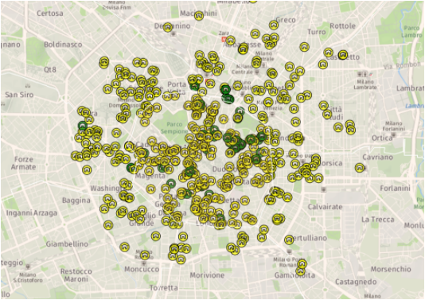

# Point Referenced Data Modeling {#prdm}

Geostatistical data are a collection of samples of geo type data indexed by coordinates (e.g. latlong, eastings and northings) that originate from a spatially continuous phenomenon [@Moraga2019]. Data as such can monitor a vast range of measurements, as an example diseases ones cancer detection [@Bell2006] at several sites, epidemic ones COVID19 spread in China [@Li_Li_Ding_Hu_Chen_Wang_Peng_Shen_2020], environmental ones likewise PM concentration in the North-Italian [@Cameletti2012]. As a further argument house prices smoothly varies between closer neighborhoods [@Bayesian_INLA_Rubio]. All the Examples taken before might document a spatial nature of data according to which closer observations can display similar values, this phenomenon is named spatial autocorrelation. Spatial models are explicitly designed to take into account this behavior and can separate spatial patterns from simply random spatial variance. API generated data are point referenced data, so modeling methodologies applied during the analysis exclusively regard the just introduced data type.
As a side note spatial data can be distinguished into 3 main categories:

* areal data: 
* point referenced data 
* point pattern data

Spatial data can also be measured according to a 3rd dimension (4th where there is elevation) which is time. In this settign it might be interesting to research time correlation between subsequent spatial data time points [@PACI2017149]. Since API generated data on a daily basis stores a .json file on a DB, future research on this data might consider the idea to include the time component in the model. 
What It can be observed in point reference data type is just a sample, some sites, from a continuous unobserved spatial process \@ref(GP) which we aim to estimate.

## Gaussian Process (GP){#GP}

For simplicity lets consider $y$ of interest observations $y\left(\boldsymbol{s}_{1}\right),y\left(\boldsymbol{s}_{2}\right), \ldots, y\left(\boldsymbol{s}_{n}\right)$
from a random spatial process $Y$, such that: $Y\left(\boldsymbol{s}_{1}\right),Y\left(\boldsymbol{s}_{2}\right), \ldots, Y\left(\boldsymbol{s}_{n}\right)$ observed at location $\boldsymbol{s}_{1}, \ldots, \boldsymbol{s}_{n}$. In the context of geostatistical data each observation, once again, has to be considered as a partial realization of an unobserved random spatial process.
$\left\{Y(s): s \in D \subset \mathbb{R}^{2}\right\}$ , where $D$ is a subset of r-dimensional Euclidean space $\mathbb{R}^{r}$. 
When $r = 1$ it is a simple stochastic process widely explored in literature i.e. time series process. Nevertheless geostatistical data belong always to $r = 2$ or eventually $r = 3$, when elevation is available. The stochastic process $Y$ is observed in a fixed set of "monitoring stations" and inference can be done regarding moments of the realized process. This information are essential to build a spatially continuous surface over the y-studied variable in order to predict the phenomenon at locations not yet observed.  

A collection of $n$ random variables, such as $Y(s_{1}), Y(s_{2}) , \ldots, Y(s_{n})$ that are random _valid_ spatial processes are said to be a **GP** if for any set of spatial index $n$ and for each set of corresponding locations $\left(y\left(s_{1}\right), \ldots, y\left(s_{n}\right)\right)$ follows a multivariate _Gaussian_ distribution with mean $\boldsymbol{\mu}=\left(\mu\left(\boldsymbol{s}_{1}\right), \ldots, \mu\left(\boldsymbol{s}_{n}\right)\right)$ and covariance matrix $\mathbf{\Sigma}$ [@Blangiardo-Cameletti]. The covariance matrix relates each observation to each others through a spatial covariance function defined as $\mathcal{C}(\cdot)$.  The covariance function ensures that all the values that are close together in input space will produce output values that are close together. Covariance function needs to inherits the _validity_ characteristics from the random spatial process, furthermore it has to be _positive definite_.  Below a generalised version for the $i$th observation and $j$th:

\begin{equation}
\operatorname{Cov}\left(y\left(s_{i}\right), y\left(s_{j}\right)\right)
(\#eq:cov)
\end{equation}

GP has to meet two important properties: it has to be **Stationary** and  **Isotropic**. 

### Stationarity in GP

Stationarity in a stochastic process can be either _strong_  or _weak_. The strong assumption forces that for any given spatial index $n$ and its correspondent locations $s_{1,\ldots,n}$, the distribution of the process $\left\{Y\left(s_{1}\right), \ldots, Y\left(s_{n}\right)\right\}$ is the same of the one in $\left\{y\left(s_{1}+\boldsymbol{h}\right), \ldots, y\left(\boldsymbol{s}_{n}+\boldsymbol{h}\right)\right\}$, where $h$ is a number belonging to $R^{2}$.
The latter (i.e, weak) ensures that if the GP mean moment is constant over the study domain $\mu(\mathbf{s}) \equiv \mu$ (e.g. $E[Y(s)]=\mu, \forall s \in D$) then the covariance functions does depend only on the distance between each couple points (euclidean $\left\|s_{i}-s_{j}\right\|$ distance) separation. Distance choice is a major subject but for simplicity Euclidean has been selected. Weak stationarity consequences are that It does not matter whether observations are placed either in a specific region, nor the direction towards they are oriented, the covariance functions $\mathcal{C}(h)$ can summarize the process through the separation vector $h$ [@Banerjee-Gelfand]. 

Moreover since it is assumed to be true  $E[Y(\mathbf{s}+\mathbf{h})-Y(\mathbf{s})]=0$, the second moment of the latter expression can be written as $E[Y(\mathbf{s}+\mathbf{h})-Y(\mathbf{s})]^{2}$ leading to also $\operatorname{Var}(Y(\mathbf{s}+\mathbf{h})-Y(\mathbf{s}))$. Last expression is called _variogram_ and can be expressed with $2 \gamma(\mathbf{h})$, even tough its half $\gamma(\mathbf{h})$  is more often used as expression, namely _semivariogram_ [@Cressie_2015]. 
The intuition behind this expression is that the difference in value between two near points $Y(\mathbf{s}+\mathbf{h})$ and $Y(\mathbf{h})$ is expected to be small with respect to the ones farther, in compliance with the first law of geography by Tobler: 

> "Everything is related to everything else, 
> but near things are more related than distant things"
>
>  `r tufte::quote_footer('--- Waldo R. Tobler')`

Semivariograms are an efficient tool to asses spatial continuity but they are theoretical. However semivariograms can be fitted to existing data giving birth to empirical semivariograms which are then plotted against their separation vector. The plot can be used to verify the null hypothesis of spatial independence and variability of the process. The below expression is the empirical semivariogram functional form:

$$\hat{\gamma}(t)=\frac{1}{2}|N(t)| \sum_{\left(\mathbf{s}_{i}, \mathbf{s}_{j}\right) \in N(t)}\left(Y\left(\mathbf{s}_{i}\right)-Y\left(\mathbf{s}_{j}\right)\right)^{2}$$

where $N(t)$ is the set of location pairs such that $\left\|\mathbf{s}_{i}-\mathbf{s}_{j}\right\|=t$ and so $|N(t)|$ is the number of pairs in the set. As already guessed before empirical semivariogram values are expected to be small at short pairs distance and tends to increase when distance increases. The rational behind is that similar observations are expected to lay close together (small $h$) leading to lower semivariogram values ($\gamma(\mathbf{h})$), as opposite farther pairs obervations (big $h$) tend to be different and associated to greater semivariogram values. Flat semivariogram might indicate small spatial variance, since whether separation $h$ increases or not, semivariogram values remains the same $\frac{\Delta\gamma(\mathbf{h})}{\Delta\mathbf{h}}\approx0$. Semivariograms might be implied earlier in the modeling process to to evaluate the presence of any spatial pattern. Then They are also implied later in the final stage of the modeling process with the aim to asses if any spatial pattern in still present in the residuals. The three main arguments in semivariograms are: _range_ $\sigma^{2}$, _nugget_ $\tau^{2}$ and _sill_ $\tau^{2}+\sigma^{2}$. 

- _range_: At some offset distance, the variogram values will stop changing and reach a sort of “plateau”. The distance at which the effect occurs is called the range $\frac{\Delta\gamma(\mathrm{h})}{h} \approx 0$.
- _sill_: The “plateau” value at which the variogram stops changing $\frac{\Delta\gamma(\mathrm{h})}{h} = 0$.
- _nugget_: The discontinuity at the origin. Although this theoretically should be zero, sampling error and short scale variability can cause it to be non-zero $\gamma(\mathrm{0})$.

### Isotropy in GP 
The process is said to be **Isotropic** if the covariance function depends only on the between-points distance so it is invariant under rotation [@Krainski-Rubio]. If the last assumption does not hold and direction towards point are distant from each other in the spatial domain $D$ then the process is said to be **Anisotropic**.

$$C(\mathbf{s}+\mathbf{h}, \mathbf{s} \mid \theta)=\sigma^{2} \mathbf{R}(\|h\| ; \phi)$$

### Matérn covariance function{#Matern}

There are many covariance functions and their application depends both on data and the scope on the analysis.
Examples of spatial covariance functions among all the others are: Linear, Spherical, Exponential and Matérn.
Matérn displays higher degree of flexibility since it has many tuning parameter. It can be also accounted as the most used in geostatistics [@Krainski2018] and [@Bayesian_INLA_Rubio]. Matérn is tuned mainly by two parameters, a scaling one $\kappa>0$ (the most of the times set equal to the range) and a smoothing one $\nu>0$. By decomposing it into a more granular form and cosidering two generic locations $\mathbf{S}_{i}$  and $\mathbf{S}_{j}$,  a _stationary_ and _isotropic_ Matérn _correlation_ function [@Krainski2018]. Keep in mind notation \@ref(eq:cov): 

$$
\operatorname{Cor}_{Matérn}\left(U\left(\mathbf{s}_{i}\right), U\left(\mathbf{s}_{j}\right)\right)=\frac{2^{1-\nu}}{\Gamma(\nu)}\left(\kappa\left\|\mathbf{s}_{i}-\mathbf{s}_{j}\right\|\right)^{\nu} K_{\nu}\left(\kappa\left\|\mathbf{s}_{i}-\mathbf{s}_{j}\right\|\right)
$$

where $\|\cdot\|$ is the Euclidean distance, $\Gamma(\cdot)$ is a gamma function and $K_{\nu}(\cdot)$ is a modified Bessel function of second kind. The relationship that ties Matérn correlation and covariance is $\mathcal{C}(h_{i,j}) = \operatorname{Cov}_{Matérn}\left(U\left(\mathrm{s}_{i}\right), U\left(\mathrm{s}_{j}\right)\right) = \sigma_{u}^{2} \operatorname{Cor}_{M}\left(U\left(\mathbf{s}_{i}\right), U\left(\mathbf{s}_{j}\right)\right)$.
Then if $u(\mathbf{s})$ is a realization from $U(\mathbf{s})$ at $n$ locations the joint covariance matrix can be defined as each entry of the joint covariance matrix $\Sigma_{i, j}= \sigma_{u}^{2} \operatorname{Cor}_{M}\left(U\left(\mathbf{s}_{i}\right), U\left(\mathbf{s}_{j}\right)\right)$. Common customary choice is to assume that $U(.)$ in centered in 0.
Covarianca function has to be

## Hedonic class models for Rental House Market

The theoretical foundation of the Hedonic Price Models (from now on HPM) relies on the consumer utility theory of Lancaster’s (1966) and in Rosen's model [Rosen, 1974]. The general principle in HPM suggests that the value of a commodity can be calculated by the estimated values of its separate properties. Applying HPM to real estate, house pricing (also renting) is given by the unit cost of each household characteristic, therefore the expenditures associated with them. More generally the discussion might be also opened to how much adding a household expenditure impacts the total price of the house [letteratura]. It can be also extended to how much a new infrastructure (transports, new public places) will drive house price value [letteratura]. Both of the two points mentioned are interesting research prospects but are beyond the scope of the analysis. 
According to HPM Hedonic Price function establishes a general functional relationship between the observed household expenditures on housing, $P(C)$, and the level of characteristics contained in vector $C$. $P(C)=f\left(c_{1}, c_{2}, c_{3}, \ldots, c_{n}\right)$. 
A first attempt to include spatial effect in urban economic literature is provided by Alonso (1964). Its contribution was to raise voice on house prices (also rent) mainly depending on land price and a number of purely spatial covariates like CBD, the distance from City Business District. Other covariates were transport cost per kilometer and community income, even though they were defined also as spatial parameters through distances. The model proposed by Alonso is called monocentric since the centroid from which distances are calculated is only one. Moreover a first touch to spatial data thory was done since the CBD was defined as areal unit with well-defined boundaries of regular or irregular shape. However Applications of the model were not convincing since obervations offered a different picture. Results instead displayed a Poly-centric areal structure (universities and Malls) which might have driven prices. The model also assumed that covariates like CBD are only informative within city center boundaries and then displayed no significance out of the core of the city. Poly-centric theory was also more coherent with the architectural and socio-economical evolution of cities during recent times, therefore mono centric theory was then criticized and abandoned. Critics regarded also neighborhood quality measure and boundary problems Dubin (1987). Dubin for these reasons developed a geostatistical model including areal effects in the error term since handling these covariates was posing several hard challenges. Here relies part of the reason why the problem in this analysis is approached as point reference and not as areal.
During literature evolution on HPM, as it is already been explained, discussions on vector $C$ have risen. Though generally they can be grouped into two macro domains:

- Residential structure characteristics, such as: house size, and the number of rooms, number of bathrooms (inner data effect)
- Effects associated with the geographic location (locational effects), both between houses and within other existing infrastructures, events or areas. (outer data effect)

For the scope of the analysis residential structure covariates and locational between houses effects are considered. Exogenous effects such as crime rate and transports are not included in the model since prices and rents are already incorporating that information. 
As a final remark scholars would argue that rent values do not represent the actual value of real estate. Nevertheless in empirical analysis rent value are considered a proxy for the price of real estate [@Herath_Maier_2011]. A further argument to endorse this hypothesis is brought by [@sellingVSrental] considering housing a commodity, then the selling or the rental should be considered interchangeable economic actions with respect to same inner need to satisfy. This is also stronger in this case since the latter statement is referred to a paper exclusively based on italian real estate analysis. Moreover Capozza and Seguin [@Capozza_Seguin_1996] discussed about how much rent-price ratio predicts future changes both in rents and prices. Among other issues raised they pinpointed the decomposition of rent-price ratio into two parts: the predictable part and the unexplained residuals part. The predictable part was in negative relationship with price changes, in other words cities in which prices are relatively high with respect to rents are associated with higher capital gains that justifies that misalignment. This is also true for the opposite, that is cities in which prices are higher with respect to the rents, and this can not be associated to any local condition, realizes lower capital gains. One other demonstration of price-rent exchangeablity and strong correlation is offered by Clark [@Clark_1995] which traces the Capozza and Seguin work. Rent-price ratio is negatively correlated with following future changes in rents. In other words prices are still higher when areas in which they are observed documents an increase in rent prices. All the literature review above is oriented to a long-run alignement of price and rent. 

## Regression for univariate spatial data 

Since the relationships between the characteristics of the house, i.e. vector $C$, and the price $P$ is not defined in economic literature it is possible to assume any $f$ functional form. The open possibility to apply any relationship between covariates comes very handy in the INLA setting \ref(latentGaussian) since latent gaussian models are prepared to accept any $f$ link function that modifies the linear predictor. 
What the vats majority of econometric literature applies is a logarithmic scale trasnformation to the y price response variable. The transformation smooths the skewness of prices leading to best estimates. This argumentation can be taken also for prices regarding house rents.
If it assumed a linear relationship among covariates then a classical bayesian non-spatial linear regression can relate a $log(y)$ response variable with its covariates and error through the expression:

\begin{equation}
    \log(y_{i})=\mu_{i}+\varepsilon_{i}
(\#eq:genreg)
\end{equation}

where $y_{i}$ is normally distributed as $y_{i} \sim \operatorname{Normal}\left(\mu_{i}, \sigma^{2}\right)$  and $\mu_{i}$ is the mean structure that might linearly depend on some $\mathbf{X}$ covariates, $\beta$ coefficients and $\varepsilon_{i}$ white noise error. Keeping in mind the INLA notation, the linear predictor can be written as

\begin{equation}
  \eta_{i}=\beta_{0}+\sum_{j=1}^{J} \beta_{j} x_{i m}
(\#eq:linearpred)
\end{equation}
where the $i$ pedix is the observation number and the $j$ pedix is the mth covariate.  Moreover it is possible to specify $\eta$ as a function of $\mu$. The link function between them in this case is identity, so that $\eta_{i}=g\left(\mu_{i}\right)=\mu_{i}$. In GLMs when response variable has to stay between $[0,1]$ (e.g. probabilities), the link function might be Logit, which leads to logistic regression. More generally expressed in vector notation:

\begin{equation}
  y\left(\mathbf{s}_{i}\right)=\mathbf{x}\left(\mathbf{s}_{i}\right)^{\prime} \beta_{j}+\varepsilon\left(\mathbf{s}_{i}\right)
  (\#eq:genregvec)
\end{equation}

where its OLS estimator is:
\begin{equation}
  \hat{\beta}=\left(\mathbf{X}^{\prime} \mathbf{X}\right)^{-1} \mathbf{X}^{\prime} \mathbf{y}
(\#eq:ols)
\end{equation}

However in many cases non-linear functions, like basis function might be a smoother solution to model coordinates when used as covariates [@Krainski2018].
Moreover In the context of bayesian analysis a prior distribution has to be imposed on the regression coefficients $\beta = \left\{\beta_{0}, \ldots, \beta_{J}\right\}$ as well ad on the variance  $\sigma^{2}$ of $y_{i}$. When no expert information is provided vague priors are introduced, meaning that the regression should not be weighted too much on the priors choice. 
Vague priors might be:

- $\beta_{m} \sim \operatorname{Normal}\left(0,10^{6}\right)$ for the beta coefficients
- $\log (\tau)=\log \left(1 / \sigma^{2}\right) \sim \log \operatorname{Gamma}\left(1,10^{-5}\right)$ for precision 

When leveraging information from location the added $w(\mathbf{s})$ has to be introduced in the previous equation \@ref(eq:genregvec). $w(\mathbf{s})$ surface is required in order to incorporate spatial error into regression settings, as well as enabling prediction over the entire domain $D$: 

$$y\left(\mathbf{s}_{i}\right)=\mathbf{x}\left(\mathbf{s}_{i}\right)^{\prime}\beta_{j}+w(\mathbf{s})+\varepsilon\left(\mathbf{s}_{i}\right)$$

The $w(\mathbf{s})$ in the context of the analysis is approached as a stationary and isotropic GP\@ref(GP) whose distribution is multivariate Gaussian with mean $\boldsymbol{\mu}(\mathbf{s}) = 0$ and function of the spatial index $\mathbf{s}$ and covariance function $\mathcal{C}( \cdot \mid \theta)$ .
$\varepsilon(\mathbf{s})$ is iid and mean centered in 0 with variance $\tau^{2}$ and is called non-spatial error since it contributes to the nugget. The error term is pure since it interferes with the covariance function so that the model can embody the spatial component. 
One of the major advantages of having a a spatial process embedded into a GP is _likelihood_ based inference. 

### Parameter estimation 

Gaussian spatial models can be considered as GLM with a particular specification of the covariance matrix $\Sigma_{\theta}=\sigma^{2} \mathbf{R}(\phi)+\tau^{2} I_{n}$,
then the likelihood can be computed by:
$$\mathbf{y} \mid \boldsymbol{\theta}, \boldsymbol{\beta} \sim \mathrm{N}\left(\mathbf{X} \beta, \Sigma_{\theta}\right)$$
where,  $\boldsymbol{\theta}=\left(\sigma^{2}, \tau^{2}, \phi\right)$
Since likelihood estimation is possible then MLE can be computed for $\boldsymbol{\beta}$ and $\boldsymbol{\theta}$ are $\hat{\boldsymbol{\beta}}$ and $\hat{\boldsymbol{\theta}}$. 
Then the estimation in vector notation is: 

$$\hat{\boldsymbol{\beta}}_{M L E}=\left(\mathbf{X}^{\prime} \Sigma^{-1} \mathbf{X}\right)^{-1} \mathbf{X}^{\prime} \Sigma^{-1} \mathbf{y}$$

## Hierarchical Bayesian Regression 

Spatial Models are characterized by many parameters which at their time might be tuned by some other hyper-parameters. The problem can be viewed by a different angle considering that observations might fall into different categories such that some of them belong to levels like males or females, married or not-married. Moreover diving into the specific problem house prices can be facetted by which floor they belong or whether they fall into different energy classes and many others more. Simplyfing the discussion and considering just one single 9 levels category, data can be organized in the way that each single observation (squares in figure below) belongs to its respective belonging category (circles in figure). 

At this point data can be conveniently grouped into two meta-categories: _fist level_ and _second level_ [@Blangiardo-Cameletti]. _First level_ are identified by sampling observations which have a certain probability distribution. _Second level_ (circles) are categories and might be associated to a set of parameters $\theta=\left\{\theta_{1}, \ldots, \theta_{J}\right\}$.
Since the structure once again in the analysis is hierarchical, a DAG (Directed Acyclical Graph) @Blangiardo-Cameletti representation might sort out ideas. If categories are represented by different thetas nodes $\theta$ and edges are the logical condition to belong to the precise category for observations then:

  

To fully take into account the hierarchical structure of the data $\left\{\theta_{1}, \ldots, \theta_{J}\right\}$ can be assumed to come from a distribution $p\left(\theta_{j} \mid \psi\right)$ characterized by $\boldsymbol{\psi}=\left\{\psi_{1}, \ldots, \psi_{K}\right\}$ hyper parameters, see left figure. If $\theta_{j}$ come from the same distribution they are assumed also to be sharing information [@Blangiardo-Cameletti]. In a hierarchical framework this can be specified by: 

$$
p\left(\theta_{1}, \ldots, \theta_{J} \mid \psi\right)=\int \prod_{j=1}^{J} p\left(\theta_{j} \mid \psi\right) p(\psi) \mathrm{d} \psi
$$

theta $\theta_{j}$ parameters are similar in the sense they come from the same distribution family characterized by $\boldsymbol{\psi}$ hyper parameters, which at their own time are identified by priors (fixed quantities). This structure can extended to allow more than two levels of hierarchy since  the marginal distributions of $\theta$ can be decomposed into the product of their conditional distribution given some hyperparameter $\psi$ as well as their prior distribution $p(\psi)$.

$$
p(\boldsymbol{\theta})=\int p\left(\boldsymbol{\theta} \mid \boldsymbol{\psi}_{1}\right) p\left(\boldsymbol{\psi}_{1} \mid \boldsymbol{\psi}_{2}\right) \ldots p\left(\boldsymbol{\psi}_{L-1} \mid \boldsymbol{\psi}_{L}\right) p\left(\boldsymbol{\psi}_{L}\right) \mathrm{d} \boldsymbol{\psi}_{1} \ldots \mathrm{d} \boldsymbol{\psi}_{L}
$$

$\boldsymbol{\psi}_{l}$ identifies the hyper pram fot the  l _th_ level of hierarchy.

[ integra la hierarchical regression di blangiardo con quello ceh ho giua scritto ]
\@ref(eq:linearpred)

## INLA as a hierarchical model [va parafrasato]

INLA model \@ref(inla) can be rewritten in within a hierarchical structure so that the _first level_ belongs to the sampling distribution for $y$, which are independet and identically distributed given the latent field $\mathbf{\theta}$ (that groups all the regression components such as regressioon padameters, smooth functions) and the hyperparameters: 

$$
\boldsymbol{y} \mid \boldsymbol{\theta}, \boldsymbol{\psi}_{1} \sim p\left(\boldsymbol{y} \mid \boldsymbol{\theta}, \boldsymbol{\psi}_{1}\right)=\prod_{i=1}^{n} p\left(y_{i} \mid \theta_{i}, \boldsymbol{\psi}_{1}\right)
$$

Then at the _second level_  the latent field $\mathbf{\theta}$ is characteriuzed by a multivariate Norma distri ution given all the other hyper parameters $\psi_{2}$: 

$$
\boldsymbol{\theta} \mid \boldsymbol{\psi}_{2} \sim \mathrm{MVNormal}\left(\boldsymbol{0}, \boldsymbol{Q}^{-1}\left(\boldsymbol{\psi}_{2}\right)\right)
$$
Finally, the hyperparameters $\boldsymbol{v}=\left\{\psi_{1}, \boldsymbol{\psi}_{2}\right\}$ have some prior distribution given by $\psi \sim p(\psi)$

## Spatial Kriging

Kriging is the operation according which given $y$ observation it is possible to predict over $\mathbf{s}_{0}$ new locations not yet observed. 

[manca solo estimatore kriging e un po' di matematica dietro]

## Model Checking and Comparison

