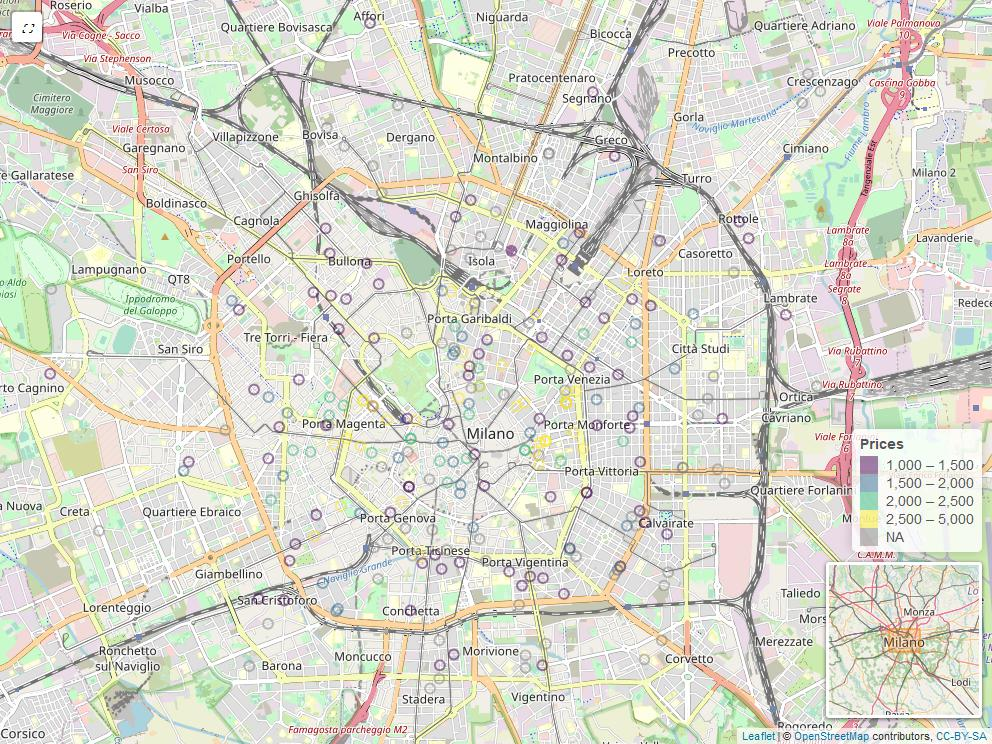
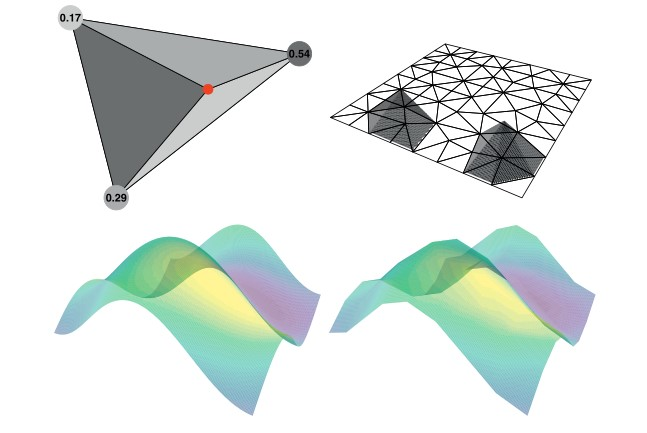

# Exploratory Analysis {#exploratory}

<!--  You can label chapter and section titles using `{#label}` after them, e.g., we can reference Chapter \@ref(intro). If you do not manually label them, there will be automatic labels anyway, e.g., Chapter \@ref(methods).-->

```{r options, include=FALSE}
knitr::opts_chunk$set(
  warning = FALSE,  
  strip.white = TRUE,
  message = FALSE,
  cache = FALSE,
  echo = FALSE
)

# libraries are in libs.R
# source(here::here("libs.R"))

library(readr)
library(kableExtra)
library(tidyverse)
library(broom)
library(viridis)
library(leaflet)
library(sp)
library(glue)
library(ggpmisc)
library(gstat)
library(stringi)
library(scales)
library(plotly)
library(INLA)
## review text mining
library(tidytext)
library(stopwords)
library(widyr)
library(igraph)
library(ggraph)
## missing profile
library(caret)
library(tidyverse)
library(naniar)
library(forcats)
library(visdat)
library(ComplexHeatmap)
library(patchwork)
library(ggridges)


## Personal ggplot theme 
theme_nicco = function (base_size = 11, base_family = "") {
  theme_bw() %+replace% 
    theme(
      text = element_text(family = "sans", size = 12),
      plot.title = element_text(face = "bold", size = 14, margin=margin(0,0,30,0)),
      panel.background  = element_blank(),
      axis.ticks = element_line(colour = "grey70", size = 0.2),
      plot.background = element_rect(fill="white", colour=NA),
      panel.border = element_rect(linetype = "blank", fill = NA),
      legend.background = element_rect(fill="transparent", colour=NA),
      legend.key = element_rect(fill="transparent", colour=NA)
    )
}
```


( _metti flow in DRAKE_ )

Data flows out the REST API end point `*/complete` in a .json format. Data can be filtered out On the basis of the options set in the API endpoint argument body. Some of the options supplied to the API, as in section \@ref(APIdocs), might regard the real estate `city` interested, `npages` as the number of pages to scrape, `type` as the choice between rental of selling market. Since to the analysis extent data should come from the same geographic area API, city and filter parameters are kept permanent (e.g. Milan rental real estate within "circonvallazione" approximated geo-borders). As a consequence a dedicated endpoint `.thesis` parameter is passed in the argument body. By setting the option equal to to TRUE  the API caller requests thesis data. In other words the latter option under the hood secures to specify to the API an already composed query url to be passed to the scraping endppoint, which corresponds to precise zones imposed while searching for advertisemnts on Immobiliare.it. To help figure out the idea behind the operation it can be thought as refreshing everyday the same immobiliare.it url on their website looking for accomodations within a specified zone. 
Parameters specified are also npages = 120, leading to to 3000 observations. The `*` refers to the EC2 public DNS.

`http://*/complete/120/milano/affitto/.thesis=true`

As a further data source is available a mondgoDB ATLAS cluster which, because of the scheduler, stocks daily .csv information from Milan real estate. Credentials have to be supplied. For run time reasons also related to the bookdown files continuous building the API endpoint is not called and code chunks outputs are cached due to heavy computation. Instead data is extracted from the MongoDB cluster. A summary table of the columns involved is presented with the goal to introduce the reader to API incoming data. Data needs some heavy preprocess steps to get modeled which is briefly covered in the data preparation part in section \@ref(prep). Data coming from the /complete enndpoint has a geo-statistical spatial component and consequently a spatial representation of the dataset is showed. One further plot points out that geographic coordinates are non-linearly related \@ref(fig:NonLinearSpatialRel) to the price response variable so dedicated techniques are required. Exploration starts with factor counts evidencing a "Bilocale" prevalence which is then compared to other cities. This suggest some critical Milan real estate market demand information and consequently reflections on the offer. Heating and cooling systems, two of the covariates extracted, are grouped and then arranged by descending order prevalence. They both do not display any significative price change but they bring to the surface an important environmental concern. The same is done by highlighting ridges distribution for other two newly engineered covariates. Data displays bimodality in prices distribution for different n-roomed accommodations and the model should take account of the behavior. Then a piece-wise linear regression is fitted for each n-roomed accommodation sub-group whose single predictor is the square meter footage. The analysis emphasize some valuable economic consequences both for investors interested into property expansions and for tenants that are planning to partition single properties into rentable sub-units. The previous analysis brings along a major question which regards the most valuable properties per single square meter surface and a answer based on data is given. Then a further log linear regression  setting is proposed to evaluate the impact of some other presumably important covariate. A Tie Fighter plot displays for which coefficient, associated to each dummyied predictor, there are surprisingly high prices compared to the effect of the square meter footage expansion. A partial conclusion is that having 2 or 3 bathrooms truly pays an extra monthly gain, also caused by the number of tentants the accomodations could host. Then missing assessement and imputation takes place. At first is made a brief a revision of missing and randomnes by @Little, then theory is applied by visualizing missing in combination with heat-map and co-occurrence plot. Combined missing observation test is able to detect whether data is missing because of inner scraping faiilures or simple rarity in data appereance. Then for the observations that passed the test imputation is made through INLA posterior expectation. That is the case of data lost in predictors so the missing covariates ( _condominium_ ) are brought into a model as response variable whose this time predictors are explanatory ones. Through a method specified within the INLA function the posterior statistics are computed and then finally imputed in the place of missing ones.

Visualisations are done with ggplot2 in a Tidyverse approach. Maps are done with ggplot2 too and Leaflet, together with its extensions. 
A preliminary API data exploratory analysis evidences 34 covariates and 250 rows, which are once again conditioned to the query sent to the API. Immobiliare.it furnishes many information regarding property attributes and estate agency circumstances. Data displays many NA in some of the columns but georeference coordinates, due to the design of scraping functions, are in any case present. 


```{r data_loading}

dati = read_csv("data/data.csv", locale = readr::locale(encoding = "latin1")) %>%
  dplyr::select(-X1) %>%  
  janitor::clean_names()
```

```{r covar_table, fig.cap="Covariate explanation table"}

### fai la tabella delle colonne
### 
ref =c(
"ID of the apartements",
"latitude coordinate",
"longitude coordinate",
"the complete address: street name and number",
"the condominium monthly expenses",
"the age in which the building was contructed",
"the property floor",
"indipendent property type versus apartement type",
"specification of the type and number of rooms",
"property type residential or not",
"the actual status of the house, ristrutturato, nuovo, abitabile",
"the heating system Cen_Rad_Gas (centralizzato a radiatori, alim a gas), Cen_Rad_Met,",
"air conditioning hot and cold, Autonomo, freddo/caldo, Centralizzato, freddo/caldo",
"the date of publication of the advertisement",
"land registry information",
"apartement main characteristics",
"number of photos displayed in the advertisement",
"real estate agency name",
"If the price is lowered it flags the starting price",
"If the price is lowered it flags the current price",
"If the price is lowered indicates the days passed since the price has changed",
"If the price is lowered indicates the date the price has changed",
"the energy class according to the land registers",
"the type of contract",
"if it is still avaiable or already rented",
"the total number of the building floors",
"number of parking box or garages avaibable in the property",
"estate agency review, long chr string",
"it if has multimedia option, such as 3D house vitualization home experience or videos",
"the monthly price <- response",
"square meters footage",
"the number of rooms in the house, and their types",
"title of published advertisement"
)

names = dati %>%  names
tibble(
  name = toupper(names),
  ref  = ref 
) %>% 
  knitr::kable(booktabs = T, longtable = T)
  # 
  # kbl(booktabs = T, longtable = T) %>%
  # kable_styling(full_width = F,font_size = 8) %>%
  # column_spec(1, bold = T) %>%
  # column_spec(2, width = "20em")

```


## Data preparation{#prep}

```{r data_prep, message=FALSE}
datiprep = dati %>% 
  select(-tpprop) %>% 
  ## floor
  mutate(floor = str_remove_all(floor, "°")) %>% 
  separate(floor, c("floor", "ascensore","accdisabili"), sep = ", ", convert = T) %>%
  replace_na(list(ascensore = "no", accdisabili = "no")) %>% 
  mutate(ascensore = recode(ascensore,"con accesso disabili" = "no")) %>%  
  mutate(floor = recode(floor, "1" = "1 piano", "2" = "2 piano", "3" = "2 piano", "4" = "4 piano", "5" = "5 piano", "6" = "6 piano", "7" = "7 piano", "8" = "8 piano", "9" = "9 piano")) %>% 
  ## TOTPIANI
  # mutate(TOTPIANI = str_remove_all(TOTPIANI, " piani")) %>% 
  ## LOCALI
  mutate(locali = if_else(substr(locali,start = 1,stop = 1) == 1, "1", locali)) %>% 
  separate(locali, c("totlocali", "other"), sep = "\\s", extra = "merge") %>% 
  separate(other, c("camereletto","altro","bagno", "cucina"), sep = ", ", convert = T, fill = "left")  %>% 
  ## CAMERALETTO
  mutate(camereletto = if_else(totlocali== 1, "(1 camera da letto", camereletto)) %>% 
  mutate(camereletto = if_else(is.na(camereletto),altro , camereletto)) %>% 
  mutate(camereletto = if_else(camereletto== "locali",NA_character_ , camereletto)) %>%  
  mutate(camereletto = if_else(camereletto== "camere da letto", paste0(totlocali," camere da letto"), camereletto)) %>% 
  mutate(camereletto = str_remove(camereletto, "\\(")) %>% 
  ## altro
  mutate(altro = if_else(bagno== "1 altro)","1 altro)" , altro)) %>% 
  replace_with_na(replace = list(altro = c("camere da letto", "locali"))) %>% 
  mutate(altro = str_remove(altro, "\\)")) %>% 
  ## bagno
  mutate(bagno = if_else(cucina== "1 bagno", "1 bagno", bagno)) %>% 
  replace_with_na(replace = list(bagno = "1 altro)")) %>% 
  mutate(bagno = if_else(totlocali== "1", "1 bagno", bagno)) %>% 
  ## cucina (ne ho perse qualcuna)
  replace_with_na(replace = list(cucina = "1 bagno")) %>% 
  mutate(totlocali = recode(totlocali, "1" = "Monolocale", "2" = "Bilocale", "3" = "Trilocale", "4" = "Quadrilocale", "5" = "Pentalocale")) %>% ## non proviene più di sei locali 
  ## aptchar
  mutate(aptchar = str_remove_all(aptchar,"-"),
         aptchar = str_trim(aptchar)) %>%
  mutate(fibra_ottica = if_else(stri_detect_fixed(aptchar,"fibra ottica"), "yes", "no"),
         videocitofono = if_else(stri_detect_fixed(aptchar,"videocitofono"), "yes", "no"),
         impianto_di_allarme = if_else(stri_detect_fixed(aptchar,"impianto di allarme"), "yes", "no"),
         reception = if_else(stri_detect_fixed(aptchar,"reception"), "yes", "no"),
         porta_blindata = if_else(stri_detect_fixed(aptchar,"porta blindata"), "yes", "no"),
         esposizione_esterna = if_else(stri_detect_fixed(aptchar,"esposizione esterna"), "yes", "no"),
         cancello_elettrico = if_else(stri_detect_fixed(aptchar,"cancello elettrico"), "yes", "no"),
         portiere_intera_giornata = if_else(stri_detect_fixed(aptchar,"portiere intera giornata"), "yes", "no"),
         balcone = if_else(stri_detect_fixed(aptchar,"balcone"), "yes", "no"),
         arredato = if_else(stri_detect_fixed(aptchar,"arredato"), "yes", "no"),
         impianto_tv_centralizzato = if_else(stri_detect_fixed(aptchar,"impianto tv centralizzato"), "yes", "no"),
         armadio_a_muro = if_else(stri_detect_fixed(aptchar,"armadio a muro"), "yes", "no"),
         portiere_mezza_giornata = if_else(stri_detect_fixed(aptchar,"portiere mezza giornata"), "yes", "no"),
         caminetto = if_else(stri_detect_fixed(aptchar,"caminetto"), "yes", "no"),
         esposizione_interna = if_else(stri_detect_fixed(aptchar,"esposizione interna"), "yes", "no"),
         mansarda = if_else(stri_detect_fixed(aptchar,"mansarda"), "yes", "no"),
         parzialmente_arredato = if_else(stri_detect_fixed(aptchar,"parzialmente arredato"), "yes", "no"),
         taverna = if_else(stri_detect_fixed(aptchar,"taverna"), "yes", "no"),
         idromassaggio = if_else(stri_detect_fixed(aptchar,"idromassaggio"), "yes", "no"),
         terrazza = if_else(stri_detect_fixed(aptchar,"terrazza"), "yes", "no"),
         esposizione_doppia = if_else(stri_detect_fixed(aptchar,"esposizione doppia"), "yes", "no"),
         giardino_comune = if_else(stri_detect_fixed(aptchar,"giardino comune"), "yes", "no"),
         giardino_privato = if_else(stri_detect_fixed(aptchar,"giardino privato"), "yes", "no"),
         taverna = if_else(stri_detect_fixed(aptchar,"taverna"), "yes", "no")
         )


dummied_ftc = dummied %>%
  separate(aptchar, into = LETTERS[1:15],"\\s{2,}")  %>% 
  replace(., is.na(.), "0") 


all_aptchars = map(dummied_ftc, ~str_c(unique(.x),collapse = ",")) %>%
  bind_rows() %>% 
  gather(key = col_name, value = col_unique)  %>% 
  mutate(col_unique  = strsplit(col_unique, "\\,")) %>%
  pull(col_unique) %>% 
  unlist() %>% 
  unique()


```

Data needs to undergo to many previous cleaning preprocess steps, this is a forced stage since API data comes in human readable format, which is not prepared to be modeled. Cleaning steps mainly regards:

- encoding from UTF-8 to Latin due to Italian characters incorrectly parsed.
- *floors* covariate needs to be separated by its *ascensore* and *accdisabili* components, adding 2 more bivariate covariates.
- *locali* needs to be separated too. 5 category levels drain out: *totlocali*, *camereletto*, *altro*, *bagno*, *cucina*. *nroom* is a duplicate for *totlocali*, so it is discarded.
- *aptchar* is a character strign column that contains a various number of different features per house. The preprocess steps include cleaning the string from unnecessary characters, then finding the whole set of unique elements across the character column by splitting on a regex pattern, in the end recoding newly created bivariate columns "yes" or "no" accoeding to a matching pattern whether the feature appears in the string not. A slice from the API output APTCHAR is:

`r datiprep %>%  select(aptchar) %>%  slice(sample(1))  %>% pull(1)`

### Maps and Geo-Visualisations

Geographic coordinates can be represented on a map in order to reveal first symptoms of spatial autocorrelation. Observations are spread almost equally throughout the surface even though the response var *price* indicates unsurprisingly that higher prices are nearer to the city center.
The map in figure \@ref(fig:leaflet_visuals) is a leaflet object, which needs to be overlapped with layers indicating different maps projections. This is interactive in the .html version, and static is proposed in the .pdf output version. The map object takes a input the latitute and longitude coordinates coming from THE API, and they do not need any CRS (Coordinate Reference System) projection since leaflet can accept the data type.

```{r LeafletVisuals, out.width="100%", fig.cap="Leaflet Map"}

if(knitr::is_latex_output()){
    
} else if(knitr::is_html_output()){  
  dati2 = dati %>%
    dplyr::select(price, long, price )
  pal = colorBin("viridis", bins = c(1000, 1500, 2000, 2500, 5000))
  
  leaflet(dati2) %>%
    # addProviderTiles(providers$CartoDB.Positron) %>% bug in Lealfet while caching
    setView(lat = 45.474211, lng = 9.191383, zoom = 13) %>%
    addMiniMap() %>% 
    addTiles() %>% 
    addCircles(lng = ~long, 
               lat = ~lat, 
               color = ~ pal(price),
               weight = 10,
               radius = ~log(price)) %>%
    addLegend("bottomright",
      pal = pal, values = ~price,
      title = "Prices") %>%
    addScaleBar(position = c("bottomleft"))
  }
```

Predictors, in this case latitude and longitude appear to have nonlinear relationships with the outcome price. The relationship appears to be Gaussian whose mean points to the city center, red dashed line represent latitude and longitude coordinates for the Dome of Milan. Non linearities can be treated with regression splines

```{r NonLinearSpatialRel,fig.cap="Non Linear Spatial Relationship disclosed"}
dome = data.frame(coords = c(9.191383, 45.464211), latlong = c("lat","long"))
domecoords = data.frame(coords = c(9.191383, 45.464211))
bu = datiprep %>% 
  dplyr::select(price, lat, long) %>% 
  tidyr::pivot_longer(cols = c(long, lat), 
                      names_to = "predictor", values_to = "value")

ggplot(bu,aes(x = value, price)) + 
geom_point(alpha = .2) + 
geom_smooth(se = FALSE) + 
facet_wrap(~ predictor, scales = "free_x") +
geom_vline(data = subset(bu, predictor == "lat"), aes(xintercept = 45.464211), color = "red", lty = 2) + 
geom_vline(data = subset(bu, predictor == "long"), aes(xintercept = 9.191383),color = "red", lty = 2) + 
scale_y_continuous(labels = dollar_format(suffix = "€", prefix = ""))+
labs(x = "",
     y = "Price (EUR)")+
theme_nicco()
#> `geom_smooth()` using method = 'gam' and formula 'y ~ s(x, bs = "cs")'
```


## Counts and First Orientations

Arranged Counts for categorical columns can give a sense of the distribution of categories across the dataset suggesting also which predictor to include in the model. The visualization in figure \@ref(fig:fctCounts) offers the rearranged factor *TOTLOCALI*. 
Bilocali are the most common option for rent, then trilocali comes after. The intuition behind suggests that Milan rental market is oriented to "lighter" accommodations in terms of space and squarefootage. This should comes natural since Milan is both a vivid study and working area, so short stayings are warmly welcomed.

```{r fctCounts, fig.cap="Most common housedolds categories"} 
datiprep %>%
  mutate(totlocali = as_factor(totlocali)) %>% 
  count(totlocali, sort = TRUE) %>% 
  mutate(totlocali = fct_reorder(totlocali, n)) %>%
  ggplot(aes(n, totlocali)) +
  geom_col() +
  labs(x = "# of houses",
       y = "",
       title = "Most common housedolds categories in Milan")+
  theme_nicco()
```

Two of the most requested features for comfort and livability in rents are the heating/cooling systems installed. Moreover rental market demand, regardless of the rent duration, strives for a ready-to-accomodate offer to meet clients needs. In this sense accomodation coming with the newest and most techonological systems are naturally preferred with respect the contrary. 
x-axis in figure \@ref(fig:PricePerAc) represents log_10 price for both of the two plots. Logarithmic scale is needed to smooth distributions and the resulting price interpretation have to considered into relative percent changes. Furthermore factors are reordered with respect to decreasing price.  
y-axis are the different level for the categorical variables recoded from the original data due to simplify lables and to hold plot dimension. Moreover counts per level are expressed between brackets close to their respective factor.
The top plot displays the most prevalent heating systems categories, among which the most prevalent is "Cen_Rad_Met" by far. This fact is extremely important since metano is a green energy source and if the adoption is wide spread and pipelines are well organized than it brings enormous benefit to the city. As a consequence one major concern regards that for many years policies have been oriented to reduce vehicles emission (euro1 euro2...) instead of focusing on house emissions. This was also a consequence of the lack of house data especially in rural areas. According to data there are still a 15% portion of houses powered by oil fired. 
Then in bottom plot Jittering is then applied to point out the number of outliers outside the IQR (Inter Quantile Range) .25 and their impact on the distribution. A first conclusion is that outliers are mainly located in autonomous systems, which leads of course to believe that the most expensive houses are heated by autonomoius heating systems. Indedd in any case this fact that does not affect monthly price. The overlapping IQR signifies that the covariates levels do not impact the response variable.


```{r PricePerAc, fig.cap="Log Monthly Price per Heating/Cooling system?"}

pph =datiprep %>%
  mutate(heating = fct_lump(heating, 4)) %>%
  filter(heating != "Other") %>%
  filter(heating != is.na(heating)) %>% 
  mutate(heating = recode(heating,"Centralizzato, a radiatori" = "Cen_Rad",
                          "Centralizzato, a radiatori, alimentato a gas" = "Cen_Rad_Gas",
                          "Centralizzato, a radiatori, alimentato a metano" = "Cen_Rad_Met",
                          "Autonomo, a radiatori, alimentato a metano" = "Aut_Rad_Met",
                          "Autonomo, a radiatori, alimentato a gas" = "Aut_Rad_Gas")) %>% 
  add_count(heating, name = "heating_count") %>% 
  mutate(heating = glue("{ heating } ({ heating_count })"),
         heating  = fct_reorder(heating, price)) %>%
  ggplot(aes(price, heating)) +
  ggtitle("Log Monthly Price per Heating and AC systems?")+
  geom_boxplot() +
  geom_jitter(width = 0, height = .1, alpha = .25) +
  scale_x_log10(labels = dollar_format(suffix = "€", prefix = "")) +
  labs(y = "",
       x = "") +
  theme_nicco()

ppa =datiprep %>%
  mutate(ac = fct_lump(ac, 4)) %>%
  # filter(ac != "Other") %>%
  filter(ac != is.na(ac)) %>% 
  add_count(ac, name = "ac_count") %>% 
  mutate(ac = glue("{ ac } ({ ac_count })"),
         ac  = fct_reorder(ac, price)) %>%
  ggplot(aes(price, ac)) +
  geom_boxplot() +
  geom_jitter(width = 0, height = .1, alpha = .25) +
  scale_x_log10(labels = dollar_format(suffix = "€", prefix = "")) +
  labs(x = "Price (EUR)",
       y = "") +
  theme_nicco()

pph / ppa

```


this visualization intersects allows to discover bimodality in the response variable.  Log scales was needed since they are all veru skewd and log scale then is needed also in the model.

(qui ci puoi mettere a confronto per variabile bianria, così vedi cosa includere nel modello esempio sotto dove commentato, )

```{r}
## non filled
non_fill = datiprep %>%
  add_count(totlocali, name  = "totlocali_count") %>% 
  mutate(totlocali = glue("{ totlocali } ({ totlocali_count })"),
         totlocali = fct_reorder(totlocali, price)) %>% 
  ggplot(aes(price, totlocali, fill = accdisabili)) + 
  geom_density_ridges(alpha = .5) +
  scale_x_log10(labels = dollar_format(suffix = "€", prefix = "")) +
  labs(x = "Price (EUR)",
       y = "",
       title = "How much do Cost items in each category cost?") +
  theme_nicco()


with_fill = datiprep %>%
  add_count(totlocali, name  = "totlocali_count") %>% 
  mutate(totlocali = glue("{ totlocali } ({ totlocali_count })"),
         totlocali = fct_reorder(totlocali, price)) %>% 
  ggplot(aes(price, totlocali,fill = ascensore)) + ## qui fill con v avriabile bianria
  geom_density_ridges(alpha = .5) +
  scale_x_log10(labels = dollar_format(suffix = "€", prefix = "")) +
  labs(x = "Price (EUR)",
       y = "",
       title = "How much do Cost items in each category cost?") +
  theme_nicco()

with_fill / non_fill
```

What it might be really relevant to research is how monthly prices change with respect to house square footage for each house configuration. The idea is to asses how much adding a further square meter affetcs the monthly price for each n-roomed flat.
One implication is how the property should be developed in order to request a greater amount of money per month. As an example in a situation in which the household has to lot its property into different sub units he can be helped to decide the most proficient choice in economic terms by setting ex ante the square footage extensions for each of the sub-properties.
A further implication can regard economic convenience to enlarge new property acquisitions under the expectation to broadened the square footage (construction firms). Some of the potential enlargements are economically justified, some of the other are not.
The plot  \@ref(fig:GlmPriceSq) has two continuous variables for x (price) and y (sqfeet) axis, the latter is log 10 scaled due to smoothness reasons. Coloration discretizes points for the each $j$ household rooms totlocali. A sort of overlapping  piece-wise linear regression (log-linear due to transformation) is fitted on each totlocali group, whose response variable is price and whose only predictor is the square footage surface (i.e.  $\log_{10}(\mathbf{price_j}) \sim +\beta_{0,j}+\beta_{1,j}\mathbf{sqfeet_j}$). Five different regression models are proposed in the top left. The interesting part regards the models slopes $\hat\beta_{1,j}$. The highest corresponds to "Monolocale" for which the enlargement of a 10 square meters in surface enriches the apartment of a `r 10^(0.00726*10)-1`% monthly price addition. Almost the same is witnessed in "Bilocale" for which a 10 square meters extension gains a `r 10^(0.0049*10)-1`% value. One more major thing to notice is the "ensamble" regression line obtained as the interpolation of the 5 plotted ones. The line suggests a clear slope descending pattern (logarithmic trend) from Pentalocale and beyond whose assumption is strengthened by looking at the decreasing trend in the $\hat\beta_1$ predictor slopes coefficients. Furthermore investing into an extension for "Quadrilocale" and "Trilocale" is _coeteris paribus_ an interchangeable economic choice.

```{r GlmPriceSq, fig.cap="Monthly Prices change wrt square meters footage in different n-roomed apt"}

my_formula = y ~ x

datiprep_sq = datiprep %>%
  filter(!is.na(sqfeet),
         sqfeet >= .001) %>%
  arrange(desc(sqfeet)) %>%
  add_count(totlocali, name = "totlocali_count") %>% 
  mutate(abs_price = price / sqfeet) 

datiprep_sq %>%
  dplyr::filter(!is.na(totlocali)) %>%
  mutate(totlocali = fct_lump(totlocali, 5)) %>%
  ggplot(aes(sqfeet, price, color = totlocali)) +
  geom_smooth(method = "lm",se = FALSE, formula = my_formula) +
  stat_poly_eq(formula = my_formula, 
               eq.with.lhs = "italic(hat(y))~`=`~",
               aes(label = paste(..eq.label.., sep = "~~~")), 
               parse = TRUE) +
  geom_point() +
  
  # scale_x_log10(labels = unit_format(suffix = expression("m^2"))) +
  scale_y_log10(labels = dollar_format(suffix = "€", prefix = "")) +
  scale_x_continuous(labels = unit_format(suffix = "m^2", prefix = "")) +
  labs(y = "price (EUR)",
       x = "") +
  theme_nicco()
```

In table (...) resides the answer to the question "which are the most profitable properties per month in terms of the price per square meter footage ratio". The covariate floor together with the totpiani are not part of the model, indeed they can explain the importance and the height of the building justifying extraordinary prices.  The first 4 observations are unsurprisingly "Bilocale", the spatial column location, not a regressor, can lend a hand to acknowledge that the street addresses point to very central and popular zones. The zones are, first City Life, second Brera and third Moscova, proving that in modeling real estate rents the spatial component is fundamental , even more in Milan. 

```{r TopAbsPrice, fig.cap="prima tabella"}
datiprep_sq %>%
  arrange(desc(abs_price)) %>% 
  select(location,totlocali, price, sqfeet,floor, totpiani,abs_price) %>%
  head() %>% 
  kable(booktabs = T)
```

Then as a further point it might be important to investigate a linear model whose response is price and whose covariates are the newly created abs_price and some other presumably important ones e.g. floor, bagno, totpiani. The model fitted is `log2(price) ~ log2(abs_price) + bagno + floor + totpiani`.
The plot in figure \@ref(fig:TieFighterPlot) has the purpose to demonstrate how monthly price is affected by covariates conditioned to their respective square meter footage. The interpretation of the plot starts by fixing a focus point on 0, which is the null effect highlighted by the red dashed line. Then the second focus is on house surface effect (i.e. House Surface (doubling) in the plot, the term log2(abs_price) has been converted to more familiar House Surface (doubling)), which contributes to increase the price of an estimated coefficient of $\approx .6$ for each doubling of the square meter footage. Then what it can be noticed with respect to the two focus points are the unusual effects provoked by the other predictors t the right of the house surface effect and to the far left below 0. "2 and 3 bagni" are unusually expensive with respect to the square meter footage increment, on the other hand" al piano rialzato" and "al piano terra" are undervalued with respect to their surface.  The fact that 2 and 3 bathrooms can guarantee a monthly extra check is probably caused to a minimum rent plateau requested for each occupant. the number of bathrooms are a proxy to both house extension since normally for each sleeping room there also exist at least 1 bathroom as well as prestigious houses dispose of more than 1 toilette services. So the more are the occupants regardless of the square meter footage dedicated to them, the more the house monthly returns,


it can be noticed is that ultimo piano, otgether with 2 abagni ad 3 bagni are unusually expensive with respect to their proper square meter footage. On the other hand the piano rialzato and piano terra are unusually undervalued given their surface.  
In other words the  to help with the interpretation. The fact that 2 and 3 bathrooms can guarantee a monthly extra check is probably caused to a minimum rent plateau requested for each occupant. So the more are the occupants regardless of the square meter footage dedicated to them, the more the house returns. The conclusion 

```{r TieFighterPlot, fig.cap="Coefficient Tie fighter plot for the linear model: log2(price) ~ log2(abs_price) + condom + other_colors"}

datiprep_sq %>%
  mutate(totpiani = fct_lump(totpiani, 5),
         floor = fct_lump(floor,10)) %>% 
  filter(floor != "Other") %>%  
  filter(totpiani != "Other")  %>% 
  lm(log2(price) ~ log2(abs_price) + bagno + floor + totpiani,  data = .)  %>% 
  tidy(conf.int = TRUE) %>%    
  filter(term != "(Intercept)") %>%
  mutate(term = ifelse(term == "log2(abs_price)", "House Surface (doubling)", term), 
         term = ifelse(str_detect(term,"totpiani"), glue("{term} totali"), term), 
         term = str_remove(term, "^bagno"),
         term = str_remove(term, "^totpiani"),
         term = ifelse(str_detect(term,"floor"), glue("al {term}"), term), 
         term = str_remove(term, "floor")) %>% 
         # term = str_remove(term, "^floor") 
  mutate(term = fct_reorder(term, estimate)) %>%
  ggplot(aes(estimate, term)) +
  geom_point() +
  geom_errorbarh(aes(xmin = conf.low, xmax = conf.high), height = .1) +
  geom_vline(xintercept = 0, color = "red", lty = 2) +
  labs(x = "Coefficient",
       y = "",
       title = "Unusually expensive house chars wrt House Surface") +
  theme_nicco()
```


## Text Mining in estate Review

The word network in figure \ref(fig:WordNetworkgraph) tries to summarize relevant information from real estate agency review into each advertisement. avg_totprice expresses the sum of the price per month plus the condominium in order to fully integrate inner property characteristics together with building exclusivity. Tokenized words are then filtered with "stopwords-iso" italian dictionary. 
Nodes associated with hotter colours are also associated to more expensive in and out-house characteristics. The size of nodes keeps track of the number of reviews in which the specific word appears. A table of the most common words can help highlight both the real estate jargon as well as words that brings up house values. 

```{r MostUsed, fig.cap="Most valuable and used words in reviews"}

datiprep_review = datiprep %>% 
  select(review, id, price)

datiprep  = datiprep %>%  
  rename_all(tolower)

it_stopwd = tibble(word =  stopwords("it", source = "stopwords-iso"))

review_tokenized = datiprep_review %>%
  unnest_tokens(word, review) %>% 
  anti_join(it_stopwd, by = "word") %>% 
  filter(str_detect(word, "[a-z]")) %>% 
  inner_join(datiprep, by = "id")

review_words = review_tokenized %>%
  filter(!is.na(condom)) %>% 
  mutate(totprice = price.x +condom) %>% 
  relocate(totprice, after  = "id") %>% 
  group_by(word) %>% 
  summarize(count = n(),
            reviews = n_distinct(id),
            avg_totprice = mean(totprice))%>%
  arrange(desc(reviews)) 

review_words %>% 
  head(10) %>% 
  knitr::kable(booktabs = T)
```


```{r TF_IDF, eval=FALSE}
review_tf_idf = review_tokenized %>%
  bind_tf_idf(word, reviews, count) %>% 
  arrange(desc(tf_idf))
```


Furthermore it is possible to grossly divide the plot in figure \ref(fig:WordNetworkgraph) into 3 sub-groups of nodes, each of which addresses a specific part of the house comprehensive evaluation.
In the far right side of the plot are considered the external appliances like neighbor stores, subway stations and services and are associated to mean prices. The correspondent number of reviews are not justifying by any type of price increasing effect. Whereas slightly moving the view to the left, the area centered in portineria evidences a sub-groups of nodes associated to relatively higher avg-totprice. Some of them are servizio signorile palazzo. The previous set of nodes indicates services that are proper to the building can lead to some sort of extra payment. Then still moving 
Possiamo immaginare di dividere il network in 3 raggruppamenti di nodi, ognuno dei quali parla di uni specifico tema. nella parte alta sinistra csi parla delle circostanze estenre dell'appartamente, i negozi i mezzi serizi la metri, i prezzi evidenzziati dal colore nei nodi sono neutri, indicando che non impattano il prezzo in maniera significativa. poco più sotto è possibile vedere un altro centroide verso il quale puntano  una serie di edges peritenti che riguardano i servizi interni al building come la portinerua, l'ingresso, il palazzo. in questo caso i colori sono più caldi e i servizi sembrano essere pagati di più. successivamente sosptandoci veros il centro del'network si nota un nodo di gravità attorno alquale si trovamo molti outgoing edges, che riscaldamento. Attorno a riscaldamento che vista la grandezza ricorre spesso nelle recensioni, si sviluppano tutti i servizi non descritti da immobiliare all'interno della casa, insiema a tutte le caratteristiche cbe distinguono la casa revisionata dalle altre. i colori degradano spostandosi da sinistra verso destea, accanto a riscaldmaento si nota un cluster che associati a prezzi minoro come spese condominiali e arredato arredato. nel caso delle spese condominiali i cluster sono associati a prezzi minori perchè il prezzo del conominio spesso non è commisurato al prezzo nè al prestigio dell'appartamento. Speso infatti include costi variabili come utenze gas e luce, o acqua che vengono scontati con prezzi più bassi di affitto. la somma di condominio e prezzo offrirebbe un panorama più chiaro. 


```{r WordNetworkgraph, fig.cap="Word Network Graph for 250 Estate Agencies Review"}

word_cors = review_tokenized %>%
  semi_join(review_words_filtered, by = "word") %>%
  distinct(id, word) %>%
  pairwise_cor(word, id, sort = TRUE)

set.seed(2020)

filtered_cors = word_cors %>%
  head(300)

nodes = review_words %>%
  filter(word %in% filtered_cors$item1 | word %in% filtered_cors$item2)
  
filtered_cors %>%
  graph_from_data_frame(vertices = nodes)  %>% 
  ggraph() +
  geom_edge_link() +
  geom_node_point(aes(size = reviews * 1.5)) +
  geom_node_point(aes(size = reviews,  color = avg_totprice)) +
  geom_node_text(aes(label = name), repel = TRUE) +
  scale_color_gradient2(low = "blue", high = "red", midpoint = 2000) +
  theme_void() +
  labs(color = "Avg Price",
       size = "# of reviews",
       title = "Network of words used together in REA reviews",
       subtitle = "Based on 250 rental reviews and their respective price")

```


## Missing Assessement and Imputation

As already pointed out some data might be lost since immobiliare provides the information that in turn are pre filled by estate agencies or privates through standard document formats. Some of the missing can be reverse engineered by other information in the web pages e.g. given the street address it is possible to trace back the lat and long coordinates. Some other information can be encountered in .json files hidden inside each of the single web pages.
The approach followed in this part is to prune redundant data and rare predictors trying to limit the dimensionality of the dataset.

### Missing assessement 

The first problem to assess is why information are missing. As already pointed out in the preliminary part as well as in section \@ref(ContentArchitecture) many of the presumably important covariates (i.e. price lat, long, title ,id ...) undergo to a sequence of forced step inside scraping functions with the aim to avoid to be lost. If at the end of the sequence covariates are still missing, the correspondent observation is not considered and it is left out of the resulting scraped dataset. The choice originates from empirical missing patterns suggesting that when important information are missing then the rest of the covariates are more likely to be missing to, as a consequence the observation should be discarded.
The missing profile is crucial since it can also raise suspicion on the scraping failures. By Taking advantage of the missing pattern in observations the maintainer can directly identify the problem and derivatives and immediately debug the error. In order to identify if the nature of the pattern a revision of missing and randomness is introduced by @Little.
Missing can be devided into 3 categories:

- *MCAR* (missing completely at random) likelihood of missing is equal for all the information, in other words missing data are one idependetn for the other.
- *MAR* (missing at random) likelihood of missing is not equal.
- *NMAR* (not missing at random) data that is missing due to a specific cause, scarping can be the cause.

MNAR is often the case of daily monitoring clinical studies [@Kuhn], where patient might drop out the experiment because of death and so all the relating data starting from the death time +1 are lost.
To identify the pattern a _heat map_  plot \@ref(fig:Heatmap) clarifies the idea:

```{r Heatmap, fig.cap="Missingness Heatmap plot"}
data1 = datiprep %>% select(-which(colMeans(is.na(.)) < 0.001)) ## % of missing
convert_missing = function(x) ifelse(is.na(x), 0, 1)
scat_missing = apply(data1, 2, convert_missing)

Heatmap(
  scat_missing, 
  name = "Missing", #title of legend
  column_title = "Predictors", row_title = "Samples",
  col = c("black","lightgrey"),
  show_heatmap_legend = FALSE,
  row_names_gp = gpar(fontsize = 0) # Text size for row names
)
```

Looking at the top of the heat map plot, right under the "Predictor" label, the first tree split divides predictors into two sub-groups. The left branch considers from *TOTPIANI* to *CATASTINFO* and there are no evident patterns. Then missingness can be traced back to MAR. Imputation needs to be applied up to *CONDOM* included, the others are discarded due to rarity: i.e. *BUILDAGE*: 14% missing, *CATASTINFO*: 21% and *AC*: 24%. Moreover *CUCINA* and *ALTRO* are generated as "childred" of the original *LOCALI* variable, so it should not surprise that their missing behavior is similar ,whose prevalence is respectively 13% and 14%, for that reason are discarded. 
In the far right hand side *ENCLASS* and *DISP* data are completely missing and a pattern seems to be found. The most obvious reason is a scraping fail in capturing data. Further inspection of the API scraping functions focused on the two covariates is strongly advised. From *LOWRDPRICE.* covariates gorup class it seems to be witnessing a missing underlining pattern NMAR which is clearer by looking at the co_occurrence plot in figure \@ref(fig:cooccurrence). Co-occurrence analysis might suggest frequency of missing predictor in combination and *LOWRDPRICE.* class covariates are displaying this type of behavior. *PAUTO* is missing in the place where *LOWRDPRICE.* class covariates are missing, but this is not happening for the opposite, leading to the conclusion that *PAUTO* should be treated as a rare covariate MAR, therefore *PAUTO* is dropped.
After some further investigation on *LOWRDPRICE.*, the group class flags when the *PRICE* covariate is effectively decreased and this is unusual. That is solved by grouping the covariate's information and to encode it as a two levels categorical covariate if lowered or not. Further methods to feature engineer the *LOWRDPRICE.* class covariates can be with techniques typical of profile data, further references are on @Kuhn.

```{r cooccurrence, fig.cap="Missingness co-occurrence plot"}
gg_miss_upset(data1, nsets = 7) 
```


### Covariates Imputation
```{r ImputationData}
## conversion to dataframe
data_miss = datiprep %>%  
  select(-id,-lat,-long,-location, -buildage, -cucina, -altro, -ac,-pub_date, -catastinfo, -aptchar, -age,-lowrdprice.originalprice,-lowrdprice.currentprice, -lowrdprice.passeddays,-lowrdprice.date,-enclass,-contr ,-disp, -pauto,-review,  -hasmulti,-title) %>% 
  as.data.frame()

```

A relatively simple approach to front missingness is to build a regression model to explain the covariates that have some missing and plug-back-in the respective estimates (e.g. posterior means) from their predictive distributions @Little. This approach is fast and easy to implement in most of the cases, but it ignores the uncertainty behind the imputed values [@Bayesian_INLA_Rubio]. However it has the benefit to be a more than a reasonable choice with respect to the number of computation required, especially with INLA and in a spatial setting. That makes it the first choice method to follow since imputation regards also a small portion of data and predictors. At first it is considered the predictor _condominium_  for which some observation are missing. Indices are:

```{r IndexCondominium}
##  missing data index
condom_na = which(is.na(data_miss$condom)) ## 19  74  77  90  99 113 116 120 179 249
condom_na

```


<!-- and a benchmark model is fitted whose formula is `price ~ 1 + condom + bagno + sqfeet`. Inla handles missing data by ignoring them so the model trains coefficients on a restricted sample of observations. -->

<!-- ```{r} -->
<!-- ## benchmark model -->
<!-- benchmark = inla(price ~ 1+ condom + totlocali + sqfeet, data = data_miss) -->
<!-- benchmark$summary.fixed %>%  -->
<!--   rownames_to_column(var = "terms") %>%  -->
<!--   as_tibble() %>%  -->
<!--   select(terms:sd) %>%  -->
<!--   column_to_rownames(var = "terms")  %>% -->
<!--   head(6) %>%  -->
<!--   knitr::kable(booktabs = T) -->

<!-- ``` -->


A model is fitted based on missing data for which the response var is condominium and predictors are other important explanatory ones, i.e.`condom ~ 1 + sqfeet + totlocali + floor + heating + ascensore`. In addition to the formula in the inla function a further specification has to be provided with the command `compute = TRUE` in the argument control.predictor. The command `compute` estimates the posterior means of the predictive distribution in the response variable for the missing points. The estimated posetior mean quantities are then imputeda are in table \@red(tab:CondomImputation)

```{r CondomImputation, fig.cap="Posterior Means imputation"}
## condom model fitted
cov_imputation = inla(condom ~ 1 + sqfeet + totlocali + heating + ascensore + accdisabili, data = data_miss,
                      control.predictor = list(compute = TRUE),
                      control.compute = list(config = TRUE))

data_imputed = data.frame(data_miss) 
data_imputed$condom[condom_na] = cov_imputation$summary.fitted.values[condom_na, "mean"]
cov_imputation$summary.fitted.values[condom_na, c("mean", "sd")] %>% 
  knitr::kable(booktabs = T)
```


<!-- Afterwards the benchmark model is refitted in imputed data and coefficients are compared with the missing. Results displays... -->

<!-- ```{r refitting} -->

<!-- data_imputed = data.frame(data_miss) -->
<!-- data_imputed$condom[condom_na] = cov_imputation$summary.fitted.values[condom_na, "mean"] -->
<!-- which(is.na(data_imputed$condom)) -->

<!-- refitted = inla(price ~ 1 + condom + totlocali+ sqfeet, data = data_imputed) -->
<!-- refitted %>%  summary() -->
<!--   rownames_to_column(var = "terms") %>%  -->
<!--   as_tibble() %>%  -->
<!--   select(terms:sd) %>%  -->
<!--   column_to_rownames(var = "terms")  %>% -->
<!--   head(6) %>%  -->
<!--   knitr::kable(booktabs = T) -->
<!-- ``` -->


A further method for imputation has been designed by _Gómez-Rubio, Cameletti, and Blangiardo 2019) miss lit_ by adding a sub-model for the imputations to the final model through the inla function. This is directly handled inside the predictor formula adding a parameter in the latent field. However the approach makes the model more complex with a further layer of uncertainty to handle. 
At first the additive regression model with all the covariates is called including the covariates with missing values. The response variable *PRICE* displays no missing values and the model fitted is: 

 
## Model Specification


## Mesh building 

*PARAFRASARE*
The SPDE approach approximates the continuous Gaussian field $w_{i}$ as a discrete Gaussian Markov random field by means of a finite basis function defined on a triangulated mesh of the region of study. The spatial surface can be interpolated performing this approximation with the inla.mesh.2d() function of the R-INLA package. This function creates a Constrained Refined Delaunay Triangulation (CRDT) over the study region, that will be simply referred to as the mesh. Mesh should be intended as a trade off between the accuracy of the GMRF surface representation and the computational cost, in other words the more are the vertices, the finer is the GF approximation, leading to a computational funnel. 



Arguments can tune triangularization through inla.mesh.2d() :

* `loc`:location coordinates that are used as initial mesh vertices
* `boundary`:object describing the boundary of the domain,
* `offset`:  argument is a numeric value (or a length two vector) and it is used
to set the automatic extension distance. If positive, it is the extension distance
in the same scale units. If negative, it is interpreted as a factor relative to the
approximate data diameter; i.e., a value of -0.10 (the default) will add a 10%
of the data diameter as outer extension.
* `cutoff`: points at a closer distance than the supplied value are replaced by a single vertex. Hence, it avoids small triangles 
* `max.edge`: A good mesh needs to have triangles as regular as possible in size and shape.
* `min.angle`argument (which can be scalar or length two vector) can be used to specify the minimum internal angles of the triangles in the inner domain and the outer extension

A convex hull is a polygon of triangles out of the domain area, in other words the extension made to avoid the boundary effect. All meshes in Figure 2.12 have been made to have a convex hull boundary. If borders are available are generally preferred, so non convex hull meshes are avoided.

```{r NonConvexHull, eval=FALSE}
bound = inla.nonconvex.hull(coords)
```

### Shinyapp for mesh assessment

INLA includes a Shiny (Chang et al., 2018) application that can be used to tune the mesh params interactively

```{r meshbuilder, eval = FALSE}
INLA::meshbuilder()
```


The mesh builder has a number of options to define the mesh on the left side. These include options to be passed to functions inla.nonconvex.hull() and inla.mesh.2d() and the resulting mesh displayed on the right part.

### BUilding SPDE model on mesh


## Spatial Kriging (Prediction)

QUI INCERTEZZE
```{r variogram}
semivar = variogram(PRICE~1, 
                       locations= ~LONG+LAT,
                       data=dati)
# 
# fit.vgm = fit.variogram(semivar, vgm("Sph"))
# krg = krige(log(PRICE) ~ 1, data, model = fit.vgm)

```

