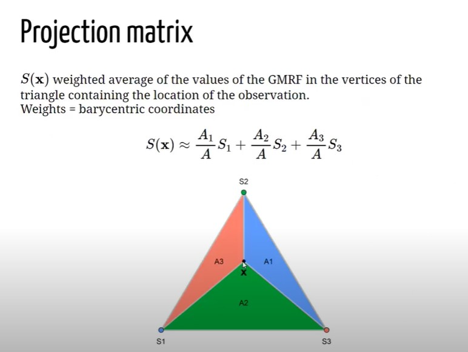
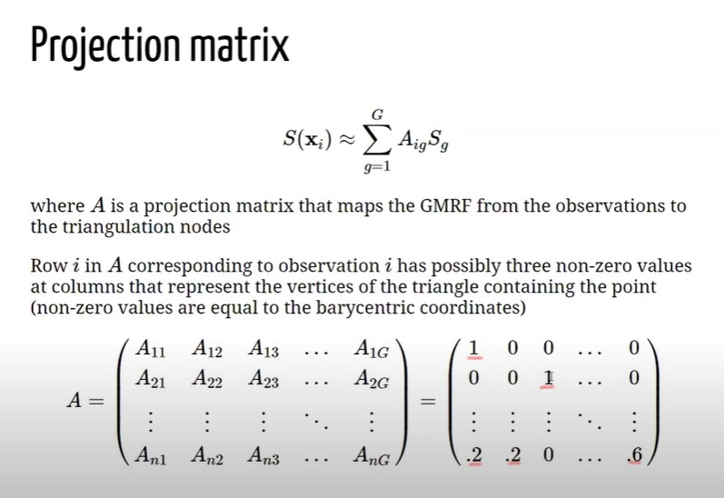

# Appendix {-}

## Gaussian Process{#gpbasics}

Let assume ti have cloud of points represented by two variables $X_1$ and $X_2$, figure \@ref(fig:gpcloud). The cloud of points are observation taken from a realization of two variables e.g. height and weight, What it might be observed is:

Each circle in both panels figure \@ref(fig:gpclouds) represents a measurements of the observed phenomenon. Let assume to fit a multivariate gaussian distribution to the left panel data. The process of learning is to fit a Gaussian to data, the ultimate goal is to describe the data, the most perfectly evident Gaussian is the one interpolating the points and centering in $\left(0,0\right)$, a circle might be a good guess. Instead for the right one in \@ref(fig:gpclouds), a smart guess could be still centering the mean in, indeed now it is an ellipse describing the variability.
At this point it might be interesting to vectorized what is has been measured, the centers are then compressed into a vector $\mu_{i}$, i.e. it has two components $X_1$ and $X_2$ whose corresponding mean is 0.

$$
\boldsymbol{\mu}=\left[\begin{array}{ll}
\mu_{x_1} \\
\mu_{x_2}
\end{array}\right]
$$

This is true for all the observations which have two coordinates too $x_1$ and $x_2$. for each of the points, e.g. for point 1:

$$
\mathbf{x_1}=\left[\begin{array}{ll}
x_1 \\
x_2
\end{array}\right]
$$

the can be neagtive positive, the Real numbers, usually we have $\mathbb{R}^{2}$ extending from - infinity to + infinity, to the power of two because we have 2 dimensions, a Real plane.
any point is gaussian distributed when with mean .. an variance. 
how we explain covariance, thorugh _correlation._
we do it by correlation with its noraml forms. the covariance is the term that goes insisde the matrices in the upper right of the matrxi we have the expectation of $x_1$ times $x_2$, like $\mathbb{E}(x_1 \cdot x_2)$, where the extactation in the gaussian case is the mean which is 0, so the corresponding values is 0.
the covariance essentially is the dot product  [ref dot product](https://mathinsight.org/dot_product_matrix_notation) of $x_1$ and $x_2$ variable, so what happens when you take the dot product of vectors, 
if for example you take a vector that looks like 1 and 0 and you take the dot product of one other vecto 1 and 0, so that:

$$
\left[\begin{array}{ll}
1 \\
0
\end{array}\right]\left[\begin{array}{ll}
1 & 0 \\
\end{array}\right] = 1
$$
You will end up with 1, recall dot productm first element first vcetor times first element second vectro and second element first vector times second element secon vector. So identical vector will get a high dot product value leading to a high similarity measure. Dot product can be indeded as a similarity measure.
... But if you take two different vector as 1 0 and 0 1 then:

$$
\left[\begin{array}{ll}
1 \\
0
\end{array}\right]\left[\begin{array}{ll}
0 & 1 \\
\end{array}\right] = 0
$$

This time the multiplication leads to 0 value, as a matter of fact they are different. They are no similar.
IF two points are closed the dot product will be high in 2D. What the covariance should be? if variances are assumed to be 1 then in this case i qould expect to be 0, i.e. covariance matrix is:

$$
\left[\begin{array}{ll}
1 & 0 \\
0 & 1
\end{array}\right] = \mathbf{cov_{plot1}}(x_1,x_2)
$$

because I can picka  poin tin two pointa in this cloud. Suppose i increase x1 then my chance of getting a x2 point that is positive or negative is the samee, knowing somthin about x1 give nothign about x2. no information is proivede. On the other hand i the second plot knowing a positive value of 1 can suggest with a certain probability that x2 will be positive (great proabibility. So some information is provided), e.g.

$$
\left[\begin{array}{ll}
1   & 0.5 \\
0.5 & 1
\end{array}\right] = \mathbf{cov_{plot2}}(x_1,x_2)
$$

Some positive number idicates that i expect a positive inc rease iwhen boht of the two are increasing singularly. thsi is what the correlation, the basis to do linear regresssion and non linear- thei is a bivariate gaussian. If the entri3es are  means that they are uncoorellated, if they are non-zero then they are correlated, theby can be both positive or negative (correlatiob)

now lets generate a gassiian distrivution so x_1 and x_2 in 2D and then a third dimension hwere we express probability, this is said joint distribution. So i am going to cu this gaussian at certain point for x_1 and cut a plain rigght thgouth this gauissan imagine to ahava cake and then taka kkniw and cut it.(see the image)

form the man perspective you are goin to see a gaussian distribution, you will be lookong at x_ and you will be seeing a gaussain plot in green. this is the probability of x_1 gievn x_1. also said "conditioned" probabolity. This gaussian has a mean like the one alreasdy seen and this is the center of the gaussian, we can rewrite the mena and variance of the multivariate gaussian describing the cloud of points. sigma are the covaraince martix sigma. 

...
sigma 1 and signa 2 if you have 1 d varibale the widjth has to be postive, for mulitvariate gaussian equl so here positive definitness: covariance mateix symetric.  
...
any artibitray variable transposed x time the covarince matrix nedds to be positive. 
 what is the mean of this gaussian i might want to know what is the widht of this gaussian would it be great if there is a formula that guven the cloud of point and likelihood estimation. we coilf obtain the red bell in figure. 
Compute the green curve how it is done? this requires some work and it is said matrix *invesrion lemma*, this is foudamental for machine learnign. let's assume it. The theorem says that the the mean fof the gaussian is the mean of x_1 and then some other operation with sigma, see below from paci (miss ref)

the theorem says toi ocnsider a multivariate gaussian a vector 1 and a vector 2 each vecto compinent has a mena and a covarianc matrix, this by lemma gives us the expression and the math behind is no tremendous, but it is long. What it is important is to undestand fto go from a joont to a conditional distribution in our case. thats i the value od the theorem. 

One background further thing: assume that we have a gaussian variable distribution that we want to sample fromm,  we had now ewe are going to do the opposite, before we had poitns and we tried to figure out the curve, now we have the curve and we are gointg to try to rpoduce data. I need to be able to draw sample froma gaussian distribution. i will assume that i have a meachnism that produces a uniform samples, so you have a random numebr generatior with equal probabolity from 0 to 1, I assume a also the cumulative aof a gaussian.

the cumulative of a gaussian is what you get if you syrta summing the area under the curve of the gaussian as you move from the left. value after valure you can plot the cumulative ahead (see figure) the point where there is a flex point is the mean beacuse tha gassias is symmetric. The asymptot is 1 becuase the are under the curve sumes to 1. 
If i can draw a random number form Uniform and the project it to thre cumulative and then finally projct it back to the gaussian distribution. Inverse cumulative mapping. If oyu do this multiple times you are going to have many sample palced next to the mean and as sparse as the variance. in this process of sampling try to sample a point i froma gaussian that has mean 0 a variance 1, now letes try to draw a point from a gaussian with mean mu and variance sigma. ...

In the multivariate case suppose that we have  evctor with two variables how do i draw a vector from a multivariate gasussian with 0 means and plot 1 covarianc ematrix. the theormeem also says that the marginal distribution can be seen by civariance matrix , fist take the men_1 and take upper left element from the covariance matrix obtaining the marginal rpobabiloty for x_1, i.e.

<!-- $$ -->
<!-- \pi(x_1) = \mathbf{N}(\mu_1, \Sigma_{11}) \\ -->
<!-- \pi(x_2) = \mathbf{N}(\mu_2, \Sigma_{22})  -->
<!-- $$ -->
<!-- then in our problem: -->

<!-- $$ -->
<!-- \pi(x_1) = \mathbf{N}(0, 1) \\ -->
<!-- \pi(x_2) = \mathbf{N}(0, 1)  -->
<!-- $$ -->
Then for simplicity we can simplyfy by groupign vector into:
(vectore exoression multivariate)

I need a wau to take square trotto of matrices, if x come sfroma  MVG 

35:01--

## SPDE and Triangularization (YT speech: @YT:paumoraga){#triangular}

In order to fit LGM type of models with a spatial component INLA uses SPDE (Stochastic Partial Differential Equations) approach.
Suppose that is it given have a continuous Gaussian random process (a general continuous surface), what SPDE does is to approximate the continuous process by a discrete Gaussian process using a triangulation of the region of the study. Let assume to have a set of points defined by a CRS system (Latitude and Longitude, Easthings and Northings), and let assume that the object of the analysis is to estimate a spatially continuous process. Instead of exploiting this property as a whole, it is estimated the process only at the vertices of this triangulation. This requires to put a triangularization of the region of the study on top the the process and the software will predict the value of the process at its vertices, then it interpolates the rest of the points obtaining a "scattered" surface. 

Imagine to have a point a location X laying inside a triangle whose vertices are $S_1, S_2 and S_3$. SPDE operates by setting the values of the process at location x equal to the value of the process at their vertices with some weights, and the weights are given by the _Baricentric coordinates (BC)_. BC are proportional to the area at the point and the vertices. Let assume to have a piece of triangularization $\boldsymbol{A}$ and let assume that the goal is to compute the value at location X. X, as in formula above $\boldsymbol{A}$, would be equal to $S_1$, multiplied by the area $A_1$ dived by the whole triangle area ($\boldsymbol{A}$) + $S_2$ multiplied by the area $A_2$ divided by $\boldsymbol{A}$ + $S_3$, multiplied by the area $A_3$ dived by ($\boldsymbol{A}$. This would be the value of the process at location X given the triangulations (numeber of vertices). SPDE is actually apprximatring the value of hte process using a weighted average of the value of the process at the triangle vertices which ir proportional to the area of the below triangle. 
In order to do this within INLA \@ref(inla) it is needed also a _Projection Matrix_ , figure \@ref(fig:projmat). The Projection matrix maps the continuous GRMF (when it is assumed a GP) from the observation to the triangulation. It essentially assigns the hieght of the triangle for each vertex of the triangularization to the process. Matrix $\mathcal{A}$, whose dimensions are $\mathcal{A_{ng}}$. It has $n$ rows a $g$ columns, where $n$ is the number of observations and $g$ is the number of vertices of the triangulation. Each row has possibly three non-0 values, right matrix in figure \@ref(fig:projmat), and the columns represent the vertices of the triangles that contains the point. Assume to have an observation that coincides with a vertex $S_1$ of the triangle in \@ref(fig:triang), since the point is on top of the vertex (not inside), there are no weights ($A_1 = \mathcal{A}$) and 1 would be the value at $A_{(1,1)}$ and 0 would be the rest f the values in the row. Now let assume to have an observation coinciding with $S_3$ (vertex in position 3), then the result for $A_{(2,3)}$ would be 1 and the rest 0. Indeed when tha value is X that lies within one of the triangles all the elements of the rows will be 0, but three elements in the row corresponding of the p osition of the vertices $1 = .2, 2 = .2 and g = .6$, as a result X will be weighted down for the areas.

