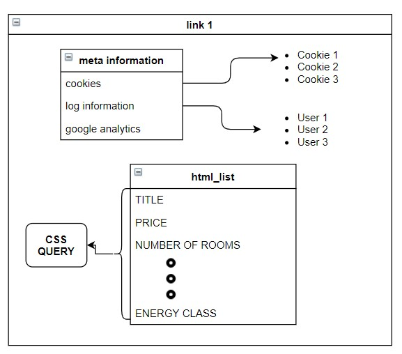
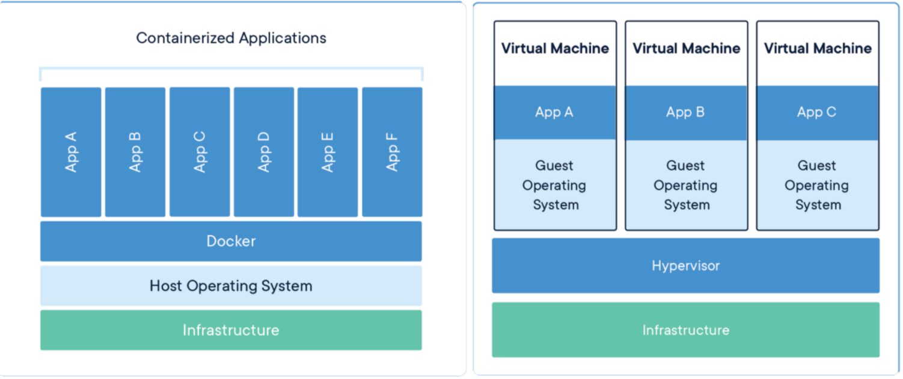
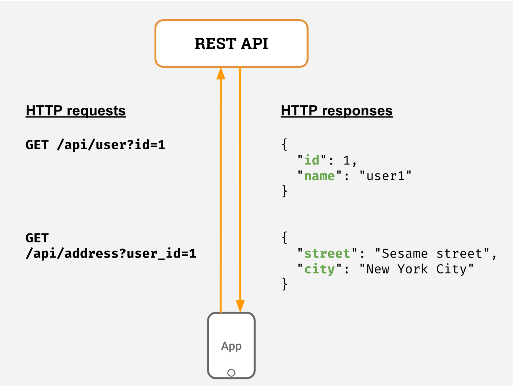
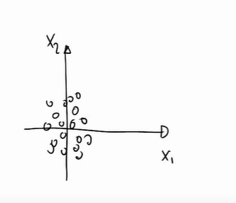

--- 
title: "REST API for Real Estate rental data, a spatial Bayesian modeling approach with INLA."
author: "[Niccolò Salvini](https://niccolosalvini.netlify.app/)"
url: 'https://niccolosalvini.github.io/Thesis/'
date: "Last compiled on 05 novembre, 2020"
site: bookdown::bookdown_site
output: bookdown::gitbook
documentclass: book
classoption: oneside
bibliography: [refs.bib, Rpackages.bib]
biblio-style: apalike
link-citations: yes
github-repo: NiccoloSalvini/Thesis
favicon: "images/favicon.ico" 
cover-image: "images/spat-touch.png"
description: " Niccolò Salvini master's thesis project"
apple-touch-icon: "images/spatial.png"
apple-touch-icon-size: 120
papersize: a4
geometry: "left=4cm, right=3cm, top=3cm, bottom=3cm"  
fontsize: 12pt
linestretch: 1.5
toc-depth: 2
fig_width: 7
fig_height: 6
fig_caption: true
links-as-notes: true  
lot: true 
lof: true
---

<!-- VALUTARE SE METTERE NEL DOCUEMTNO FINALE -->


<!-- AUTO COMPILE packages.bib -->

<!-- ```{r include=FALSE} -->
<!-- # automatically create a bib database for R packages -->
<!-- knitr::write_bib(c( -->
<!--   .packages(), 'bookdown', 'knitr', 'rmarkdown' -->
<!-- ), 'packages.bib', append = TRUE) -->
<!-- ``` -->


<!--chapter:end:index.Rmd-->

# Introduction {#intro}

<!--  You can label chapter and section titles using `{#label}` after them, e.g., we can reference Chapter \@ref(intro). If you do not manually label them, there will be automatic labels anyway, e.g., Chapter \@ref(methods).-->
Trento: 

* Argomento
* Problema
* Obiettivi
* Metodo
* Struttura della tesi


Main themes: 

- Research Question
- Milan Real Estate Controversies in relation to research question
- why the API (perchè mi mancano i dati e perchè è il futuro)
- Open Data discussion personal hope of data sharing and benefits from oper source
- Why a Bayesian approach
- Why INLA 


<!-- estratto dall'introduzione dellpinfrastrutture, ha senso messo qua  -->
As a general discussion technologies implied can be thought as the distance between a service running locally on a laptop and something that it can actually be put into production, shared among company stakeholders, solving business related problems. When such technologies are applied data scientist and interlocutors gradually close the gap. Insights are better communicated, data is up-to-date and automation can save time. Nonetheless when the infrastructure is structured with vision then integrating or substituting existing technologies is not trivial. Anyway technologies can not be always embedded because they might be exclusively designed to work only on certain back ends, therefore some choices are not into discussion. With foresight RStudio by setting future-oriented guidelines has spent a lot of effort giving its users an easy, integrated and interconnected environment. By that it is meant that the RStudio community has tried to either integrate or open the possibility to a number of technologies that fill the blanks in their weaker parts. On top of many, an entire package has been dedicated to democratize REST APIs (Plumber [@plumber]). As a further example developers in RStudio have created an entire new paradigm i.e. Shiny [@shiny], a popular web app development package, that enforces the developer to have front-end and back-end technologies tied up in the same IDE. They also added performance monitoring and optimization packages that are fitted into shiny such as shinytest [metti tag] and shinyloadtest [metti tag] to simulate sessions and verify network traffic congestion.

<!--chapter:end:01-intro.Rmd-->

# Scraping {#scraping}

<!--  You can label chapter and section titles using `{#label}` after them, e.g., we can reference Chapter \@ref(intro). If you do not manually label them, there will be automatic labels anyway, e.g., Chapter \@ref(methods).-->


The following chapter covers a gentle introduction and concepts of web scraping centered on immobiliare.it. It starts in general terms by ideally segmenting websites in two meta-concepts: website structure and content architecture, then it provokes this segmentation to the specific immobiliare.it case. The abstract workflow will ease the identification of the first "high level" challenge to be fronting during scraping, which is mainly understanding how the website is structured and how to reverse engineer the url composition. The structure is unrolled so that each part can be singularly and directly accessed and the problem can be passed to "lower levels". At this point a rooted-tree graph representation is used to map scraping functions into immobiliare content architecture. By means of `rvest` scraping is possible and the main function involved are presented. A specific function to scrape price (the response var of the analysis) is shown and then also a second function, that takes care of grouping all the scraping functions into a single one. Scraping best practices are applied both on the web server side, kindly requesting permission and delayed sending rate; and from the web client side by granting continuous scraping, avoiding server blocks by User Agent rotation and trycatches / handlers for easy debugging. Then run time issues are fronted presenting two different options for looping construction, `furrr` and `foreach`. The latter has displayed interesting results and further improvements are taken into consideration. Then an overview of the open challenges is offered so that this work might be extended or integrated with other technologies. In the end legal profiles are addressed comparing scraping results and difficulties with a counterpart case study.

## What is Web Scraping


Content in webpages is the most of the times well organized and accessible.
This is made possible by the effort put into building both the _website structure_ and the _content architecture_. For website structure it is meant the way urls, pointing to webpages, are arranged throughout the website.
Website structure constitutes a _first dimension_ of hierarchy. Some popular structure examples might regard social-networks where posts can be scrolled down within a single url page named the wall. Scrolling down might end due to few posts, but the perception related to the scroll option is a never-ending webpage associated to a single url. Instead personal profiles are dedicated to a specified unique url and even in profiles posts are allocated into a sub domain and might be scrolled down arranged by time since the day of social subscription. Online newspapers display their articles in the front wall and by accessing to one of them all the related following articles sometimes can be reached by an arrow, pointing right or left. Articles can also be suggested and the more the website is explored the more articles are likely to be seen twice within the same session. It will soon end up into a suggestion loop that it will recursively shows the same contents; recursive structures are popular in newspaper-type websites. Online Retailers as Amazon, based on filters, groups inside a single webpage (i.e. page n° 1) a fixed set of items, having their dedicated personal url attached to them. Furthermore Amazon offers the opportunity to skip to the following page (i.e. page n° 2), searching for another different and fixed set of items and so on until the last page/url. Generally website structures try to reflect both the user expectations with respect to the product on the website and the design expression of the web developer. For these reasons for each websites usage category exists a multitude of content architectures. For each content architectures there are multiple front end languages which are designated for multiple end users. In the future expectations are tailor made webpages on users with respect to its personal preferences. Moreover web design in scraping plays an important role since the more sophisticated graphical technologies are implied, the harder will be to scrape information. 


A _second dimension_ of hierarchy is brought by content architecture in the name of the language used for content creation and organization i.e. HTML. HTML stands for Hyper Text Markup Language and ... 
HTML drives the hierarchy structure that is then generalized to the website structure. According to this point of view the hierarchical website structure is a consequence of the content architecture by means of HTML language ( _arborescence_: direction from root to leaves).
CSS language stands for Cascading Style Sheets and takes care of the style of the webpage. The combination of HTML and CSS offers a wide flexibility in building web sites, once again expressed by the vast amount of different designs on the web. Some websites' components also might be tuned by Javascript language, which in the context of scraping adds a further layer of difficulty. As a matter of fact since Javascript components are dynamic within the webpage, scraping requires specialized libraries to enable different parser to get the content. CSS allows the scraper to target a class of objects in the web page that shares same style (e.g. same css query) so that each element that belongs to the class (i.e. share same style) can be gathered. This practice provides enormous advantages since by CSS a set of objects can be obtained within a single function call. 
First and Second dimension of the scraping problem imply hierarchy, a simple way to approach the problem is to represent it through already known data structures. One way to imagine hierarchy in both of the two dimensions are graph based data structures named as **Rooted Trees**. By analyzing the first dimension through the lenses of Rooted trees it is possible to compress the whole problem into the general graph based jargon [@Graph_Diestel]. Rooted trees must start with a root node which is the domain of the web page. Each _Node_ is a url destination and each _Edge_ is the connection between nodes. Connections have been made possible in the website by nesting urls inside webpages so that within a single webpage the user can access to a number of other related links. Furthermore, as an extension to the rooted tree framework a general graph theory component is introduced, i.e. the _Weight_. Each edge is associated to a weight whose interpretation is the run time cost to walk from a node to its conncted other nodes (e.g. from a url to the other). In addition the content inside each node takes the name of payload, which ultimately is the scope of the scraping processes. The walk from node 17 to node 8 in figure below (even though that is the case of a binary rooted tree) is called path and it represented as an ordered list of nodes connected by edges. In this context each node can have both a fixed and variable outgoing sub-nodes that are called _Children_ . When root trees have a fixed set of children are called _k-ary_ rooted trees. A node is said to be _Parent_ to other nodes when it is connected to them by outgoing edge, in right figure below "head" is the parent of nodes "title" and "meta". Nodes in the tree that shares the same parent node are said _Siblings_, "head" and "body" are siblings in figure \@ref(tree_html). Moreover _Subtrees_ are a set of nodes and edges comprised of a parent and its descendants e.g. node "body" with all of its descendants might constitute a subtree. The concept of subtree in both of the dimensions plays crucial role in cutting run time scraping processes and fake headers provision (see section \@ref(spoofing)). If the website strucuture is locally reproducible and the content architecture within webpages tends to be equal, then functions for a single subtree might be extended to the rest of others subtrees that are siblings to the same parent node. Local reproducibility is a property according to which starting from a single url all the related urls can be inferred from a pattern. Equal content architecture throughout different single links means to have sort of standard shared-within advs criteria that each single rental advertisement has to refer. In addition two more metrics have might better describe the tree: _level_ and _height_. The level of a node $\mathbf{L}$ counts the number of edges on the path from the root node to $\mathbf{L}$. The height is the maximum level for any node in the tree, from now on $\mathbf{H}$. What is worth to be anticipating is that functions are not going to be applied directly to siblings in the more general rooted tree. Instead it would be better segmenting the highest level rooted tree into a sequence of single subtrees whose roots are the siblings for reasons explained in section \@ref(spoofing).


###  Immobiliare.it Webscraping website structure{#webstructure}

The structure of the website resembles the one from the popular online retailer Amazon. According to the query filters selected in a dedicated section (e.g. city, number of rooms 5, square footage less than 60 $m^2$ etc), the url is shaped so that each further filter is appended at the end of the domain url `https://www.immobiliare.it/` root node. Filters are appended to the domain with a proper syntax, not all the syntax are equal. Once filters are all applied to the root domain this constitutes the new url root domain node that might have this appearance by filtering for rents in Milan city when square footage is less than 60 $m^2$: domain +`affitto-case/milano/?superficieMinima=60`.  Since this is true only for page n°1 containing the first 25 advs (see figure \@ref(fig:website_tree1)) all the remaining siblings nodes corresponding to the subsequent pages have to be generated. Here the utility of Local reproducibility property introduced in the previous section. The remaining siblings, i.e. the ones belonging to page 2 (with the attached 25 links),to page 3 etc. can be generated by adding a further filter `&pag=n`, where n is the page number reference (from now on referred as _pagination_). Author customary choice is to stop pagination up to 300 pages since spatial data can not be to too large due to computational constraints.
Up to this process pagination has generated a list of siblings nodes whose children elements number is fixed (i.e. 25 links per page \@ref(fig:website_tree1) lower part). That makes those trees _k-ary_, where k is 25 indicating the number of children leaves. K-ary trees are rooted trees in which each node has no more than k children, in this particular case final leaves. The well known binary rooted tree is actually a special case of k-ary when $k = 2$. Filters reverse engineering process and 25-ary trees with equal content structure across siblings allow to design a single function to call that could be mapped for all the other siblings. In addition in order to further unroll the website a specific scraping function grabs the whole set of 25 links per page. As a result a single function call of `scrape_href()` can grab the links corresponding to page 1. Then the function is mapped for all the generated siblings nodes (i.e. up to  300) obtaining a collection of all links belonging to the set of pages. Ultimately the complete set of links corresponds to every single advertisement posted on immobilaire.it at a given time.

{#fig:website_tree1}


### Immobiliare.it Webscraping content architecture with `rvest`{#ContentArchitecture}

To start a general scraping function the only requirement is a target url (i.e. the filtered root node url). Then a list `html_session` object is opened by specifying the url and  the request data that the user need to send to the web server (see left part to dashed line image \@ref(fig:workflow)). Information to be attached to the web server request will be further explored later, tough they are mainly three: User Agents, emails references and proxy servers. `html_session` objects contains a number of useful information such as: the url, the response, coockies, session times etc. Once the connection is established (request response 200) all the following operations rely on the opened session, in other words for the time being in the session the user will be authorized with the before-provided characteristics through the request.
The list object contains mostly the html content of the webpage and that is where data needs to be parsed. The list can disclose as well other interesting meta information related to the session but they are not collected.
The figure in \@ref(fig:rvest flow chart, missing source) sketches what the scraping needs to front:

{#fig:workflow}

To the right of dashed line in the flow chart are painted a sequence of `rvest`[@rvest] functions that follow a general step by step text comprehension rules. `rvest` first handles parsing the html content of the web page within the session object `read_html()`, secondly It looks for a single node `html_nodes()` through a CSS query. CSS is a way to route `rvest` to consider a precise node in the webpage. Thirdly it converts the content (i.e. payload) into a human readable text with `html_text()`. The sketch of immboliare.it content strucures is reported in the figure below:




The code chunk below shows a function that can scrape the price.


```r
scrapeprice.imm = function(session) {
    
    opensess = read_html(session)
    price = opensess %>% html_nodes(css = ".im-mainFeatures__title") %>% html_text() %>% 
        str_trim()
    
    if (is.null(price) || identical(price, character(0))) {
        price2 = opensess %>% html_nodes(css = ".im-features__value , .im-features__title") %>% 
            html_text() %>% str_trim()
        
        if ("prezzo" %in% price2) {
            pos = match("prezzo", price2)
            return(price2[pos + 1]) %>% str_replace_all(c(`\200` = "", `\\.` = "")) %>% 
                str_extract("\\-*\\d+\\.*\\d*") %>% str_replace_na() %>% str_replace("NA", 
                "Prezzo Su Richiesta")
        } else {
            return(NA_character_)
        }
    } else {
        return(price) %>% str_replace_all(c(`\200` = "", `\\.` = "")) %>% str_extract("\\-*\\d+\\.*\\d*") %>% 
            str_replace_na() %>% str_replace("NA", "Prezzo Su Richiesta")
        
    }
    
}
```

The function takes as a single argument a session object which is at first initialized in one other function. Then It reads the inner html content in the session storing the information into an obj called the `opensess`. Another obj is created, namely price, right after the pipe operator a css query into the html is called. The css query `.im-mainFeatures__title` points to a precise data location inside the web page, right below the main title. Expectation are that price is a one-element chr vector, containing the price and other unnecessary non-UTF characters. Then the algorithm enters into the first `if` statement. The handler checks if the object `price` is empty. If it doesn't the algorithm jumps to the end of the algorithm and returns the cleaned quantity. But If it does it takes again the `opensess` and tries with a second css query `.im-features__value , .im-features__title` where price might be also found. Please note that this is all done within the same session, so no more additional request information has to be sent. Since the latter css query points to data stored inside a list, for the time being the newly created obj price2 is a list containing various information. Then the algorithm flow enters into the second `if` statement that checks whether the `"prezzo"` is matched the list or not, if it does it returns the +1 position index element with respect to the "prezzo" positioning. This happens because data in price2 list are stored by couples sequentially, e.g. [title, "Appartamento Sempione", energy class, "G", "prezzo", 1200/al mese]. When it returns the element corresponding to +1 position index it applies also some data wrangling with `stringr` package to keep out overabundant characters. The function then escapes in the else statement by setting `price2 = NA_Character_` once no css query could be finding the price information. the _character-string_ type has to be imposed due to fact that later they can not be bind. In other words if the function is evaluated for a url and returns the price quantity, but then is evaluated for url2 and outputs NA (no character) then results can not be combined into dataframe due to different types.


Once all the functions have been created they need to be called together and then data coming after them need to be combined. This is done by `get,data.catsing()` which at first checks the validity of the url, then takes the same url as input and filters it as a session object. Then simultaneously all the functions are called and then combined. All this happens inside a `foreach` parallel loop called by `scrape.all.info()` 


```r
scrape.all.info = function(url = "https://www.immobiliare.it/affitto-case...",
                           vedi = FALSE, 
                           scrivi = FALSE, 
                           silent = FALSE){
  if (silent) {
    start = as_hms(Sys.time()); cat('Starting the process...\n\n')
    message('\nThe process has started in',format(start,usetz = TRUE))  
  }
  # open parallel multisession
  cl = makeCluster(detectCores()-1) #using max cores - 1 for parallel processing
  registerDoParallel(cl)
  start = as_hms(Sys.time())
  
  if (silent) {
    message('\n\nStart all the requests at time:', format(start,usetz = T))  
  }
  ALL = foreach(i = seq_along(links),
                .packages = lista.pacchetti,
                .combine = "bind_rows",
                .multicombine = FALSE,
                .export ="links" ,
                .verbose = TRUE,
                .errorhandling='pass') %dopar% {
                  source("utils.R")
                  sourceEntireFolder("functions_singolourl")
                  get.data.catsing = function(singolourl){
                    
                    # dormi()
                    # 
                    if(!is_url(singolourl)){
                      stop(paste0("The following url does not seem either to exist or it is invalid", singolourl))
                    }
                    
                    session = html_session(singolourl, user_agent(agents[sample(1)]))
                    if (class(session) == "session") {
                      session = session$response  
                    }
                      
                    id         = tryCatch({scrapehouse.ID(session)},
                                          error = function(e){ message("some problem occured in scrapehouse.ID") })
                    lat        = tryCatch({scrapelat.imm(session)},
                                          error = function(e){ message("some problem occured in scrapelat.imm") })
                    long       = tryCatch({scrapelong.imm(session)},
                                          error = function(e){ message("some problem occured in scrapelong.imm") })
                    location   = tryCatch({take.address(session)},
                                          error = function(e){ message("some problem occured in take.address") })
                    condom     = tryCatch({scrapecondom.imm(session)},
                                          error = function(e){ message("some problem occured in scrapecondom.imm") })
                    buildage   = tryCatch({scrapeagebuild.imm(session)},
                                          error = function(e){ message("some problem occured in scrapeagebuild.imm") })
                    
                  ...
                  
                   combine = tibble(ID        = id,
                                     LAT       = lat, 
                                     LONG      = long,
                                     LOCATION  = location,
                                     CONDOM    = condom,
                                     BUILDAGE  = buildage,
                                    
                  ...
                  
                  
                  return(combine) 
                  }
  stopCluster(cl)
  return(ALL)
}
```

The skeleton constitutes a standard format adopted for many other scraping function in the analysis. Being equal the css query what it changes is the matching term, i.e. "numero camere" instead of "prezzo" to look for how many rooms there are in the house. This is true for all the information contained in the list accessed by the fixed css query. Those that are not they are a few and they do not need to be scraped. 
In addition some other functions outputs need to undergo to further heavy cleaning steps in order to be usable As a consequence oh that functions need also to be broken down by pieces into many single .R files whose names correspond to each important information.
Below it is printed the tree structure folder that composes the main elements of the scraping procedure. It can be notices that the two folders, namely functions_singolourl and functions_url enclose all the single functions that allows to grab single information from session. Folders with a customized function are then sourced within the two main functions, scrape.all and scrape.all.info so data can be extracted.

```
 levelName
1  immobiliare.it-WebScraping     
2   ¦--functions_singolourl       
3   ¦   ¦--0scrapesqfeetINS.R     
4   ¦   ¦--0scrapenroomINS.R      
5   ¦   ¦--0scrapepriceINS.R      
6   ¦   ¦--0scrapetitleINS.R      
7   ¦   ¦--ScrapeAdDate.R         
8   ¦   ¦--ScrapeAge.R            
9   ¦   ¦--ScrapeAgeBuilding.R    
10  ¦   ¦--ScrapeAirConditioning.R
11  ¦   ¦--ScrapeAptChar.R        
12  ¦   ¦--ScrapeCatastInfo.R     
13  ¦   ¦--ScrapeCompart.R        
14  ¦   ¦--ScrapeCondom.R         
15  ¦   ¦--ScrapeContr.R          
16  ¦   ¦--ScrapeDisp.R           
17  ¦   ¦--ScrapeEnClass.R        
18  ¦   ¦--ScrapeFloor.R          
19  ¦   ¦--ScrapeHasMulti.R       
20  ¦   ¦--ScrapeHeating.R        
21  ¦   ¦--ScrapeHouseID.R        
22  ¦   ¦--ScrapeHouseTxtDes.R    
23  ¦   ¦--ScrapeLAT.R            
24  ¦   ¦--ScrapeLONG.R           
25  ¦   ¦--ScrapeLoweredPrice.R   
26  ¦   ¦--ScrapeMetrature.R      
27  ¦   ¦--ScrapePhotosNum.R      
28  ¦   ¦--ScrapePostAuto.R       
29  ¦   ¦--ScrapePropType.R       
30  ¦   ¦--ScrapeReaReview.R      
31  ¦   ¦--ScrapeStatus.R         
32  ¦   ¦--ScrapeTotPiani.R       
33  ¦   ¦--ScrapeType.R           
34  ¦   °--take_location.R        
35  ¦--scrapeALL.R                
36  ¦--scrapeALLINFO.R            
37  ¦--functions_url              
38  ¦   ¦--ScrapeHREF.R           
39  ¦   ¦--ScrapePrice.R          
40  ¦   ¦--ScrapePrimaryKey.R     
41  ¦   ¦--ScrapeRooms.R          
42  ¦   ¦--ScrapeSpace.R          
43  ¦   °--ScrapeTitle.R          
44  ¦--libs.R                     
45  ¦--utils.R                    
46  ¦--README.Rmd                 
47  ¦--README.md                  
48  °--simulations                
49      ¦--rt_match_vs_forloop.R  
50      °--runtime_simul.R
```


##  Scraping Best Practices and Security provisions{#best-practices}

Robots.txt files are (rivedi citation) a way to kindly ask webbots, spiders, crawlers, wanderers to access or not access certain parts of a webpage. The de facto ‘standard’ never made it beyond a informal “Network Working Group INTERNET DRAFT”. Nonetheless, the use of robots.txt files is widespread (e.g. https://en.wikipedia.org/robots.txt, https://www.google.com/robots.txt) and bots from Google, Yahoo and the like will adhere to the rules defined in robots.txt files, although their _interpretation_ of those rules might differ.

Robots.txt files are plain text and always found at the root of a website's domain. The syntax of the files in essence follows a fieldname: value scheme with optional preceding user-agent: ... lines to indicate the scope of the following rule block. Blocks are separated by blank lines and the omission of a user-agent field (which directly corresponds to the HTTP user-agent field) is seen as referring to all bots. # serves to comment lines and parts of lines. Everything after # until the end of line is regarded a comment. Possible field names are: user-agent, disallow, allow, crawl-delay, sitemap, and host. For further notions [@robotstxt, @google:robottxt]

Some interpretation problems:

- finding no robots.txt file at the server (e.g. HTTP status code 404) implies that everything is permitted
- subdomains should have there own robots.txt file if not it is assumed that everything is allowed
- redirects involving protocol changes - e.g. upgrading from http to https - are followed and considered no domain or subdomain change - so whatever is found at the end of the redirect is considered to be the - robots.txt file for the original domain
- redirects from subdomain www to the doamin is considered no domain change - so whatever is found at the end of the redirect is considered to be the robots.txt file for the subdomain originally requested

For the thesis purposes it has been designed a dedicated function to assess whether the domain or the related paths require specific actions or they prevent some activity on the target. The following `checkpermission()` function has been integrated inside the scraping system and it is called once at the starting point.


```r
dominio = "immobiliare.it"

checkpermission = function(dom) {
    
    robot = robotstxt(domain = dom)
    vd = robot$check()[1]
    if (vd) {
        cat("\nrobot.txt for", dom, "is okay with scraping!")
    } else {
        cat("\nrobot.txt does not like what you're doing")
        stop()
    }
}
## metti path allowed check
checkpermission(dominio)
```

```
## 
## robot.txt for immobiliare.it is okay with scraping!
```


Further improvements in this direction might come with the `polite` package [@polite] which combines the power of the `robotstxt`, the `ratelimitr` [@ratelimitr] to limit sequential requests together with the `memoise` [@memoise] for response caching. This package is wrapped up around 3 simple but effective ideas: 

> The three pillars of a polite session are seeking permission, taking slowly and never asking twice.

The three pillars constitute the _Ethical_ web scraping manifesto [@densmore_2019] which are common shared practises that are aimed to self regularize scrapers. These have to be intended as best practices, not in any case as law enforcements, however many scrapers themselves, as website administrators or analyst, have fought in their daily working tasks with bots. Crawling bots in intensive scraping processes might fake real client navigation logs and as a consequence might induce distorted analytics. Due to this fact comes the need to find a common operating ground and therefore politely asking for permission.

## Security provisions: User Agents, Proxies and Handlers 

HTTP requests to the website server by web clients come with some mandatory information packed in it. The process according to which HTTP protocols allow to exchange information can be easily thought with an  everyday real world analogy. As a generic person A rings the door's bell of person B's house. A comes to B door with its personal information, its name, surname, where he lives etc. At this point B may either answer to A requests by opening the door and let him enter given the set of information he has, or it may not since B is not sure of the real intentions of A. This typical everyday situation in nothing more what happens billions of times on the internet everyday, the user (in the example above A) is interacting with a server website (part B) sending packets of information. If a server does not trust the information provided by the user, if the requests are too many, if the requests seems to be scheduled due to fixed sleeping time, a server can block requests. In certain cases it can even forbid the user log to the website. The language the two parties exchanges are coded in numbers that ranges from 100 to 511, each of which has its own specific significance. A popular case of this type of interaction occurs when users are not connected to internet so the server responds 404, page not found. Servers are built with a immune-system like software that raises barriers and block users to prevent dossing or other illegal practices.


This procedure is a dayly issue to people that are trying to collect information from websites. Google performs it everyday with its spider crawlers, which are very sophisticated bots that scrapes over a enormous range of websites. This challenge can be addressed in multiple ways, there are some specific Python packages that overcome this issue. The are also certain types of scraping as the Selenium web driver automation that simulates browser automation. Selenium allows the user not to be easily detected by the server immune system and peaceful. Precautions have not been taken lightly, and a simple but effective approach is proposed.

### User Agents Spoofing{#spoofing}


The user agent string includes the user application or software, the operating system (and their versions), the web client, the web client’s version, as well as the web engine responsible for the content display (such as AppleWebKit). The user agent string is sent in the form of a HTTP request header. Since User Agents acts as middle man between the client request and the server response, then from a continuous scraping point of view it would be better rotating them, so that each time the middle man looks different. The solution adopted builds a vector of user agent strings identified by different specifications, different web client, different operating system and so on, then samples 1 of them 
Then whenever a request from a web browser is sent to a web server, 1 random sample string is drawn from the user agents pool. So each time the user is sending the request it appears to be a different User Agent.
Below the user agents rotation pool:


```r
set.seed(27)
agents = c("Mozilla/5.0 (Windows NT 6.1; WOW64) AppleWebKit/537.36 (KHTML, like Gecko) Chrome/83.0.4103.116 Safari/537.36", 
    "Mozilla/5.0 (Windows NT 10.0; WOW64) AppleWebKit/537.36 (KHTML, like Gecko) Chrome/83.0.4103.116 Safari/537.36", 
    "Mozilla/5.0 (Windows NT 10.0; Win64; x64) AppleWebKit/537.36 (KHTML, like Gecko) Chrome/83.0.4103.116 Safari/537.36", 
    "Mozilla/5.0 (Macintosh; Intel Mac OS X 10_12_1) AppleWebKit/602.2.14 (KHTML, like Gecko) Version/10.0.1 Safari/602.2.14", 
    "Mozilla/5.0 (Windows NT 10.0; WOW64) AppleWebKit/537.36 (KHTML, like Gecko) Chrome/54.0.2840.71 Safari/537.36", 
    "Mozilla/5.0 (Macintosh; Intel Mac OS X 10_12_1) AppleWebKit/537.36 (KHTML, like Gecko) Chrome/54.0.2840.98 Safari/537.36", 
    "Mozilla/5.0 (Macintosh; Intel Mac OS X 10_11_6) AppleWebKit/537.36 (KHTML, like Gecko) Chrome/54.0.2840.98 Safari/537.36", 
    "Mozilla/5.0 (Windows NT 6.1; WOW64) AppleWebKit/537.36 (KHTML, like Gecko) Chrome/54.0.2840.71 Safari/537.36", 
    "Mozilla/5.0 (Windows NT 6.1; Win64; x64) AppleWebKit/537.36 (KHTML, like Gecko) Chrome/54.0.2840.99 Safari/537.36", 
    "Mozilla/5.0 (Windows NT 10.0; WOW64; rv:50.0) Gecko/20100101 Firefox/50.0")
agents[sample(1)]
```

```
## [1] "Mozilla/5.0 (Windows NT 6.1; WOW64) AppleWebKit/537.36 (KHTML, like Gecko) Chrome/83.0.4103.116 Safari/537.36"
```

A more secure approach might be a further rotation of proxies between the back and forth sending-receving process. A proxy server acts as a gateway between the web user and the web server.
While the user is exploiting a proxy server, internet traffic flows through the proxy server on its way to the server requested. The request then comes back through that same proxy server and then the proxy server forwards the data received from the website back to the client. The final result will be linear combination of User Agents ID and Proxy server for each sending requests, grating a high security level.
Many proxy servers are offered in a paid version, so in this case since security barriers are not that high they  will not be implemented. As a further disclaimer many online services are providing free proxies server access, but this comes at a personal security cost due to a couple of reasons:
- Free plan Proxies are shared among a number of different clients, so as long as someone has used them in the past for illegal purposes the client is indirectly inheriting their legal infringements.
- Very cheap proxies, for sure all of the ones free, have the activity redirected on their servers monitored, profiling in some cases a user privacy violation issue.

### Handlers and Trycatches

During scraping many difficulties are met. Some of them might come from website structure issues, so that rooted-tree hierarchies are changed as a consequence of a restructuring. Some others might interest content architecture where data is reallocated to some other places in the webpage, then CSS query are no more able to catch data. Handlers in the form of trycatch error workarounds are explicitly built in this sense. The continuous building and testing of the scraping functioning has required the maintainer to have a precise and fast debugging experience. The following consideration might give a sense of the time consumed when debugging handlers are not implied: `get.data.catsing()` triggers 34 different scrapping functions that are supposed to point to 34 different data pieces. Within a single function call by default pagination generates 10 pages each of which contains at least 25 different single urls to be scrapped. That leads to a number of 8500 single data information, the probability given 8500 associated to something going missing or misparsed is undoubtedly high.
The solution proposed tries to handle fails by implementing as many trycatches as scrapping fucntions inside the a the single `get.data.catsing()` call. Then inside each single scrapping function are put the handlers. This set up allows to catch (and in some cases prevent) fails starting from the very end of the scraping process. As a consequence of this setting when a scrapping function is not able to gather data an error inside the function is thrown, then the error call is intercepted by the corresponding trycatch, which at the end messages where the error occurs.
Below some of the main handlers implied:

- `.get_ua()` verifies that the User Agent in the session is not the default one.


```r
.get_ua = function(sess) {
    stopifnot(is.session(sess))
    stopifnot(is_url(sess$url))
    ua = sess$response$request$options$useragent
    return(ua)
}
```


- `.is_url()` verifies that the url input needed has the canonic form. This is done by a REGEX query.


```r
.is_url = function(url) {
    re = "^(?:(?:http(?:s)?|ftp)://)(?:\\S+(?::(?:\\S)*)?@)?(?:(?:[a-z0-9¡-<ef><U+00BF><U+00BF>](?:-)*)*(?:[a-z0-9¡-<ef><U+00BF><U+00BF>])+)(?:\\.(?:[a-z0-9¡-<ef><U+00BF><U+00BF>](?:-)*)*(?:[a-z0-9¡-<ef><U+00BF><U+00BF>])+)*(?:\\.(?:[a-z0-9¡-<ef><U+00BF><U+00BF>]){2,})(?::(?:\\d){2,5})?(?:/(?:\\S)*)?$"
    grepl(re, url)
}
```


- `.get_delay()` checks through the robotxt file if a delay between each request is kindly welcomed. When response is NA delay is not required.


```r
.get_delay = function(domain) {
  
  message(sprintf("Refreshing robots.txt data for %s...", domain))
  
  cd_tmp = robotstxt::robotstxt(domain)$crawl_delay
  
  if (length(cd_tmp) > 0) {
    star = dplyr::filter(cd_tmp, useragent=="*")
    if (nrow(star) == 0) star = cd_tmp[1,]
    as.numeric(star$value[1])
  } else {
    10L
  }
  
}
get_delay =  memoise::memoise(.get_delay) ## so that .get_delay results are cached
.get_delay(domain = dominio)
```

```
## [1] NA
```

## Parallel Computing

Since are opened as many sessions as single links and since for each link are supposed to be called 34 functions run time computation can take a while. Run time is crucial when dealing with active web pages and time to market in real estate is very important, in here originates the need to have always up-to-date data. Run time optimization involves each level of the scraping process from the "lowest" i.e. inside each single function to the "highest" i.e. the agglomerative function. Inside single scraping functions as a general criteria for loops are avoided due to Rcpp reasons, vectorization is preferred. Within agglomerative function instead the approach was to test two different results. All the following runtime examinations are performed on the `scrape()` functions which is a lightweight version of the final API function. 
The first attempt was using `furrr` package [@furrr] which enables mapping through a list with the `purrr`, along with a `future` parallel back end. The approach has shown decent preformance, but its run time drastically increases when more requests are sent. This leads to a preventive conclusion about the computational complexity: it has to be at least linear with steep slope. Empirical demonstrations have been made:


On the x-axis in the figure the number of urls which are evaluated together, on y axis the run time taken measured in seconds. Iteration after iteration the urls considered are cumulated one at at a time. Looking at the blue smoothing curve in between confidence lines the big-O guess might be linear time $\mathcal{O}(n)$, where n are the links considered.

A second attempt tried to explore the `foreach` package [@foreach]. This quite recent package enables a new looping construct for executing R code in an iterative way. The core reason for using the `foreach` package is that it supports *parallel execution*, that is, it can execute those repeated operations on multiple processors/cores on the computer, or on multiple nodes of a cluster. The construction follows the r-base looping idea, below steps are summarized:

- start clusters on processors cores
- define the iterator, i.e. "i"  equal to the number of elements that are going to be looped
- `.packages`: Inherits the packages that are used in the tasks define below
- `.combine`: Define the combining function that bind results at the end (say cbind, rbind or tidyverse::bind_rows).
- `.errorhandling`: specifies how a task evaluation error should be handle.
- `%dopar%`: the dopar keyword suggests foreach with parallelization method
- then the function within the elements are iterated
- close clusters

One major concern regards that functions inside the %dopar% should be standalone in order to be executed in parallel. For standalone it is meant that everything that is needed to be executed and to output results should be defined inside the  %dopar%, as it would be opened a new empty environment for each iteration. Moreover as a further consequence packages imported into each clusters, the .packages methods takes care of that.


It can be grasped quite easily that the curve now is flattened and a confident guess migh be logarithmic time $\mathcal{O}(log(n))$. 

A further performance improvement could be obtained using a new package called `doAzureParallel` which is built on top of the foreach. doAzureParallel enables different Virtual Machines operating parallel computing throughout Microsoft Azure cloud, but this comes at a substantial monetary cost. This would be a perfect match given that parallel methods seen before accelerates the number of requests sent among different processors or cluster, even though actually the goal is to have something that separates different sessions. Unleashing Virtual Machines allows from one hand to further increase computational capabilties, so the number of potential requests, from the other it can partition requests among different proper machines (a pool of agents for each VM) extending even more the combination of IDs and as a consequence masquerading even better the scraping automation.


## Open Challenges{#challenges}

The main challenge remains unsolved since each single elements have been finely optimized but scraping function and so REST API must be continuously maintained.   Indeed What it can not be a-priori optimized are the future changes that involves the website structure. Content architecture as opposite, with some sophistication can take care of finding exact information within the webpage even if the designed is changed. The idea developed in the package @Rcrawler, even though results are not always acceptable, is to crawl the website and to search for targeted keywords. Once keywords are found the scraping algorithm looks for the related information that should be located throughout the html files locally stored. html are known to be very lightweight so computation of this kind is not bothering run time. For this reasons performances with algorithm of this species are very neat but results, as anticipated, are under the expectation. As a solution an accurate text mining approach can be considered as a further enachement. It should be also pointed out that @Rcrawler is designed to scrape a vast number of websites, as contrary the scraping functions here presented are exclusively designed to be applied on immobliare.it, even though they can be extended to other related website with no effort.
The way the scraping function are designed really facilitates responsive fast debugging but this can not be by any means automatized. The API necessitates frequently to resort to continuous integration (i.e. CI) review to verify the working status. Moreover Error messages can not really be understood sometimes even with handlers, this is due to functions that are called within a parallel beckend that does not allow to print error on console as in this  [stackoverflow reproducible example](https://stackoverflow.com/questions/10903787/how-can-i-print-when-using-dopar). So each time an error occurs the "main" functions needs to be taken out of from the parallel back end and separately evaluated. This is time consuming but for the time being no solutions have been found. 

## Legal Profiles (ancora non validato)

"Data that is online and public is always available for all" is never a good answer to the question "Can I use those web data to my scope". [Immobiliare.it](https://www.immobiliare.it/) is not providing any open source data from its own database neither the perception is that it is planning to do so in the future. Immobiliare has not even provided a paid API through which data might be accessed.
A careful reading of their terms, reviewed with a intellectual property expert, has been done to get this service running without any legal consequence, as a reference the full policy can be seen in their [specialized section](https://www.immobiliare.it/terms/). Nevertheless the golden standard for scraping was respected since the robottxt is neat allowing any actions as demonstrated above. So if it might be the case of misinterpretation of their policy, it will be also the case of lack of communication between servers response and immobiliare.it intent to preserve their own intellectual property.
What it was shockingly surprising are the low barriers to obtain information with respect to other counterpart online players. Best practices are applied and delayed requests (even though not asked) have been sent to normalize traffic congestion. But scraping criteria followed are once again fully based on common shared best practises (see section \@ref(best-practices)), and *not* any sort of general agreements between parties. As a result a plausible approach could be applying scraping procedures without any prevention. It would not surely cause any sort of disservice for the website since budjet constraints are set low, but in the long run it will cause lagging as soon as budjet or subjects will increase. Totally different was the approach proposed by Idealista.com, which is a comparable to immobiliare.it. Idealista does block requests if they are not in compliance with their servers inner rules. User agents in this case must be rotated quite frequently and as soon as a request does not fall within the pool of user agents (i.e. is labled as web bot) it is immediately blocked and 404 response is sent back. Delay is kindly asked and it must be specified, consequnetly this slows down scraping function per se.

- Idealista content is composed by Javascript so and html parser can no get that.
- Idealista blocks also certain web browser that have a demonstrated "career" in scraping procedures.

All of this leads to accept that entry barriers to scrape are for sure higher than the one faced for Immobiliare. The reticence to share data could be a reflex on how big idealista is; as a matter of fact it has a heavy market presence in some of the Europe real estate country as Spain and France. So the hidden intention was to raise awareness on scraping procedure that in a certain remote way can hurt their business. This has been validated by the fact that prior filtering houses on their website a checkbox has to be signed. The checkbox make the user sign an agreement on their platform according to which data can not be misused and it belongs their intellectual property.


<!--chapter:end:02-scraping.Rmd-->

# REST API Infrastructure {#Infrastructure}

<!--  You can label chapter and section titles using `{#label}` after them, e.g., we can reference Chapter \@ref(intro). If you do not manually label them, there will be automatic labels anyway, e.g., Chapter \@ref(methods).-->

In order to provide a fast and easy to use API service to the end user many technologies have been involved. Challenges in scraping as pointed out in section \@ref(challenges) are many and still some remains unsolved. Challenges regards not only scraping per se, but also the way the service has to interact with the users. Interactions are many and consequently are problems arised. API service has to be fast otherwise data become obsolete and so happen to the analysis that have relied on those data. Service has to be deployed so that it can be shared over a wider range of clients. Service has to be scalable at need since, due to deployment, when the number of users increases the run time performance should not decrease. Moreover from one hand service has to be continuously integrated and reviewed so that each function can be responsive to immobiliare.it changes. But on the other code behind the service has to be version controlled and freezed, so that when packages are updated service can prevent fails. API has to be also secured granting access only to the ones authorized. In the end Service has to be run at a certain given times and storing data on cloud database, so that it can be tracked back the evolution of the phenomenon under inspection.
Open source solutions for each of the requirements stated are available for back-end and front-end integration. Moreover documentations related to technologies served are able to offer flexible solutions to be embedded into the R ecosystem.
For all the requirements the idea is to provide a REST Plumber API with 4 endpoints which calls parallelized scraping functions built in section \@ref(scraping). On top of that a daily Cron Job scheduler, exposing one API endpoint, produces and later stores a .csv file in a NOSQL mongoDB Atlas could database. Containerization happens through a Linux OS (Ubuntu distr) Docker container hosted by a AWS EC2 server. API endpoints are secured with https protocols and protected with authentication by nginx reverse proxy. On a second server a Shiny App calls one endpoint with specified parameters which returns daily data from the former infrastructure.

Technologies involved are:

- GitHub version control
- Scheduler cron job, section \@ref(scheduler)
- Docker containers, section \@ref(docker)
- Plumber REST API, section \@ref(plumberapi)
- NGINX reverse proxy, section \@ref(nginx)
- AWS (Amazon Web Services) EC2 \@ref(aws)
- MongoDB Atlas
- Shiny, see chapter \@ref(application)


As a side note each single part of this thesis has been made according to the same API inspiring criteria of reproducibility and self containerization. RMarkdown [@rmarkdown1] documents (book's chapters) are compiled and then converted into .html files. Through Bookdown [@bookdown2] the resulting documents are put together according to general .yml instruction file and are readble as gitbook.
Files are then pushed to a [Github repository](https://github.com/NiccoloSalvini/thesis). By a simple trick with GH pages, .html files are dispalyed into a Github subdomain hosted at [link](https://niccolosalvini.github.io/thesis/).  The resulting  deployed gitbook can also produce a .pdf version output through a Xelatex engine. Xelatex compiles .Rmd documents according to a .tex template which formatting rules are contained in a further .yml file. The pdf version of the thesis can be obtained by clicking the download button, then choosing pdf output version in the upper banner. For further references on the topic @bookdown2

Some of the main technologies implied will be viewed singularly, nonetheless for brevity reasosn some needs to be skipped.


## Scheduler{#scheduler}

\BeginKnitrBlock{definition}\iffalse{-91-83-99-104-101-100-117-108-101-114-93-}\fi{}
<span class="definition" id="def:scheduler"><strong>(\#def:scheduler)  \iffalse (Scheduler) \fi{} </strong></span>A Scheduler in a process is a component on a OS that allows the computer to decide which activity is going to be executed. In the context of multi-programming it is thought as a tool to keep CPU occupied as much as possible.
\EndKnitrBlock{definition}


As an example it can trigger a process while some other is still waiting to finish. There are many type of scheduler and they are based on the frequency of times they are executed considering a certain closed time neighbor.

- Short term scheduler: it can trigger and queue the "ready to go" tasks
  - with pre-emption 
  - without pre-emption

The ST scheduler selects the process and It gains control of the CPU by the dispatcher. In this context we can define latency as the time needed to stop a process and to start a new one. 

- Medium term scheduler 
- Long term scheduler

for some other useful but beyond the scope refereces, such as the scheduling algorithm the reader can refer to [@wiki:scheduler].

### Cron Jobs
\BeginKnitrBlock{definition}\iffalse{-91-67-114-111-110-106-111-98-93-}\fi{}
<span class="definition" id="def:cronjob"><strong>(\#def:cronjob)  \iffalse (Cronjob) \fi{} </strong></span>Cron job is a software utility which acts as a time-based job scheduler in Unix-like OS. Linux users that set up and maintain software environments exploit cron to schedule their day-to-day routines to run periodically at fixed times, dates, or intervals. It typically automates system maintenance but its usage is very flexible to whichever needed. It is lightweight and it is widely used since it is a common option for Linux users.
\EndKnitrBlock{definition}
The tasks by cron are driven by a crontab file, which is a configuration file that specifies a set of commands to run periodically on a given schedule. The crontab files are stored where the lists of jobs and other instructions to the cron daemon are kept.

Each line of a crontab file represents a job, and has this structure


Each line of a crontab file represents a job. This example runs a shell named scheduler.sh at 23:45 (11:45 PM) every Saturday. .sh commands can update mails and other minor routines.

45 23 * * 6 /home/oracle/scripts/scheduler.sh

Some rather unusual scheduling definitions for crontabs can be found in this reference [@wiki:cronjob]. Crontab's syntax completion can be made easier through [this](https://crontab.guru/) GUI.  

The cron job needs to be ran on scraping fucntions at 11:30 PM every single day. The get_data.R script first sources an endpoint function, then it applies the function with fixed parameters. Parameters describe the url specification, so that each time the scheduler runs the get_data.R collects data from the same source. Day after day .json files are generated and then stored into a NOSQL *mongoDB* database whose credentials are public. Data are collected on a daily basis with the explicit aim to track day-by-day changes both in the new entries an goners in rental market, and to investigate the evolution of price differentials over time. Spatio-Temporal modeling is still quite unexplored, data is saved for future used. Crontab configuration for daily 11:30 PM schedules has this appearance:

30 11 * * * /home/oracle/scripts/get_data.R

Since now the computational power comes from the machine on which the system is installed. A smarter solution takes care of it by considering run time limits and the substantial inability to share data. To a certain extent what it has been already done since now might fit for personal use: a scheduler can daily execute the scraping scripts  and  generate a .csv file. Furthermore an application can rely on those data, but evident reasons suggest that it does not suite any need. What it will do the trick would be an open source dedicated software environment or *container* that will contains scraping functions and a scheduler on cloud solving a pair of the problems arisen. This problem can be addressed with a technology that has seen a huge growth in its usage in the last few years.

## Docker{#docker}

\BeginKnitrBlock{definition}\iffalse{-91-68-111-99-107-101-114-93-}\fi{}
<span class="definition" id="def:docker"><strong>(\#def:docker)  \iffalse (Docker) \fi{} </strong></span>_Docker_ is a software tool to create and deploy applications using containers.
_Docker containers_ are a standard unit of software (i.e. software boxes) where everything needed for applications, such as libraries or dependencies can be run reliably and quickly. Furthermore they are also portable, in the sense that they can be taken from one computing environment to the following. Docker containers by default run on kernel Linux OS.
\EndKnitrBlock{definition}
Containers can be thought as an abstraction at the app layers that groups code and dependencies together. One major advantage of containers is that multiple containers can run on the same machine with the same OS. Each container can run its own isolated process in the user space, so that each task is complementary to the other. Containers are lightweight and take up less space than Virtual Machines (container images are files which can take up typically tens of MBs in size), can handle more applications and require fewer Virtual Machines and OSs.




When containers are built _Docker container Images_ are created and can be open sourced through Docker Hub.
_Docker Hub_ is a web service provided by Docker for searching and sharing container images with other teams or developers in the community. Docker Hub can connect with GitHub behind authorization entailing an image version control tool. Once the connection is established  changes that are pushed with git to the GitHub repository are passed to Docker Hub. The push command automatically triggers the image building. Then docker image can be tagged (salvini/api-immobiliare:latest)so that on one hand it is recognizable and on the other can be reused in the future. Once the building stage is completed the DH repository can be pulled and then run locally on machine or cloud, see section \@ref(aws).
Docker building and testing images can be very time consuming. R packages can take a long time to install because code has to be compiled, especially if using R on a Linux server or in a Docker container. 
Rstudio [package manager](https://packagemanager.rstudio.com/client/#/) includes beta support for pre-compiled R packages that can be installed faster. This dramatically reduces packages time installation [@nolis_2020].
In addition to that an open source project named [rocker](https://www.rocker-project.org/images/) has narrowed the path fro developers by building custom R docker images for a wide range of usages. What can be read from their own website about the project is: "The rocker project provides a collection of containers suited for different needs. find a base image to extend or images with popular software and optimized libraries pre-installed. Get the latest version or a reproducible fixed environment." 

### Why Docker

[Indeed](https://it.indeed.com/), an employment-related search engine, released an article on 2019 displaying changing trends from 2015 to 2019 in Technology Job market. Many changes are relevant in key technologies. Two among the others technologies (i.e. docker and Azure) have experienced a huge growth and both refer to the same demand input: _containers_ .
The landscape of Data Science is changing [@Skills_Explorer] from reporting to application building:
In 2015 - Businesses reports drive better decisions
In 2020 - Businesses need apps to empower better decision making at all levels


For all the things said what docker is bringing to business [@red_hat_customer_portal]:

- _Speed application deployment_ : containers include the minimal run time requirements of the application, reducing their size and allowing them to be deployed quickly.
- _Portability across machines_ : an application and all its dependencies can be bundled into a single container that is independent from the host version of Linux kernel, platform distribution, or deployment model. This container can be transfered to another machine that runs Docker, and executed there without compatibility issues.
- _Version control and component reuse_ : you can track successive versions of a container, inspect differences, or roll-back to previous versions. Containers reuse components from the preceding layers, which makes them noticeably lightweight. In addition due to Docker Hub it is possible to establish a connection between Git and DockerHub. Vesion
- _Sharing_ : you can use a remote repository to share your container with others. It is also possible to configure a private repository hosted on Docker Hub.
- _Lightweight footprint and minimal overhead_ : Docker images are typically very small, which facilitates rapid delivery and reduces the time to deploy new application containers.
- _Fault isolation_ :Docker reduces effort and risk of problems with application dependencies. Docker also freezes the environment to the preferred packages version so that it guarantees continuity in deployment and isolate the container from system fails coming from package version updates.

The way to tell docker which system requirements are needed in the newly born software is a _Dockerfile_.

### Dockerfile{#dockerfile}

Docker can build images automatically by reading instructions from a Dockerfile. A Dockerfile is a text document that contains all the commands/rules a generic user could call on the CLI to assemble an image. Executing the command `docker build` from shell the user can trigger the image building. That executes sequentially several command-line instructions. For thesis purposes a dockerfile is written with the specific instructions and then the file is pushed to GitHub repository. Once pushed DockerHub automatically parses the repository looking for a plain text file whose name is "Dockerfile". When It is matched then it trriggers the building of the image.

The Dockerfile used to trigger the building of the service docker container has the following set of instructions:


- `FROM rocker/tidyverse:latest` : the command imports a pre-built image by the rocker team that contains the latest (tag latest) version of base-R along with the tidyverse packages.


- `MAINTAINER Niccolo Salvini "niccolo.salvini27@gmail.com"` : The command tags the maintainer and its e-mail contact information.


- `RUN apt-get update && apt-get install -y \ libxml2-dev \ libudunits2-dev` :The command update and install Linux dependencies needed for running R packages. `rvest` requires libxml2-dev and `magrittr` needs libudunits2-dev. If they are not installed then associated libraries can not be loaded. Linux dependencies needed have been found by trial and error while building containers. Building  logs messages print errors and suggest which dependency is mandatory.


- `RUN R -e "install.packages(c('plumber','tibble','...',dependencies=TRUE)` : the command install all the packages required to execute the files (R files) containerized for the scraping. Since all the packages have their direct R dependencies the option `dependencies=TRUE` is needed. 


- `RUN R -e "install.packages('https://cran.r-project.org/.../iterators, type='source')`
`RUN R -e "install.packages('https://cran.r-project.org/.../foreach/, type='source')`
`RUN R -e "install.packages('https://cran.r-project.org/.../doParallel, type='source')`
DoParallel was not available in package manager for R version later than 4.0.0. For this reason the choice was to install a previous source version by the online repository, as well as its dependencies.


- `COPY \\` The command tells Docker copies all the files in the container.


- `EXPOSE 8000` :  the commands instructs Docker that the container listens on the specified network ports 8000 at runtime. It is possible to specify whether the port exposed listens on UDP or TCP, the default is TCP (this part needs a previous set up previous installing, for further online documentation It is recommended [@docker_documentation_2020] )

- `ENTRYPOINT ["Rscript", "main.R"]` : the command tells docker to execute the file main.R within the container that triggers the API start. In main.R it are pecified both the port and the host where API expects to be exposed (in this case port 8000). 

In order to make the system stand-alone and make the service available to a wider range of subjects a choice has to be made. The service has to have both the characteristics to be run on demand and to specify query parameters. 

## REST API 
\BeginKnitrBlock{definition}\iffalse{-91-65-80-73-93-}\fi{}
<span class="definition" id="def:api"><strong>(\#def:api)  \iffalse (API) \fi{} </strong></span>API stands for application programming interface and it is a set of definitions and protocols for building and integrating application software. APIs let a product or a service communicate with other products and services without having to know how they’re implemented.
\EndKnitrBlock{definition}
This can simplify app development, saving time and impacting positively on the budget due to resource savings. APIs are thought of as contracts, with documentation that represents an general agreement between parties.
There are many types of API that exploit different media and architectures to communicate with apps or services.
\BeginKnitrBlock{definition}\iffalse{-91-82-69-83-84-93-}\fi{}
<span class="definition" id="def:rest"><strong>(\#def:rest)  \iffalse (REST) \fi{} </strong></span>The specification REST stands for REpresentational State Transfer and is a set of architectural principles. 
\EndKnitrBlock{definition}
When a request is made through a REST API it transfers a representation of the state to the requester. This representation, is submitted in one out of the many available formats via HTTP: JSON (Javascript Object Notation), HTML, XLT, TXT. JSON is the most popular because it is language agnostic [@what_is_a_rest_api], as well as more comfortable to be read and parsed.
In order for an API to be considered RESTful, it has to conform to these criteria:

(rivedi elenco)
- A client-server architecture made up of clients, servers, and resources, with requests managed through HTTP.
- Stateless client-server communication, meaning no client information is stored between requests and each request is separate and unconnected.
- Cacheable data that streamlines client-server interactions.
- A uniform interface between components so that information is transferred in a standard form. This requires that:
  - resources requested are identifiable and separate from the representations sent to the client.
  - resources can be manipulated by the client via the representation they receive because the representation contains enough information to do so.
  - self-descriptive messages returned to the client have enough information to describe how the client should process it.
  - hypermedia, meaning that after accessing a resource the client should be able to use hyperlinks to find all other currently available actions they can take.
- A layered system that organizes each type of server (those responsible for security, load-balancing, etc.) involved the retrieval of requested information into hierarchies, invisible to the client.

REST API accepts http requests as input and elaborates them through end points. An end point identifies the operation through traditional http methods (e.g. /GET /POST) that the API caller wants to perform. Further documentation and differences between HTTP and REST API can be found to this [reference](https://docs.aws.amazon.com/it_it/apigateway/latest/developerguide/http-api-vs-rest.html).

open REST API examples: 
- BigQuery API API: A data platform for customers to create, manage, share and query data.
- YouTube Data API v3: The YouTube Data API v3 is an API that provides access to YouTube data, such as videos, playlists, and channels.
- Cloud Natural Language API: Provides natural language understanding technologies, such as sentiment analysis, entity recognition, entity sentiment analysis, and other text annotations, to developers.
- Skyscanner Flight Search API: The Skyscanner API lets you search for flights & get flight prices from Skyscanner's database of prices, as well as get live quotes directly from ticketing agencies.
- Openweathermap API: current weather data for any location on Earth including over 200,000 cities.



### Plumber REST API{#plumberapi}

Plumber allows the user to create a REST API by adding decoration comments to the existing R code. Decorations are a special type of comments that suggests to Plumber where and when the API specifications parts are. Below a simple example extracted by the documentation:


```r
# plumber.R

#* Echo back the input
#* @param msg The message to echo
#* @get /echo
function(msg="") {
  list(msg = paste0("The message is: '", msg, "'"))
}

#* Plot a histogram
#* @serializer png
#* @get /plot
function() {
  rand = rnorm(100)
  hist(rand)
}

#* Return the sum of two numbers
#* @param a The first number to add
#* @param b The second number to add
#* @post /sum
function(a, b) {
  as.numeric(a) + as.numeric(b)
}
```

three endpoints associated to 2 /GET and 1 /POST requests are made available. Functions are made clear without names so that whenever the endpoint is called functions are directly executed.
Decorations are marked as this `#*` and they are followed by specific keywords denoted with `@`.
- the `@params` keyword refers to parameter that specifies the corpus of the HTTP request, i.e. the inputs with respect to the expected output. If default parameters are inputted then the API response is the elaboration of the functions with default parameters. As opposite endpoint function elaborates the provided parameters and returns a response.
- `#* @serializer` specifies the extension of the output file when needed.
- `#* @get`  specifies the method of HTTP request sent.
- `/echo` is the end point name.
- `@filter` decorations activates a filter layer which are used to track logs and to parse request before passing the argbody to the end points.

Many more options are available to customize plumber API but are beyond the scope, a valuable resource for further insights can be found in the dedicated package website [@an_api_generator_for_r]

### Immobiliare.it REST API  

The API service is composed by 4 endpoints */scrape* , */links*, */complete* and */get_data*:

- */scrape performs a fast scraping of the website that leverages a shortest path to directly extract 5 covariates from url. url from which data extraction takes place might be composed through parameters. By default the end point scrape data from Milan  real estate rental market. Fast scraping is reached thanks to avoiding to access to single links. It is a superficial scraping and does not contain geospatial, however it might fit for regression settings.

- */links: extracts the list of single links belonging to each of the page, looking at section \@ref(webstructure) each 25 single links for each sibling. It displays sufficient performances in terms of run time. It is propaedeutic to apply the following endpoint. 

- */complete:  both the function all.links and complete are sourced. The former with the aim to grab each single links and store it into an object. The latter to actually iterate scraping on each of the links.

- */get_data: it triggers the data extraction by sourcing the /complete endpoint and then storing .json file into the NOSQL mongoDB ATLAS


### REST API documentation{#APIdocs}


- Get FAST data, it covers 5 covariates: title, price, num of rooms, sqmeter, primarykey
```r
      GET */scrape
      @param city [chr string] the city you are interested in (e.g. "roma", "milano", "firenze"--> lowercase, without accent)
      @param npages [positive integer] number of pages to scrape, default = 10, min  = 2, max = 300
      @param type [chr string] "affitto" = rents, "vendita"  = sell 
      @param macrozone [chr string] avail: Roma, Firenze, Milano, Torino; e.g. "fiera", "centro", "bellariva", "parioli" 
      content-type: application/json 
```
- Get all the links 

```r
      GET */link
      @param city [chr string] the city you are interested to extract data (lowercase without accent)
      @param npages [positive integer] number of pages to scrape default = 10, min  = 2, max = 300
      @param type [chr string] "affitto" = rents, "vendita"  = sell 
      @param .thesis [logical] data used for master thesis
      content-type: application/json 
```   
      
-  Get the complete set of covariates (52) from each single links, takes a while

```r
      GET */complete
      @param city [chr string] the city you are interested to extract data (lowercase without accent)
      @param npages [positive integer] number of pages to scrape default = 10, min  = 2, max = 300
      @param type [chr string] "affitto" = rents, "vendita"  = sell 
      @param .thesis [logical] data used for master thesis
      content-type: application/json
```


## NGINX reverse proxy server{#nginx}

For analysis purposes NGINX is open source software for reverse proxying and load balancing.
Proxying is typically used to distribute the load among several servers, seamlessly show content from different websites, or pass requests for processing to application servers over protocols other than HTTP.
[...]

When NGINX proxies a request, it sends the request to a specified proxied server, fetches the response, and sends it back to the client. It is possible to proxy requests to an HTTP server (another NGINX server or any other server) or a non-HTTP server (which can run an application developed with a specific framework, such as PHP or Python) using a specified protocol. Supported protocols include FastCGI, uwsgi, SCGI, and memcached.
[...]


.conf file and installation on Linux server. Security and Authentication. 

## AWS EC2 server{#aws}

Executing REST API on a public server allows to share data with a various number of services thorugh multitude of subjects. Since it can not be specified a-priori how many times and users are going to enjoy the service a scalable solutio might fill the needs. Scalable infrastructure through a flexible cloud provider combined with nginx load balancing can offer a stable and reliable infrastructure for a relatively cheap price.
AWS offers a wide range of services each of which for a wide range of budgets and integration. Free tier servers can be rent up to a certain amount of storage and computation that nearly 0s the total bill. The cloud provider also has a dedicated webpage to configure the service needed with respect to the usage named [amazon cost manager](https://aws.amazon.com/en/aws-cost-management/).

\BeginKnitrBlock{definition}\iffalse{-91-65-87-83-32-69-67-50-93-}\fi{}
<span class="definition" id="def:aws"><strong>(\#def:aws)  \iffalse (AWS EC2) \fi{} </strong></span>Amazon Elastic Compute Cloud (EC2) is a web service that contributes to a secure, flexible computing capacity in the AWS cloud. EC2 allows to rent as many virtual servers as needed with customized capacity, security and storage.

\EndKnitrBlock{definition}
[few words still on EC2]

### Launch an EC2 instance

The preliminary step is to pick up an AMI (Amazon Machine Image). AWS AMI are already-set-up machines with stadardized specification designed to speed up the process of choosing the a customed machine. Since the project is planned to be nearly 0-cost a “Free Tier Eligible” server is chosen. By checking the Free Tier box all the available free tiers are displayed. The machine selected has this specification: t2.micro with 1 CPU and 1GB RAM and runs on a Ubuntu distribution OS. First set up settings needs to be left as-is, networking and VPC can always be updated when needed. In the "add storage" step 30 GB storage are selected, moreover 30 represent the upper limit since the server can be considered free tier. Tags windows are beyond the scope. Secondly configuration needs to account security and a new entry below SSH connection (port 22) has to be set in. New security configuration has to have TCP specification and should be associated to port 8000. Port 8000, as in dockerfile section \@ref(dockerfile), has been exposed and needs to be linked to the security port opened. 


At this point instance is prepared to run and in a few minutes is deployed. Key pairs, if never done before, are generated and .pem file is saved and securely stored. Key pairs are mandatory to access to the Ubuntu server via SSH. SSH connection in Windows OS can be handled with [PuTTY](https://www.putty.org/), which is a SSH and telnet client designed for Windows. At first PuTTYgen has to convert the key pair .pem  file into a .ppk extension (otherwise Putty can not read it). Once converted .ppk is sourced in the authorization panel. If everything works and authentication is verified then the Ubuntu server CLI appears and an interaction with the server is made available. 


## Further Integrations

Pins is an r packages [this link](https://rstudio.com/resources/rstudioconf-2020/deploying-end-to-end-data-science-with-shiny-plumber-and-pins/?mkt_tok=eyJpIjoiTmprNU1USXhPVEprWXpNMSIsInQiOiJtTUhKVzlvSjVIV2hKc0NRNVU1NTRQYSsrRGd5MWMyemlTazQ5b1lHRGJXNVBLcnpScjZRaWVcL2JGUjBPNGIwV3pwY1dKTW45cnhcL2JzZUlGWndtSFNJZVNaOUcyc1ZXcEJOcnppSVJXSGZRSVU1ZUY1YUU2NWdDamoxZG5VMHZcLyJ9)


<!--chapter:end:03-infrastructure.Rmd-->

# INLA computation {#inla}


INLA [@Rue2009] stands for Integrated Nested Laplace approximation and constitutes a computational alternative to traditional MCMC methods. INLA does approximate bayesian inference on special type of models called LGM (Latent Gaussian Models) due to the fact that they are _computationally_ convenient. The benefits are many, some among the other are:

- Low computational costs, even for large models.
- It provides high accuracy.
- Can define very complex models within that framework.
- Most important statistical models are LGM.
- Very good support for spatial models.
- Implementation of spatio-temporal model enabled.

INLA uses a combination of analytics approximations and numerical integration to obtain an approximated posterior distribution of the parameters in a shorter time period.
The chronologic steps in the methodology presentation follows the course sailed by @Moraga2019 blended with the author choice to skip details. As a matter of fact the aim of the chapter is to provide a comprehensive intuition oriented to the immediate application of the methodology, without stepping too long on mathematical details. By the way details e.g model assessment and control options are handled under the hood by the package and can be tuned within the main function, most of them are covered by @Bayesian_INLA_Rubio. Notation is imported from @Blangiardo-Cameletti and @Bayesian_INLA_Rubio, and quite differ from the one presented in the original paper by Rue, Chopin and Martino -@Rue2009. As further notation remarks: bold symbols are considered as vectors, so each time they occur they have to be considered like the _ensamble_ of their values. In addition $\tilde\pi$ in section \@ref(approx) are the Laplace approximation of the underlying integrals. Moreover the inner functioning of Laplace approximation and its special usage within the INLA setting is far from the scope, but an easy shortcut oriented to INLA is in @Blangiardo-Cameletti.

INLA can fit only Latent Gaussian type of models and the following work tries to encapsulate its properties. Then afterwards a problem can be reshaped into the LGM framework with the explicit purpose to explore its benefits. When models are reduced to LGMs then joint posterior distribution can be rewritten and then approximated with INLA. A hierarchical bayesian structure on the model will help to integrate many parameter and hyperparameter levels and simplify interpretation.
Generic Information on the project and the R-INLA package are contained in the introduction to last section \@ref(inla). In the end a brief application on a toy spatial dataset is proposed with the aim to fasten the familiarity with the methodology and to come to grip with INLA results.

## Latent Gaussian Models LGM{#LGM}

Given some observations $y_{i \ldots n}$ in order to define a Latent Gaussain Model within the bayesian framework it is convenient to specify at first an  _exponential family_ (Gaussian, Poisson, Exponential...) distribution function characterized by some parameters $\phi_{i}$ (usually expressed by the mean $\left.E\left(y_{i}\right)\right)$) and some other hyper-parameters $\psi_{k} ,\forall k \in \ 1\ldots K$. The parameter $\phi_{i}$ can be defined as an additive _latent linear predictor_ $\eta_{i}$, as pointed out by Krainski and Rubio (-@Krainski-Rubio) through a link function $g(\cdot)$, i.e. $g\left(\phi_{i}\right)=\eta_{i}$. A comprehensive expression of the linear predictor takes into account all the possible effects on covariates

$$
\eta_{i}=\beta_{0}+\sum_{m=1}^{M} \beta_{m} x_{m i}+\sum_{l=1}^{L} f_{l}\left(z_{l i}\right)
$$

where $\beta_{0}$ is the intercept, $\boldsymbol{\beta}=\left\{\beta_{1}, \ldots, \beta_{M}\right\}$ are the coefficient that quantifies the linear effects on covariates $\boldsymbol{x}=\left({x}_{1}, \ldots, {x}_{M}\right)$ and $f_{l}(\cdot), \forall l \in 1 \ldots L$ are a set of random effects defined in terms of a $\boldsymbol{z}$ set of covariates $\boldsymbol{z}=\left(z_{1}, \ldots, z_{L}\right)$ (e.g. rw, ar1). As a consequence of the last assumption the class of LGM  can receive a wide range of models e.g. GLM, GAM, GLMM, linear models and spatio-temporal models. This constitutes one of the main advantages of INLA, which can fit many different models, starting from simpler and ending with more complex. Contributors recently are extending the methodology to many areas as well as models moreover they are trying to incorporate INLA with non gaussian latent models as Rubio -@Bayesian_INLA_Rubio pointed out.
All the latent components can be conveniently grouped into a variable denoted with $\boldsymbol{\theta}$ such that: $\boldsymbol{\theta}=\left\{\beta_{0}, \boldsymbol{\beta}, f\right\}$ and the same can de done for hyper parameters $\boldsymbol{\psi} = \left\{\psi_{1}, \ldots, \psi_{K}\right\}$. 
Then the probability distribution conditioned to parameters and hyper parameters is then:

$$
y_{i} \mid \boldsymbol{\theta}, \boldsymbol{\psi} \sim \pi\left(y_{i} \mid \boldsymbol{\theta},\boldsymbol{\psi}\right)
$$

Since data $\left(y_{1}, \ldots, y_{n}\right)$ is drawn by the same distribution family but it is conditioned to parameters which are conditional independent  (i.e. $\pi\left(\theta_{i}, \theta_{j} \mid \theta_{-i, j}\right)=\pi\left(\theta_{i} \mid \theta_{-i, j}\right) \pi\left(\theta_{j} \mid \theta_{-i, j}\right)$) [@GMRFRue] then the joint distribution is given by the product of all the independent parameters i.e. the likelihood. Moreover the Product operator index $i$ ranges from 1 to $n$, i.e.  $\mathbf{I} = \left\{1 \ldots n \right\}$. When an observation is missing so the corresponding $i \notin \mathbf{I}$ INLA automatically will not include it in the model avoiding errors -@Bayesian_INLA_Rubio. As a consequence the likelihood expression is:

\begin{equation}
\pi(\boldsymbol{y} \mid \boldsymbol{\theta}, \boldsymbol{\psi})=\prod_{i \in \mathbb{I}} \pi\left(y_{i} \mid \theta_{i}, \boldsymbol{\psi}\right)
(\#eq:likelihood)
\end{equation}

Each data point is connected to one combination $\theta_{i}$ out of all the possible linear combinations of elements in $\boldsymbol{\theta}$ _latent field_. The latent aspect of the field regards the undergoing existence of many parameter combination alternatives. Furthermore hyper parameters are by definition independent, in other words $\boldsymbol{\psi}$ will be the product of many univariate priors [@Bayesian_INLA_Rubio]. A Multivariate Normal distribution is imposed on the latent field $\boldsymbol{\theta}$ such that it is centered in 0 with precision matrix $\boldsymbol{Q(\psi)}$ (the inverse of the covariance matrix $\boldsymbol{Q}^{-1}(\boldsymbol{\psi})$)  depending only on $\boldsymbol{\psi}$ hyper parameter vector i.e., $\boldsymbol{\theta} \sim \operatorname{Normal}\left(\mathbf{0}, \boldsymbol{Q}^{-1}(\boldsymbol{\psi})\right)$. As a notation remark some authors choose to keep the covariance matrix expression as $\boldsymbol{Q}$ and its inverse precision matrix as $\boldsymbol{Q}^{-1}$. This is strongly not encouraged fro two reasons: the first is that the default hyperpramater option in INLA R package uses the precision matrix, the second it over complicates notation when writing down conditional expectation as Rue pointed out _miss lit_. However notation for covariance function introduced in chapter \@ref(Matern) i.e. Matérn  has to be expressed through covariance matrix, this passage will be cleared out in the dedicated section so that confusion is avoided.
The exponential family density function is then expressed through: 

\begin{equation}
\pi(\boldsymbol{\theta} \mid \boldsymbol{\psi})=(2 \pi)^{-n / 2}| \boldsymbol{Q(\psi)}|^{1 / 2} \exp \left(-\frac{1}{2} \boldsymbol{\theta} \boldsymbol{Q(\psi)} \boldsymbol{\theta}\right)
(\#eq:gmrf)
\end{equation}

The conditional independence assumption on the latent field $\boldsymbol{\theta}$ leads $\boldsymbol{Q(\psi)}$ to be a sparse precision matrix since for a general pair of combinations $\theta_{i}$ and $\theta_{j}$ the resulting element in the precision matrix is 0 i.e. $\theta_{i} \perp \theta_{j} \mid \theta_{-i, j} \Longleftrightarrow Q_{i j}(\boldsymbol{\psi})=0$ -@Blangiardo-Cameletti. 
A probability distribution function with those characteristics is said _Gaussian Markov random field_ (**GMRF**). GMRF as a matter of fact are Gaussian variables with Markov properties which are encoded in the precision matrix $\boldsymbol{Q}$ [@Rue2009]. (puoi dire di più)
From here it comes the source of run time computation saving, inherited using GMRF for inference. As a consequence of GMRF representation of the latent field, matrices are sparse so numerical methods can be exploited [@Blangiardo-Cameletti]. _Moreover when Gaussian Process (see chapter \@ref(GP)), which are used to integrate spatial components, are represented as GMRF through SPDE (Stochastic Partial Differential Equations) approach, then INLA can be used as a computing choice. This last assumption will be framed in chapter \@ref(inla) and verified in chapter \@ref(spde)._
Once priors distributions are specified for $\boldsymbol{\psi}$ then the joint posterior distribution for $\boldsymbol{\theta}$ and $\boldsymbol{\psi}$ is

$$
\pi(\boldsymbol{\theta}, \boldsymbol{\psi} \mid y)\propto  \underbrace{\pi(\boldsymbol{\psi})}_{\text {prior }} \times \underbrace{\pi(\theta \mid \psi)}_{\text {GMRF }} \times \underbrace{\prod_{i=1}^{n} \pi\left(y_{i} \mid \theta_{i}, \boldsymbol{\psi}\right)}_{\text {likelihood }}
$$

Last expression is said a Latent Gaussian Models, **LGM**, if the whole set of assumptions imposed since now are met. Therefore all models that can be reduced to a LGM representation are able to host INLA methodology.
Then plugging in the _likelihood_ \@ref(eq:likelihood) and _GMRF_ \@ref(eq:gmrf) expression the posterior distribution can be rewritten as


$$
\begin{aligned}
\pi(\boldsymbol{\theta}, \boldsymbol{\psi} \mid y) & \propto \pi(\boldsymbol{\psi}) \times \pi(\boldsymbol{\theta} \mid \boldsymbol{\psi}) \times \pi(y \mid \boldsymbol{\theta}, \boldsymbol{\psi}) \\
& \propto \pi(\boldsymbol{\psi}) \times \pi(\boldsymbol{\theta} \mid \boldsymbol{\psi}) \times \prod_{i=1}^{n} \pi\left(y_{i} \mid \theta_{i}, \boldsymbol{\psi}\right) \\
& \propto \pi(\boldsymbol{\psi}) \times|\boldsymbol{Q}(\boldsymbol{\psi})|^{1 / 2} \exp \left(-\frac{1}{2} \boldsymbol{\theta}^{\prime} \boldsymbol{Q}(\boldsymbol{\psi}) \boldsymbol{\theta}\right) \times \prod_{i}^{n} \exp \left(\log \left(\pi\left(y_{i} \mid \theta_{i}, \boldsymbol{\psi}\right)\right)\right)
\end{aligned}
$$

And by joining exponents by their multiplicative property it is obtained

\begin{equation}
\pi(\boldsymbol{\theta}, \boldsymbol{\psi} \mid y) \propto \pi(\psi) \times|\boldsymbol{Q}(\boldsymbol{\psi})|^{1 / 2} \exp \left(-\frac{1}{2} \boldsymbol{\theta}^{\prime} \boldsymbol{Q}(\boldsymbol{\psi}) \boldsymbol{\theta}+\sum^{n} \log \left(\pi\left(y_{i} \mid \theta_{i}, \boldsymbol{\psi}\right)\right)\right)
(\#eq:jointpostdistr)
\end{equation}


## Approximation in INLA setting{#approx}

INLA is not going to try to estimate the whole posterior distribution from expression \@ref(eq:jointpostdistr). Instead it will try to estimate the posterior marginal distribution effects for each $\theta_{i}$ combination in the latent parameter $\boldsymbol{\theta}$, given the hyper parameter priors specification $\psi_{k}$. Proper estimation methods however are beyond the scope of the analysis, further excellent references are suggested in their respective part by Rubio -@Bayesian_INLA_Rubio in section 2.2.2  and Blangiardo & Cameletti -@Blangiardo-Cameletti in section 4.7.2. 
The marginal posterior distribution function for each latent parameter element $\theta_{i}$ is

\begin{equation}
  \pi(\theta_{i} \mid \boldsymbol{y})=\int \pi(\boldsymbol{\theta}, \boldsymbol{\psi} \mid \mathbf{y}) \pi(\boldsymbol{\psi} \mid \mathbf{y}) d \psi
(\#eq:latentparam)
\end{equation}

The posterior marginal integral for each hyper parameter $\psi_{k}, \forall k \in 1, \ldots, K $ is


$$
\pi\left(\psi_{k} \mid y\right)=\int \pi(\boldsymbol{\psi} \mid y) d \psi_{-k}
$$

where the notation $\psi_{-k}$ is a vector of hyper parameters $\psi$ without considering $k$th element $\psi_{k}$.

The goal is to have approximated solution for latent parameter posterior distributions. To this purpose A *hierarchical procedure* is now imposed since the "lower" hyper parameter integral, whose approximation for the moment does not exist, is nested inside the "upper" parameter integral that takes hyper param as integrand. Hierarchical structures are welcomed very warmly since they are convenient later in order to fit a hierarchical bayesian model approached in the next chapter \@ref(hierreg)). While many approximation strategies are provided and many others are emerging for both the hyper param and for the latent field, the common ground remains to unnest the structure in two steps such that:

- step 1: compute the Laplace approximation $\tilde\pi\left(\boldsymbol{\psi} \mid \boldsymbol{y}\right)$  for each hyper parameters marginal: $\tilde\pi\left(\psi_{k} \mid \boldsymbol{y}\right)$
- step 2: compute Laplace approximation $\tilde{\pi}\left(\theta_{i} \mid \boldsymbol{\psi}, \boldsymbol{y}\right)$ marginals for the parameters given the hyper parameter approximation in step 1: $\tilde{\pi}\left(\theta_{i} \mid \boldsymbol{y}\right) \approx \int \tilde{\pi}\left(\theta_{i} \mid \boldsymbol{\psi}, \boldsymbol{y}\right) \underbrace{\tilde{\pi}(\boldsymbol{\psi} \mid \boldsymbol{y})}_{\text {Estim. in step 1 }} \mathrm{d} \psi$

Then plugging approximation in the integral observed in \@ref(eq:latentparam) it is obtained:

$$
\tilde{\pi}\left(\theta_{i} \mid y\right) \approx \int \tilde{\pi}\left(\theta_{i} \mid  \boldsymbol{\psi}, y\right) \tilde{\pi}(\boldsymbol{\psi} \mid y) \mathrm{d} \psi
$$

In the end INLA by its default approximation strategy thrpugh  _simplified Laplace approximation_  uses the following numerical approximation to compute marginals: 

$$
\tilde{\pi}\left(\theta_{i} \mid y\right) \approx \sum_{j} \tilde{\pi}\left(\theta_{i} \mid \boldsymbol{\psi}^{(j)}, y\right) \tilde{\pi}\left(\boldsymbol{\psi}^{(j)} \mid y\right) \Delta_{j}
$$

where {$\boldsymbol{\psi}^{(j)}$} are a set of values of the hyper param $\psi$ grid used for numerical integration, each of which associated to a specific weight $\Delta_{j}$. The more the weight $\Delta_{j}$ is heavy the more the integration point is relevant. Details on how INLA finds those points is beyond the scope, but the strategy and grids seraches are offered in the appendix follwing both Rubio and Blangiardo.


### further approximations (prolly do not note include)

INLA focus on this specific integration points by setting up a regular grid about the posterior mode of $\psi$ with CCD (central composite design) centered in the mode [@Bayesian_INLA_Rubio].


The approximation $\tilde{\pi}\left(\theta_{i} \mid y\right)$ can take different forms and be computed in different ways. @Rue2009 also discuss how this approximation should be in order to reduce the numerical error [@Krainski-Rubio].

Following @Bayesian_INLA_Rubio,  approximations of the joint posterior for the hyper paramer $\tilde\pi\left(\psi_{k} \mid \boldsymbol{y}\right)$  is used to compute the marginals for the latent effects and hyper parameters in this way: 

$$
\left.\tilde{\pi}(\boldsymbol{\psi} \mid \mathbf{y}) \propto \frac{\pi(\boldsymbol{\theta}, \boldsymbol{\psi}, y)}{\tilde{\pi}_{G}(\boldsymbol{\theta} \mid \boldsymbol{\psi}, y)}\right|_{\boldsymbol{\theta}=\boldsymbol{\theta}^{*}(\boldsymbol{\psi})}
$$

In the previous equation $\tilde{\pi}_{G}(\boldsymbol{\theta} \mid \boldsymbol{\psi}, y)$ is a gaussian approximation to the full condition of the latent effect ${\theta}^{*}(\boldsymbol{\psi})$ is the mode for a given value of the hyper param vector $\boldsymbol{\psi}$ 

At this point there exists three types of approximations for $\pi\left(\boldsymbol{\theta} \mid \boldsymbol{\psi}, y\right)$

- first with a gaussian approximation, estimating mean $\mu_{i}(\boldsymbol{\psi})$ and variance $\sigma_{i}^{2}(\boldsymbol{\psi})$. 
- second using the _Laplace Approximation._ 
- third using _simplified Laplace Approximation_

(rivedere meglio)

## R-INLA package in a bayesian hierarchical regression perspective{#rinla}

### Overview

INLA computations and methodology is developed by the R-INLA project whose package is available on their [website](http://www.r-inla.org). Download is not on CRAN (the Comprehensive R Archive Network) so a special source repo link, which is maintained by authors and collaborators, has to be optioned. The website offers also a forum where a daily discussion group is opened and an active community is keen to answer. Moreover It also contains a number of reference books, among which some of them are fully open sourced as gitbook. Furthermore as Havaard Rue has pointed out in a web-lecture on the topic, the project is gaining importance due to its new applications and recent use cases, but by no means it is replacing the older MCMC methods, rather INLA can integrate pre existing procedures.
The core function of the package is `inla()`and it works as many other regression functions like `glm()`, `lm()` or `gam()`. Inla function takes as arguments the formula (where are response and linear predictor), the data (expects a data.frame obj) on which estimation is desired together with the distribution of the data. Many other methods inside the function can be added through lists, such as `control.family` and `control.fixed` which let the analyst specifying priors distribution both for $\boldsymbol{\theta}$ parameters, $\boldsymbol{\psi}$ hyper parameters and the outcome precision $\tau$, default values are non-informative.
`control.fixed` as said regulates prior specification through a plain list when there only a single fixed effect, instead it does it with nested lists when fixed effects are greater than 2, a guided example might better display the behaviour:
`control.fixed = list(mean = list(a = 1, b = 2, default = 0))`
In the chuck above it is assigned prior mean equal to 1 for fixed effect "a" and equal 2 for "b"; the rest of the prior means are set equal to 0.
Inla objects are inla.dataframe summary-type lists containing the results from model fitting. Results contained in the object are specified in the table below, even though some of them requires special method: (se riesco più elegante in kable)
Following Krainski & Rubio -@Krainski-Rubio observations $y(s_{1}), \ldots, y(s_{n})$ are taken from a toy generated dataset and a hierarchical linear regression is fitted. 


### Linear Predictor{#example}

SPDEtoy dataset, that has a spatial component, is generated from a $y_{i}$ Gaussian variable; its moments are $\mu_{i}$ and precision $\tau$.


The formula that describe the linear predictor has to be called directly inside the `inla()` function or it can be stored in the environment into a variable. The mean moment in the gaussian distribution $\mu_{i}$ is expressed as the _linear predictor_ $\eta_{i}$ (i.e. $E\left(y_{i} \mid \beta_{0}, \ldots, \beta_{M}, x_{i 1}, \ldots, x_{i M}\right) = \eta_{i}$ ). The function that maps the linear predictor into the parameter space is identity as in section \@ref(genregvec) i.e. $\eta_{i}=\beta_{0}+\sum_{m=1}^{M} \beta_{m} x_{m i}+\sum_{l=1}^{L} f_{l}\left(z_{l i}\right)$. 
After including $s_{1}$ and $s_{2}$ spatial covariates the linear predictor takes the following form: $\beta_{0}+\beta_{1} s_{1 i}+\beta_{2} s_{2 i}$, where once again $\beta_{0}$ is the fixed effect i.e. intercept and the $\beta_{j}$ are the linear effect on covariates. INLA allows also to include non-linear effects with the `f()` method inside the formula. `f` are foundamental since they are used to incorporate the spatial component in the model through the Matérn covariance function, this will be shown in section (boh).
Once the formula is decided then priors has to be picked up; for the intercept a customary choice is uniform. Prior for Gaussian latent parameters are vague and they have 0 mean and 0.001 precision, then the prior for $\tau$ is a Gamma with parameters 1 and 0.00005. Prior initial choice can be later adapted.

The summary of the model parameters is:

$$
\begin{aligned}
y_{i} & \sim N\left(\mu_{i}, \tau^{-1}\right), i=1, \ldots, 200 \\
\mu_{i} &=\beta_{0}+\beta_{1} s_{1 i}+\beta_{2} s_{2 i} \\
\beta_{0} & \sim \text { Uniform } \\
\beta_{j} & \sim N\left(0,0.001^{-1}\right), j=1,2 \\
\tau & \sim G a(1,0.00005)
\end{aligned}
$$


```r
data("SPDEtoy")
formula = y ~ s1 + s2
m0 = inla(formula, data = SPDEtoy)
```


\begin{table}

\caption{(\#tab:table_INLA)prova}
\centering
\begin{tabular}[t]{lrrrrrrr}
\toprule
  & mean & sd & 0.025quant & 0.5quant & 0.975quant & mode & kld\\
\midrule
(Intercept) & 10.1321487 & 0.2422118 & 9.6561033 & 10.1321422 & 10.6077866 & 10.1321497 & 7e-07\\
s1 & 0.7624296 & 0.4293757 & -0.0814701 & 0.7624179 & 1.6056053 & 0.7624315 & 7e-07\\
s2 & -1.5836768 & 0.4293757 & -2.4275704 & -1.5836906 & -0.7404955 & -1.5836811 & 7e-07\\
\bottomrule
\end{tabular}
\end{table}


The output offers among the others a summary of the posterior marginal values for intercept, coefficient and covariates, as well as precision. Below the plots for the parameters and hyperparameters. From the summary it can be seen that the mean for s2 is negative, so the more the value of the y-coordinates increases the more the output decreases, that is truer looking at the SPDEtoy cotour plot. Plots can be generated by calling the `plot` function on the inla object, however the one generated below are `ggplot2` outputs coming from the $marginals.fixed list object. 


\begin{table}

\caption{(\#tab:higer_posterior_density_interval)higer posterior density interval}
\centering
\begin{tabular}[t]{lrr}
\toprule
  & low & high\\
\midrule
level:0.9 & -2.291268 & -0.879445\\
\bottomrule
\end{tabular}
\end{table}


R-Inla also has r-base fashion function to compute statistics on marginal posterior distributions for the density, distribution as well as the quantile function respectively `inla.dmarginal`, `inla.pmarginal` and `inla.qmarginal`. One major option which is conveniently packed into a dedicated function computes the higher posterior density credibility interval `inla.hpdmarginal` for a given covariate's coefficient, such that $\int_{q_{1}}^{q_{2}} \tilde{\pi}\left(\beta_{2} \mid \boldsymbol{y}\right) \mathrm{d} \beta_{2}=0.90$ zwith .1 Confidence Level. 


Recall that the interpretation is different from the frequentist: in Bayesian statistics $\beta_{j}$ comes from probability distribution, while frequenstists considers $\beta_{j}$ as fixed unknown quantity whose estimator (random variable conditioned to data) is used to infer the value -@Blangiardo-Cameletti.


<!--chapter:end:04-inla.Rmd-->

# Point Referenced Data Modeling {#prdm}

Geostatistical data are a collection of samples of geo type data indexed by coordinates (e.g. latlong, eastings and northings) that originate from a spatially continuous phenomenon [@Moraga2019]. Data as such can monitor a vast range of phenomena, as an example disease cancer detection [@Bell2006] at several sites, COVID19 spread in China [@Li_Li_Ding_Hu_Chen_Wang_Peng_Shen_2020], PM pollution concentration in a North-Italian region Piemonte [@Cameletti2012]. Moreover house prices variation, as observed in @Bayesian_INLA_Rubio, where selling prices smoothly vary between closer neighborhoods. All the Examples taken before might document a spatial nature of data according to which closer observations can display similar values, this phenomenon is named spatial autocorrelation. Spatial autocorrelation conceptually originates from geographer Waldo Tobler whose famous quote, known as first law of geography, inspires geostatisticians:

> "Everything is related to everything else, 
> but near things are more related than distant things"
>
>  \hfill --- Waldo R. Tobler

Spatial models are explicitly designed to take into account this behavior and can separate spatial patterns from simply random spatial variance. 
Spatial data can be partitioned into three spatial data type whose modeling tools are specific with respect to their category.

- Areal Data
- **Point Referenced Data**
- Point Pattern Data


<!-- Potrei mettere lealfet interattivo ma si rovina nella conversione latex
rimane da provare:
- salvarlo come oggetto html e poi plottarlo
- cambiare providers con uno più semplice
- evitare markers difficile

questa immagine sotto è troppo grande, occupa tutta una pagina del PDF
-->


REST API seen in chapter \@ref(Infrastructure) extracts point referenced data, so modeling methodologies described in this analysis will exclusively take into account point referenced oriented techniques.
In order to extend the notion from discrete measurements (i.e. point referenced) to a continuous spatial surface a stochastic process, namely Gaussian Process, has to be introduced and constrained according to convenient properties. GP are then evaluated with a specific covariance function, i.e. Matèrn. The reason why Matérn is selected as candidate for covariance function will be much more clear in the next chapter \@ref(spde). 
Hedonic Price Models are at first introduced and then a brief literature review is offered. Hedonic Prices brings to this work the theoretical basis but they do not suggest estimation methods, which are essentially the major issue in geostatistics. For this reason Hedonic Models are exploited into a spatial bayesian regression framework with the aim to apply INLA (seen in chpater \@ref(inla)) methodology. 
At first standard Bayesian regression is presented as introduction, then the spatial component in the form of a GP is added to the model. Many parameters are considered so far, as a consequence a hierarchy structure is imposed. To this extent an entire section is dedicated to hierarchy which simplifies model building and methodology understanding as well as allowing to bring in many different parameters that come from different levels through the exchangeability property. 
As a matter of fact parameters originate from the Gaussian latent field, but also from  Matérn covariance function tuning hyper parameters.
Then INLA is applied and a GMRF representation of GP is...
Spatial kriging is essential to predict the process at new locations so that the spatial surface can be plotted and analyzed. 
In the end models have to be checked and verified with resampling schemes which are once again specific to the data type and the scope of the analysis.


_(forse mettere alla fine come further developments)_
As a side note Spatial data can also be measured according to a further dimension which is the Time. Latest literature suggests that spatio temporal models are the most accurate, as a consequence it might be interesting to research time correlation between subsequent spatial data time points, a valuable reference is offered in @PACI2017149. This will not take an enormous effort due ti the fact that on a daily basis REST API generates data which are stored as .json file on a DB. Future research on this data might consider the idea to include the time component in the model.


## Gaussian Process (GP){#GP}

For simplicity lets consider $y$ point of interest observations $y\left(\boldsymbol{s}_{1}\right),y\left(\boldsymbol{s}_{2}\right), \ldots, y\left(\boldsymbol{s}_{n}\right)$
from a random spatial process $Y$, such that: $Y\left(\boldsymbol{s}_{1}\right),Y\left(\boldsymbol{s}_{2}\right), \ldots, Y\left(\boldsymbol{s}_{n}\right)$ observed at location $\boldsymbol{s}_{1}, \ldots, \boldsymbol{s}_{n}$. In the context of geostatistical data each observation has to be considered as a partial realization of an unobserved random spatial process.
$\left\{Y(s): s \in D \subset \mathbb{R}^{2}\right\}$, where surface $D$ is a subset of r-dimensional Euclidean space $\mathbb{R}^{r}$. 
Moreover When $r = 1$ it is the most simple stochastic process widely explored in literature i.e. time series process. However geostatistical data always have $r = 2$ (i.e. lat and long, eastings and northings) or eventually $r = 3$, when elevation data is available. The stochastic process $Y$ is observed in a fixed set of "monitoring stations" and inference can be done regarding moments of the realized process. This information are essential to build a spatially continuous surface over the y-studied variable in order to predict the phenomenon at locations not yet observed.  


\BeginKnitrBlock{definition}\iffalse{-91-71-80-32-100-101-102-105-110-105-116-105-111-110-93-}\fi{}
<span class="definition" id="def:GP"><strong>(\#def:GP)  \iffalse (GP definition) \fi{} </strong></span>A collection of $n$ random variables, such as $Y(s_{1}), Y(s_{2}) , \ldots, Y(s_{n})$ that are _valid_ spatial processes are said to be a **GP** if for any set of spatial index $n$ and for each set of corresponding locations $\left\{y\left(s_{1}\right), \ldots, y\left(s_{n}\right)\right\}$  follows a multivariate _Gaussian_ distribution with mean $\boldsymbol{\mu}=\left\{\mu\left(s_{1}\right), \ldots, \mu\left(s_{n}\right)\right\}$ and covariance matrix $\mathbf{Q}^{-1}_{i,j}, \forall i \neq j$
\EndKnitrBlock{definition}

Even tough sometimes it is more convenient to express the covariance matrix as its inverse i.e. precision matrix $\boldsymbol{Q}_{i,j}$ [@Blangiardo-Cameletti]. The covariance matrix relates each observation to each of the others through a covariance function defined as $\mathcal{C}(\cdot)$.


GP in the spatial context must check two important properties in order to exploit INLA, even though both of these assumptions can be relaxed:

* **Stationary**.
* **Isotropy**.


**Stationarity** in a stochastic process can be _strong_, _weak_ or _intrinsic_. The strong property forces the distribution of the process $\left\{y\left(s_{1}\right), \ldots, y\left(s_{n}\right)\right\}$ for any given spatial index $n$ and its correspondent location sets $s_{1,\ldots,n}$ to be the same as the one in $\left\{y\left(s_{1}+\boldsymbol{h}\right), \ldots, y\left(s_{n}+\boldsymbol{h}\right)\right\}$, where $h$ is a number belonging to $R^{2}$. 
On the other hand the weak property ensures that if the GP mean moment is constant over the study domain $\mu(\mathbf{s}) \equiv \mu$ (e.g. $E[Y(s)]=\mu, \forall s \in D$) then the covariance functions does depend only on the distance (euclidean $\left\|s_{i}-s_{j}\right\|$ distance) between each couple points.
Weak stationarity consequences are the most interesting: It does not matter whether observations are placed either in a specific region, nor the direction towards they are oriented, the covariance functions $\mathcal{C}(h)$ can summarize the process through the separation vector $\mathbf{h}$ i.e. $\mathcal{C}(\mathbf{s}, \mathbf{s}+\mathbf{h})=\mathcal{C}(\mathbf{h}), \forall \mathbf{h} \in \mathbb{R}^{r}$ [@Banerjee-Gelfand]. In other words weak stationarity in GP implies being invariant under _translation_ [-@Krainski-Rubio]. The relationship between strong and weak is not bijective since being strong implies also being weak, but the opposite is not always true for non-Gaussian process.
Furthermore through the intrinsic stationary property it is meant that $E[Y(\mathbf{s}+\mathbf{h})-Y(\mathbf{s})]=0$, the second moment of the latter expression can be written as $E[Y(\mathbf{s}+\mathbf{h})-Y(\mathbf{s})]^{2}$ leading to $\operatorname{Var}(Y(\mathbf{s}+\mathbf{h})-Y(\mathbf{s}))$. Last expression is called _variogram_ and can be expressed with $2 \gamma(\mathbf{h})$, even tough its half,i.e. $\gamma(\mathbf{h})$, is more interpretable, namely _semivariogram_ [@Cressie_2015].

Semivariograms are characterized by mainly 3 tuning parameters:

- _range_ $\sigma^{2}$: At some offset distance, the variogram values will stop changing and reach a sort of “plateau”. The distance at which the effect occurs is called the range $\frac{\Delta\gamma(\mathrm{h})}{h} \approx 0$.
- _sill_ $\tau^{2}$: The “plateau” value at which the variogram stops changing $\frac{\Delta\gamma(\mathrm{h})}{h} = 0$.
- _nugget_ $\tau^{2}+\sigma^{2}$: The discontinuity at the origin. Although this theoretically should be zero, sampling error and short scale variability can cause it to be non-zero $\gamma(\mathrm{0})$.

 


presi i dati con le relative distanze euclidee a coppie di punti si binnano le distanze grazie ad un offset ottenendo i valori per il semivariogram. ottenuti i valori si fitta il semivargiogram a quei valori, un modo  è la likelihood. A questo punto si calcolano le tre grandezze nugget sill e range per poi poter far uscire le funzioni di covarianza. 

<!-- <!-- non so se tenere -->

<!-- da qui -->

<!-- -->
<!-- Furthermore since it is assumed to be true by the intrinsic stationary property that $E[Y(\mathbf{s}+\mathbf{h})-Y(\mathbf{s})]=0$, the second moment of the latter expression can be written as $E[Y(\mathbf{s}+\mathbf{h})-Y(\mathbf{s})]^{2}$ leading to $\operatorname{Var}(Y(\mathbf{s}+\mathbf{h})-Y(\mathbf{s}))$. Last expression is called _variogram_ and can be expressed with $2 \gamma(\mathbf{h})$, even tough its half,i.e. $\gamma(\mathbf{h})$, is more interpretable, namely _semivariogram_ [@Cressie_2015]. -->
<!-- The intuition behind the variogram is that the difference in value between two near points $Y(\mathbf{s}+\mathbf{h})$ and $Y(\mathbf{h})$ is expected to be small with respect to the ones farther ( _ergodicity_ of the spatial process  @Banerjee-Gelfand ), in compliance with the first law of geography by Tobler:  -->


<!-- > "Everything is related to everything else,  -->
<!-- > but near things are more related than distant things" -->
<!-- > -->
<!-- >  \hfill --- Waldo R. Tobler -->


<!-- Semivariograms are an efficient tool to asses spatial continuity and contiguity but they are theoretical. However semivariograms can be fitted into existing data giving birth to empirical semivariograms which are then plotted against their separation vector. The plot can be used to verify the null hypothesis of spatial independence and variability of the process. The below expression is the empirical semivariogram functional form: -->

<!-- $$\hat{\gamma}(t)=\frac{1}{2}|N(t)| \sum_{\left(\mathbf{s}_{i}, \mathbf{s}_{j}\right) \in N(t)}\left(Y\left(\mathbf{s}_{i}\right)-Y\left(\mathbf{s}_{j}\right)\right)^{2}$$ -->


<!-- where $N(t)$ is the set of location pairs such that $\left\|\mathbf{s}_{i}-\mathbf{s}_{j}\right\|=t$ and so $|N(t)|$ is the number of pairs in the set. As already guessed before empirical semivariogram values are expected to be small at short pairs distance and tends to increase when distance increases. The rational behind is that similar observations are expected to lay close together (small $h$) leading to lower semivariogram values ($\gamma(\mathbf{h})$), as opposite farther pairs obervations (big $h$) tend to be different and associated to greater semivariogram values. Flat semivariogram might indicate small spatial variance, since whether separation $h$ increases or not, semivariogram values remains the same $\frac{\Delta\gamma(\mathbf{h})}{\Delta\mathbf{h}}\approx0$. Semivariograms might be implied earlier in the modeling process to to evaluate the presence of any spatial pattern. Then they are also implied in the model checking stage with the aim to asses if any spatial pattern is still present in the residuals.  -->

<!--  -->

<!-- <!-- a qui --> 

The process is said to be **Isotropic** if the covariance function depends only on the between-points distance $\left\|\mathbf{h}\right\|$ so it is invariant under _rotation_ [-@Krainski-Rubio]. A further way of seeing the property is that Isotropy implies concentric decaying contours that resemble the vanishing of spatial dependence, and so covariance values too. 
then if the last assumption does not hold and direction towards point are distant from each other matters within the spatial domain $D$, then is said to be **Anisotropic**. 
Formalizing the results:

$$\mathcal{C}(\mathbf{h})=\mathcal{C}(\|\mathbf{h}\|)$$


## Spatial Covariance Function

The covariance function $\mathcal{C}(\cdot)$ ensures that all the values that are close together in input space will produce output values that are close together. $\mathcal{C}(\cdot)$ needs to inherits the _validity_ characteristics from the random spatial process, furthermore it has to be _positive definite_. 
In addition covariance function  must share characteristic properties of functions, such as:

(cerca di capire queste...)

 - Multiply valid covariance functions (summing independent random variables)
 - Mixing covariance functions (mixing distributions)
 - Convolving covariance functions, this will be very important ...
 
<!-- Below a generalized version for two random $i$th $j$th observations: -->

<!-- \begin{equation} -->
<!-- \operatorname{Cov}\left(y\left(s_{i}\right), y\left(s_{j}\right)\right) -->
<!-- (\#eq:cov) -->
<!-- \end{equation} -->

Covariance functions under stationary and isotropic GPs displays two important properties: they are constant in mean within $D$ i.e. $\mathcal{C}(\mathbf{s}, \mathbf{s}+\mathbf{h})=\mathcal{C}(\mathbf{h}), \forall \mathbf{h} \in \mathbb{R}^{r}$ and they depends on distance vector $\mathbf{h}$, not direction i.e. $\mathcal{C}(\mathbf{h})=\mathcal{C}(\|\mathbf{h}\|)$
There are many covariance functions and ways to relate distant points on a spatial domain $D$. Typically the choice of the Covariance can depend either on data or the scope of the analysis. Covariance functions are wrapped into special hyper parameters which are mainly three:

1. _Range_: At some offset distance, the variogram values will stop changing and reach a “plateau”. The distance at which this occurs is called the range.
2. _Sill_: The “plateau” value at which the variogram stops changing.
3. _Nugget_: The discontinuity at the origin. Although this theoretically should be zero, sampling error and short scale variability can cause it to be non-zero

(espressione della covariance function insieme a alle $\sigma^2$ come:  $C(\mathbf{s}+\mathbf{h}, \mathbf{s} \mid \theta)=\sigma^{2} \mathbf{R}(\|h\| ; \phi)$)
spiega anche queste due sotto


$$
\mathbf{w}=\left(w\left(\mathbf{s}_{1}\right), \ldots, w\left(\mathbf{s}_{n}\right)\right)^{\prime} \sim \mathrm{N}\left(\mathbf{0}, \sigma^{2} \mathbf{R}(\phi)\right) \text { where } \left.\mathbf{R}(\phi)_{i j}=\rho\left(\left\|\mathbf{s}_{i}-\mathbf{s}_{j}\right\| ; \phi\right)\right)
$$


$\Sigma_{\theta}=\sigma^{2} \mathbf{R}(\phi)+\tau^{2} I_{n}$


A summary of the most used covariance functions are presented below.

$$
\begin{aligned}
&\text { Exponential } \quad \mathcal{C}(\mathbf{h})=\left\{\begin{array}{cl}
\tau^{2}+\sigma^{2} & \text { if }  h=0 \\
\sigma^{2} \exp (-\phi h) & \text { if } h>0 
\end{array}\right.\\
&\text { Gaussian } \quad \mathcal{C}(\mathbf{h})=\left\{\begin{array}{cl}
\tau^{2}+\sigma^{2} & \text { if } h=0 \\
\sigma^{2} \exp \left(-\phi^{2} h^{2}\right) & \text { if } h>0 
\end{array}\right. \\
&\text { Matérn } \quad \mathcal{C}(\mathbf{h})=\left\{\begin{array}{cl}
\tau^{2}+\sigma^{2} & \text { if } h=0 \\
\frac{\sigma^{2}}{2^{\nu-1} \Gamma(\nu)}(\phi h)^{\nu} K_{\nu}(\phi h) & \text { if } h>0
\end{array}\right.
\end{aligned}
$$

### Matérn Covariance Function{#Matern}

Matérn is special since when it is used together with a stationary and isotropic GP, the SPDE approach can provide a GMRF representation of the same process, chapter \@ref(spde) discloses this fundamental property.
Matérn can also be accounted as the most used in geostatistics [@Krainski2018] and [@Bayesian_INLA_Rubio] and is tuned mainly by two parameters, a scaling one $\kappa>0$, usually set equal to the range by the relation $\sigma^{2}=\frac{\sqrt{8 \lambda}}{\kappa}$) and a smoothing one $\nu>0$.  A _stationary_ and _isotropic_ Matérn covariance function has this form:


$$
\mathcal{C}(\mathbf{h})=\left\{\begin{array}{ll}
\tau^{2}+\sigma^{2} & \text { if } h=0 \\
\frac{\sigma^{2}}{2^{\nu-1} \Gamma(\nu)}(\phi t)^{\nu} K_{\nu}(\phi t) & \text { if } h>0
\end{array}\right.
$$

 $\Gamma(\nu)$ is a Gamma function depending on $\nu$ values, $K_{\nu}(\cdot)$ is a modified Bessel function of second kind. The smoothness parameter $\nu$ in the figure below takes 4 different values showing the potentiality of Matérn to relates distances to covariance values. When $\nu = 1$ ... When $\nu = 1/2$ it becomes the exponential covariance function, When $\nu = 3/2$ it uncovers a convenient closed form, when $\nu \approx \infty$, in this case for representation purposes $\nu = 80$ it becomes Gaussian covariance function.


ancora di più su matern, forse di più in spde 

<!-- By decomposing it into a more granular form and cosidering two generic locations $\mathbf{S}_{i}$  and $\mathbf{S}_{j}$, -->

<!-- $$ -->
<!-- \operatorname{Cor}_{Matérn}\left(U\left(\mathbf{s}_{i}\right), U\left(\mathbf{s}_{j}\right)\right)=\frac{2^{1-\nu}}{\Gamma(\nu)}\left(\kappa\left\|\mathbf{s}_{i}-\mathbf{s}_{j}\right\|\right)^{\nu} K_{\nu}\left(\kappa\left\|\mathbf{s}_{i}-\mathbf{s}_{j}\right\|\right) -->
<!-- $$ -->

<!-- where $\|\cdot\|$ is the Euclidean distance, $\Gamma(\cdot)$ is a gamma function and $K_{\nu}(\cdot)$ is a modified Bessel function of second kind. The relationship that ties Matérn correlation and covariance is $\mathcal{C}(h_{i,j}) = \operatorname{Cov}_{Matérn}\left(U\left(\mathrm{s}_{i}\right), U\left(\mathrm{s}_{j}\right)\right) = \sigma_{u}^{2} \operatorname{Cor}_{M}\left(U\left(\mathbf{s}_{i}\right), U\left(\mathbf{s}_{j}\right)\right)$. -->
<!-- Then if $u(\mathbf{s})$ is a realization from $U(\mathbf{s})$ at $n$ locations the joint covariance matrix can be defined as each entry of the joint covariance matrix $\Sigma_{i, j}= \sigma_{u}^{2} \operatorname{Cor}_{M}\left(U\left(\mathbf{s}_{i}\right), U\left(\mathbf{s}_{j}\right)\right)$. Common customary choice is to assume that $U(.)$ in centered in 0. -->


## Hedonic models Literature Review and Spatial Hedonic Price Models

The theoretical foundation of the Hedonic Price Models (from now on HPM) resides in the consumer utility theory of @Lancaster together with @Rosen market equilibrium. According to Lancaster the utility of a commodity does not exist by itself, instead it exists as the sum of the utilities associated to its separable characteristics. Integrating Lancater, Rosen introduces HPM and suggests that each separate commodity characteristics are priced by the markets on the basis of supply and demand equilibrium. Applying HPM to Real Estate in a market context, from the buy side house prices (but also rents) are set as the unit cost of each household attributes, conversely from the selling side the expenditures associated to build of each them.
Formalizing the results, Hedonic Price $P$ in Real Estate is expressed as a general $f$ functional form that takes as input the house characteristics vector $\mathbf{C}$. 

$$P=f\left(c_{1}, c_{2}, c_{3}, \ldots, c_{n}\right)$$

Vector $\mathbf{C}$ since now might contain a unidentified and presumably vast number of ungrouped characteristics. In this setting @Malpezzi tried to organize house features by decomposing $\mathbf{C}$ into mutually exclusive and exhaustive subgroups. An overview of the vector components involved is given by @Ling according to which $P$ represents the house price, $S$ is the structural characteristics of the house, $N$ represents the neighborhood characteristics, $L$ signifies the locational characteristics, $C$ describes the contract conditions and $T$ is time. $\beta$ is the vector of the parameters to be estimated. Then

$$P=f\left(S, N, L, C, T, \beta\right)$$

Historically a first attempt to include spatial effect in urban economic literature is provided by _Alonso (1964) miss ref_. Its contribution was to raise voice on house prices (also rent) mainly depending on land price and a number of purely spatial covariates like CBD, the distance from City Business District. Other covariates were transport cost per kilometer and community income, even though they were defined also as spatial parameters through distances. The model proposed by Alonso is called monocentric since the centroid from which distances are calculated is only one. Moreover a first touch to spatial data thory was done since the CBD was defined as areal unit with well-defined boundaries of regular or irregular shape. However applications of the model were not convincing since empirical studies offered a different picture. Results instead displayed a Poly-centric areal structure (universities and Malls) which might be better explaining prices. The model also assumed that covariates like CBD are only informative within city center boundaries and then displayed no significance out of the core of the city. Poly-centric theory was also more coherent with the architectural and socio-economical evolution of cities during that times, therefore mono centric theory was then criticized and abandoned. Critics regarded also neighborhood quality measure and boundary problems _Dubin (1987) miss ref_. Dubin for these reasons developed a model including areal effects in the error term since handling these covariates was posing several hard challenges. Areal data choice for Dubin was forced since he was interested in land values, geostatics interest was not a focus also due to the difficulties in gathering accurate data. Coming to recent literature a change in focus has been made by switching from theory based model to estimation methods. As a consequence to the change in focus @Ling said that practitioners should spend more time in variable selection and model specification with respect to their specific need. 
As Ling has observed the emerging trends are in the field of semi-parametric and non-parametric methods -@Ling. Historically semi-parametric regression considers models indexed by spatial coordinates _Pace RK (1995)_. At the same time _Kammann and Wand (2003)_ gave birth to geoadditive models where the spatial component is added as a covariate. [...]


A further aspect of the problem is posed by scholars that do not consider rents to be representative for the actual value of real estate. Nevertheless in empirical analysis rent value are considered a proxy for real estate pricing [@Herath_Maier_2011]. A further argument to endorse this hypothesis is brought by @sellingVSrental considering housing a commodity, then the selling or the rental should be considered interchangeable economic actions with respect to same inner need to be satisfied. This is also truer to the thesis' extent since Manganelli, Morano, and Tajani have centered their analysis exactly on italian real estate data. Moreover @Capozza_Seguin_1996 discussed on how much rent-price ratio predicts future changes both in rents and prices. Among all the other discussions raised they brought the decomposition of rent-price ratio into two parts: the predictable part and the unexplained residuals part. The predictable part was discovered to be negatively correlated with price changes, in other words cities in which prices are relatively high with respect to rents are associated with higher capital gains that might justify that misalignment. This is also true for the opposite, that is cities in which prices are lower with respect to the rents, and this effect can not be associated to any local condition, realize lower capital gains. A further argument is offered by Clark [@Clark_1995] which went after the Capozza and Seguin work. Rent-price ratio is negatively correlated with following future changes in rents. In other words prices are still higher when areas in which they are observed documents an increase in rent prices. All the literature review above is oriented to a long-run alignment of price and rent. 


## Point Referenced Regression for univariate spatial data{#univariateregr}

Since in HPM the relationships between the characteristics of the house, i.e. vector $\mathbf{C}$ and the price $P$ is not in any case fixed by econometric literature it is possible to assume any $f$ functional form. The open possibility to apply a wide range of relationship between covariates fit in the INLA setting, since Latent Gaussian Models are prepared to accept a any linear and non linear $f$ functions \@ref(LGM) through the `f()` method. Hedonic price models are, as a consequence, a subset of models that can be fitted into LGM and therefore by INLA method.

Moreover what the vast majority of econometric literature _(Greene, 2018)_ suggest to apply a is log-linear / square root model. This is due to the fact that log transformation / square root smooths the skewness of prices normalizing the curve, leading to more accurate estimates. Having an exponential family generating process lowers even further computational cost for reasons linked to the $\tilde\pi(\boldsymbol{\psi})$ hyper param INLA approximation [@Blangiardo-Cameletti]. Notation is taken from the previous chapter \@ref(inla), for brevity purposes $\boldsymbol{\beta}$ $\mathbf{X}$ and $\boldsymbol{y}$ indicates vectors incorporating all their respective realizations and the $s$ spatial component is left out in favor of the observation pedix $i$.  
The simplest log-linear bayesian regression model assumes linear relationship between predictors and a Normal data generating process: (log has been taken out for simplicity, bu it will be then considered in the regression setting) (valuta l'idea che per interpretabilità di modellarla come Gamma exponential family anzichè tenerla normale)

$$
\log{(y_{i})} \sim \operatorname{Normal}(\mu_{i}, \sigma^{2})
$$

$$
y_{i}=\mu_{i}+\varepsilon_{i}
$$

then by the following relationship $E\left(y_{i} \mid \beta_{0}, \ldots, \beta_{M}, x_{i 1}, \ldots, x_{i M}\right)=\beta_{0}+\sum_{m=1}^{M} \beta_{m} x_{i m}$  it is possible to specify a more general linear predictor (seen also in chapter \@ref(inla)) through an identity link function i.e. $\eta_{i}=g\left(\mu_{i}\right)=\mu_{i}$ obtaining:

$$
\eta_{i}=\beta_{0}+\sum_{m=1}^{M} \beta_{m} x_{m i}+\sum_{l=1}^{L} f_{l}\left(z_{l i}\right)
$$

Where, once again, the mean structure linearly depends on some $\mathbf{X}$ covariates, $\boldsymbol{\beta}$ coefficients, $f_{l}(\cdot), \forall l \in 1 \ldots L$ are a set of random effects defined in terms of a $\boldsymbol{z}$ set of covariates $\boldsymbol{z}=\left(z_{1}, \ldots, z_{L}\right)$ (e.g. rw, ar1) and  $\varepsilon_{i}$ white noise error.
Priors have to be specified and a non informativeness for $\tau^2 = 1/\sigma^2$ and $\boldsymbol{\beta}$ is chosen, such that $\pi(\tau^2) \propto 1$ and $\pi(\boldsymbol\beta) \propto 1$. As a consequence the conditional posterior for the parameters of interest $\boldsymbol{\beta}$ is:

$$
\boldsymbol{\beta} \mid \sigma^{2}, \boldsymbol{y}, \boldsymbol{X} \sim \operatorname{MVNormal}\left(\left(\boldsymbol{X}^{\prime} \boldsymbol{X}\right)^{-1} \boldsymbol{X}^{\prime} \boldsymbol{y}, \sigma^{2}\left(\boldsymbol{X}^{\prime} \boldsymbol{X}\right)^{-1}\right)
$$

where the mean structure corresponds to the OLS estimator: $\left(\boldsymbol{X}^{\prime} \boldsymbol{X}\right)^{-1} \boldsymbol{X}^{\prime} \boldsymbol{y}$ for $\beta$ and then to obtain the marginal posterior for $\boldsymbol{\beta}$ it is needed to integrate with respect to $\sigma^2$.

In order to engage the spatial coordinate components into the regression setting $w_{i}$ has to be added to the equation. $w_{i}$ is set as a stationary and isotropic GP with mean 0 and variance as covariance function expressed as Matérn.
Recall that GP
The new regression setting integrates the _spatial error_ part in the name of $w_{i}$ and a _non-spatial error_ part $\varepsilon_{i}$ distributed normally with mean 0 and variance $\tau^2$ ,i.e. $\mathrm{N}\left(0, \tau^{2}\right)$, which offers its contribution error to the nuggets via the covariance function. 
Consequently there is one more parameter to estimate. It is worth mentioning that the distribution of $w_{i}$ at a finite number of points is considered a realization of a multivariate Gaussian distribution. In this case, the likelihood estimation is possible and it is the multivariate Gaussian distribution with covariance $\Sigma$. 

$$
\log(y_{i})= \beta_{0} + (\mathbf{X})^{\prime}\boldsymbol{\beta}+w_{i}+\varepsilon_{i}
$$


The covariance of the marginal distribution of $y_{i}$ at a finite number of locations is $\Sigma_{y} = \Sigma + \tau^2\mathbf{I}$, where $\mathbf{I}$ denotes the indicator function (i.e., $\mathbf{I}(i = i^{\prime})= 1$ if $i = i^{\prime}$, and 0 otherwise). This is a short extension of the basic GF model, and gives one additional parameter to estimate

<!-- \begin{equation} -->
<!--     \log(y_{i})=\mu_{i}+\varepsilon_{i} -->
<!-- (\#eq:genreg) -->
<!-- \end{equation} -->

<!-- where $y_{i}$ is normally distributed as $y_{i} \sim \operatorname{Normal}\left(\mu_{i}, \sigma^{2}\right)$ and $\mu_{i}$ is the mean structure that linearly depends on some $\mathbf{X}$ covariates, $\boldsymbol{\beta}$ coefficients, $f_{l}(\cdot), \forall l \in 1 \ldots L$ are a set of random effects defined in terms of a $\boldsymbol{z}$ set of covariates $\boldsymbol{z}=\left(z_{1}, \ldots, z_{L}\right)$ (e.g. rw, ar1) and  $\varepsilon_{i}$ white noise error. Please recall that the $i$th pedices are the observations and the $m$th pedices are the covariates. The structure is a repetition of what already seen in chapter \@ref(LGM) -->

<!-- \begin{equation} -->
<!--   \eta_{i}=\beta_{0}+\sum_{m=1}^{M} \beta_{m} x_{m i}+\sum_{l=1}^{L} f_{l}\left(z_{l i}\right) -->
<!-- (\#eq:linearpred) -->
<!-- \end{equation} -->

<!-- The link function specified in this case is still identity, so that $\eta_{i}=g\left(\mu_{i}\right)=\mu_{i}$. Nevertheless GLMs can be applied with different link function. when response variable has to stay between $[0,1]$ (e.g. probabilities), the link function might be Logit, which leads to logistic regression. More generally expressed in vector notation: -->

<!-- \begin{equation} -->
<!--   \log(y_{i})\left(\mathbf{s}_{i}\right)=\mathbf{x}\left(\mathbf{s}_{i}\right)^{\prime} \beta_{j}+\varepsilon\left(\mathbf{s}_{i}\right) -->
<!--   (\#eq:genregvec) -->
<!-- \end{equation} -->

<!-- where its OLS estimator is: -->
<!-- \begin{equation} -->
<!--   \hat{\beta}=\left(\mathbf{X}^{\prime} \mathbf{X}\right)^{-1} \mathbf{X}^{\prime} \mathbf{y} -->
<!-- (\#eq:ols) -->
<!-- \end{equation} -->

<!-- Moreover In the context of bayesian analysis a prior distribution has to be imposed on the regression coefficients $\beta = \left\{\beta_{0}, \ldots, \beta_{J}\right\}$ as well ad on the variance  $\sigma^{2}$ of $y_{i}$. When no expert information is provided vague priors are introduced, meaning that the regression should not be weighted too much on the priors choice. -->
<!-- Vague priors might be: -->

<!-- - $\beta_{m} \sim \operatorname{Normal}\left(0,10^{6}\right)$ for the beta coefficients -->
<!-- - $\log (\tau)=\log \left(1 / \sigma^{2}\right) \sim \log \operatorname{Gamma}\left(1,10^{-5}\right)$ for precision -->

<!-- Spatial modeling goal is to include spatial information from location into the model. This is done within the bayesian frameoùwork and INLA by adding $w(\mathbf{s})$ in the previous equation \@ref(eq:genregvec).  -->

<!-- $$y\left(\mathbf{s}_{i}\right)=\mathbf{x}\left(\mathbf{s}_{i}\right)^{\prime}\beta_{j}+w(\mathbf{s})+\varepsilon\left(\mathbf{s}_{i}\right)$$ -->

<!-- The $w(\mathbf{s})$ in the context of the analysis is approached as a stationary and isotropic GP\@ref(GP) whose distribution by definition is multivariate Gaussian with mean $\boldsymbol{\mu}(\mathbf{s}) = 0$ and function of the spatial index $\mathbf{s}$ and covariance function $\mathcal{C}( \cdot \mid \theta)$ . -->
<!-- $\varepsilon(\mathbf{s})$ is iid and mean centered in 0 with variance $\tau^{2}$ and is called non-spatial error since it contributes to the nugget. The error term is pure since it interferes with the covariance function so that the model can embody the spatial component.  -->
<!-- One of the major advantages of having a a spatial process embedded into a GP is _likelihood_ based inference.  -->

<!-- ### Parameter estimation  -->

<!-- Gaussian spatial models can be considered as GLM with a particular specification of the precision matrix $\Sigma_{\theta}=\sigma^{2} \mathbf{R}(\phi)+\tau^{2} I_{n}$, -->
<!-- then the likelihood can be computed by: -->
<!-- $$\mathbf{y} \mid \boldsymbol{\theta}, \boldsymbol{\beta} \sim \mathrm{N}\left(\mathbf{X} \beta, Q_{\theta}\right)$$ -->
<!-- where,  $\boldsymbol{\theta}=\left(\sigma^{2}, \tau^{2}, \phi\right)$ -->
<!-- Since likelihood estimation is possible then MLE can be computed for $\boldsymbol{\beta}$ and $\boldsymbol{\theta}$ are $\hat{\boldsymbol{\beta}}$ and $\hat{\boldsymbol{\theta}}$.  -->
<!-- Then the estimation in vector notation is:  -->

<!-- $$\hat{\boldsymbol{\beta}}_{M L E}=\left(\mathbf{X}^{\prime} Q^{-1} \mathbf{X}\right)^{-1} \mathbf{X}^{\prime} Q^{-1} \mathbf{y}$$ -->

## Hierarchical Bayesian models{#hiermod}

Spatial Models are characterized by many parameters which in turn are tuned by other hyper-parameters. Traditionally Bayesian hierarchical models are not widely adopted since they have high computational burdens, indeed they can handle very complex interactions via random components, especially when dealing with spatio temporal data @Ling.  Blangiardo e Cameletti -@Blangiardo-Cameletti tried to approach the problem from a different angle offering an intuitive solution on how hierarchy relates different levels parameters. This is done by reversing the problem and starting from data back to parameters, instead the other way round. So taking a few steps back the problem can be reformulated by starting from grouping observation into categories and then trying to impose a hierarchical structure on data based on the categories. As a result observations might fall into different categories, underlining their natural characteristics, such as: some of them might belong to category _levels_ like males or females, married or not-married. Moreover diving into the specific problem house prices can be faceted by which floor they belong or whether they are assigned to different energy classes and many others more. As an example Blangiardo and Cameletti example consider grouping data according to just a single 9 _levels_ category. Data for the reasons stated before can be organized such that each single observation (squares in figure below) belongs to its respective mutually exclusive and collectively exhaustive category (circles in figure).  


Furthermore data can be partitioned into two meta-categories, _fist level_ and _second level_,  highlighting the parameter and hyper paramter chain roles. _First level_ are identified by sampling observations which are drawn by the same probability distribution (squares) . _Second level_ (circles) are categories and might be associated to a set of parameters $\theta=\left\{\theta_{1}, \ldots, \theta_{J}\right\}$.
Since the structure is hierarchical, a DAG (Directed Acyclical Graph) -@Blangiardo-Cameletti representation might sort out ideas. If categories are represented by different $\theta_{j}$ nodes and edges (arrows in the figure) are the logical belonging condition to the category then a single parameter $\theta$ model has the right figure form: 

  

To fully take into account the hierarchical structure of the data the model should also consider further lelvels. Since $\left\{\theta_{1}, \ldots, \theta_{J}\right\}$ are assumed to come from the same distribution $\pi(\theta_{j})$, then they are also assumed to be sharing information [@Blangiardo-Cameletti], (left figure).  When a further parameter $\boldsymbol{\psi}=\left\{\psi_{1}, \ldots, \psi_{K}\right\}$ is introduced, for which a prior distribution is specified, then the conditional distribution of $\boldsymbol{\theta}$ given $\boldsymbol{\psi}$ is:

$$
\pi\left(\theta_{1}, \ldots, \theta_{J} \mid \boldsymbol{\psi}\right)=\int \prod_{j=1}^{J} \pi\left(\theta_{j} \mid \psi\right) \pi(\psi) \mathrm{d} \psi
$$
This is possible thanks to the conditional independence property already encountered in chapter \@ref(inla), which means that each single $\theta$ is conditional independent given $\psi$
This structure can extended to allow more than two levels of hierarchy since the marginal prior distributions of $\theta$ can be decomposed into the product of their conditional priors distributions given some hyper parameter $\psi$ as well as their prior distribution $\pi(\psi)$.

$$
\pi(\boldsymbol{\theta})=\int \pi\left(\boldsymbol{\theta} \mid \boldsymbol{\psi}_{1}\right) \pi\left(\boldsymbol{\psi}_{1} \mid \boldsymbol{\psi}_{2}\right) \ldots \pi\left(\boldsymbol{\psi}_{L-1} \mid \boldsymbol{\psi}_{L}\right) \pi\left(\boldsymbol{\psi}_{L}\right) \mathrm{d} \boldsymbol{\psi}_{1} \ldots \mathrm{d} \boldsymbol{\psi}_{L}
$$

$\boldsymbol{\psi}_{l}$ identifies the hyper pram for the $l_{th}$ level of hierarchy. Each further parameter level $\psi$ is conditioned to its previous in hierarchy level $l-1$ so that the parameter hierarchy chain is respected and all the linear combinations of parameters are carefully evaluated. The *Exchangeability* property enables to have higher $H$ nested DAG (i.e. add further $L$ levels) and to extend the dimensions in which the problem is evaluated, considering also time together with space. From a theoretical point of view there are no constraints to how many $L$ levels can be included in the model, but as a drawback the more the model is nested the more it suffers in terms of interpretability and computational power. Empirical studies have suggest that three levels are the desired amount since they offer a good bias vs variance trade-off.

## INLA model through spatial hierarchical regression{#finalregr}

INLA model seen in section \@ref(LGM) can be rearranged according to the hierarchical structure considering also the regression settings for point referenced data stated in the previous section \@ref(univariateregr).

As an initial step it is required to specify a probability distribution for $\boldsymbol{y} = \left(y\left(s_{1}\right), \ldots, y\left(s_{n}\right)\right)=\left(y_{1}, \ldots, y_{n}\right)$, this is a mandatory step looking at the \@ref(example) methods needed to compute the `inla()` function. A Normal distribution for simplicity is chosen.

As _first level_ is picked up an **exponential family** sampling distribution (i.e. Normally distributed, Gamma one other choice), which is _exchangeable_ with respect to the $\boldsymbol{\theta}=\left\{\beta_{0}, \boldsymbol{\beta}, f\right\}$ *latent field*  and hyper parameters $\boldsymbol{\psi_{1}}$, which includes also the ones coming from the latent Matérn GP process $w_{i}$. The Spatial Guassian Process is centered in 0 and with Matérn covariance function as $\tau^2$. $w_{i}$ addresses the spatial autocorrelation between observation through a Matérn covariance function $\mathcal{C}(\cdot | \boldsymbol\psi_{1})$ which in turn is tuned by hyper param included in $\boldsymbol{\psi_1}$. Moreover the $w_{i}$ surface has to be passed in the formula method definition \@ref(example) via the `f()` function, so that INLA takes into cosideration the spatial component. 


$$
\boldsymbol{y} \mid \boldsymbol{\theta}, \boldsymbol{\psi}_{1} \sim \mathrm{N}\left(\beta_{0}+ (\mathbf{X}_{i})^{\prime}\boldsymbol{\beta} + w_{i} ,  \tau^2 I_{n}\right)=\prod_{i=1}^{n} \mathrm{N}\left(y_{i} \mid \theta_{i}, \psi_{1}\right)
$$

Then at the _second level_ the latent field $\boldsymbol{\theta}$ is characterized by a Normal distribution given the remaining hyper parameters $\boldsymbol{\psi}_2$, recall the covariance matrix $\boldsymbol{Q}^{-1}(\boldsymbol{\psi_{2}})$, depending on $\boldsymbol{\psi_{2}}$ hyperparameters, is handled now by a Matérn covariace function depeding on its hyperparamter. This is done in order to map the GP spatial surface into a GMRF by SPDE solutions.  

$$
\boldsymbol{\theta} \mid \boldsymbol{\psi}_{2} \sim \mathrm{N}\left(\boldsymbol{0}, \mathcal{C}( \cdot , \cdot  \mid \boldsymbol{\psi}_{2})\right)
$$

In the end a _third level_ hyper parameters $\boldsymbol{\psi}=\left\{\boldsymbol{\psi_{1}}, \boldsymbol{\psi}_{2}\right\}$ having some specified prior distribution i.e. $\boldsymbol{\psi} \sim \pi(\boldsymbol{\psi})$,


## Spatial Kriging
In Geostatistics the main interest resides in the spatial prediction of the spatial latent field pr the response variable at location not yet observed. 
Assumed the model in the previous section, suppose that $y^{\star}$ is not a observed occurrence of the response variable at location $s_{0}$ (not in the data) of the GP $w_{i}$ spatial surface estimated through observed refereced points in $\boldsymbol{y}$. As a consequence of exchangeability (first step previous section \@ref(finalregr)) then $\boldsymbol{y}^{\otimes}=\left\{\boldsymbol{y}, y^{\star}\right\}$. Then considering INLA notation it is obtained: 

$$
\begin{aligned}
&\pi\left(y^{\star} \mid \boldsymbol{y}\right)=\frac{\pi\left(\boldsymbol{y}, y^{\star}\right)}{\pi(\boldsymbol{y})} \text { from the conditional probability }\\
&=\frac{\int \pi\left(y^{\star} \mid \theta\right) \pi(\boldsymbol{y} \mid \theta) \pi(\theta) \mathrm{d} \theta}{\pi(\boldsymbol{y})} \text { by exchangeability }\\
&=\frac{\int \pi\left(y^{\star} \mid \theta\right) \pi(\theta \mid y) \pi(y) \mathrm{d} \theta}{\pi(y)} \text { applying Bayes' theorem }\\
&=\int \pi\left(y^{\star} \mid \boldsymbol{\theta}\right) \pi(\boldsymbol{\theta} \mid \boldsymbol{y}) \mathrm{d} \boldsymbol{\theta}
\end{aligned}
$$

A DAG representation might offr the intuition behind Prediction in spatial models:


where $\pi\left(y^{\star} \mid \boldsymbol{y}\right)$ is said predictive distribution and it is meaningful only in the Bayesian framework since the posterior distribution is treated as a random variable, which is totally not true in frequentist statistics.


## Model Checking

(Incrociarlo con altri tesi) 


Once the model is set up and fitted a resampling scheme has to be chosen in order to evaluate the model performance. One of the most used method to assess beyasian model quality is LOOCV cross validation and defualt choice fo R-INLA package. From data is left out one single observation and so that the Validation set is  $\boldsymbol{y}_{v} = \boldsymbol{y}_{-i}$ and the Assessement set is a $\boldsymbol{y}_{a} = \boldsymbol{y}_{i}$
the rest of the observations. Two KPI are assumed to be representative:

- CPO conditional predictive ordinate (pettit, 1990): $CPO_{i} = \pi(y^{\star} \mid \boldsymbol{y}_{v})$
- PIT probability integral tranform (dawid, 1984): $PIT_{i} = \pi(y^{\star} < y_{i} \mid \boldsymbol{y}_{v})$

These quantities are used by default by setting control options in the `inla(control.compute = list())` list object by setting them equal o TRUE. Inla also provides an inner method to authomatically handlee failing in computing those two quantities, leadind to values of 1 when predictions are not reliable and the ipposite for 0.Moreover the empirical distribution of the PIT can be used to asses predictive performance: if it is Uniform, so there are not values that strongly differ from the others then the model is correctly checked. Otherwise if the dostribtuon almost approxiamtes any of the other possibles then the Cross validation assessement prediction has led incorrectly predict the "out of the bag" validation sample.

Posteerior checking method exploits a full cross validation where $\boldsymbol{y}_{a} = \boldsymbol{y}_{v}$ and it is called predictive checks. Th assessement set now is equal to the validation set,a s a consequence all the observation are evaluated twice. 4 quantities are driver to model estimate quality:

- the _posterior predictive distribution_: $\pi(y^{\star} \mid \boldsymbol{y})  = \int \pi(y^{\star} \mid \theta_{i})\pi({\theta_{i}} \mid \boldsymbol{y})\mathrm{d}\theta_{i}$ which is the likelihood of a replicate observation. When values are small that indicates that are those values are coming from tails, since the area under the curve (i.e. probability) is less. If this happens for many observation then outliers are driving the model leading to poor estimates
- the _posterior predictive p-value_ whose math expression is:$\pi(y^{\star} \leq y_{i} \mid \boldsymbol{y})$ for which values near to 0 and 1 indicates poor perfomances. 
- _Root Mean Square Predictive Error RMSE_: $\sqrt{\frac{1}{n} \sum_{i=1}^{n}(y_{i}-{y}^{\star}_{i})^{2}}$
- $R^2$

R-INLA has already antiticipated in chapter 4 section\@ref(example) have designed function to compute statistics on posterior distribution as `inla.pmarginal()` returning the cumulative density distribution.

## Prior Specification


<!--chapter:end:05-prd_modelling.Rmd-->

# SPDE approach{#spde}

<!--  You can label chapter and section titles using `{#label}` after them, e.g., we can reference Chapter \@ref(intro). If you do not manually label them, there will be automatic labels anyway, e.g., Chapter \@ref(methods).-->

Observations in the spatial problem setting are considered as realizations of a stationary, isotropic unobserved GP $w(s)$ that we aim to estimate (\@ref(GP)). Before approaching the problem with SPDE, GPs were treated as multivariate Gaussian densities and Cholesky factorizations were applied on the covariance matrices and then fitted with likelihood. Matrices in this settings were very dense and they were scaling with the order of $O\left(n^{3}\right)$, leading to obvious big-n problem. 
The breakthrough, came with @Lindgren2011 that proves that a stationary, isotropic GP with Matérn covariance can be represented as a GMRF using SPDE solutions by finite element method [@Krainski-Rubio]. In other words given a GP whose covariance matrix is $\boldsymbol{Q}$, SPDE can provide a method to approximate $\boldsymbol{Q}$ without computational constraints. As a matter of fact SPDE are equations whose solutions are GPs with a chosen covariance function focused on satisfying the relationship SPDE specifies.
Benefits are many but the most important is that the representation of the GP through a GMRF provides a sparse representation of the spatial effect through a sparse precision matrix $\boldsymbol{Q}^-1$ . Sparse matrices enable convenient inner computation properties of GMRF that can be exploited with INLA. Bayesian inference on GMRF can take advantage of lower computational cost because of these properties stated before leading to a more feasible big-O $O\left(n^{3 / 2}\right)$. The following chapter will provide a intuition on SPDE oriented to practitioners. The chapeter once again will follow the track of Krainski & Rubio -@Krainski-Rubio and Blangiardo and Cameletti -@Blangiardo-Cameletti works, together with the street-opener paper from @Miller2019 as compendium. SPDE might be complex for those who are not used to applied mathematics and physics making it difficult not only to grab the concept, but also to find its applications. One more obstacle regards SPDE software implementation, since without deep technical expertise it might be difficult to customize code with the aim to extend the methodology to different models. For a gentle introduction on what a SPDE is from a mathemathical perspective a valuable reference is @Miller2019 in secction 2.1, then also its application to Matérn in 2.3.


##  Set SPDE Problem

Given the statistical model already encountered in chapter \@ref(univariateregr):

$$
y\left(\mathbf{s}_{i}\right)=\mathbf{x}\left(\mathbf{s}_{i}\right)^{\prime} \beta_{j}+w(\mathbf{s})+\varepsilon\left(\mathbf{s}_{i}\right)
$$

where $\eta(\mathbf{s}_{i}) = g (\mathbf{x}\left(\mathbf{s}_{i}\right)^{\prime}\beta_{j})$ is the linear predictor, whose link function $g( \cdot )$ is identity (can be also extended to GLM), where $w(\mathbf{s})$ is a Gaussian Process with mean structure 0 and $C(\cdot)$ covariance structure ( where $\boldsymbol{Q}$ is the covariance matrix and $Q^{-1}$ precision matrix). Then $w(s) \sim MV\mathcal{N}(0, \boldsymbol{Q}_{i,j}^{-1})$ and where $\varepsilon(\mathbf{s}_{i})$ is white noise error such that $\varepsilon(\mathbf{s}_{i}) \sim \mathcal{N}\left(0, \tau^{2}\right)$.
Comprehending $w$ in the model brings two major issues, specify a covariance function for observations as well as how to fit the model. Among all the possible reachable solutions including the SPDE, the common goal is to define covariance function between locations by approximating the precision matrix $\boldsymbol{Q}^{-1}$, since they are an effective tool to represent covariance function as in section \@ref(LGM).
For those reasons SPDE approach implies finding an SPDE whose solution have the precision matrix, that is desired for $w$. @Lindgren2011 proves that an approximate solution to SPDE equations is to represent $w$ as a sum of basis function multiplied by coefficients -@Miller2019. Moreover the basis function coefficients are in reality a GMRF (for which fast method comptations already exists). 

## SPDE within R-INLA 

First point addresses the assumption that a GP with Matérn covariance function and $\nu >0$ is a solution to *SPDE* equations. 
Second point addressed the issues of solving SPDE when grids are irregular, as opposite with the one seen in first point (regular grid for irregular distribution. In here comes FEM used in mathematics and engineering application with the purpose to solve differential equations. Notation is kept coherent with the one for the previous chapter.

## First Point Krainsky Rubio TOO TECHNICAL 

A regular 2D grid lattice is considered with infinite number of location points as vertices.


<!--chapter:end:06-spde.Rmd-->

# Exploratory Analysis {#exploratory}

<!--  You can label chapter and section titles using `{#label}` after them, e.g., we can reference Chapter \@ref(intro). If you do not manually label them, there will be automatic labels anyway, e.g., Chapter \@ref(methods).-->


Data comes packed into the REST API end point `*/complete` in .json format. Data can be filtered out On the basis of the options set in the API endpoint argument body. Some of the options might regard the `city` in which it is aevaluated the real estate market, `npages` as the number of pages to be scraped, `type` as the choice between rental of selling. For further documentation on how to structure the API endpoint query refer to section \@ref(APIdocs).  Since to the analysis purposes data should come from the same source (e.g. Milan rental real estate within "circonvallazione") a dedicated endpoint boolean option `.thesis` is passed in the argument body. What the API option under the hood is doing is specifying a structured and already filtered URL to be passed to the scraping endppoint. By securing the same URL to the scraping functions data is forced to come from the same URL source. The idea behind this concept can be thought as refreshing everyday the same immobiliare.it URL. API endpoint by default also specifies 10 pages to be scraped, in this case 120 is provided leading to to 3000 data points. The `*` refers to the EC2 public DNS that is `ec2-18-224-40-67.us-east-2.compute.amazonaws.com`

`http://*/complete/120/milano/affitto/.thesis=true`

As a further source data can also be accessed through the mondgoDB credentials with the cloud ATLAS database by picking up the latest .csv file generated. For run time reasons also related to the bookdown files continuous building the API endpoint is called the day before the presentation so that the latest .csv file is available. As a consequence code chunks outputs are all cached due to heavy computation.
Interactive  maps are done with Leaflet, the result of which is a leaflet map object which can be piped to other leaflet functions. This permits multiple map layers and many control options to be added interactively (LaTex output is statically generated)

A preliminary exploratory analysis evidences 34 covariates and 250 rows. Immobiliare.it furnishes many information regarding property attributes and estate agency circumstances. Data displays many NA in some of the columns but georeference coordinates, due to the design of scraping functions, are in any case present. 


\begin{longtable}{ll}
\toprule
name & ref\\
\midrule
ID & ID of the apartements\\
LAT & latitude coordinate\\
LONG & longitude coordinate\\
LOCATION & the complete address: street name and number\\
CONDOM & the condominium monthly expenses\\
\addlinespace
BUILDAGE & the age in which the building was contructed\\
FLOOR & the floor the apartement is\\
INDIVSAPT & indipendent propeorty versus apartement\\
LOCALI & specification of the type and number of rooms\\
TPPROP & property type residential or not\\
\addlinespace
STATUS & the actual status of the house, ristrutturato, nuovo, abitabile\\
HEATING & the heating system centralized or autonomous\\
AC & air conditioning hot and cold\\
PUB\_DATE & the date of publication of the advertisement\\
CATASTINFO & land registry infromation\\
\addlinespace
APTCHAR & apartement main characteristics\\
PHOTOSNUM & number of photos displayes\\
AGE & estate agency name\\
LOWRDPRICE.originalPrice & If the price is lowered it indicates the starting price\\
LOWRDPRICE.currentPrice & If the price is lowered it indicates the current price\\
\addlinespace
LOWRDPRICE.passedDays & If the price is lowered the days passed since the price has changed\\
LOWRDPRICE.date & If the price is lowered the date passed since the price has changed\\
ENCLASS & the energy class communicated to the\\
CONTR & the type of contract\\
DISP & if it is still avaiable or not\\
\addlinespace
TOTPIANI & the total number of floors\\
PAUTO & number of parking box or garages avaibable in the property\\
REVIEW & estate agency review, long chr string\\
HASMULTI & it if has multimedia option, such as 3D house vitualization home experience or videos\\
PRICE & the monthly price <- response\\
\bottomrule
\end{longtable}

Geographic coordinates can be represented on a map in order to get a first perception of spatial autocorrelations clusters.
Leaflet maps are created with leaflet(), the result of which is a leaflet map object which can be piped to other leaflet functions. This allows multiple map layers and control settings to be added interactivelyleaflet object takes as input data in latitude and longitude UTM coordinates so no transfomation is required. Otherwise a projection to the right zone would be required and the a sp transform 


\includegraphics[width=1\linewidth]{images/leaflet_prezzi} 


##  Data preparation 

As already pointed out some data went missing since immobiliare provides data that in turn is filled by estate agencies or privates through pre compiled standard formats. Some of the missing observations can be reverse engineered by other information in the web pages e.g. given the street address it is possible to trace back the lat and long coordinates, even though this is already handled by the API through scraping functions with the mechanism found in section \@ref(ContentArchitecture). Some of the information lacking in the summary table they might be desumed and then imputed by the estate agency review which is one of the covariates and where the most of the times missing information can be found. The approach followed in this part is to prune redundant information and "over" missing covariates trying to limit the dimensionality of the dataset.


### NA Removal and Imputation 

The first problem to assess is why information are missing. As already pointed out in the introduction part and in section \@ref(ContentArchitecture) many of the presumably important covariates (i.e. price lat, long, title ,id ...) undergo to a sequence of forced step inside scraping functions with the aim to avoid to be missed.  If in the end of the sequence the covariates values are still missing, the correspondent observation is not imputed and it is left out of the scraped dataset. The author choice to follow this approach relies on empirical observation that suggest when important inframtion is missing then the rest of the covariates also do, as a consequence the observation is not useful. Moreover when the spatial component can no be reverse engineered then it is also the case of left out observation while scraping. The model needs to have a spatial component in order to be evaluted. To this purpose The missing profile is crucial since it can also suggest problems in the scraping procedure. By identifying pattern in missing observation the maintainer can take advanatge of it and then debug the part that causes missingness. In order to identify the pattern a revision of missigness is introduced by _Little and Rubin (2014) miss lit_ .randomnes can be devided into 3 categories:

- MCAR (missing completely at random) likelihood of missing is equal for all the infromation, in other words missing data are one idependetn for the other.
- MAR (missing at random) likelihood of missin is not equal.
- *NMAR* (not missing at random) data that is missing due to a specific cause, scarping can be the cause.

The last iphothesis MNAR is often the case of daily monitoring clinical studies, where patient might drop out the experiment because of death and so as a consequence all the data starting from the death time +1 is missing.
To assess pattern A _heat map_ plot fits the need: 

 

Looking at the left hand of the heat map plot \@ref(fig:Heatmap) considering from *TOTPIANI* to *AC* there are no relevant patterns and missingness can be traced back to MAR, conditioned mean imputation is applied until *CONDOM* included, the otherS are discarded. In the far right hand side *ENCLASS* and *DISP* data is completely missing, this can be addressed to a scraping fail. Further inspection of the API scraping process focused on those covariates is strongly advised. From *LOWRDPRICE.* covariates class it seems to be witnessing a missing underlining pattern NMAR which is clearer by looking are the second co_occurrence plot \@ref(fig:cooccurrence) analysis. Co-occurrence analysis might suggest frequency of missing predictor combinations and *LOWRDPRICE.* class covariates are missing all together in combination. *PAUTO* is missing where lowered price class covariates are missing but this is not true for all the observations leading to the conclusion that *PAUTO* should be treated as a low prevalence covariate, therefore PAUTO is discarded.
After a further investigation *LOWRDPRICE.* exists when the price covariates is effectively decreased, that leads to group the covariate's information and to encode it as a two levels categorical covariate. Further methods to feature engineer the lowrdprice covariates are profile data. 

 


## Spatial Autocorrelation assessement 


Spatial data come packed into point reference 

- tmap 
- leaflet 
- gganimate 


## Model Specification


## Mesh building 

*PARAFRASARE*
The SPDE approach approximates the continuous Gaussian field $w_{i}$ as a discrete Gaussian Markov random field by means of a finite basis function defined on a triangulated mesh of the region of study. The spatial surface can be interpolated performing this approximation with the inla.mesh.2d() function of the R-INLA package. This function creates a Constrained Refined Delaunay Triangulation (CRDT) over the study region, that will be simply referred to as the mesh. Mesh should be intended as a trade off between the accuracy of the GMRF surface representation and the computational cost, in other words the more are the vertices, the finer is the GF approximation, leading to a computational funnel. 


Arguments can tune triangularization through inla.mesh.2d() :

* `loc`:location coordinates that are used as initial mesh vertices
* `boundary`:object describing the boundary of the domain,
* `offset`:  argument is a numeric value (or a length two vector) and it is used
to set the automatic extension distance. If positive, it is the extension distance
in the same scale units. If negative, it is interpreted as a factor relative to the
approximate data diameter; i.e., a value of -0.10 (the default) will add a 10%
of the data diameter as outer extension.
* `cutoff`: points at a closer distance than the supplied value are replaced by a single vertex. Hence, it avoids small triangles 
* `max.edge`: A good mesh needs to have triangles as regular as possible in size and shape.
* `min.angle`argument (which can be scalar or length two vector) can be used to specify the minimum internal angles of the triangles in the inner domain and the outer extension

A convex hull is a polygon of triangles out of the domain area, in other words the extension made to avoid the boundary effect. All meshes in Figure 2.12 have been made to have a convex hull boundary. If borders are available are generally preferred, so non convex hull meshes are avoided.


### Shinyapp for mesh assessment

INLA includes a Shiny (Chang et al., 2018) application that can be used to tune the mesh params interactively


The mesh builder has a number of options to define the mesh on the left side. These include options to be passed to functions inla.nonconvex.hull() and inla.mesh.2d() and the resulting mesh displayed on the right part.

### BUilding SPDE model on mesh


## Spatial Kriging (Prediction)

QUI INCERTEZZE


<!--chapter:end:07-exploratory.Rmd-->

# Model Selection & Fitting{#modelspec}

## Model Criticism 

evaluation of the variables to include in the mode,, assumptions of the model i.e. exchangeablity and independence prior distribution to assign to parameters and hyper parameters.

## Spatial Kriging

## Model Checking

if (models > 2){

    ## Model Selection


      IDEA: proporre due modelli uno più interepretabile con distribuzione normale, e un ò'altro con sempre exponential family ma con Gamma distribution function, ora vedo se riesco a fare tutto. dovrei sacrificare applicazione.


}


<!--chapter:end:08-model_fitting.Rmd-->

# Final Words 

We have finished a nice book.

<!--chapter:end:09-conclusions.Rmd-->

# Appendix {-}

## GP basics 
[Nando de Freitas 1](https://www.youtube.com/watch?v=4vGiHC35j9s&t=164s)

[Nando de Freitas 2](https://www.youtube.com/watch?v=MfHKW5z-OOA)


lets say there are a cloud of points represented by two variables x1 and x2. the cloud of points describes a realization of this two variable i.e. height and weight and then you just plot it , you might get measurement like that,


or: 


each circle is a mesuduraments. now when we use multivariate gaussian we fit gaussian to data, the process of learning is to fit a gaussian to data, the ultimate goal is to describe the data, the smartest gaussian in the first image is to center the mean in the 0 and the draw a cricle containin all the other observation. Instaed for the second image it is still centering the mean in 0 but now it is an ellipse describing the variability, the size of the elipse descrube the variability of the data.
the center is a vector $\mu_{i}$ that it is beacuse we have two components $x_1$ and $x_2$ whhose mean is 0 for each of the other. This is true for all the observation which have two coordinates too $x_1$ and $x_2$. in vector notations we have for the mean:

$$
\boldsymbol{\mu}=\left[\begin{array}{l}
\mu_{x_1} \\
\mu_{x_2}
\end{array}\right]
$$

for each of the points, e.g. for point 1:

$$
\mathbf{x_1}=\left[\begin{array}{l}
x_1 \\
x_2
\end{array}\right]
$$

the can be neagtive positive, the Real numbers, usually we have $\mathbb{R}^{2}$ extending from - infinity to + infinity, to the power of two because we have 2 dimensions, a Real plane.

any point is gaussian distributed when with mean .. an variance. 
how we explain covariance, thorugh _correlation._
we do it by correlation with its noraml forms. the covariance is the term that goes insisde the matrices in the upper right of the matrxi we have the expectation of $x_1$ times $x_2$, like $\mathbb{E}(x_1 \cdot x_2)$, where the extactation in the gaussian case is the mean which is 0, so the corresponding values is 0.
the covariance essentially is the dot product  [ref dot product](https://mathinsight.org/dot_product_matrix_notation) of $x_1$ and $x_2$ variable, so what happens when you take the dot product of vectors, 
if for example you take a vector that looks like 1 and 0 and you take the dot product of one other vecto 1 and 0, so that:

$$
\left[\begin{array}{l}
1 \\
0
\end{array}\right]\left[\begin{array}{l}
1 & 0 \\
\end{array}\right] = 1
$$
You will end up with 1, recall dot productm first element first vcetor times first element second vectro and second element first vector times second element secon vector. So identical vector will get a high dot product value leading to a high similarity measure. Dot product can be indeded as a similarity measure.
... But if you take two different vector as 1 0 and 0 1 then:

$$
\left[\begin{array}{l}
1 \\
0
\end{array}\right]\left[\begin{array}{l}
0 & 1 \\
\end{array}\right] = 0
$$

This time the multiplication leads to 0 value, as a matter of fact they are different. They are no similar.
IF two points are closed the dot product will be high in 2D. What the covariance should be? if variances are assumed to be 1 then in this case i qould expect to be 0, i.e. covariance matrix is:


$$
\left[\begin{array}{ll}
1 & 0 \\
0 & 1
\end{array}\right] = \mathbf{cov_{plot1}}(x_1,x_2)
$$


because I can picka  poin tin two pointa in this cloud. Suppose i increase x1 then my chance of getting a x2 point that is positive or negative is the samee, knowing somthin about x1 give nothign about x2. no information is proivede. On the other hand i the second plot knowing a positive value of 1 can suggest with a certain probability that x2 will be positive (great proabibility. So some information is provided), e.g.

$$
\left[\begin{array}{ll}
1   & 0.5 \\
0.5 & 1
\end{array}\right] = \mathbf{cov_{plot2}}(x_1,x_2)
$$

Some positive number idicates that i expect a positive inc rease iwhen boht of the two are increasing singularly. thsi is what the correlation, the basis to do linear regresssion and non linear- thei is a bivariate gaussian. If the entri3es are  means that they are uncoorellated, if they are non-zero then they are correlated, theby can be both positive or negative (correlatiob)

now lets generate a gassiian distrivution so x_1 and x_2 in 2D and then a third dimension hwere we express probability, this is said joint distribution. So i am going to cu this gaussian at certain point for x_1 and cut a plain rigght thgouth this gauissan imagine to ahava cake and then taka kkniw and cut it.(see the image)


form the man perspective you are goin to see a gaussian distribution, you will be lookong at x_ and you will be seeing a gaussain plot in green. this is the probability of x_1 gievn x_1. also said "conditioned" probabolity. This gaussian has a mean like the one alreasdy seen and this is the center of the gaussian, we can rewrite the mena and variance of the multivariate gaussian describing the cloud of points. sigma are the covaraince martix sigma. 

...
sigma 1 and signa 2 if you have 1 d varibale the widjth has to be postive, for mulitvariate gaussian equl so here positive definitness: covariance mateix symetric.  
...
any artibitray variable transposed x time the covarince matrix nedds to be positive. 
 what is the mean of this gaussian i might want to know what is the widht of this gaussian would it be great if there is a formula that guven the cloud of point and likelihood estimation. we coilf obtain the red bell in figure. 
Compute the green curve how it is done? this requires some work and it is said matrix *invesrion lemma*, this is foudamental for machine learnign. let's assume it. The theorem says that the the mean fof the gaussian is the mean of x_1 and then some other operation with sigma, see below from paci (miss ref)


the theorem says toi ocnsider a multivariate gaussian a vector 1 and a vector 2 each vecto compinent has a mena and a covarianc matrix, this by lemma gives us the expression and the math behind is no tremendous, but it is long. What it is important is to undestand fto go from a joont to a conditional distribution in our case. thats i the value od the theorem. 

One background further thing: assume that we have a gaussian variable distribution that we want to sample fromm,  we had now ewe are going to do the opposite, before we had poitns and we tried to figure out the curve, now we have the curve and we are gointg to try to rpoduce data. I need to be able to draw sample froma gaussian distribution. i will assume that i have a meachnism that produces a uniform samples, so you have a random numebr generatior with equal probabolity from 0 to 1, I assume a also the cumulative aof a gaussian.

the cumulative of a gaussian is what you get if you syrta summing the area under the curve of the gaussian as you move from the left. value after valure you can plot the cumulative ahead (see figure) the point where there is a flex point is the mean beacuse tha gassias is symmetric. The asymptot is 1 becuase the are under the curve sumes to 1. 
If i can draw a random number form Uniform and the project it to thre cumulative and then finally projct it back to the gaussian distribution. Inverse cumulative mapping. If oyu do this multiple times you are going to have many sample palced next to the mean and as sparse as the variance. in this process of sampling try to sample a point i froma gaussian that has mean 0 a variance 1, now letes try to draw a point from a gaussian with mean mu and variance sigma. ...

In the multivariate case suppose that we have  evctor with two variables how do i draw a vector from a multivariate gasussian with 0 means and plot 1 covarianc ematrix. the theormeem also says that the marginal distribution can be seen by civariance matrix , fist take the men_1 and take upper left element from the covariance matrix obtaining the marginal rpobabiloty for x_1, i.e.

$$
\pi(x_1) = \mathbf{N}(\mu_1, \Sigma_{11}) \\
\pi(x_2) = \mathbf{N}(\mu_2, \Sigma_{22}) 
$$
then in our problem:

$$
\pi(x_1) = \mathbf{N}(0, 1) \\
\pi(x_2) = \mathbf{N}(0, 1) 
$$
Then for simplicity we can simplyfy by groupign vector into:
(vectore exoression multivariate)

I need a wau to take square trotto of matrices, if x come sfroma  MVG 

35:01--

<!--chapter:end:10-appendix.Rmd-->


<!--chapter:end:99-references.Rmd-->

