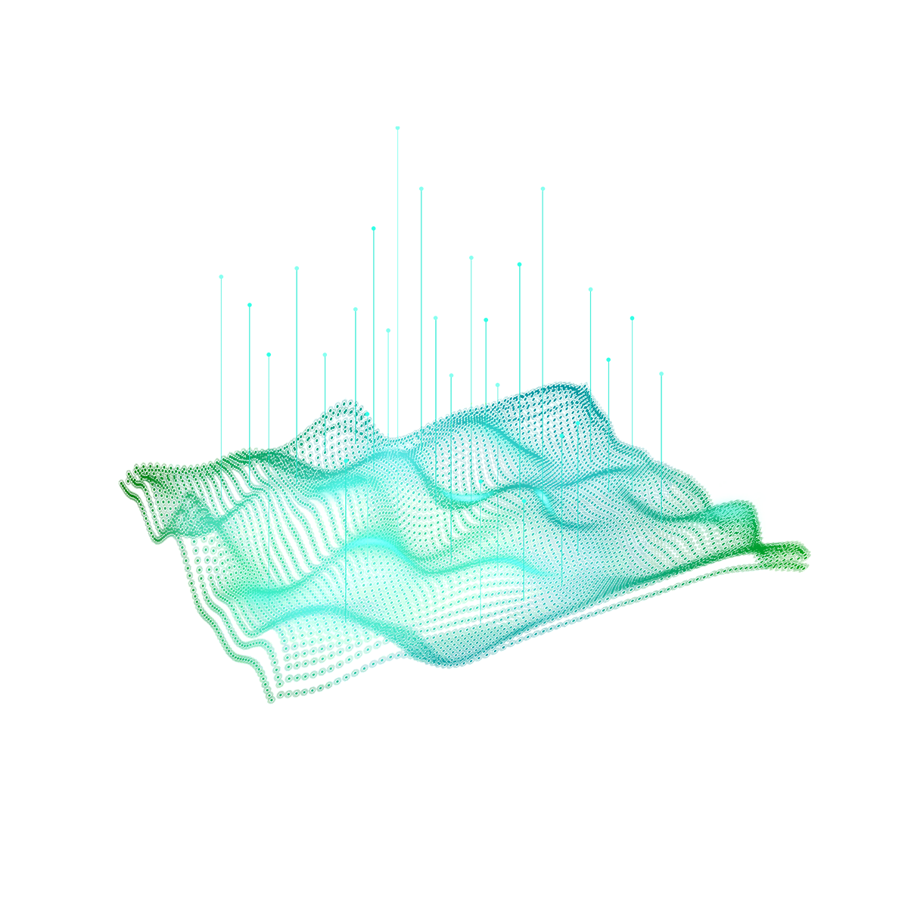

<!-- README.md is generated from README.Rmd. Please edit that file - rmarkdown::render('README.Rmd', output_format = 'github_document', output_file = 'README.md') -->

# REST Scraping API for Real Estate data, a Spatial Bayesian modeling perspective with INLA

*author*: [**Niccolò Salvini**](https://niccolosalvini.netlify.app/)
*date*: 14 June, 2021

 

   

Spatial Data Analysis

### Abstract:

The following work has the aim to build a robust Scraping API service to
extract Real Estate rental data (Milan, IT) and applying *geostatistics*
spatial modeling through a convenient computing alternative called INLA.
Data originates from immobiliare.it database and it is extracted through
a *scraper* built on top of the website. The scraper is *optimized* with
respect to both the server side *kindly requesting* permission and
imposing *delayed-request rates*, and the client side by granting
continuity through *fail dealers* and request’s *headers rotation*.
Scraping functions exploit a custom workflow that combines url reverse
engineering and optimal search strategies within the website. Speed
comes from the fact that differently from spiders and derivatives which
operate a full crawling down of the web site, the workflow concentrates
only on a restricted set of urls. A further critical speed boost is
offered by parallelism through the latest *Future* back-end, and a run
time benchmark demonstrates the scraper rapidity for two recent parallel
with two configurations. The scraper is then wrapped into a http API
through an R framework, namely *Plumber*. Security is a major focus and
anti dossing strategies, HTTPS and sanitization are singularly treated.
Docker can offer a lightweight environment where dependencies are
conveniently organized making the software portable. As a result the
whole API service is *containerized* and built upon custom Dockerfiles,
which are orchestrated by *Compose* through a .yml file. Amazon EC2 is
an AWS web service providing a stable, scalable cloud computing
capability in which the system is hosted. The service choice is a free
tier one. Along with the server it comes the need of a reverse proxy
service and the choice falls on *NGINX* reverse proxy server for
authentication and load balancing. The architecture principles stacked
on top of the http API elevates it to being RESTful. RESTful APIs are a
mean of communication among internet services that allows to perform any
kind of action without having both parts to know how they are
implemented. In other words, if the client wants to interact with a web
service with the aim to retrieve information or perform a function, a
RESTful API land a hand by communicating the *desiderata* to that system
so it can understand and fulfill the request in a secured and structured
way. Software CI/CD is managed through automatic workflow that exploits
GitHub and DockerHub, which ultimately allows containers to be pulled
into the EC2. Once the RESTful API endpoint is invoked, data, in this
case Milan rental market within the municipality borders, is
asynchronously scraped and collected into a JSON format. Traditional
spatial bayesian methods have been generally slow in the context of
spatial big data since covariance matrices are dense and their
inversions scale to a cubic order. Therefore Integrated Nested Laplace
approximation (INLA) is applied constituting a faster computational
alternative on a special type of models called Latent Gaussian models
(LGM). *INLA* shorten computations through analytics approximations with
Laplace and numerical methods for space matrices with the aim to obtain
an approximated posterior distribution of the parameters. Hedonic Price
Models (HPM) constitutes the economic theoretical foundation of the
model according to which the linear predictor is set. As a matter of
fact house prices are related to the value of the property by their
demand-offer price equilibra for each single characteristic (including
the spatial ones). A further aspects addresses the fact that prices are
considered as a proxy value for rents since they are both
interchangeable economic actions satisfying the same need. However the
critical part of studying house characteristics in geostatistics is the
*estimation* for the reason already anticipates. LGMs are defined into a
hierarchical bayesian modeling framework, distinguishing three nested
hierarchy levels: the likelihood of the data (generally an exponential
family), the latent Gaussian Markov Random Field GRMF (where the linear
predictor is) and the hyper parameter distribution for which priors are
specified. GMRF are suitable since they provide a sparse precision
matrix due to conditional assumption, marking matrices tridiagonal. The
spatial component of the data is considered as a discrete realization of
an underlying unobserved and continuous Gaussian Process (GP) to be
estimated, completely characterized by a mean structure and a covariance
matrix. For the Gaussian Process are made two major assumptions:
stationarity and isotropy, which let specifying a flexible covariance
function i.e. Matérn. The Stochastic Partial Differential Equations
(SPDE) solutions can provide a GMRF representation of the GP whose
covariance matrix is Matérn. This happens through a triangulation of the
domain of the study, i.e. mesh. The model is then fitted and cross
validated with R-INLA and inference on parameter posterior distribution
is given.

### Deployment:

The deployment of the project is made through Netlify + GitHub + GitHub
actions (CI environement).

### License:

