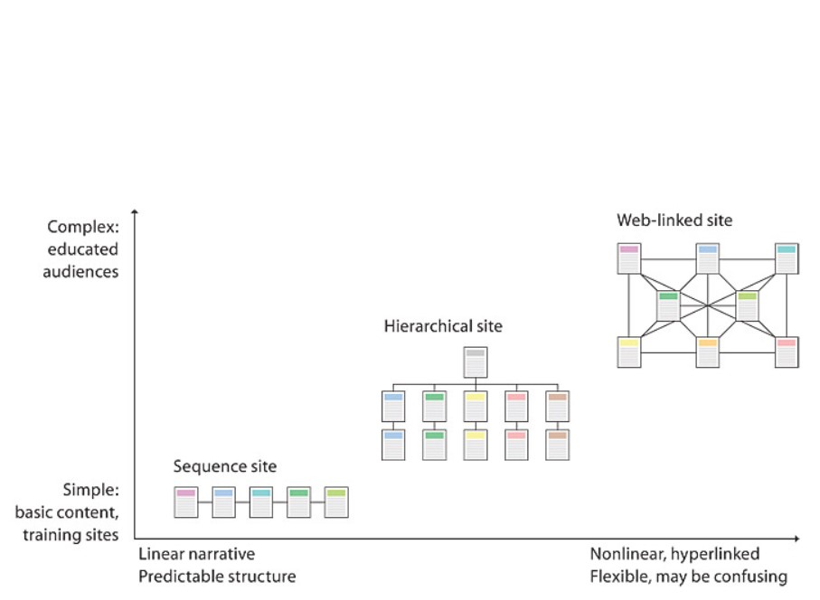
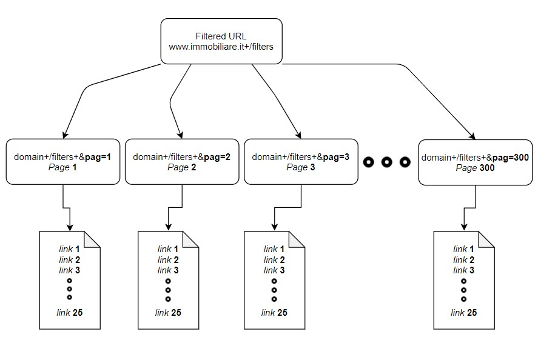
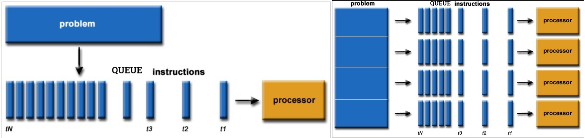
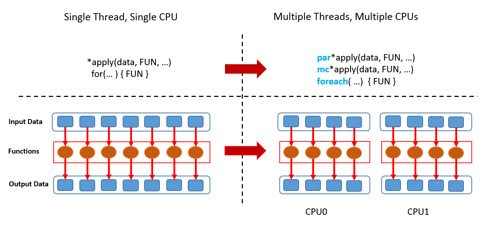
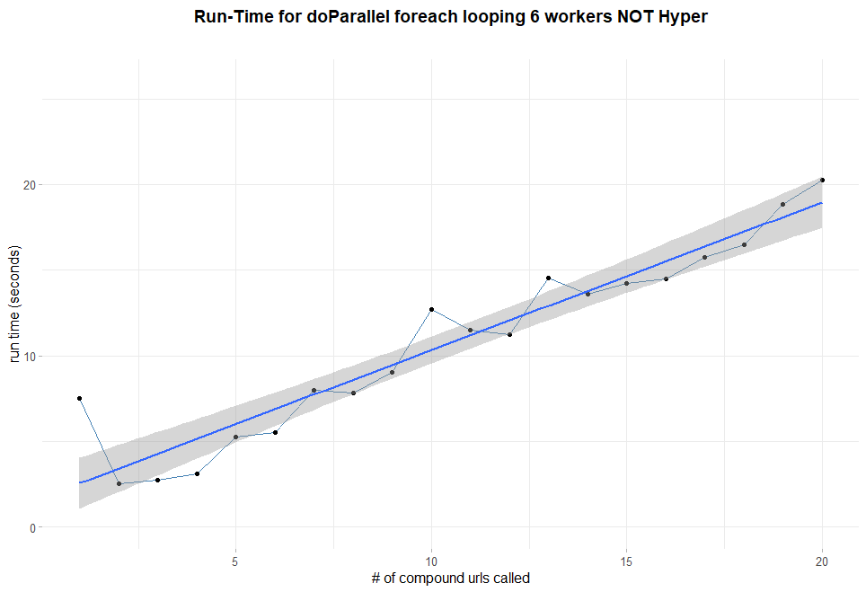

# Scraping {#scraping}

<!--  You can label chapter and section titles using `{#label}` after them, e.g., we can reference Chapter \@ref(intro). If you do not manually label them, there will be automatic labels anyway, e.g., Chapter \@ref(Scraping). Figure cross referencing follows this syntax: \@ref(fig:plot) when matched in the markdown figure insertion syntax  -->


The following chapter covers advanced topics on web scraping and related hard challenges with a focus on the immobiliare.it case. A new scraping workflow concept is proposed that integrates the crawling part inside the proper scraping and removes frictions related to inner complexities. The workflow offers a faster solution with respect to traditional library oriented scraping methods. The solution proposed takes advantage of the url clean structure and proposes an "inverse crawling" methodology. At first url sematic is reverse engineered so that the sitemap is explicit and url can be freely compose. Secondly links are crawled and collected in a list according to the url composed. By doing that each link can be directly targeted by scraping functions, with that said the focus can shift to the proper scraping part. An example of scraping function with `rvest` @rvest is presented outlining the strategy adopted to look for the exact content within immobiliare.it HTML/CSS. The search strategy skeleton of the function is then reproduced for all the data that shares the same CSS query location.
Scraping common best practices are applied from the web server point of view, this is taken care by kindly asking for permission and sending delayed requests rate. As well as from the the web client point of view by securing continuous scraping through server blocks, User Agent pool rotation and fail dealer to bypass empty content. Then a run time scraping benchmark is presented for two different parallel back end options `future` @future and `doParallel` @doParallel, together with two parallel looping constructions, `furrr` @furrr and `foreach` @foreach. Both of the two have displayed similar results, nevertheless the former offers has a more {Tidiverse} orientation and offers a wider range of integrations. Furthermore an overview of still open challenges is given with the hope that the effort put might be extended or integrated with newer technologies and paradigms. In the end legal profiles are addressed comparing results and implications with a market counterpart study.

## Web Scraping 

\BeginKnitrBlock{definition}\iffalse{-91-83-99-114-97-112-105-110-103-93-}\fi{}<div class="definition"><span class="definition" id="def:scraping"><strong>(\#def:scraping)  \iffalse (Scraping) \fi{} </strong></span>Web Scraping is a technique aimed at extracting unstrctured data from static or dynamic internet web pages and collecting it a structured way. It can be applied simultaneously or automatically by a scheduler that plans the execution at a given time.</div>\EndKnitrBlock{definition}
Web scraping is a form of data mining. The basic and most important goal of the web scraping process is to mine information from different and unstructured websites and transform it into an comprehensible structure like spreadsheets. Web scraping can be performed with different degrees of precision in several ways via several tools. Popular options are APIs, proprietary softwares, browser integrations and open source libraries. Challenges in scraping mainly regards _security_, _run-time_ and _exception handling_. 
Scraping can be mainly decomposed into 2 separable and collectively exhaustive tasks: _crawling_ and _proper scraping_ which they ultimately outline a forced sequential process. The forced aspects regards essentially the way websites are made and the language used for content creation and organization i.e. HTML. HTML stands for Hyper Text Markup Language and is the standard _markup_ language for documents designed to be showed into a web browser. It can be supported by technologies such as Cascading Style Sheets (CSS) and other scripting languages, as an example JavaScript [@html_2020].
CSS language stands for Cascading Style Sheets and is a style sheet language used for modifying the appearance of a document written in a _markup_ language[@css_2020]. The combination of HTML and CSS offers a wide flexibility in building web sites, once again expressed by the vast amount of different websites on the web.
Some examples of websites might be social-networks where posts are scrolled down within a single url named "wall". The scrolling option might end due to the end of the feed, but the experience is a never-ending web page associated to a single url. Indeed personal profiles have dedicated unique url and personal photos or friends are allocated into specific personal profile sub-domains. Connection among webpages are complex networks that happens at many levels, photos, friends, places.
As a different example online newspapers display their articles in the front page of their websites. and By accessing to one of them all the pertinent articles sometimes can be reached in the low bottom or in the side part of the webpage. Suggested articles during website exploration can be seen twice, that is the more the website is covered the more is the likelihood of seeing the same article twice. Recursive website structures are popular in newspaper-kind websites since it is part of the expectation on website's user experience.
Online Retailers as Amazon, based on search filters, groups inside a single web page (i.e. page n° 1) a fixed set of items, having their dedicated single urls attached to them. Furthermore many of the retailers, Amazon's too, allows the user to search into many pages i.e. page n° 2,3, looking for another fixed set of items. The experience ends when the last page associated to the last url is met.
These are few examples of how websites can be built and infinitely many others are available ranging from the easiest to the most complex, as in figure \@ref(fig:html_tree). 
Generally speaking website structures try to reflect both the user expectations on the product and the creative design expression of the web developer. This is also constrained to the programming languages chosen and the specific requirements that the website should met. For all the reason said, for each product, whether it is physical product, or service, or information there exists a multitude of website structure. For each website structure there exists multiple content architecture. For each content architecture there exists many front end languages which are ultimately designated to satisfy multiple end users. In the future chances are that websites might display tailor made customization of contents and design based on specific personal preferences. As a further addition web design in scraping plays an important role since the more are implied sophisticated graphical technologies, the harder will be scraping information. 

## Graph Representation of HTML
Graph based data structures named as **Rooted Trees**. By analyzing the first dimension through the lenses of Rooted trees it is possible to compress the whole setting into tree graph jargon, as a further reference on notation and wordings can be found in @Graph_Diestel. Rooted trees must start with a root node which in this context is the domain of the web page. Each _Node_ is a url destination and _Edges_ are the connections to web pages. Jumps from one page to the others (i.e. connections) are possible in the website by nesting urls inside webpages so that within a single webpage the user can access to a limited number of other links. Each edge is associated to a _Weight_ whose interpretation is the run time cost to walk from one node to its connected others (i.e. from a url to the other). In addition the content inside each node takes the name of payload, which is ultimately the goal of the scraping processes. 
The walk from node "body" to node "h2" in figure below is called path and it represented as an ordered list of nodes connected by edges. In this context each node can have both a fixed and variable outgoing sub-nodes that are called _Children_ . When root trees have a fixed set of children are called _k-ary_ rooted trees. A node is said to be _Parent_ to other nodes when it is connected to them by outgoing edges, in the figure below "headre" is the parent of nodes "h1" and "p". Nodes in the tree that shares the same parent node are said _Siblings_, "h1" and "p" are siblings in figure \@ref(fig:html_tree). Moreover _Subtrees_ are a set of nodes and edges comprised of a parent and its descendants e.g. node "main" with all of its descendants might constitute a subtree. The concept of subtree in both of the problem dimensions plays crucial role in cutting run time scraping processes as well as fake headers provision (see section \@ref(spoofing)). If the website strucuture is locally reproducible and the content architecture within webpages tends to be equal, then functions for a single subtree might be extended to the rest of others siblings subtrees. Local reproducibility is a property according to which starting from a single url all the related urls can be inferred from a pattern. Equal content architecture throughout different single links means to have a standard shared-within-webpages criteria according to which each single rental advertisement has to refer (e.g. each new advertisement replicates the structure of the existing ones). In addition two more metrics describe the tree: _level_ and _height_. The level of a node $\mathbf{L}$ counts the number of edges on the path from the root node to $\mathbf{L}$ , e.g. "head" and "body", are at the same level. The height is the maximum level for any node in the tree, from now on $\mathbf{H}$, in figure \@ref(fig:html_tree). What is worth to be anticipating is that functions are not going to be applied directly to siblings in the "upper" general rooted tree (i.e. from the domain). Instead the approach follwed is segmenting the highest tree into a sequence of single children unit that shares the same level ("nav", "main", "header", "title" and "footer") for reasons explained in section \@ref(spoofing).


Some websites' components also might be tuned by a scripting language as Javascript. JavaScript enables interactive web pages and the vast majority of websites use it for all the operations that are performed by the client in a client-server relationship [@Javascript_2020].
In the context of scraping Javascript adds a further layer of difficulty. As a matter of fact Javascript components are dynamic and scraping requires specialized libraries or remote web browser automation ([@RSelenium] R Bindings for Selenium 2.0 Remote WebDriver) to catch the website content.

## Crawling 

- general idea, definition (with latex def. component)
- urllib 
- clean url 
- representation of crawling
-


## Proper Scraping 




A _second dimension_ of hierarchy is brought by content architecture by means of the language used for content creation and organization i.e. HTML. HTML stands for Hyper Text Markup Language and is the standard _markup_ language for documents designed to be showed into a web browser. It can be supported by technologies such as Cascading Style Sheets (CSS) and other scripting languages, as an example JavaScript [@html_2020].
HTML inner language properties brings along the hierarchy that is then inherited from the website structure. According to this point of view the hierarchical website structure is a consequence of the language chosen for building content architecture.
Since a hierarchy structure is present a direction must be chosen, this direction is from root to leaves i.e. _arborescence_.
CSS language stands for Cascading Style Sheets and is a style sheet language used for modifying the appearance of a document written in a _markup_ language[@css_2020].
The combination of HTML and CSS offers a wide flexibility in building web sites, once again expressed by the vast amount of different websites designs on the web. Some websites' components also might be tuned by a scripting language as Javascript. JavaScript enables interactive web pages and the vast majority of websites use it for all the operations that are performed by the client in a client-server relationship [@Javascript_2020].
In the context of scraping Javascript adds a further layer of difficulty. As a matter of fact Javascript components are dynamic and scraping requires specialized libraries or remote web browser automation ([@RSelenium] R Bindings for Selenium 2.0 Remote WebDriver) to catch the website content.
CSS instead allows the scraper to target a class of objects in the web page that shares same style (e.g. same CSS query) so that each element that belongs to the class (i.e. share the same style) can be gathered. This practice provides tremendous advantages since by a single CSS query a precise set of objects can be obtained within a unique function call. 
First and Second dimension of the scraping problem imply hierarchy. One way to imagine hierarchy in both of the two dimensions are 


###  Immobiliare.it website structure{#webstructure}

The website structure of immobiliare can be assumed to be similar to the one of the largest online retailer Amazon. For that reason they both fall into the same website structure category. Sharing the same category might imply that the transition from customized website structure scraping functions (i.e. immobiliare) do not take extraordinary sophistication to be extended to other comparable websites (i.e. Amazon). Assuming that the scraper knows where data is stored (i.e. payloads), the mandatory step is a way to compose and decompose url anatomy. As a matter of fact each time the scraper script visits the website it should not step back from domain root node and then down the longest path reaching the final content node. Instead it should try to shorten the path by minimizing the number of nodes encountered, conditioned to the respective nodes' weights. This is a first important conclusion since by separating the website strcuture from the content architecture scraping is massively faster and should not no more rely on the website forced root-to-node paths.
immobiliare.it is a [clean url](https://en.wikipedia.org/wiki/Clean_URL) _miss lit_ and it can be easily parsed and queried according to some parameters (i.e. filters) selected in their dedicated section (e.g. city, number of rooms 5, square footage less than 60 $m^2$, macrozone "fiera" and "centro"). The url is shaped so that each further parameters and its respcetive values are appended at the end of the domain url `https://www.immobiliare.it/`. Parameters and values are appended with a proper semantic, not all the sematics are equal, that is why scraping needs sophostication when applied to other websites. One major adavatge in this context is immobilaire being a [clean url](https://en.wikipedia.org/wiki/Clean_URL), whose sematic is oriented to usability and accessibility.
Once parameters are applied to the root domain this constitutes a newer rooted tree whose url root node is the parametrized.It might have this appearance (params are  city of Milan, square footage is less than 60 $m^2$: domain + filters i.e. `affitto-case/milano/?superficieMinima=60`. Since for the moment are generated only links related to page n°1 containing the first 25 advs links (see figure \@ref(fig:websitetree)) all the remaining siblings nodes corresponding to the subsequent pages have to be initialized. In here resides the utility of Local reproducibility property introduced in the previous section. The remaining siblings, e.g. the ones belonging to page 2 (with the attached 25 links), to page 3 etc. can be generated by adding a further parameter `&pag=n`, where n is the page number reference (from now on referred as _pagination_). Author customary choice is to stop pagination up to 300 pages since spatial data can not be to too large due to computational requirements imposed by inla methodology \@ref(inla). The code chunk below has the aim to mimic the url syntax filters building, s given a set of information it can reproduce any related sibling. detaching website structure from content architecture.


```r
if (!missing("macrozone")) {
    macrozone = tolower(macrozone) %>% iconv(to = "ASCII//TRANSLIT") %>% str_trim()
    idzone = list()
    zone = fromJSON(here::here("ALLzone.json"))
    for (i in seq_along(macrozone)) {
        zone$name = zone$name %>% tolower()
        if (grepl(macrozone[i], zone)[2]) {
            pos = grepl(macrozone[i], zone$name, ignore.case = T)
            idzone[i] = zone[pos, ] %>% select(id)
        } else {
            stop(paste0("zone:", macrozone[i], " is not recognized"))
        }
    }
    idzone = idzone %>% unlist() %>% unique()
    mzones = glue::glue_collapse(x = idzone, "&idMZona[]=")
    
    dom = "https://www.immobiliare.it/"
    stringa = paste0(dom, tipo, "-case/", citta, "/?", mzones)
    npages_vec = str_c(stringa, "&pag=", 2:npages) %>% append(stringa, after = 0)
    
} else {
    dom = "https://www.immobiliare.it/"
    stringa = paste0(dom, tipo, "-case/", citta, "/")  # mzones
    npages_vec = glue("{stringa}?pag={2:npages}") %>% append(stringa, after = 0)
    
}
```


Up to this point pagination has generated a vector of siblings nodes whose children elements number is fixed (i.e. 25 links per page \@ref(fig:websitetree) lower part). That makes those trees _k-ary_, where k is 25 indicating the number of children leaves. K-ary trees are rooted trees in which each node has no more than k children, in this particular case final leaves. The well known binary rooted tree is actually a special case of k-ary when $k = 2$. parameters reverse engineering process and 25-ary trees with equal content structure across siblings allow to design a single function to call that could be mapped for all the other siblings. In addition in order to further unroll the website a specific scraping function grabs the whole set of 25 links per page. As a result a single function call of `scrape_href()` can grab the links corresponding to page 1. Then the function is mapped for all the generated siblings nodes (i.e. up to  300) obtaining a collection of all links belonging to the set of pages. Ultimately the complete set of links corresponds to every single advertisement posted on immobiliare.it at a given time. 





### Immobiliare.it content architecture with `rvest`{#ContentArchitecture}

To start a general scraping function the only requirements are a target url (i.e. the filtered root node url) and a way to compose url (i.e. pagination ). Then a session class object  `html_session` is opened by specifying the url and the request data that the user needs to send to the web server, see left part to dashed line in figure \@ref(fig:workflow). Information to be attached to the web server request will be further explored later, tough they are mainly three: User Agents, emails references and proxy servers. `html_session` class objects contains a list number of useful data such as: the url, the response, cookies, session times etc. Once the connection is established (response request 200) all the following operations rely on the opened session, in other words for the time being in the session the user will be authorized with the already provided request data. The list object contains the xml/html content response of the webpage and that is where data needs to be parsed and class converted. The list can disclose as well other interesting meta information related to the session but in this context are not collected. The light blue wavy line follows the steps required to get the content parsed from the beginning to the end.


To the right of dashed line in the flow chart \@ref(fig:workflow) are painted a sequence of `rvest`[@rvest] functions that follow a general step by step text comprehension rules. `rvest` first handles parsing the html respose content of the web page within the session through `read_html()`. Secondly, as in figure \@ref(fig:ContentStructure), it looks for a single node `html_nodes()` through a specified CSS query. CSS is a way to route `rvest` to consider a precise node or set of nodes in the web page. For each information contained in each of the web page a different CSS query has to be called.
Thirdly it converts the content (i.e. payload) into a human readable text with `html_text()`. A simplified version of the important contents to be scraped in each single link is sketched in figure \@ref(fig:ContentStructure)


The code chunk below exemplifies a function that can scrape the price. The function explicitly covers only the right part to the dashed line (figure \@ref(fig:workflow)) of the whole scraping process. The initial part (left dashed in same figure), where session is opened and response is converted is handles inside the second code chunk where `get.data.catsing()` is.

## Proper Scarping

Given the structure of the webpage it is imposed a nest sequential search strategy gravitating around 2 main criteria: shortest paths and obligation of results. The algorithm starts considering a single session object argument, then It reads the inner HTML content in the session storing the information into a reusable check up obj `opensess`. Immediately after another object `price` is created and a CSS query is called on direct on a HTML nodes set. The CSS location `.im-mainFeatures__title` points to a precise group of data right below the main title. Expectation is that price is a single element character vector, containing price and other unnecessary non-UTF characters. Then the algorithm bumps into the first `if` statement. The logical conditions checks whether the object `price` first search went lost. If it does not the algorithm jumps directly to the end of the function and returns a preprocessed quantity. As opposite If it does it considers again the reusable `opensess` and hits with a second css query `.im-features__value , .im-features__title`, pointing to second data location. Note that the whole search is done within the same session (i.e. reusing the same session object), so no more additional request information has to be sent). Since the second CSS query points to data stored in sequeence in a list object, the newly initialized `price2` is a list containing various information. Then the algorithm flows into a second `if` statement that checks whether `"prezzo"` is matched in the list, if it does the algorithm returns the +1 position index element with respect to the "prezzo" position. This happens because data in the list is stored by couples sequentially, e.g. [title, "Appartamento Sempione", energy class, "G", "prezzo", 1200/al mese]. Then in the end a third CSS query is called and a further nested if statement checks the emptiness of the latest CSS query. `price3` points to a hidden JSON object within the HTML content. If even the last search is lost then the algorithm escapes in the else statement by setting `NA_Character_` resulting in no CSS query is able to find data. the _NA_Character_ string type has to be imposed due to row bind contraints in tibbles.
The search skeleton used for price scraping constitutes a standard reusable search method in the analysis for all the scraping functions. However for some of the information not all the CSS location points are available and the algorithm is forced to be executing only certain paths, e.g. price can be found under main title, indeed condizioatore is not.


Once all the functions have been designed they need to be grouped and called together. This is done by `fastscrape()` Which at first checks the validity of the url, then takes the same url as input and filters it as a session object. Then simultaneously all the functions are called and then combined. All this happens inside a `foreach` parallel loop called by `scrape.all.info()` 


```r
## [ fastscrape ] ----
## first endpoint function 
options(future.rng.onMisuse="ignore")
fastscrape = function(npages_vec){
            tic()
            plan(multisession, workers = availableCores())
            result = tibble(
                        title =  future_map(npages_vec, possibly( ~{
                                    sesh = html_session(.x, user_agent(agent = agents[sample(1)]))
                                    scrapetitle_imm(session = sesh)},NA_character_, quiet = FALSE))%>%  flatten_chr(),
                        
                        monthlyprice =  future_map(npages_vec, possibly(~{
                                    sesh = html_session(.x, user_agent(agent = agents[sample(1)]))
                                    scrapeprice_imm(session = sesh) },NA_character_, quiet = FALSE))%>%  flatten_chr(),
                        
                        nroom =  future_map(npages_vec, possibly( ~{
                                    sesh = html_session(.x, user_agent(agent = agents[sample(1)]))
                                    scraperooms_imm(session = sesh) },NA_character_, quiet = FALSE))%>%  flatten_chr(),
                        
                        sqmeter =  future_map(npages_vec, possibly( ~{
                                    sesh = html_session(.x, user_agent(agent = agents[sample(1)]))
                                    scrapespace_imm(session = sesh) },NA_character_, quiet = FALSE))%>%  flatten_chr(),
                        
                        href =  future_map(npages_vec, possibly( ~{
                                    sesh = html_session(.x, user_agent(agent = agents[sample(1)]))
                                    scrapehref_imm(session = sesh) },NA_character_, quiet = FALSE))%>%  flatten_chr()
                        
            )
            
            toc()
            return(result) 

}
```


## Scraping Best Practices and Security provisions{#best-practices}

Web scraping have to naturally interact multiple times with both the _client_ and _server side_ and as a result many precautions must be seriously taken into consideration. From the server side a scraper can forward as many requests as it could (in the form of sessions opened) which might cause a traffic bottleneck (DOS attack @wiki:DOS) impacting the overall server capacity. As a further side effect it can confuse the nature of traffic due to fake user agents \@ref(spoofing) and proxy servers, consequently analytics reports might be driven off track. 
Those are a small portion of the reasons why most of the servers have their dedicated Robots.txt files. Robots.txt @meissner_2020 are a way to kindly ask webbots, spiders, crawlers to access or not access certain parts of a webpage. The de facto "standard" never made it beyond a _informal_ “Network Working Group INTERNET DRAFT”. Nonetheless, the use of robots.txt files is widespread due to the vast number of web crawlers (e.g. [Wikipedia robot](https://en.wikipedia.org/robots.txt), [Google robot](https://www.google.com/robots.txt)). Bots from the own Google, Yahoo adhere to the rules defined in robots.txt files, although their _interpretation_ might differ.

Robots.txt files [@robotstxt] essentially are plain text and always found at the root of a website's domain.  The syntax of the files follows a field-name value scheme with optional preceding user-agent. Blocks are separated by blank lines and the omission of a user-agent field (which directly corresponds to the HTTP user-agent field) is seen as referring to all bots. Possible field names as pinpointed in [@google:robottxt] are: user-agent, disallow, allow, crawl-delay, sitemap and host. A standard set of shared interpretation is:

- Finding no robots.txt file at the server (e.g. HTTP status code 404) implies full permission.
- Sub-domains should have their own robots.txt file, if not it is assumed full permission.
- Redirects from subdomain www to the domain is considered no domain change - so whatever is found at the end of the redirect is considered to be the robots.txt file for the subdomain originally requested.

Further improvements in the R ecosystem in this direction is explored with the `polite` @polite package  which combines the effects of the `robotstxt`, the `ratelimitr` @ratelimitr to limit sequential session requests together with the `memoise` @memoise for robotstxt response caching. Even though the solution meets both of the two stakeholders requirements (server and client) ratelimitr is not designed to work in parallel -@ratelimitr , so it is not implied in the final outcome. However the 3 simple and effective ideas wrapped up in the package describes what a "polite" session should be and finally are kept fixed during the scraping:

> The three pillars of a polite session are seeking permission, taking slowly and never asking twice.

The three pillars constitute the _Ethical_ web scraping manifesto [@densmore_2019] which are common shared practices that are aimed to self regularize scrapers. These have to be intended as best practices, not, in any case, as law enforcements. However many scrapers themselves, as website administrators or analyst, have fought in their daily working tasks with bots and product derivatives. Intensive Crawling might fake out real client navigation log messages and digital footprint and as a consequence might induce distorted analytics.
with that said a custom function that permanetly checks the validity of the session request is called once prior any scraping function execution cached into a variable. In the result below the function returning a boolean is applied to the root domain of immobiliare.it as a proof of permission.


```r
dom = "immobiliare.it"
polite_permission = memoise::memoise(paths_allowed(domain = dom))
polite_permission
```

```
## Memoised Function:
## [1] TRUE
```

Furthermore a custom function based on robotxtst cached results at first highlights the delay stated in the file, in this context no delays are stated. As a default author choice is to set it equal to 5. Then It manages delayed requests rate through the `purrr` stack. At first a `rate` object is created and then a `rate_sleep` delay is then inserted within the function as in @rate_delay. 


```
## [1] "immobiliare.it"
```


```r
get_delay = function(memoised_robot, domain) {
    
    message(glue("Refreshing robots.txt data for %s... {domain}"))
    temp = memoised_robot$crawl_delay
    
    if (length(temp) > 0 && !is.na(temp[1, ]$value)) {
        star = dplyr::filter(temp, useragent == "*")
        if (nrow(star) == 0) 
            star = temp[1, ]
        as.numeric(star$value[1])
    } else {
        5L
    }
    
}
get_delay(rbtxt_memoised, domain = dom)
```

```
## [1] 5
```


## Web Client Security provisions: User Agents, Proxies and Fail Dealers  

HTTP headers are sent via HTTP protocol transactions and allow the client and the server to pass additional information with the request or the response. Some of most important request header fields are User agent, url as well as e-mails addresses. From a very general point of view the process according to which HTTP protocols allow to exchange information can be easily figured out with an everyday real life world analogy. As a generic person A rings to the door's bell of person B. Then A is coming to B door with its personal information, i.e. name, surname, where he lives etc. Since now B may either positively answer to A requests by opening the door given the set of information he has, or it may not since B is not sure of the real intentions of A. The situation can be transposed on the internet where the user browser (in the example above A) is interacting with a website server (part B) sending packets of information, figure \@ref(fig:webworks). If a server does not trust the information provided by the user, if the requests are too many, if the requests seems to be scheduled due to fixed sleeping time, a server can block requests. In certain cases it can even forbid the user to open a session to the website. The communication is encoded with numbers ranging from 100 to 511, each of which has its own specific significance. A popular case of interaction occurs when users are not connected to internet so the server responds 404, page not found. Servers are built with a immune-system like software that raises barriers and block users to prevent dossing or other illegal practices.


### HTTP User Agent Spoofing{#spoofing}

\BeginKnitrBlock{definition}\iffalse{-91-85-115-101-114-32-65-103-101-110-116-115-93-}\fi{}<div class="definition"><span class="definition" id="def:useragents"><strong>(\#def:useragents)  \iffalse (User Agents) \fi{} </strong></span>The user agent (from now refered as UA) "retrieves, renders and facilitates end-user interaction with Web content" @UaDef.</div>\EndKnitrBlock{definition}

In HTTP, the UA string is often considered as _content negotiator_ [@wiki:UserAgent], where the requested server selects the most appropriate content based on operating parameters for the response. On the basis of the User agent, the web server can load different CSS based on the outcome, deliver custom JavaScript, automatically send the correct translation due to UA language preferences [@whoishostingthis.com].
The UA string is also one of the main responsible according to which Web crawlers and scrapers through robotstxt as in \@ref(best-practices) may be ousted from accessing certain parts of a website. 
In the context of the web server to be able to identify critical information as the user operating system and the browser. One of the aim of User agnets are to keep track information and optimize rendering. Then, the web server uses the exchanged information to determine what content should be presented to particular operating systems and web browsers on a series of devices. However this common standard is recently sentenced to be superseded in favor of a newer (2020) Google technology called _Hints_ @wiki:UserAgentHints.
The user agent string includes the user application or software, the operating system (and their versions), the web client, the web client’s version, as well as the web engine responsible for the content display (such as AppleWebKit). The user agent string is sent in the form of a HTTP request header. Since User Agents acts as middle man between the client request and the server response, then from a continuous scraping point of view it would be better rotating them, so that each time the middle man looks different. The solution adopted builds a vector of user agent strings identified by different specifications, different web client, different operating system and so on, then samples 1 of them 
Then whenever a request from a web browser is sent to a web server, 1 random sample string is drawn from the user agents pool. So each time the user is sending the request it appears to be a different User Agent.
Below the user agents rotation pool:


```r
set.seed(27)
url = "https://user-agents.net/"
agents = read_html(url) %>% html_nodes(css = ".agents_list li") %>% html_text()

agents[sample(1)]
```

```
## [1] "Mozilla/5.0 (Linux; Android 10; SM-G988B Build/QP1A.190711.020; wv) AppleWebKit/537.36 (KHTML, like Gecko) Version/4.0 Chrome/86.0.4240.198 Mobile Safari/537.36 [FB_IAB/FB4A;FBAV/298.0.0.46.116;]"
```

A more secure approach might be a further rotation of proxies between the back and forth sending-receving process. A proxy server acts as a gateway between the web user and the web server.
While the user is exploiting a proxy server, internet traffic flows through the proxy server on its way to the server requested. The request then comes back through that same proxy server and then the proxy server forwards the data received from the website back to the client. The final result will be linear combination of User Agents ID and Proxy server for each sending requests, grating a high security level.
Many proxy servers are offered in a paid version, so in this case since security barriers are not that high they  will not be implemented. As a further disclaimer many online services are providing free proxies server access, but this comes at a personal security cost due to a couple of reasons:

- Free plan Proxies are shared among a number of different clients, so as long as someone has used them in the past for illegal purposes the client is indirectly inheriting their legal infringements.
- Very cheap proxies, for sure all of the ones free, have the activity redirected on their servers monitored, profiling in some cases a user privacy violation issue.

### Dealing with failure in Parallel

During scraping many difficulties are met. Some of them might come from website structure issues, so that rooted-tree hierarchies are changed as a consequence of a restructuring, better outlined in section \@ref(challenges). Some others might interest content architecture where data is reallocated to some other places in the webpage, as a consequence CSS query are no more able to grab the content. Handlers are explicitly built in this sense. The continuous building and testing of the scraping functioning has required the maintainer to have a precise and fast debugging experience. The following consideration might give a sense of the time consumed when handlers are not implied. API endpoints evokes 34 different scrapping functions that are supposed to point to 34 different data pieces. Within a single function call by default pagination generates 10 pages each of which contains at least 25 different single links to be scrapped. That leads to a number of 8500 single data information. The probability given 8500 associated to something going lost or unparsed is undoubtedly high.
The solution proposed tries to deal with failure through implementing `purrr` adverb `possibly()`, which takes a function (a verb) and returns a modified version. In this case, the modified function will never throw an error. The approach is encouraged when functions need to be mapped over larger objects and when run time are long as pointed out in section 21.6 of @Rdatascience.


```r
title = future_map(npages_vec, possibly(~{
    sesh = html_session(.x, user_agent(agent = agents[sample(1)]))
    scrapetitle_imm(session = sesh)
}, NA_character_, quiet = FALSE)) %>% flatten_chr()
```


Then also inside each single scrapping function are bundled "authorization" handlers that protect the web server side from unpolite scraping practises. This set up allows to catch (and in some cases prevent) web sites poloicy misuses from the very beginning of the scraping process. 
Below some of the main authorization handlers implied:

- `get_ua()` verifies that the User Agent in the session is not the default one.


```r
get_ua = function(sess) {
    stopifnot(is.session(sess))
    stopifnot(is_url(sess$url))
    ua = sess$response$request$options$useragent
    return(ua)
}
```


- `is_url()` verifies that the url input needed has the canonic form. This is done by a REGEX query.


```r
is_url = function(url) {
    re = "^(?:(?:http(?:s)?|ftp)://)(?:\\S+(?::(?:\\S)*)?@)?(?:(?:[a-z0-9¡-<ef><U+00BF><U+00BF>](?:-)*)*(?:[a-z0-9¡-<ef><U+00BF><U+00BF>])+)(?:\\.(?:[a-z0-9¡-<ef><U+00BF><U+00BF>](?:-)*)*(?:[a-z0-9¡-<ef><U+00BF><U+00BF>])+)*(?:\\.(?:[a-z0-9¡-<ef><U+00BF><U+00BF>]){2,})(?::(?:\\d){2,5})?(?:/(?:\\S)*)?$"
    grepl(re, url)
}
```


- `get_delay()` checks through the robotxt file if a delay between each request is kindly welcomed. When response is NA delay is not required.


```r
dominio = "immobiliare.it"
get_delay = function(domain) {
  
  message(sprintf("Refreshing robots.txt data for %s...", domain))
  
  cd_tmp = robotstxt::robotstxt(domain)$crawl_delay
  
  if (length(cd_tmp) > 0) {
    star = dplyr::filter(cd_tmp, useragent=="*")
    if (nrow(star) == 0) star = cd_tmp[1,]
    as.numeric(star$value[1])
  } else {
    10L
  }
  
}

get_delay =  memoise::memoise(get_delay) ## so that .get_delay results are cached
get_delay(domain = dominio)
```

```
## [1] NA
```


- `checkpermission()` assess whether the domain or the related paths require specific actions or they prevent some activity on the target.


```r
checkpermission = function(dom) {
    
    robot = robotstxt(domain = dom)
    vd = robot$check()[1]
    if (vd) {
        cat("\nrobot.txt for", dom, "is okay with scraping!")
    } else {
        cat("\nrobot.txt does not like what you're doing")
        stop()
    }
}

checkpermission(dom = dominio)
```

```
## 
## robot.txt for immobiliare.it is okay with scraping!
```

## Implicit Parallel Scraping

Scraping run time is crucial when dealing with elastic markets and proactive web pages. This is also true in rental real estate where time to market is a major competitive advantage and monthly prices elasticity with respect to the time is high.
Since the dimension of the run time problem requires as many session requests opened as single links crawled (refer to section \@ref(ContentArchitecture)). And since for each of the links are supposed to be called at least 34 different functions, refer to section \@ref(ContentArchitecture), then computation must be _parallelized_.
The extraordinary amount of time taken in a non-parallel environment is caused by R executing tasks on a single processor sequentially link-by-link in a queue (i.e. single threaded computing). In order to overcome this inefficiency explicit parallel (sometimes improperly called [asynchronous](https://medium.com/@cummingsi1993/the-difference-between-asynchronous-and-parallel-6400729fa897)) scraping functions are proposed, so that computation do not employ vast cpu time (i.e. cpu-bound) and space. Modern processor architectures provide multiple cores on a single processor and a way to redistribute computation. As a result many tasks can be split over processors and then multiple cores for each processor. 



The explicit/implicit property regards where parallel execution should happen in the code, allowing the developer to be flexible enough to decide which piece of code needs parallelization and which does not.
Parallel back ends initialization depends both on the parallel library and the looping constructor even though tangible efforts have been recently put into interoperability through `doFuture` @doFuture. 
As a general rule of thumb it must be specified the computing group and the parallel execution strategy. The _computing group_ is a software concept as in [@parallelr], that points out the number of R processes and their relative computing power/memory allocation according to which the task is going to be split. From a strictly theoretic perspective the working groups can be greater than the number of cores detected. Although for inner libraries functioning are initialized as many workers as physical cores (default option for most of the back ends).
This is also due to latent default load balancing strategies that are able to equally redistribute tasks over workers according to memory space allocation and dependencies. General settings 

In the R ecosystem parallel libraries are a few and are mostly designed on looping constructions. The two choices are _doParalle_ along with the foreach loop constructor and _Future_ with furrr (purrr and future). The latter is a generic, low-level API for parallel processing as in @bengtsson_2017. Future 

A variety of backends exist and third-party contributions meeting the specifications, which ensure that the same code works on all backends, If I were re-writing my code now, I'd probably also use futures and purrr. The former adds some niceties to doparallel and foreach if you choose to use that syntax, like automatically exporting packages. And it's backend-agnostic, 

Multisession futures are a special case of cluster futures. 

Two are the most important features of future back end: Tidy format together with the furrr (purrr looping contruction) package which enables tidy evaluation and the related convenient tidy sintx properties and packages. The other regars the   
The most flexible and strong Parallel libraries are Parallel, doParallel, doMC and Future, which offer different sintax but same construction. They all come with a specific looping constructor which is optmized with respect to


For a quick but comprehensive perspective on Parallel theory both on hardware and software side @barney is strongly suggested. For a full reference focused on the R parallel ecosystem, run time simulations and advanced algorithm back end design strategies the authorities are [@parallelr]. If the interest is to cut short theory and directly put R into parallel then a valuable resource is this [blog](https://nceas.github.io/oss-lessons/parallel-computing-in-r/parallel-computing-in-r.html), which inter alia covers the main debugging.

doParallela among the other offers also 
`detectCores()` uncovers how many _Hyper-Threading_ cores are at the disposition, since they do not provide any computational advantage the option _logical_ is set false. Below the number of cores available on the following machine:





The following run time simulations are performed on custom group of functions which is a lightweight version of the final API endpoint. Simulation are preformed on local machine therefore benchmarks can not really be representative to the problem. As a matter of fact the API is served on a Linux OS server with its proper hardware and parallel execution is handled differently in local machine (windows 10, ...).. As a partial solution agnostic language libraries are chosen so sub-optimal solutions are found.
As a further general criteria base-R for loops are avoided inside single scraping functions due to Rcpp reasons, vectorization is preferred.
The first attempt was using `furrr` package [@furrr] which enables mapping (i.e. `map`) through a list from `purrr`, along with a `future` parallel back end. furrr gets along with the Tidyverse paradigm so it is expected to grow and maintained. Workers are specified though a plan with the command `plan(multisession, workers = 2)`. Then the function operates as many other seen purrr variations:
`furrr::future_map(scrape(), .progress = T)`. Future is intuitive and easy to use, offers progress bar notifications and a dedicated website that covers also remote EC2 connections.Furthermore recently it has widened the flexibility of workers strategies by chunking strategy allowing to tweak batches of workers.
The approach has shown decent performance, but its run time drastically increases when more requests are sent. This leads to a preventive conclusion about the computational complexity: it has to be at least linear with steep slope. Empirical demonstrations have been made: ( _pensa se fare più simulazioni, prende tempo_ )


On the x-axis in the figure \@ref(fig:furrr) the number of compounded urls evaluated, on y-axis the run time taken measured in seconds. Iteration after iteration the function provides to the workers 1 further link to scrape untill all the set is inputted. Looking at the blue smoothing curve in between confidence lines the big-O guess might be linear time $\mathcal{O}(n)$, where n are the number of links considered.

A second attempt tried to explore the `foreach` package [@foreach] originally developed by Microsoft R. The package enables a looping construct to explicitly distribute the computations to multiple R workers. foreach does offer a vast flexibility in terms of expressing the working group and clusters of workers. foreach minimizes also operations executed by isolating containers. 
That means all workers should be self containing enviroments including libraries function and exported objects.

Flexibility comes at a cost of usability, as a matter of fact the loop constructor paradigm is much more complex with respect to furrr.
The looping construction abstractly follows the r-base looping idea, below main steps are summarized:

- Detect cores, initialize workers based on number of cores, register the parallel back end `registerDoParallel(cl,cores)`
- define the iterator, i.e. "i"  equal to the number of elements that are going to be looped
- `.packages`: Inherits the packages that are used in the tasks define below
- `.combine`: Define the combining function that bind results at the end (say cbind, rbind or tidyverse::bind_rows).
- `.errorhandling`: specifies how a task evaluation error should be handle.
- `%dopar%`: the dopar keyword suggests foreach with parallelization method
- then the function within the elements are iterated
- close clusters




It can be grasped quite easily by figure \@ref(fig:foreach) that initially foreach takes some times to set up parallel workers but then the curve is flattened and a confident guess might be .5 sloped linear time $\mathcal{O}(\frac{n}{2})$. 


## Open Challenges and Further Improvemements{#challenges}

Still one of the main challenges remains unsolved since each single element at each level has been optimized nevertheless scraping function must be continuously kept updated. As a matter of fact what unfortunately can not be predicted are the future changes that involves the first part of the scraping process i.e. crawling. Indeed scraping, with some further adjustments can take care of searching for precise information within the web page even if the design changes, and so happens for both HTML and CSS. This idea is massively applied in the package Rcrawler @Rcrawler, which crawls the entire website and searches for targeted keywords. The major benefit relies in crawling and subsequently saving in local the whole set of html/xml files that composes the website. HTML are agreed to be generally lightweight so the crawling part does not weigh down the run time. Once all files are dnwloaded the algorithm looks for the target keywords within the html files. Performances with algorithm of this kind are very efficient but results are not always effective due to the fact that keywords in the web page are not always associated to the data indeed required. Afterall a safer way to scrape content might be embedding complex customized regular expression on the HTML text which univoquely indetifies the CSS data location.
As a disclaimer Rcrawler is designed to be flexible enough to scrape a vast number of websites. As opposite the scraping functions here presented are exclusively built on top of immobiliare.it, even though they can be extended to other category related website with a small effort \@ref(webstructure).
On the parallel computing side some further performance boosts might come adding HPC (high-performance computing) clusters through `future.batchtools` @futurebatchtools sharing computation on separate nodes. The package implements a generic future wrapper for all batchtools backends like Torque, Slurm, Sge and many more.  

`doAzureParallel` _miss lit_ which is built on top of foreach. doAzureParallel enables different Virtual Machines operating parallel computing throughout Microsoft Azure cloud. This comes at a further economic cost as a consequence it is not the first choice. Nonetheless it would perfectly shrinks run time by accelerating the number of requests sent among different processors/cores and cores, even though actually the end goal is to differentiate sessions. Cloud Virtual Machines allow from one hand to further add computational capabilties (more processore more cores), from the other they can internalize requests among different machines (a pool of agents for each VM), extending even more the linear combination of IDs.

Moreover error messages can not sometimes be printed out in console and be undesrtood while in parallel beckend. as it is shown the [stackoverflow reproducible example](https://stackoverflow.com/questions/10903787/how-can-i-print-when-using-dopar). As a consequence to that each time an error occurs the "main" functions needs to be taken out of from the parallel back end and separately evaluated. This is time consuming but for the time being no solutions have been found. 

## Legal Profiles (ancora non validato)

"Data that is online and public is always available for all" is never a good answer to the question "Can I use those web data to my scope". Immobiliare.it is not providing any open source data from its own database neither the perception is that it is planning to do so in the future. Immobiliare has not even provided a paid API through which data might be accessed.
A careful reading of their terms, reviewed with a intellectual property expert, has been done to get this service running without any legal consequence, as a reference the full policy can be seen in their [specialized section](https://www.immobiliare.it/terms/). Nevertheless the golden standard for scraping was respected since the robottxt is neat allowing any actions as demonstrated above. So if it might be the case of misinterpretation of their policy, it will be also the case of lack of communication between servers response and immobiliare.it intent to preserve their own intellectual property. Below are checked the permissions to scrape the endpoints:
What it was shockingly surprising are the low barriers to obtain information with respect to other counterpart online players. Best practices are applied and delayed requests (even though not asked) have been sent to normalize traffic congestion. But scraping criteria followed are once again fully based on common shared best practises (see section \@ref(best-practices)), and *not* any sort of general agreements between parties. As a result a plausible approach could be applying scraping procedures without any prevention. It would not surely cause any sort of disservice for the website since budjet constraints are set low, but in the long run it will cause lagging as soon as budjet or subjects will increase. Totally different was the approach proposed by Idealista.com, which is a comparable to immobiliare.it. Idealista does block requests if they are not in compliance with their servers inner rules. User agents in this case must be rotated quite frequently and as soon as a request does not fall within the pool of user agents (i.e. is labled as web bot) it is immediately blocked and 404 response is sent back. Delay is kindly asked and it must be specified, consequnetly this slows down scraping function per se.

- Idealista content is composed by Javascript so and html parser can no get that.
- Idealista blocks also certain web browser that have a demonstrated "career" in scraping procedures.

All of this leads to accept that entry barriers to scrape are for sure higher than the one faced for Immobiliare. The reticence to share data could be a reflex on how big idealista is; as a matter of fact it has a heavy market presence in some of the Europe real estate country as Spain and France. So the hidden intention was to raise awareness on scraping procedure that in a certain remote way can hurt their business. This has been validated by the fact that prior filtering houses on their website a checkbox has to be signed. The checkbox make the user sign an agreement on their platform according to which data can not be misused and it belongs their intellectual property.


