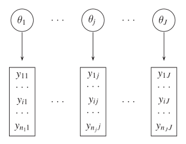
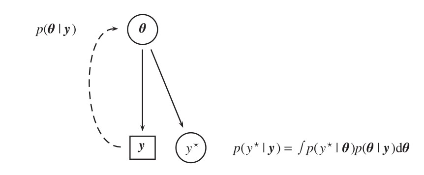

# Point Referenced Data Modeling {#prdm}

Geostatistical data are a collection of samples of geo type data indexed by coordinate Reference Systems (CRS), projected (e.g. Eastings and Northings) or unprojected (e.g. Latitude and Longitude), that originates from a spatially continuous phenomenon [@Moraga2019]. Data as such can monitor a vast range of phenomena, e.g. accidental fisheries bycatch for endangered species [@CosandeyGodin2015], COVID19 severity and case fatality rates in Spain [@Moragacovid2020], PM10 pollution concentration in a North-Italian region Piemonte [@Cameletti2012]. Moreover a large geostatistical application takes place on Real Estate where Boston house prices lattice data from MASS @mass package @rubiorealestate are developed according to several spatial models, where apartment transaction prices are in Corsica (France) are modeled in time and space [@Ling]. All the Examples taken before and might document a spatial nature of data according to which closer observations can display similar values, this phenomenon is named spatial autocorrelation. Spatial autocorrelation conceptually stems from geographer Waldo Tobler whose famous quote, known as first law of geography, inspires geostatisticians:

> "Everything is related to everything else, 
> but near things are more related than distant things"
>
>  \hfill --- Waldo R. Tobler

Spatial data can be partitioned into three spatial data type whose modeling tools are specific to their respective category.

- Areal Data
- **Point Referenced Data**
- Point Pattern Data


RESTful scraping API in \@ref(Infrastructure) allows to grab point referenced data (and covariates in tab. \@ref(exploratory)) by simply specifing the city or the sub-entity wanted. Moreover it allows also to specify the number of observation, this may result helpful in some context when complex models can not ingest large amounts of data or when the analyst's interest resides in only certain type of house characteristics.


RESTful scraping API designed in chapter \@ref(Infrastructure) extracts geostatistical components in the form of Latitude and Longitude nested in a hidden source code JSON object. Resulting observations can be represented through a map as in fig. \@ref(fig:prdmap). API allows gather dat 

Large areas with no housing within the polygons have
been removed (e.g. parks, the University of Zaragoza campus, hospital areas, etc.). What is
retained is, essentially, a full census of apartment sale transactions in and around the city center

Modeling methodologies described in this analysis will exclusively take into account point referenced techniques within the INLA algorithm.
Geostatical data can be considered as a stochastic process indexed on a continuous plane [@arbia2012spatial] i.e Gaussian Process.
This information is essential to interpolate points and build a Gaussian Process over the y-studied variable domain in order to predict the phenomenon at locations not yet observed. GPs ,at first, have to be introduced and constrained to the properties of Stationarity and Isotropy and then they are considered with a convenient covariance function, i.e. Matèrn. The reason why Matérn is selected as candidate for covariance function relies, besides its inner flexibility, on the fact that GP whose covariance function is Matérn are able to determine a GMRF \@ref(gmrf) through the Stochastic Partial Differential Equations (SPDE) approach [@Lindren2011]. The main benefit proceeding from a GP to a GMRF arises from the good computational properties that the latter appreciate enabling to wrap up modeling around INLA and consequently benefiting from it. Hedonic Price Models brings to the present analysis the theoretical foundation according to which covariates are added to the model.
Spatial kriging is essential to predict the process at new locations given the continuous spatial surface.
In the end models have to be checked and verified with resampling schemes which are once again specific to the data type and the scope of the analysis.

## Gaussian Process (GP){#GP}

<!-- prova a riscrivere GP -->

Point referenced data are defined as realizations of a stochastic process indexed by space.

$$
Y(s) \equiv\{y(s), s \in \mathscr{D}\}
$$
where $\mathscr{D}$ is a (fixed) subset of $\mathbb{R}^{d}$ (in the present work _Latitude_ and _Longitude_, i.e. $d=2$). The actual data can be then represented by a collection of observations    $\boldsymbol{\mathbf{y}}=\left\{y\left(s_{1}\right), \ldots, y\left(s_{n}\right)\right\}$ (recall notation from previous chapter \@ref(LGM)) where the set $\left(s_{1}, \ldots, s_{n}\right)$ points to the spatial location where data has been considered. For example, following @Cameletti2012, assume to have collection of samples from air pollutant measurements obtained by observing a set of monitoring stations. Then The stochastic process $Y(s)$ is observed in a fixed set of spatial indexes corresponding to the station locations (upwords arrows left in figure \@ref(fig:prdproc)). This information is essential to interpolate points and build a spatially continuous surface (right panel in figure \@ref(fig:prdproc)) over the y-studied variable domain in order to predict the phenomenon at locations not yet observed. [@LecturePaci].


The first step in defining a spatial model within INLA is to impose a LGM which reuires at first to identify a probability distribution for the observed data $\boldsymbol{\mathbf{y}}$. Usually are drawn distributions from the _Exponential family_, indexed by a set of parameters $\boldsymbol\theta$ as in \@ref(LGM), accounting for the spatial correlation — note that for the sake of simplicity we slightly abuse the notation and index the generic spatial point or area by using just the subscript $i$, rather than the indicator $s_i$, in the following.
In the case of geostatistical data, the model parameters $\boldsymbol\theta$, folllwing notation imposed in  chapter \@ref(inla) are defined as a latent stationary Gaussian Process (GP). The GP theoretical foundations and the spatial intuition are offered as a companion in the appendix \@ref(gpbasics).

\BeginKnitrBlock{definition}\iffalse{-91-71-80-32-100-101-102-105-110-105-116-105-111-110-93-}\fi{}
<span class="definition" id="def:GP"><strong>(\#def:GP)  \iffalse (GP definition) \fi{} </strong></span>A collection of $n$ random variables, such as $Y(s_{1}), Y(s_{2}) , \ldots, Y(s_{n})$ that are _valid_ and  _finite_ stochastic processes are said to be a **GP** if for any set of spatial index $n$ and for each set of corresponding locations $\left\{y\left(s_{1}\right), \ldots, y\left(s_{n}\right)\right\}$ follows a _multivariate Gaussian_ distribution with mean $\boldsymbol{\mu}=\left\{\mu\left(s_{1}\right), \ldots, \mu\left(s_{n}\right)\right\}$ and covariance matrix $\mathbf{Q}^{-1}_{i,j}, \forall i \neq j$ defined then by a covariance function $\mathscr{\cdot, \cdot}$
\EndKnitrBlock{definition}

The latent GP are in function of some hyper-parameters $\boldsymbol\psi$ and their respective prior $\pi(\boldsymbol\psi)$. Moreover a GP is completely characterized by a mean $\boldsymbol{\mu}=\left(\mu_{1}, \ldots, \mu_{n}\right)^{\prime}$ and a spatially structured covariance matrix $\boldsymbol{Q^{-1}}$ as multivariate Normal distribution, whose generic element is $\boldsymbol{Q^{-1}}_{i j}=\operatorname{Cov}(\theta_{i}, \theta_{j})=\sigma^2_{\mathscr{C}} \mathscr{C}(\Delta_{i j})$, where $\sigma_{\mathscr{C}}^{2}$ is the variance component and for $i, j = 1, \ldots, n$. $\mathscr{C}\left( \cdot, \cdot \right)$ function generally ensures that all the values that are close together in input space will produce output values that are close together, by inheriting the _validity_ and _positive definitness_ characteristics from the GP. The spatial stochastic process has also to satisfy two important properties **stationary**, **Isotropy** (both of the two relaxable at certain computational and modeling cost. 
A process is said **stationary** i.e. weak stationary, if process values at any two locations can be summarized by a covariance function $\mathscr{C(\Delta_{i j})}$ depending only on the distance. In other words it is invariant under _translation_ [@Krainski-Rubio].
A process is said **Isotropic** if the covariance function depends only on the between-points distance $\Delta_{i j}=\left\|s_{i}-s_{j}\right\|$ (in this context _Euclidean_), so it is invariant under _rotation_ [-@Krainski-Rubio]. A further way of seeing this property is that Isotropy implies concentric decaying contours [@LecturePaci], green in \@ref(fig:isoovsanis), that implies the vanishing of spatial dependence [@Blangiardo-Cameletti], and so for covariance values. 


In spatial statistics the assumption of isotropy is very frequent despite being restrictive for describing the rich variety of interactions that can characterize spatial processes. Anyway assuming the property it offers a wide range of underlying functions that can model spatial dependence for which three are the most common ones [@Krainski2018], where all the parameters below are special quantities derived from the emphirical covariance function. _(qui puoi aggingere le grandezze delle robe sotto)_

$$
\begin{aligned}
&\text { Exponential } \quad \mathscr{C}(\mathbf{ \Delta_{i j}})=\left\{\begin{array}{cl}
\tau^{2}_{\mathscr{C}}+\sigma^{2}_{\mathscr{C}} & \text { if }  \Delta_{i j}=0 \\
\sigma^{2}_{\mathscr{C}} \exp (-\phi_{\mathscr{C}} \Delta_{i j}) & \text { if } \Delta_{i j}>0 
\end{array}\right.\\
&\text { Gaussian } \quad \mathscr{C}(\mathbf{ \Delta_{i j}})=\left\{\begin{array}{cl}
\tau^{2}_{\mathscr{C}}+\sigma^{2}_{\mathscr{C}} & \text { if } \Delta_{i j}=0 \\
\sigma^{2}_{\mathscr{C}} \exp \left(-\phi^{2}_{\mathscr{C}}  \Delta_{i j}^{2}\right) & \text { if } \Delta_{i j}>0 
\end{array}\right. \\
&\text { Matérn } \quad \mathscr{C}(\mathbf{ \Delta_{i j}})=\left\{\begin{array}{cl}
\tau^{2}_{\mathscr{C}}+\sigma^{2}_{\mathscr{C}} & \text { if } \Delta_{i j}=0 \\
\frac{\sigma^{2}_{\mathscr{C}}}{2^{\nu-1} \Gamma(\nu)}(\phi_{\mathscr{C}}  \Delta_{i j})^{\nu} K_{\nu}(\phi_{\mathscr{C}}  \Delta_{i j}) & \text { if } \Delta_{i j}>0
\end{array}\right.
\end{aligned}
$$

In particular the focus is on the _Matérn_ – as it is required by the SPDE approach in Section \@ref(spdeapproach) – and this should not be intended as a restriction. In fact, as described in Guttorp and Gneiting (2006) _miss lit_, the Matèrn family is a very flexible class. Matérn is tuned mainly by two hyper-parameters, a scaling one $\kappa>0$, usually set equal to the range $\sigma_{\mathscr{C}}^{2}$ i.e. the distance at which the spatial dependence becomes negligible, by the relation $\sigma_{\mathscr{C}}^{2}=\frac{\sqrt{8 \lambda}}{\kappa}$), and a smoothing one $\nu>0$.  A _isotropic_ Matérn covariance expression is obtained by isolating the $\sigma_{\mathscr{C}}^{2}$, the variance component [@Cressie_2015]:

$$
\mathscr{C}\left(\Delta_{i j}\right)=\frac{1}{\Gamma(\lambda) 2^{\lambda-1}}\left(\kappa \Delta_{i j}\right)^{\lambda} K_{\lambda}\left(\kappa \Delta_{i j}\right)
$$
$\Gamma(\nu)$ is a Gamma function depending on $\nu$ values, $K_{\nu}(\cdot)$ is a modified Bessel function of second kind. The smoothness parameter $\nu$ in figure \@ref(fig:matern) takes 4 different values showing the flexibility of Matérn to relate different distances according to varying parameters. When $\nu = 1$ ... When $\nu = 1/2$ it becomes the exponential covariance function, When $\nu = 3/2$ it uncovers a convenient closed form [@LecturePaci], when $\nu \approx \infty$, e.g. for graphical constraints $\nu = 80$, it becomes Gaussian covariance function. In the the case shown in section \@ref(spdeapproach) $\sigma_{\mathscr{C}}^{2}$ range is set equal to the distance at which dependence vanishes below .1, for any $\lambda$.


**qui metti codici**


<!-- For simplicity lets consider $y$ point of interest observations $y\left(\boldsymbol{s}_{1}\right),y\left(\boldsymbol{s}_{2}\right), \ldots, y\left(\boldsymbol{s}_{n}\right)$ -->
<!-- from a random spatial process $Y(s_n)$, such that: $Y\left(\boldsymbol{s}_{1}\right),Y\left(\boldsymbol{s}_{2}\right), \ldots, Y\left(\boldsymbol{s}_{n}\right)$ observed at location $\boldsymbol{s}_{1}, \ldots, \boldsymbol{s}_{n}$. In the context of point reference data modeling each observation has to be considered as a partial realization of an unobserved/underlying random spatial process $\left\{Y(s): s \in D \subset \mathbb{R}^{2}\right\}$, where surface $D$ is a subset of r-dimensional Euclidean space $\mathbb{R}^{r}$.  -->
<!-- Moreover when $r = 1$ it is the most simple stochastic process widely explored in literature i.e. time series process. However geostatistical data always displays $r = 2$ (i.e. Latitutde and Longitude, Eastings and Northings) or eventually $r = 3$, when elevation data is available. The stochastic process $Y$ is observed in a fixed set of "monitoring stations" (arrows left in figure \@ref(fig:prdproc)) and inference can be done regarding moments of the realized interpolated process. This information is essential to build a spatially continuous surface (3D surface right part in figure \@ref(fig:prdproc)) over the y-studied variable in order to predict the phenomenon at locations not yet observed [@LecturePaci].   -->

<!--  -->

<!-- ```{definition,GP1,name="GP definition"} -->
<!-- A collection of $n$ random variables, such as $Y(s_{1}), Y(s_{2}) , \ldots, Y(s_{n})$ that are _valid_ spatial processes are said to be a **GP** if for any set of spatial index $n$ and for each set of corresponding locations $\left\{y\left(s_{1}\right), \ldots, y\left(s_{n}\right)\right\}$  follows a _multivariate Gaussian_ distribution with mean $\boldsymbol{\mu}=\left\{\mu\left(s_{1}\right), \ldots, \mu\left(s_{n}\right)\right\}$ and covariance matrix $\mathbf{Q}^{-1}_{i,j}, \forall i \neq j$ -->
<!-- ``` -->

<!-- The covariance matrix relates each observation to each of the others via a covariance function defined as $\mathcal{C}(\cdot)$. -->
<!-- GP in a spatial domain setting has to check two important properties in order to exploit INLA techniques, even though in some cases the assumptions can be both of the two relaxed: -->

<!-- - **Stationary**. -->
<!-- - **Isotropy**. -->

<!-- **Stationarity** in a stochastic process can be _strong_, _weak_ or _intrinsic_. The strong property forces the distribution of the process $\left\{y\left(s_{1}\right), \ldots, y\left(s_{n}\right)\right\}$ for any given spatial index $n$ and its correspondent location sets $s_{1,\ldots,n}$ to be the same as the one in $\left\{y\left(s_{1}+\boldsymbol{h}\right), \ldots, y\left(s_{n}+\boldsymbol{h}\right)\right\}$, where $h$ is a number belonging to $R^{2}$.  -->
<!-- On the other hand the weak property ensures that if the GP mean moment is constant over the study domain $\mu(\mathbf{s}) \equiv \mu$ (e.g. $E[Y(s)]=\mu, \forall s \in D$) then the covariance functions does depend only on the distance (euclidean $\left\|s_{i}-s_{j}\right\|$ distance) between each couple points. -->
<!-- Weak stationarity consequences are the most interesting: It does not matter whether observations are placed either in a specific region, nor the direction towards they are oriented, the covariance functions $\mathcal{C}(h)$ can summarize the process through the separation vector $\mathbf{h}$ i.e. $\mathcal{C}(\mathbf{s}, \mathbf{s}+\mathbf{h})=\mathcal{C}(\mathbf{h}), \forall \mathbf{h} \in \mathbb{R}^{r}$ [@Banerjee-Gelfand]. In other words weak stationarity in GP implies being invariant under _translation_ [@Krainski-Rubio]. The relationship between strong and weak is not bijective since being strong implies also being weak, but the opposite is not always true for non-Gaussian process. -->
<!-- Furthermore through the intrinsic stationary property it is meant that $E[Y(\mathbf{s}+\mathbf{h})-Y(\mathbf{s})]=0$, the second moment of the latter expression can be written as $E[Y(\mathbf{s}+\mathbf{h})-Y(\mathbf{s})]^{2}$ leading to $\operatorname{Var}(Y(\mathbf{s}+\mathbf{h})-Y(\mathbf{s}))$. Last expression is called _variogram_ whose mathematicla form is $2 \gamma(\mathbf{h})$, even tough its half,i.e. $\gamma(\mathbf{h})$, is more interpretable, namely _semivariogram_ [@Cressie_2015]. -->

<!-- Semivariograms are characterized by 3 tuning parameters circled in red in figure \@ref(fig:variogram): -->

<!-- - _range_ $\sigma^{2}$: At some offset distance, the variogram values will stop changing and reach a sort of “plateau”. The distance at which the effect occurs is called the range $\frac{\Delta\gamma(\mathrm{h})}{h} \approx 0$. -->
<!-- - _sill_ $\tau^{2}$: The “plateau” value at which the variogram stops changing $\frac{\Delta\gamma(\mathrm{h})}{h} = 0$. -->
<!-- - _nugget_ $\tau^{2}+\sigma^{2}$: The discontinuity at the origin. Although this theoretically should be zero, sampling error and short scale variability can cause it to be non-zero $\gamma(\mathrm{0})$. -->

<!--   -->

<!-- <!-- <!-- non so se tenere -->

<!-- <!-- da qui --> 

<!-- <!-- --> 
<!-- <!-- Furthermore since it is assumed to be true by the intrinsic stationary property that $E[Y(\mathbf{s}+\mathbf{h})-Y(\mathbf{s})]=0$, the second moment of the latter expression can be written as $E[Y(\mathbf{s}+\mathbf{h})-Y(\mathbf{s})]^{2}$ leading to $\operatorname{Var}(Y(\mathbf{s}+\mathbf{h})-Y(\mathbf{s}))$. Last expression is called _variogram_ and can be expressed with $2 \gamma(\mathbf{h})$, even tough its half,i.e. $\gamma(\mathbf{h})$, is more interpretable, namely _semivariogram_ [@Cressie_2015]. -->
<!-- <!-- The intuition behind the variogram is that the difference in value between two near points $Y(\mathbf{s}+\mathbf{h})$ and $Y(\mathbf{h})$ is expected to be small with respect to the ones farther ( _ergodicity_ of the spatial process  @Banerjee-Gelfand ), in compliance with the first law of geography by Tobler:  --> 


<!-- <!-- > "Everything is related to everything else,  --> 
<!-- <!-- > but near things are more related than distant things" --> 
<!-- <!-- > --> 
<!-- <!-- >  \hfill --- Waldo R. Tobler --> 


<!-- <!-- Semivariograms are an efficient tool to asses spatial continuity and contiguity but they are theoretical. However semivariograms can be fitted into existing data giving birth to empirical semivariograms which are then plotted against their separation vector. The plot can be used to verify the null hypothesis of spatial independence and variability of the process. The below expression is the empirical semivariogram functional form: --> 

<!-- <!-- $$\hat{\gamma}(t)=\frac{1}{2}|N(t)| \sum_{\left(\mathbf{s}_{i}, \mathbf{s}_{j}\right) \in N(t)}\left(Y\left(\mathbf{s}_{i}\right)-Y\left(\mathbf{s}_{j}\right)\right)^{2}$$ --> 


<!-- <!-- where $N(t)$ is the set of location pairs such that $\left\|\mathbf{s}_{i}-\mathbf{s}_{j}\right\|=t$ and so $|N(t)|$ is the number of pairs in the set. As already guessed before empirical semivariogram values are expected to be small at short pairs distance and tends to increase when distance increases. The rational behind is that similar observations are expected to lay close together (small $h$) leading to lower semivariogram values ($\gamma(\mathbf{h})$), as opposite farther pairs obervations (big $h$) tend to be different and associated to greater semivariogram values. Flat semivariogram might indicate small spatial variance, since whether separation $h$ increases or not, semivariogram values remains the same $\frac{\Delta\gamma(\mathbf{h})}{\Delta\mathbf{h}}\approx0$. Semivariograms might be implied earlier in the modeling process to to evaluate the presence of any spatial pattern. Then they are also implied in the model checking stage with the aim to asses if any spatial pattern is still present in the residuals.  --> 

<!-- <!--  --> 

<!-- <!-- <!-- a qui -->

<!-- The process is said to be **Isotropic** if the covariance function depends only on the between-points distance $\left\|\mathbf{h}\right\|$, so it is invariant under _rotation_ [-@Krainski-Rubio]. A further way of seeing the property is that Isotropy implies concentric decaying contours [@LecturePaci], green in \@ref(fig:isoovsanis), that resemble the vanishing of spatial dependence [@@Blangiardo-Cameletti], and so it does covariance values. In spatial statistics the assumption of isotropy is very common despite being very restrictive for describing the rich variety of interactions that can characterize spatial processes. -->
<!-- Then if the last assumption does not hold and direction towards point are distant from each other matters within the spatial domain $D$, then is said to be **Anisotropic**, purple in \@ref(fig:isoovsanis).  -->
<!-- Formalizing the results: -->

<!-- $$\mathcal{C}(\mathbf{h})=\mathcal{C}(\|\mathbf{h}\|)$$ -->

<!--  -->

<!-- ## Spatial Covariance Function -->

<!-- The covariance function $\math{C}(\cdot)$ ensures that all the values that are close together in input space will produce output values that are close together. $\mathcal{C}(\cdot)$ needs to inherits the _validity_ characteristics from the random spatial process, furthermore it has to be _positive definite_. The covariance function specification is a critical part of modeling and will affect kriging \@ref(kriging) estimates, parameters and related uncertainty [@cressie2015statistics]. -->
<!-- In addition covariance function must share characteristic properties of functions, such as: -->

<!-- (cerca di capire queste...) -->

<!--  - Multiply valid covariance functions (summing independent random variables) -->
<!--  - Mixing covariance functions (mixing distributions) -->
<!--  - Convolving covariance functions, this will be very important ... -->

<!-- <!-- Below a generalized version for two random $i$th $j$th observations: --> 

<!-- <!-- \begin{equation} --> 
<!-- <!-- \operatorname{Cov}\left(y\left(s_{i}\right), y\left(s_{j}\right)\right) -->
<!-- <!-- (\#eq:cov) --> 
<!-- <!-- \end{equation} --> 

<!-- Covariance functions under stationary and isotropic GPs displays two important properties: they are constant in mean within $D$ i.e. $\mathcal{C}(\mathbf{s}, \mathbf{s}+\mathbf{h})=\mathcal{C}(\mathbf{h}), \forall \mathbf{h} \in \mathbb{R}^{r}$ and they depends on distance vector $\mathbf{h}$, not direction i.e. $\mathcal{C}(\mathbf{h})=\mathcal{C}(\|\mathbf{h}\|)$ -->
<!-- There are many covariance functions and ways to relate distant points on a spatial domain $D$. Typically the choice of the Covariance can depend either on data or the scope of the analysis. Covariance functions are wrapped into hyper-parameters which are mainly three: -->

<!-- 1. _Range_: At some offset distance, the variogram values will stop changing and reach a “plateau”. The distance at which this occurs is called the range. -->
<!-- 2. _Sill_: The “plateau” value at which the variogram stops changing. -->
<!-- 3. _Nugget_: The discontinuity at the origin. Although this theoretically should be zero, sampling error and short scale variability can cause it to be non-zero -->
<!-- 4. partial sillò -->

<!-- ( espressione della covariance function insieme a alle $\sigma^2$ come: $\mathcal{C}(\mathbf{s}+\mathbf{h}, \mathbf{s} \mid \theta)=\sigma^{2} \mathbf{R}(\|h\| ; \phi)$ ) -->
<!-- spiega anche queste due sotto -->


<!-- $$ -->
<!-- \mathbf{w}=\left(w\left(\mathbf{s}_{1}\right), \ldots, w\left(\mathbf{s}_{n}\right)\right)^{\prime} \sim \mathrm{N}\left(\mathbf{0}, \sigma^{2} \mathbf{R}(\phi)\right) \text { where } \left.\mathbf{R}(\phi)_{i j}=\rho\left(\left\|\mathbf{s}_{i}-\mathbf{s}_{j}\right\| ; \phi\right)\right) -->
<!-- $$ -->

<!-- $\Sigma_{\theta}=\sigma^{2} \mathbf{R}(\phi)+\tau^{2} I_{n}$ -->


<!-- Three of the most applied covariance functions are presented below. -->

<!-- $$ -->
<!-- \begin{aligned} -->
<!-- &\text { Exponential } \quad \mathcal{C}(\mathbf{h})=\left\{\begin{array}{cl} -->
<!-- \tau^{2}+\sigma^{2} & \text { if }  h=0 \\ -->
<!-- \sigma^{2} \exp (-\phi h) & \text { if } h>0  -->
<!-- \end{array}\right.\\ -->
<!-- &\text { Gaussian } \quad \mathcal{C}(\mathbf{h})=\left\{\begin{array}{cl} -->
<!-- \tau^{2}+\sigma^{2} & \text { if } h=0 \\ -->
<!-- \sigma^{2} \exp \left(-\phi^{2} h^{2}\right) & \text { if } h>0  -->
<!-- \end{array}\right. \\ -->
<!-- &\text { Matérn } \quad \mathcal{C}(\mathbf{h})=\left\{\begin{array}{cl} -->
<!-- \tau^{2}+\sigma^{2} & \text { if } h=0 \\ -->
<!-- \frac{\sigma^{2}}{2^{\nu-1} \Gamma(\nu)}(\phi h)^{\nu} K_{\nu}(\phi h) & \text { if } h>0 -->
<!-- \end{array}\right. -->
<!-- \end{aligned} -->
<!-- $$ -->

<!-- ### Matérn Covariance Function{#Matern} -->

<!-- Matérn is crucial since when it is used together with a stationary and isotropic GP, the SPDE approach can provide a GMRF representation of the same process. Chapter \@ref(spde) discloses this fundamental property. Matérn can also be accounted as the most used in geostatistics [@Krainski2018] and [@Bayesian_INLA_Rubio]. Matérn is tuned mainly by two parameters, a scaling one $\kappa>0$, usually set equal to the range by the relation $\sigma^{2}=\frac{\sqrt{8 \lambda}}{\kappa}$) and a smoothing one $\nu>0$.  A _stationary_ and _isotropic_ Matérn covariance function has this form: -->


<!-- $$ -->
<!-- \mathcal{C}(\mathbf{h})=\left\{\begin{array}{ll} -->
<!-- \tau^{2}+\sigma^{2} & \text { if } h=0 \\ -->
<!-- \frac{\sigma^{2}}{2^{\nu-1} \Gamma(\nu)}(\phi t)^{\nu} K_{\nu}(\phi t) & \text { if } h>0 -->
<!-- \end{array}\right. -->
<!-- $$ -->

<!--  $\Gamma(\nu)$ is a Gamma function depending on $\nu$ values, $K_{\nu}(\cdot)$ is a modified Bessel function of second kind. The smoothness parameter $\nu$ in figure \@ref(fig:matern) below takes 4 different values showing the potentiality of Matérn to relates distances to covariance values. When $\nu = 1$ ... When $\nu = 1/2$ it becomes the exponential covariance function, When $\nu = 3/2$ it uncovers a convenient closed form [@LecturePaci], when $\nu \approx \infty$, in this case for representation purposes $\nu = 80$ it becomes Gaussian covariance function. -->


<!--  -->


<!-- By decomposing it into a more granular form and cosidering two generic locations $\mathbf{S}_{i}$  and $\mathbf{S}_{j}$, -->

<!-- $$ -->
<!-- \operatorname{Cor}_{Matérn}\left(U\left(\mathbf{s}_{i}\right), U\left(\mathbf{s}_{j}\right)\right)=\frac{2^{1-\nu}}{\Gamma(\nu)}\left(\kappa\left\|\mathbf{s}_{i}-\mathbf{s}_{j}\right\|\right)^{\nu} K_{\nu}\left(\kappa\left\|\mathbf{s}_{i}-\mathbf{s}_{j}\right\|\right) -->
<!-- $$ -->

<!-- where $\|\cdot\|$ is the Euclidean distance, $\Gamma(\cdot)$ is a gamma function and $K_{\nu}(\cdot)$ is a modified Bessel function of second kind. The relationship that ties Matérn correlation and covariance is $\mathcal{C}(h_{i,j}) = \operatorname{Cov}_{Matérn}\left(U\left(\mathrm{s}_{i}\right), U\left(\mathrm{s}_{j}\right)\right) = \sigma_{u}^{2} \operatorname{Cor}_{M}\left(U\left(\mathbf{s}_{i}\right), U\left(\mathbf{s}_{j}\right)\right)$. -->
<!-- Then if $u(\mathbf{s})$ is a realization from $U(\mathbf{s})$ at $n$ locations the joint covariance matrix can be defined as each entry of the joint covariance matrix $\Sigma_{i, j}= \sigma_{u}^{2} \operatorname{Cor}_{M}\left(U\left(\mathbf{s}_{i}\right), U\left(\mathbf{s}_{j}\right)\right)$. Common customary choice is to assume that $U(.)$ in centered in 0. -->


## The Stochastic Partial Differential Equation (SPDE) approach{#spdeapproach}

Locations in the spatial setting are considered as realizations of a stationary, isotropic unobserved GP $w(s)$ to be estimated (\@ref(GP)). Before approaching the problem with SPDE, GPs were treated as multivariate Gaussian densities and Cholesky factorizations were applied on the covariance matrices and then fitted with likelihood [@LecturePaci]. Covariance matrices in the context of spatial and spatio-temporal models [@PACI2017149; @Cameletti2012] are $n \times n$ whose dimension is produced the number of observations at each single location (at each time point in spatio-temporal) [@BLANGIARDO201339]. Covariance matrix as such are very dense and they were scaling with the order of $\mathcal{O}\left(n^{3}\right)$ [@Banerjee-Gelfand]. Problem were linked to the computational costs needed for linear algebra operations for model fitting and spatial interpolation as well as prediction [@Cameletti2012], having led to obvious _big-n_ problem. 
The breakthrough came with @Lindgren2011 that proves that a stationary, isotropic (might be relaxed) GP with Matérn covariance can be represented as a GMRF using SPDE solutions by finite element method [@Krainski-Rubio]. In other words given a GP whose covariance matrix is $\boldsymbol{Q^{-1}}$, SPDE can provide a method to approximate $\boldsymbol{Q^{-1}}$ without the previous computational constraints. As a matter of fact SPDE are equations whose solutions are GPs with a chosen covariance function focused on satisfying the relationship SPDE specifies [-@Krainski-Rubio].
Benefits are many but the most important is that the representation of the GP through a GMRF provides a sparse representation of the spatial effect through a sparse precision matrix $\boldsymbol{Q}$ . Sparse matrices enable convenient inner computation properties of GMRF \@ref(approx) which are exploited by INLA algorithm \@ref(inla) leading to a more feasible big-O $\mathcal{O}\left(n^{3 / 2}\right)$. Mathematical details and deep understanding of the equations in SPDE are beyond the scope of the analysis. Luckily enough R-INLA has a set of functions that makes clear to the practitioner the minimal requirements to pass from discrete locations to their continuously indexed surface alter-ego. 
In few words SPDE approach uses a finite element (FEM method) representation to shape the Matérn field as a linear combination of basis functions defined on a triangulation of the domain $\mathcal{D}$  [-@Cameletti2012]. What it intenally does is splitting the domain $\mathcal{D}$ into a number of non-intersecting triangles which converge in a common edge or corner. Then the initial vertices of the triangles are set at $s_1 \ldots s_d$. In order to get a proper triangulation, useful for spatial prediction, additional vertices are then added. The more vertices are added the more the triangulation is accurate since many more triangles can better interpolate the surface reaching more complex shapes. Secondly SPDE projects the values of the trinagularization to the dicretized spatial surface with weighted sum of areas of the underlying triangles. A less superficial intuition is offered in the appendix in section \@ref(triangular) on how SPDE computes triangularized valuez and how it projects the  triangulation to the GRMF.  
To illustrate the concept of triangulation @Cameletti2012 provide a simple example for Piemonte PM10 concentration observed at 24 monitoring stations left in figure \@ref(fig:piepm10) and using 123 vertices and a Piemonte borders, right in figure \@ref(fig:piepm10). 


Any triangle height (the size of the spatial field at each vertix triangle) is calculated by weighted sum, with linear interpolation deciding the values within the triangle. Figure \@ref(fig:spdesurf) shows a continously indexed random spatial field (left side of figure \@ref(fig:spdesurf)) with the corresponding SPDE on the basis of a triangulation (right panel \@ref(fig:spdesurf)).


## Hedonic (rental) Price Models

The theoretical foundation of the Hedonic Price Models (from now on HPM) resides in the consumer utility theory of @Lancaster together with @Rosen market equilibrium. According to Lancaster the utility of a commodity does not exist by itself, instead it exists as the sum of the utilities associated to its separable characteristics. Integrating Lancater, Rosen introduces HPM and suggests that each separate commodity characteristics are priced by the markets on the basis of supply and demand equilibra. Applying HPM to Real Estate in a market context, from the buy side house prices (indeed also rents) are set as the unit cost of each household attributes, conversely from the selling side the expenditures associated to build of each them.
Formalizing the results, Hedonic Price $P$ in Real Estate is expressed as a general $f$ functional form that takes as input the house characteristics vector $\mathbf{C} = \{c_1,c_2, c_3, \ldots c_n\}$. 

$$P=f\left(c_{1}, c_{2}, c_{3}, \ldots, c_{n}\right)$$

Vector $\mathbf{C}$ since now might contain a unidentified and presumably vast number of ungrouped characteristics. In this setting @Malpezzi tried to organize house features by decomposing $\mathbf{C}$ into mutually exclusive and exhaustive subgroups. The vector components involves the house price $P$, which is in a $f$ relation with: $S$, the structural characteristics of the house, $N$, the neighborhood characteristics, $L$, the locational characteristics, $C$, the contract conditions and $T$ time dimension (not included in the model). $\beta$ is the vector of the parameters to be estimated. Therefore:

$$P=f\left(S, N, L, C, T, \beta\right)$$
However the critical part of studying house characteristics in geostatistics is the _estimation_ and a recent (and not recent) number of emerging trends are observed [@SHEPPARD19991595]. Trends, other than the methods presented in this analysis suggests semi-parametric or non-parametric methods and applications of spatial econometrics @Ling. Researchers would also contend with problems ranging from variable selection to model specification [-@Ling].
For semi-paramametric models a local polynomial regression is developed by @clapp. The model provides a nonlinear term for the measurement of housing position values dependent on latitudes and longitudes.
Proper geoadditive models family was originally proposed by Kammann and Wand [-@kammanwand], which offers a combination of additive modeling [@buja1989] and a geostatistical component. As Ling [-@Ling] points out the candidates for the spatial component are many, e.g. kriging component [@dey2017metamodel] (which will be then subsituted with a GP \@ref(GP)) or a smooth spatial trend component based on a tensor product of longitude and latitude for which @basilebenfratmcast have investigated European industrial agglomeration externalities. The model outshines the other parameteric model performances by better managing spatial unobserved patterns. Furthermore they made available a third study dimension which is time [-@Ling]. 
Spatial econometrics' evolution trends are seen in @spateconomshifei and lately in @spateconanslein where point referenced data are modeled with endogenous time varying spatial weights matrices and unobserved common factors and ultimately are fitted with traditional bayesian estimation methods as MCMC [-@spateconanslein].
Then two further interesting modeling approach does not fall perfectly in the categories, but are higly considered in literature within the Hedonic Price models. @dubelegros recognize that the modeling tools available analyzing point referenced data were not sufficient to take into account all the dimensions according to which they want to evaluate the phenomenon. They acknowledge that _Moran's I_ index and his statistics test relies mainly on an exogenous specification of a spatial weights matrix [-@dubelegros]. As a result they assemble a spatio‐temporal weights matrix to evaluate spatial dependence through Moran's I index whose application is on real estate data (selling) for Québec City from 1986 to 1996. The second approach was addressed in @baltagiparis whose object is price estimation based on flats sold in the city of Paris over the period 1990–2003. This is a rich and unbalanced pseudo‒panel data which are modeled with spatial lag. Results displayed a nested structure of the Paris housing data, which have been tested with likelihood ratio. A similar approach was followed by Nardelli and Arbia [@arbia2020spatial] which collected crowdsourced as well as webscraped (as in section \@ref(scraping)) data and lately applied Spatial Lag Model (SLM) on a "post-sampled" [@arbia2020postsampling] version of the same. As a result bias in the model is diminished, indeed variance of the estimators is increased.
<!-- Historically a first attempt to include spatial effect in urban economic literature is provided by _Alonso (1964) miss ref_. Its contribution was to raise voice on house prices (also rent) mainly depending on land price and a number of purely spatial covariates like CBD, the distance from City Business District. Other covariates were transport cost per kilometer and community income, even though they were defined also as spatial parameters through distances. The model proposed by Alonso is called monocentric since the centroid from which distances are calculated is only one. Moreover a first touch to spatial data theory was done since the CBD was defined as areal unit with well-defined boundaries of regular or irregular shape. However applications of the model were not convincing since empirical studies offered a different picture. Results displayed a Poly-centric areal structure (universities and Malls) which might be better explaining the variance of prices. The model also assumed that covariates like CBD are only informative within city center boundaries and then show no significance out of the core of the city. Poly-centric theory was also more coherent with the architectural and socio-economical evolution of cities during that times, therefore mono centric theory was then criticized and abandoned. Critics regarded also neighborhood quality measure and boundary problems _Dubin (1987) miss ref_. Dubin for these reasons developed a model including areal effects in the error term since handling these covariates was posing several hard challenges. Areal data choice for Dubin was forced since he was interested in land values, geostatics interest was not a focus also due to the difficulties in gathering accurate data. Coming to recent literature a change in focus has been made by switching from theory based model to estimation methods. As a consequence to the change in focus @Ling said that practitioners should spend more time in variable selection and model specification with respect to their specific need.  -->
<!-- As Ling has observed the emerging trends are in the field of semi-parametric and non-parametric methods -@Ling. Historically semi-parametric regression considers models indexed by spatial coordinates _Pace RK (1995)_. At the same time _Kammann and Wand (2003)_ gave birth to geoadditive models where the spatial component is added as a covariate. [...] -->
A further aspect of the problem is posed by scholars that do not consider rents to be representative for the actual value of real estate, as a result modeling choices should be calibrated on the market economic cricumstances. Nevertheless in many empirical analysis rent value are considered a proxy for real estate pricing when considered in long-run [@Herath_Maier_2011]. A further argument to endorse this hypothesis is brought by @sellingVSrental considering housing a commodity, then the selling or the rental option should be considered interchangeable economic actions with respect to same inner need to be satisfied. This assumption is also stronger in this context since Manganelli, Morano, and Tajani have centered their analysis on italian Real Estate data. Moreover @Capozza_Seguin_1996 discussed on how much rent-price ratio predicts future changes both in rents and prices. Among all the other points raised they brought the decomposition of rent-price ratio into two parts: the predictable part and the unexplained residuals part. The predictable part was discovered to be negatively correlated with price changes, in other words cities in which prices are relatively high with respect to rents are associated with higher capital gains that might justify that misalignment. This is also true for the opposite, that is cities in which prices are lower with respect to the rents, and this effect can not be associated to any local condition, realize lower capital gains. A further argument is offered by Clark [@Clark_1995] which went after the Capozza and Seguin work. Rent-price ratio is negatively correlated with following future changes in rents. In other words prices are still higher when areas in which they are observed documents an increase in rent prices.


## Point Referenced Regression for univariate spatial data{#univariateregr}

Since in HPM the relationships between the characteristics of the house, i.e. vector $\mathbf{C}$ and the price $P$ is not in any case fixed by econometric literature it is possible to assume any $f$ functional form. The open possibility to apply a wide range of relationship between covariates fit in the INLA setting, since Latent Gaussian Models are prepared to accept a any linear and non linear $f$ functions \@ref(LGM) through the `f()` method. Hedonic price models are, as a consequence, a subset of models that can be fitted into LGM and therefore by INLA method.

Moreover what the vast majority of econometric literature _(Greene, 2018)_ suggest to apply a is log-linear / square root model. This is due to the fact that log transformation / square root smooths the skewness of prices normalizing the curve, leading to more accurate estimates. Having an exponential family generating process lowers even further computational cost for reasons linked to the $\tilde\pi(\boldsymbol{\psi})$ hyper param INLA approximation [@Blangiardo-Cameletti]. Notation is taken from the previous chapter \@ref(inla), for brevity purposes $\boldsymbol{\beta}$ $\mathbf{X}$ and $\boldsymbol{y}$ indicates vectors incorporating all their respective realizations and the $s$ spatial component is left out in favor of the observation pedix $i$.  
The simplest log-linear bayesian regression model assumes linear relationship between predictors and a Normal data generating process: (log has been taken out for simplicity, bu it will be then considered in the regression setting) (valuta l'idea che per interpretabilità di modellarla come Gamma exponential family anzichè tenerla normale)

$$
\log{(y_{i})} \sim \operatorname{Normal}(\mu_{i}, \sigma^{2})
$$

$$
y_{i}=\mu_{i}+\varepsilon_{i}
$$

then by the following relationship $E\left(y_{i} \mid \beta_{0}, \ldots, \beta_{M}, x_{i 1}, \ldots, x_{i M}\right)=\beta_{0}+\sum_{m=1}^{M} \beta_{m} x_{i m}$  it is possible to specify a more general linear predictor (seen also in chapter \@ref(inla)) through an identity link function i.e. $\eta_{i}=g\left(\mu_{i}\right)=\mu_{i}$ obtaining:

$$
\eta_{i}=\beta_{0}+\sum_{m=1}^{M} \beta_{m} x_{m i}+\sum_{l=1}^{L} f_{l}\left(z_{l i}\right)
$$

Where, once again, the mean structure linearly depends on some $\mathbf{X}$ covariates, $\boldsymbol{\beta}$ coefficients, $f_{l}(\cdot), \forall l \in 1 \ldots L$ are a set of random effects defined in terms of a $\boldsymbol{z}$ set of covariates $\boldsymbol{z}=\left(z_{1}, \ldots, z_{L}\right)$ (e.g. rw, ar1) and  $\varepsilon_{i}$ white noise error.
Priors have to be specified and a non informativeness for $\tau^2 = 1/\sigma^2$ and $\boldsymbol{\beta}$ is chosen, such that $\pi(\tau^2) \propto 1$ and $\pi(\boldsymbol\beta) \propto 1$. As a consequence the conditional posterior for the parameters of interest $\boldsymbol{\beta}$ is:

$$
\boldsymbol{\beta} \mid \sigma^{2}, \boldsymbol{y}, \boldsymbol{X} \sim \operatorname{MVNormal}\left(\left(\boldsymbol{X}^{\prime} \boldsymbol{X}\right)^{-1} \boldsymbol{X}^{\prime} \boldsymbol{y}, \sigma^{2}\left(\boldsymbol{X}^{\prime} \boldsymbol{X}\right)^{-1}\right)
$$

where the mean structure corresponds to the OLS estimator: $\left(\boldsymbol{X}^{\prime} \boldsymbol{X}\right)^{-1} \boldsymbol{X}^{\prime} \boldsymbol{y}$ for $\beta$ and then to obtain the marginal posterior for $\boldsymbol{\beta}$ it is needed to integrate with respect to $\sigma^2$.

In order to engage the spatial coordinate components into the regression setting $w_{i}$ has to be added to the equation. $w_{i}$ is set as a stationary and isotropic GP with mean 0 and variance as covariance function expressed as Matérn.
Recall that GP
The new regression setting integrates the _spatial error_ part in the name of $w_{i}$ and a _non-spatial error_ part $\varepsilon_{i}$ distributed normally with mean 0 and variance $\tau^2$ ,i.e. $\mathrm{N}\left(0, \tau^{2}\right)$, which offers its contribution error to the nuggets via the covariance function. 
Consequently there is one more parameter to estimate. It is worth mentioning that the distribution of $w_{i}$ at a finite number of points is considered a realization of a multivariate Gaussian distribution. In this case, the likelihood estimation is possible and it is the multivariate Gaussian distribution with covariance $\Sigma$. 

$$
\log(y_{i})= \beta_{0} + (\mathbf{X})^{\prime}\boldsymbol{\beta}+w_{i}+\varepsilon_{i}
$$


The covariance of the marginal distribution of $y_{i}$ at a finite number of locations is $\Sigma_{y} = \Sigma + \tau^2\mathbf{I}$, where $\mathbf{I}$ denotes the indicator function (i.e., $\mathbf{I}(i = i^{\prime})= 1$ if $i = i^{\prime}$, and 0 otherwise). This is a short extension of the basic GF model, and gives one additional parameter to estimate

\begin{equation}
    \log(y_{i})=\mu_{i}+\varepsilon_{i}
(\#eq:genreg)
\end{equation}

where $y_{i}$ is normally distributed as $y_{i} \sim \operatorname{Normal}\left(\mu_{i}, \sigma^{2}\right)$ and $\mu_{i}$ is the mean structure that linearly depends on some $\mathbf{X}$ covariates, $\boldsymbol{\beta}$ coefficients, $f_{l}(\cdot), \forall l \in 1 \ldots L$ are a set of random effects defined in terms of a $\boldsymbol{z}$ set of covariates $\boldsymbol{z}=\left(z_{1}, \ldots, z_{L}\right)$ (e.g. rw, ar1) and  $\varepsilon_{i}$ white noise error. Please recall that the $i$th pedices are the observations and the $m$th pedices are the covariates. The structure is a repetition of what already seen in chapter \@ref(LGM)

\begin{equation}
  \eta_{i}=\beta_{0}+\sum_{m=1}^{M} \beta_{m} x_{m i}+\sum_{l=1}^{L} f_{l}\left(z_{l i}\right)
(\#eq:linearpred)
\end{equation}

The link function specified in this case is still identity, so that $\eta_{i}=g\left(\mu_{i}\right)=\mu_{i}$. Nevertheless GLMs can be applied with different link function. when response variable has to stay between $[0,1]$ (e.g. probabilities), the link function might be Logit, which leads to logistic regression. More generally expressed in vector notation:

\begin{equation}
  \log(y_{i})\left(\mathbf{s}_{i}\right)=\mathbf{x}\left(\mathbf{s}_{i}\right)^{\prime} \beta_{j}+\varepsilon\left(\mathbf{s}_{i}\right)
  (\#eq:genregvec)
\end{equation}

where its OLS estimator is:
\begin{equation}
  \hat{\beta}=\left(\mathbf{X}^{\prime} \mathbf{X}\right)^{-1} \mathbf{X}^{\prime} \mathbf{y}
(\#eq:ols)
\end{equation}

Moreover In the context of bayesian analysis a prior distribution has to be imposed on the regression coefficients $\beta = \left\{\beta_{0}, \ldots, \beta_{J}\right\}$ as well ad on the variance  $\sigma^{2}$ of $y_{i}$. When no expert information is provided vague priors are introduced, meaning that the regression should not be weighted too much on the priors choice.
Vague priors might be:

- $\beta_{m} \sim \operatorname{Normal}\left(0,10^{6}\right)$ for the beta coefficients
- $\log (\tau)=\log \left(1 / \sigma^{2}\right) \sim \log \operatorname{Gamma}\left(1,10^{-5}\right)$ for precision

Spatial modeling goal is to include spatial information from location into the model. This is done within the bayesian frameoùwork and INLA by adding $w(\mathbf{s})$ in the previous equation \@ref(eq:genregvec).

$$y\left(\mathbf{s}_{i}\right)=\mathbf{x}\left(\mathbf{s}_{i}\right)^{\prime}\beta_{j}+w(\mathbf{s})+\varepsilon\left(\mathbf{s}_{i}\right)$$

The $w(\mathbf{s})$ in the context of the analysis is approached as a stationary and isotropic GP\@ref(GP) whose distribution by definition is multivariate Gaussian with mean $\boldsymbol{\mu}(\mathbf{s}) = 0$ and function of the spatial index $\mathbf{s}$ and covariance function $\mathcal{C}( \cdot \mid \theta)$ .
$\varepsilon(\mathbf{s})$ is iid and mean centered in 0 with variance $\tau^{2}$ and is called non-spatial error since it contributes to the nugget. The error term is pure since it interferes with the covariance function so that the model can embody the spatial component.
One of the major advantages of having a a spatial process embedded into a GP is _likelihood_ based inference.

### Parameter estimation

Gaussian spatial models can be considered as GLM with a particular specification of the precision matrix $\Sigma_{\theta}=\sigma^{2} \mathbf{R}(\phi)+\tau^{2} I_{n}$,
then the likelihood can be computed by:
$$\mathbf{y} \mid \boldsymbol{\theta}, \boldsymbol{\beta} \sim \mathrm{N}\left(\mathbf{X} \beta, Q_{\theta}\right)$$
where,  $\boldsymbol{\theta}=\left(\sigma^{2}, \tau^{2}, \phi\right)$
Since likelihood estimation is possible then MLE can be computed for $\boldsymbol{\beta}$ and $\boldsymbol{\theta}$ are $\hat{\boldsymbol{\beta}}$ and $\hat{\boldsymbol{\theta}}$.
Then the estimation in vector notation is:

$$\hat{\boldsymbol{\beta}}_{M L E}=\left(\mathbf{X}^{\prime} Q^{-1} \mathbf{X}\right)^{-1} \mathbf{X}^{\prime} Q^{-1} \mathbf{y}$$

<!-- ## Hierarchical Bayesian models{#hiermod} -->

<!-- Spatial Models are characterized by many parameters which in turn are tuned by other hyper-parameters. Traditionally Bayesian hierarchical models are not widely adopted since they have high computational burdens, indeed they can handle very complex interactions via random components, especially when dealing with spatio temporal data @Ling.  Blangiardo e Cameletti -@Blangiardo-Cameletti tried to approach the problem from a different angle offering an intuitive solution on how hierarchy relates different levels parameters. This is done by reversing the problem and starting from data back to parameters, instead the other way round. So taking a few steps back the problem can be reformulated by starting from grouping observation into categories and then trying to impose a hierarchical structure on data based on the categories. As a result observations might fall into different categories, underlining their natural characteristics, such as: some of them might belong to category _levels_ like males or females, married or not-married. Moreover diving into the specific problem house prices can be faceted by which floor they belong or whether they are assigned to different energy classes and many others more. As an example Blangiardo and Cameletti example consider grouping data according to just a single 9 _levels_ category. Data for the reasons stated before can be organized such that each single observation (squares in figure below) belongs to its respective mutually exclusive and collectively exhaustive category (circles in figure).   -->

<!--  -->

<!-- Furthermore data can be partitioned into two meta-categories, _fist level_ and _second level_,  highlighting the parameter and hyper paramter chain roles. _First level_ are identified by sampling observations which are drawn by the same probability distribution (squares) . _Second level_ (circles) are categories and might be associated to a set of parameters $\theta=\left\{\theta_{1}, \ldots, \theta_{J}\right\}$. -->
<!-- Since the structure is hierarchical, a DAG (Directed Acyclical Graph) -@Blangiardo-Cameletti representation might sort out ideas. If categories are represented by different $\theta_{j}$ nodes and edges (arrows in the figure) are the logical belonging condition to the category then a single parameter $\theta$ model has the right figure form:  -->

<!--    -->

<!-- To fully take into account the hierarchical structure of the data the model should also consider further lelvels. Since $\left\{\theta_{1}, \ldots, \theta_{J}\right\}$ are assumed to come from the same distribution $\pi(\theta_{j})$, then they are also assumed to be sharing information [@Blangiardo-Cameletti], (left figure).  When a further parameter $\boldsymbol{\psi}=\left\{\psi_{1}, \ldots, \psi_{K}\right\}$ is introduced, for which a prior distribution is specified, then the conditional distribution of $\boldsymbol{\theta}$ given $\boldsymbol{\psi}$ is: -->

<!-- $$ -->
<!-- \pi\left(\theta_{1}, \ldots, \theta_{J} \mid \boldsymbol{\psi}\right)=\int \prod_{j=1}^{J} \pi\left(\theta_{j} \mid \psi\right) \pi(\psi) \mathrm{d} \psi -->
<!-- $$ -->
<!-- This is possible thanks to the conditional independence property already encountered in chapter \@ref(inla), which means that each single $\theta$ is conditional independent given $\psi$ -->
<!-- This structure can extended to allow more than two levels of hierarchy since the marginal prior distributions of $\theta$ can be decomposed into the product of their conditional priors distributions given some hyper parameter $\psi$ as well as their prior distribution $\pi(\psi)$. -->

<!-- $$ -->
<!-- \pi(\boldsymbol{\theta})=\int \pi\left(\boldsymbol{\theta} \mid \boldsymbol{\psi}_{1}\right) \pi\left(\boldsymbol{\psi}_{1} \mid \boldsymbol{\psi}_{2}\right) \ldots \pi\left(\boldsymbol{\psi}_{L-1} \mid \boldsymbol{\psi}_{L}\right) \pi\left(\boldsymbol{\psi}_{L}\right) \mathrm{d} \boldsymbol{\psi}_{1} \ldots \mathrm{d} \boldsymbol{\psi}_{L} -->
<!-- $$ -->

<!-- $\boldsymbol{\psi}_{l}$ identifies the hyper pram for the $l_{th}$ level of hierarchy. Each further parameter level $\psi$ is conditioned to its previous in hierarchy level $l-1$ so that the parameter hierarchy chain is respected and all the linear combinations of parameters are carefully evaluated. The *Exchangeability* property enables to have higher $H$ nested DAG (i.e. add further $L$ levels) and to extend the dimensions in which the problem is evaluated, considering also time together with space. From a theoretical point of view there are no constraints to how many $L$ levels can be included in the model, but as a drawback the more the model is nested the more it suffers in terms of interpretability and computational power. Empirical studies have suggest that three levels are the desired amount since they offer a good bias vs variance trade-off. -->


## Spatial Kriging (prediction) {#kriging}

<!-- prePRENDI DA KRAINSKI -->

In Geostatistics the main interest resides in the spatial prediction of the spatial latent field pr the response variable at location not yet observed. 
Assumed the model in the previous section, suppose that $y^{\star}$ is not a observed occurrence of the response variable at location $s_{0}$ (not in the data) of the GP $w_{i}$ spatial surface estimated through observed refereced points in $\boldsymbol{y}$. As a consequence of exchangeability (first step previous section \@ref(inlahier)) then $\boldsymbol{y}^{\otimes}=\left\{\boldsymbol{y}, y^{\star}\right\}$. Then considering INLA notation it is obtained: 

$$
\begin{aligned}
&\pi\left(y^{\star} \mid \boldsymbol{y}\right)=\frac{\pi\left(\boldsymbol{y}, y^{\star}\right)}{\pi(\boldsymbol{y})} \text { from the conditional probability }\\
&=\frac{\int \pi\left(y^{\star} \mid \theta\right) \pi(\boldsymbol{y} \mid \theta) \pi(\theta) \mathrm{d} \theta}{\pi(\boldsymbol{y})} \text { by exchangeability }\\
&=\frac{\int \pi\left(y^{\star} \mid \theta\right) \pi(\theta \mid y) \pi(y) \mathrm{d} \theta}{\pi(y)} \text { applying Bayes' theorem }\\
&=\int \pi\left(y^{\star} \mid \boldsymbol{\theta}\right) \pi(\boldsymbol{\theta} \mid \boldsymbol{y}) \mathrm{d} \boldsymbol{\theta}
\end{aligned}
$$

A DAG representation might offr the intuition behind Prediction in spatial models:




where $\pi\left(y^{\star} \mid \boldsymbol{y}\right)$ is said predictive distribution and it is meaningful only in the Bayesian framework since the posterior distribution is treated as a random variable, which is totally not true in frequentist statistics.


## Model Criticism

Since INLA can fit a wide range of model then the flexibility should be reflected by a mouldable tool to check model suitability. 
Once the model is set up and fitted a resampling scheme has to be chosen in order to evaluate the model performance. One of the most used method to assess beyasian model quality is LOOCV cross validation and defualt choice fo R-INLA package. From data is left out one single observation and so that the Validation set is  $\boldsymbol{y}_{v} = \boldsymbol{y}_{-i}$ and the Assessement set is a $\boldsymbol{y}_{a} = \boldsymbol{y}_{i}$
the rest of the observations. Two KPI are assumed to be representative:

- CPO conditional predictive ordinate (pettit, 1990): $CPO_{i} = \pi(y^{\star} \mid \boldsymbol{y}_{v})$
- PIT probability integral tranform (dawid, 1984): $PIT_{i} = \pi(y^{\star} < y_{i} \mid \boldsymbol{y}_{v})$

These quantities are used by default by setting control options in the `inla(control.compute = list())` list object by setting them equal o TRUE. Inla also provides an inner method to authomatically handlee failing in computing those two quantities, leadind to values of 1 when predictions are not reliable and the ipposite for 0.Moreover the empirical distribution of the PIT can be used to asses predictive performance: if it is Uniform, so there are not values that strongly differ from the others then the model is correctly checked. Otherwise if the dostribtuon almost approxiamtes any of the other possibles then the Cross validation assessement prediction has led incorrectly predict the "out of the bag" validation sample.

Posteerior checking method exploits a full cross validation where $\boldsymbol{y}_{a} = \boldsymbol{y}_{v}$ and it is called predictive checks. Th assessement set now is equal to the validation set,a s a consequence all the observation are evaluated twice. 4 quantities are driver to model estimate quality:

- the _posterior predictive distribution_: $\pi(y^{\star} \mid \boldsymbol{y})  = \int \pi(y^{\star} \mid \theta_{i})\pi({\theta_{i}} \mid \boldsymbol{y})\mathrm{d}\theta_{i}$ which is the likelihood of a replicate observation. When values are small that indicates that are those values are coming from tails, since the area under the curve (i.e. probability) is less. If this happens for many observation then outliers are driving the model leading to poor estimates
- the _posterior predictive p-value_ whose math expression is:$\pi(y^{\star} \leq y_{i} \mid \boldsymbol{y})$ for which values near to 0 and 1 indicates poor perfomances. 
- _Root Mean Square Predictive Error RMSE_: $\sqrt{\frac{1}{n} \sum_{i=1}^{n}(y_{i}-{y}^{\star}_{i})^{2}}$
- $R^2$

R-INLA has already antiticipated in chapter 4 section\@ref(example) have designed function to compute statistics on posterior distribution as `inla.pmarginal()` returning the cumulative density distribution.

## Prior Specification{#priorsspec}

The priors choice is the most central part of a Bayesian analysis and at the same time the weakest since any selection might be criticized. Priors expression involves a considerably high amount of subjectivity and domain experience which may be imported from other comparable literature works or results. However according to purists Bayesian priors should be decided _a-priori_, without either looking at the data, nor the posterior results. This can be tedious since many models are sensitive to priors, as evidenced in the example in sec. \@ref(rinla). Priors may negatively impact posteriors when are 
wrong and they usually require a later revision. The choice in this context is also more difficult since it is also constrained to LGM requirements for which the latent field demands them to be jointly Gaussian. @simpson2017 provide a solid backbone knowledge on priors specification in Hierarchical models by setting up 4 guidelines principles on top of which it is built a new class said Penalized Complexity (PC) priors. Before jumping into the principles it is needed an abstract concept that goes by the name of “base model". For a general density $\pi(\mathbf{y} \,| \,\xi)$ which is controlled by a flexibility parameter $\xi$ the base model is the most uncomplicated one in the class. Following the notation this would be the model corresponding to $\xi = 0$. The base model ideally grabs the parameter choice with the lowest possible complexity given the model an set it as a ground benchmark. The following example regards base model for a a Gaussian Random effect and it considers a multivarite gaussian distributed with mean **0** and precision matrix $\tau \boldsymbol{Q}$, i.e.  $\mathbf{y} \mid \xi \sim \operatorname{MVN}(\, 0\, ,\,\tau \boldsymbol{Q})$, where $\tau=\xi^{-1}$. The base model tries to put the mass [-@simpson2017] on $\xi = 0$ since the base model in this case is a model without the random effect. At this point it is possible to present the building blocks, first priciple is _Occam’s razor_ according to which priors should be weighted down in fuction of the distance between the added complexity and the base model i.e. simpler solutions are preferred. The second principle regards how it is measured complexity whose solution is found in KLD (Kullback–Leibler divergence) calculating distance $d$. KLD in this context along with principle 1 affirms that the prior shall have high mass in areas where replacing the base model with the flexible model will not cause any information loss. Principle 3 is constant rate penalization that actually relates the distance $d$ to a constant penalization. In the end principle 4 regards a scale parameter which actually ends up not being very sharp in prior setting. A prior satistfyng all the requirements is said Penalized in Complexity.
Priors of this class therefore should be derived with respect to the specific content they are needed. In this context PC priors are seen for Gaussian Random effect, i.e. the GP process hyper parameter.
Assume to have a gaussian random effect modeling some sort of spatial dependece as in \@ref(GP), i.e. $\mathbf{x} \sim \mathcal{N}\left(\mathbf{0}, \tau^{-1} \boldsymbol{Q}^{-1}\right)$. The base model considers the absence of the random effect which implies $\tau \rightarrow \infty$, [...] the applying principles priors take the form of an exponential distribution i.e. "type-2 Gumbel distribution" on the standard deviation (in contrast to the exponential on the precision seen in the default). 


- wang genral prior specifications OK
- wang 106 choice of priors OK 
- wang 216 choice of priors for GP OK
- blangiardo 6.9 pagina 214 OK
- pagina 197 rimando a 214 OK
- leggere @simpson2017 OK


## Spatial Kriging{#kriging} 6.8

The most important aspect in geostatistics regards the possibility to predict response where the phenomenon is not yet observed as well as predicting on latent parameters also named kriging [@gelfand2010handbook]. The name Kriging dates back to a South African mining engineer who actually was the the inventor of the methodology. 


At first it may be convenient to look at general bayesian prediction 

- general bayesian prediction (wang + balngiardo)
- spartial prediction by Gelfand
- integrating with paci
- code from blangiardo 


