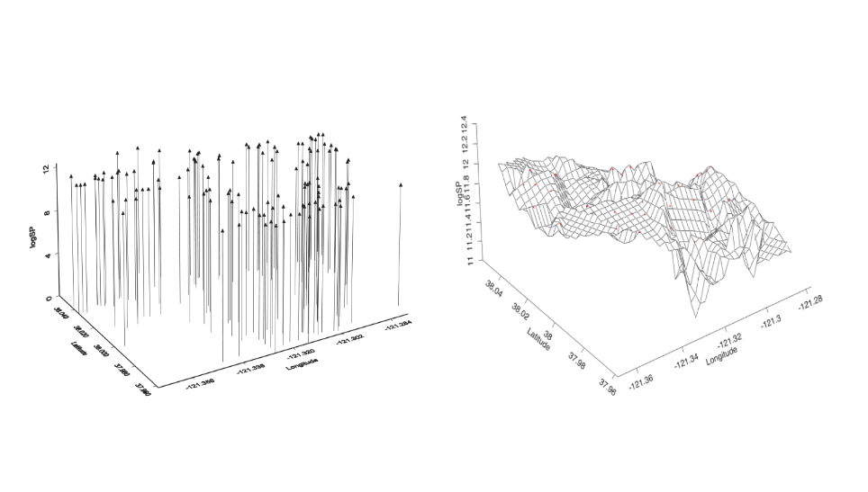
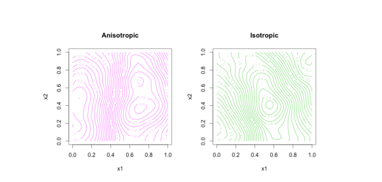
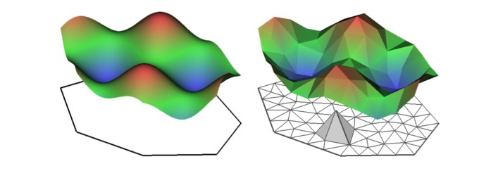
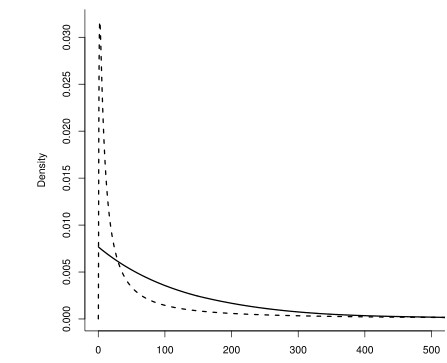

# Geostatistical Data Analysis {#prdm}

Geostatistical or equivalently point reference data are a collection of samples indexed by coordinates pertaining to a spatially continuous surface [@Moraga2019]. Coordinates might be in the form of Latitude and Longitude or Eastings and Northings, moreover they can be also unprojected with respect to a Coordinate Reference Systems (CRS e.g. lat and log), or projected (e.g. East. and North.).  Data as such can monitor a vast range of phenomena, e.g. accidental fisheries bycatch for endangered species [@CosandeyGodin2015], COVID19 severity and case fatality rates in Spain [@Moragacovid2020], PM10 pollution concentration in a North-Italian region Piemonte [@Cameletti2012]. Moreover a large geostatistical application takes place on Real Estate e.g. Boston house prices lattice data [@mass] are ingested by several spatial models [@rubiorealestate], or spatio-temporal modeling for apartment transaction prices in Corsica (FR) [@Ling]. All the examples taken before have implied inla and might have documented a spatial nature of data according to which closer observations were displaying similar values. This phenomenon is named spatial autocorrelation. Spatial autocorrelation conceptually stems from geographer Waldo Tobler whose famous quote, known as first law of geography, inspires geostatisticians:

> "Everything is related to everything else, 
> but near things are more related than distant things"
>
>  \hfill --- Waldo R. Tobler

Spatial data can be partitioned into three main types, even tough they all fall under the umbrella of inla algorithm, indeed each employs context specific tools.

- Areal Data
- **Point Referenced Data**
- Point Pattern Data

<!-- RESTful scraping API in \@ref(Infrastructure) allows to grab data containing point referenced coordinates as in fig. \@ref(fig:prdmap) by simply specifying the city or the zone desired according to the syntax in \@ref(docs). Moreover it is flexible enough to specify the number of observation, this may land a hand when the practitioner is dealing with complex models that are not able to ingest large amounts of data, or alternatively when the analyst's interest resides in only certain type of house characteristics. -->
In this chapter Gaussian Processes are seen as the continuous surface from which point referenced data are the partial realization. At first they are defined, then aer constrained to the properties of Stationarity and Isotropy. Furthermore they are considered with a suitable covariance function, i.e. Matèrn that uncovers convenient properties. These properties and the reason why Matérn is selected as candidate relies, besides its inner flexibility, on the fact that GP whose covariance function is Matérn are able to determine a GMRF \@ref(gmrf) representation of the process through the Stochastic Partial Differential Equations (SPDE) approach [@Lindgren2011]. The main benefit proceeding from a GP to a GMRF arises from the good computational properties that the latter appreciate enabling to wrap up modeling around INLA and consequently benefiting from its speed. Hedonic Price Models brings to the present analysis the theoretical foundation according to which covariates are added to the model. Then model criticism in the context of INLA is reviewed introducing two methodologies to assess model suitability based on predictive posterior distribution and deviance. In the end the prior choice falls on penalized complexity priors [@simpson2017] which constitutes a set of effective guidelines to choose priors that are compatible and natively implemented in INLA.

## Gaussian Process (GP){#GP}

Geostatistical data are defined as realizations of a stochastic process indexed by space.

$$
Y(s) \equiv\{y(s), s \in \mathscr{D}\}
$$
where $\mathscr{D}$ is a (fixed) subset of $\mathbb{R}^{d}$ (in the present work _Latitude_ and _Longitude_, i.e. $d=2$). The actual data can be then represented by a collection of observations $\boldsymbol{\mathbf{y}}=\left\{y\left(s_{1}\right), \ldots, y\left(s_{n}\right)\right\}$ (recall notation from previous chapter \@ref(LGM)) where the set $\left(s_{1}, \ldots, s_{n}\right)$ points to the spatial location where data has been observed. For example, following @Cameletti2012, let us assume to have collection of samples from air pollutant measurements obtained by observing a set of monitoring stations. Then The stochastic process $Y(s)$ is monitored in a fixed set of spatial indexes corresponding to the station locations (upword arrows left in figure \@ref(fig:prdproc)). This information is essential to interpolate points and build a spatially continuous surface (right panel in figure \@ref(fig:prdproc)) over the y-studied variable domain in order to predict the phenomenon at locations not yet observed [@LecturePaci]. Note that notation such as $Y(s_i)$ from now on will be discarded in favor of the subscript for the correspondent observation indexes i.e. $Y_i$.

The first step in defining a spatial model within INLA is to impose a LGM hierarchical structure which requires at first to identify a probability distribution function for the observed data $\boldsymbol{\mathbf{y}}$, i.e. higher level. The most common choice is to draw distributions from the _Exponential family_, indexed by a set of parameters $\boldsymbol\theta$ as in \@ref(LGM), accounting for the spatial correlation.
In the case of geostatistical data, the model parameters $\boldsymbol\theta$, following notation imposed in chapter \@ref(inla) are defined as a latent Gaussian Process (GP). Then a formal definition of GP is given,

\BeginKnitrBlock{definition}\iffalse{-91-71-80-32-100-101-102-105-110-105-116-105-111-110-93-}\fi{}
<strong>(\#def:GP)  \iffalse (GP definition) \fi{} </strong>A collection of $n$ random variables, such as $Y(s_{1}), Y(s_{2}) , \ldots, Y(s_{n})$ that are _valid_ and  _finite_ stochastic processes are said to be a **GP** if for any set of spatial index $n$ and for each set of corresponding locations $\left\{y\left(s_{1}\right), \ldots, y\left(s_{n}\right)\right\}$ follows a _Multivariate Gaussian_ distribution with mean $\boldsymbol{\mu}=\left\{\mu\left(s_{1}\right), \ldots, \mu\left(s_{n}\right)\right\}$ and covariance matrix $\mathbf{Q}^{-1}_{i,j}, \forall i \neq j$ defined then by a covariance function $\mathscr{\cdot, \cdot}$ i.e. 
\EndKnitrBlock{definition}

The latent GP are in function of some hyper-parameters $\boldsymbol\psi$ and their respective prior $\pi(\boldsymbol\psi)$. Moreover a GP is completely characterized by a mean $\boldsymbol{\mu}=\left(\mu_{1}, \ldots, \mu_{n}\right)^{\prime}$ and a spatially structured covariance matrix $\boldsymbol{Q^{-1}}$, whose generic element is $\boldsymbol{Q^{-1}}_{i j}=\operatorname{Cov}(\theta_{i}, \theta_{j})=\sigma^2_{\mathscr{\boldsymbol{\mathbf{y}}}} \mathscr{C}(\Delta_{i j})$, where $\sigma_{\mathscr{\boldsymbol{\mathbf{\xi}}}}^{2}$ is the variance component of the process and for $i, j = 1, \ldots, n$. $\mathscr{C}\left( \cdot, \cdot \right)$ function generally ensures that all the values that are close together in input space will produce output values that are close together, by inheriting the _validity_ and _positive definitness_ characteristics from the GP. The spatial stochastic process commonly is assumed to fulfill two important properties: **stationary**, **Isotropy** (even tough both of the two can be relaxed). 
A process is said **stationary** i.e. weak stationary, if process values at any two locations can be summarized by a covariance function $\mathscr{C(\Delta_{i j})}$ depending solely on the distance. In other words it is invariant under _translation_ [@Krainski-Rubio].
A process is said **Isotropical** if the covariance function depends only on the between-points distance $\Delta_{i j}=\left\|s_{i}-s_{j}\right\|$ (in this context _Euclidean_), so it is invariant under _rotation_ [-@Krainski-Rubio]. A further way of seeing this property is that Isotropy causes to stochastic processes concentric decaying contours [@LecturePaci], green in fig. \@ref(fig:isoovsanis), meaning the vanishing of spatial dependence [@Blangiardo-Cameletti], and so for covariance values. 

In spatial statistics the isotropical assumption is very frequent despite being restrictive for describing the rich variety of interactions that can characterize spatial processes. Anyway assuming the property it offers a wide range of underlying functions that can model spatial dependence for which three are the most common ones [@Krainski2018]

$$
\begin{aligned}
&\text { Exponential } \quad \mathscr{C}(\Delta_{i j})=\left\{\begin{array}{cl}
\tau^{2}_{\mathscr{C}}+\sigma^{2}_{\mathscr{C}} & \text { if }  \Delta_{i j}=0 \\
\sigma^{2}_{\mathscr{C}} \exp (-\phi_{\mathscr{C}} \Delta_{i j}) & \text { if } \Delta_{i j}>0 
\end{array}\right.\\
&\text { Gaussian } \quad \mathscr{C}(\Delta_{i j})=\left\{\begin{array}{cl}
\tau^{2}_{\mathscr{C}}+\sigma^{2}_{\mathscr{C}} & \text { if } \Delta_{i j}=0 \\
\sigma^{2}_{\mathscr{C}} \exp \left(-\phi^{2}_{\mathscr{C}}  \Delta_{i j}^{2}\right) & \text { if } \Delta_{i j}>0 
\end{array}\right. \\
&\text { Matérn } \quad \mathscr{C}(\Delta_{i j})=\left\{\begin{array}{cl}
\tau^{2}_{\mathscr{C}}+\sigma^{2}_{\mathscr{C}} & \text { if } \Delta_{i j}=0 \\
\frac{\sigma^{2}_{\mathscr{C}}}{\Gamma(\nu) 2^{\nu-1}}(\phi_{\mathscr{C}}  \Delta_{i j})^{\nu} K_{\nu}(\phi_{\mathscr{C}}  \Delta_{i j}) & \text { if } \Delta_{i j}>0
\end{array}\right.
\end{aligned}
$$

where all the parameters above are special quantities derived from the emphirical variogram. $\sigma^2$, $\tau^2$,  $\phi^2$,  and  are respectively the _range_, the distance at which correlation vanishes, the _nugget_, i.e. the non spatial variance and the _partial sill_, i.e. the spatial effect variance [@LecturePaci].
In particular the focus is on the _Matérn_ – as it is required by the SPDE approach in section \@ref(spdeapproach) – and this should not be intended as a restriction. In fact, as long described in @gneiting2006geostatistical, the Matèrn family is a very flexible class. Matérn is tuned mainly by two hyper-parameters, a scaling one $\phi>0$, usually set equal to the range of the spatial process $\sigma^{2}_{var}$ i.e. the distance at which the spatial dependence becomes negligible, by the empirically derived relation $r =\frac{\sqrt{8 \lambda}}{\kappa}$), and a smoothing one $\nu>0$ usually kept fixed.  An _isotropical_ and _stationary_ Matérn covariance expression by isolating the variance of the spatial process $\sigma_{\mathscr{\boldsymbol{\mathbf{\xi}}}}^{2}$ is:

$$
\begin{aligned}
\text { Matérn } \quad \mathscr{C}( \Delta_{i j})= \sigma_{\mathscr{\boldsymbol{\mathbf{\xi}}}}^{2} \left\{\begin{array}{cl}
\tau^{2}_{\mathscr{C}} & \text { if } \Delta_{i j}=0 \\
\frac{1}{\Gamma(\nu) 2^{\nu-1}}\left(\phi \Delta_{i j}\right)^{\nu} K_{\nu}\left(\phi \Delta_{i j}\right)& \text { if } \Delta_{i j}>0
\end{array}\right.
\end{aligned}
$$

$\Gamma(\nu)$ is a Gamma function depending on $\nu$ values and $K_{\nu}(\cdot)$ is a modified Bessel function of second kind [@yaşar2016unified]. The scaling parameter $\phi$ in figure \@ref(fig:matern) takes 4 different values showing the flexibility of Matérn to relate different distances according to varying parameters, while $\nu$ is kept to the value of $.5$ and addresses the GP degree of smoothness.
Looking at the functions in figure \@ref(fig:matern) and their interception with horizontal red line, when $\phi = 1$, it smoothly falls towards 0 covariance and spatial dependece decays at $\approx 2.3$. When $\phi = 1/2$ it becomes the exponential covariance function and rapidly pushes covariance to 0, When $\phi = 3/2$ it uncovers a convenient closed form [@LecturePaci] for which spatial dependence vanishes at $\approx 3.8$. When $\phi \approx \infty$, (here $\phi = 80$ for graphics reasons), it becomes Gaussian covariance function. In the the case shown in section \@ref(spdeapproach) $\sigma_{\mathscr{C}}^{2}$ the range, for any $\phi$, is set equal to the distance at which dependence vanishes below .1, which is actually what the red line points out.

<!--  -->

 

In the end summarizing the result obtained (abuse of notation with $(s)$ to make it clear that is a spatial process) in chapter \@ref(inla) with what it has been seen so far, the Gaussian process $y(s)$ assumes the following measurement equation, where $\xi_{i}$ is the latent field, $\varepsilon_{t} \sim N\left(\mathbf{0}, \sigma_{\varepsilon}^{2} I_{d}\right)$ is the white noise error and $I_{d}$ is an identity matrix and $\xi(\boldsymbol{s})\sim N\left(\mathbf{0}, \boldsymbol{Q^{-1}}=\sigma_{\xi}^{2} \mathscr{C}( \Delta_{i j})\right)$.

$$
y(s)=\boldsymbol{z}(\boldsymbol{s}) \boldsymbol{\beta}+\xi(\boldsymbol{s})+\varepsilon(\boldsymbol{s})
$$

## The Stochastic Partial Differential Equation (SPDE) approach{#spdeapproach}

Locations in the spatial setting are considered as realizations of a stationary, isotropical unobserved GP to be estimated (\@ref(GP)). Before approaching the problem with SPDE, GPs were treated as multivariate Gaussian densities and Cholesky factorizations were applied on the covariance matrices and then fitted with likelihood [@LecturePaci]. Covariance matrices in the context of spatial and spatio-temporal models [@PACI2017149; @Cameletti2012] are $n \times n$ dimension matrices defined by the number of observations at each single point location (at each time stamp in spatio-temporal) [@BLANGIARDO201339]. Covariance matrix as such are very dense and they were scaling with the order of $\mathcal{O}\left(n^{3}\right)$ [@Banerjee-Gelfand]. Problem were linked to the computational costs needed for linear algebra operations for model fitting and spatial interpolation as well as prediction [@Cameletti2012], having led to obvious _big-n_ problem. 
The breakthrough came with @Lindgren2011 that proves that a stationary, isotropical (can be both relaxed at the cost of different settings) GP with Matérn covariance can be represented as a GMRF using SPDE solutions by Finite Element Method [@Krainski-Rubio]. In other words given a GP whose covariance matrix is $\boldsymbol{Q^{-1}}$, SPDE can provide a method to approximate $\boldsymbol{Q^{-1}}$ without the previous computational constraints. As a matter of fact SPDE are equations whose solutions are GPs with a chosen covariance function focused on satisfying the relationship SPDE specifies [-@Krainski-Rubio].
Benefits are many but the most important is that the representation of the GP through a GMRF provides a sparse representation of the spatial effect through a sparse precision matrix $\boldsymbol{Q}$ . Sparse matrices enable convenient inner computation properties of GMRF \@ref(approx) which are exploited by INLA algorithm \@ref(inla) leading to a more feasible big-O $\mathcal{O}\left(n^{3 / 2}\right)$. Mathematical details and deep understanding of the equations in SPDE are beyond the scope of the analysis. Luckily enough R-INLA has a set of functions that makes clear to the practitioner the minimal requirements to pass from discrete locations to their continuously indexed surface alter-ego. 
As a result of SPDE the spatial Matérn field i.e. the spatial process $\xi(\boldsymbol{s})$ becomes $\tilde\xi(\boldsymbol{s})$, where the precision matrix $Q$ comes from the SPDE representation [-@Cameletti2012].

In few words SPDE approach uses a finite element (FEM method) representation to shape the Matérn field as a linear combination of basis functions defined on a triangulation (Delaunay) of the domain $\mathcal{D}$  [-@Cameletti2012], also named _mesh_. What it internally does is splitting the domain $\mathcal{D}$ into a number of non-intersecting triangles which converge in a common edge or corner. Then the initial vertices of the triangles are set at $s_1 \ldots s_d$. In order to get a proper triangulation, useful for spatial prediction, additional vertices are then added. The more vertices are added the more the triangulation is accurate since many more triangles can better interpolate the surface reaching more complex shapes. On the other side the more are the triangle the more it will take to compute the mesh and INLA performances can be damaged.

Secondly SPDE maps with a Projection matrix the values of the triangulation to the discretized spatial surface with weighted sum of areas of the underlying triangles. 

:::bulb
A less superficial intuition on how SPDE computes triangularizes values and how it uses the projection matrix based on a weighted sum of basis functions to inject the triangulation into the GRMF is offered in the appendix in section \@ref(triangular).
:::

To illustrate the concept of triangulation @Cameletti2012 provide a scatterplot for Piemonte PM10 concentration observed at 24 monitoring stations left in figure \@ref(fig:piepm10). Its respective mesh using 123 vertices and Piemonte borders is in right figure \@ref(fig:piepm10). 

Any triangle height (the size of the spatial field at each vertex triangle) is calculated by weighted sum, with linear interpolation deciding the values within the triangle. Figure \@ref(fig:spdesurf) shows a continously indexed random spatial field (left side of figure \@ref(fig:spdesurf)) with the corresponding SPDE on the basis of a triangulation (right panel \@ref(fig:spdesurf)).

In INLA mesh triangularization of the region of the study is performed within the function `inla.mesh.2d()`. Main arguments are: 

- `loc`: the coordinates used as initial vertices of mesh,
- `boundary`: the borders of the region of the study $\mathscr{D}$
- `offset`: the distance between data positions, which determines the inner and outer extension size,
- `cutoff`: minimum distance between points approved.
- `max.edge`: value that suggest the current maximum triangle edge lengths in the area and extension. This argument is on the same scale unit as coordinates.
- `min.angle` the opposite of max.edge 

Moreover the mesh can also be built on non convex study area by prior passing coordinates on `inla.nonconvex.hull()` which are then sent back to the `inla.mesh.2d()`. A convex hull is a polygon of triangles out of the domain area, in other words the extension made to avoid the boundary effect. If borders are available (and they are) are generally preferred over non convex hull meshes. A decent mesh must have triangles of size and shape as regularly as possible [@Krainski-Rubio].

## Hedonic (rental) Price Models

The theoretical foundation of the Hedonic Price Models (from now on HPM) resides in the consumer utility theory of @Lancaster together with @Rosen market equilibrium. According to Lancaster the utility of a commodity does not exist by itself, instead it exists as the sum of the utilities associated to its separable characteristics. Integrating Lancater, Rosen introduces HPM and suggests that each separate commodity characteristics are priced by the markets on the basis of supply and demand equilibra. Applying HPM to Real Estate in a market context, from the buy side house prices (indeed also rents) are set as the unit cost of each household attributes, conversely from the selling side the expenditures associated to build of each them.
Formalizing the results, Hedonic Price $P$ in Real Estate is expressed as a general $f$ functional form that takes as input the house characteristics vector $\mathbf{C} = \{c_1,c_2, c_3, \ldots c_n\}$. 

$$P=f\left(c_{1}, c_{2}, c_{3}, \ldots, c_{n}\right)$$

Vector $\mathbf{C}$ since now might contain a unidentified and presumably vast number of ungrouped characteristics. In this setting @Malpezzi tried to organize house features by decomposing $\mathbf{C}$ into mutually exclusive and exhaustive subgroups. The vector components involves the house price $P$, which is in a $f$ relation with: $S$, the structural characteristics of the house, $N$, the neighborhood characteristics, $L$, the locational characteristics, $C$, the contract conditions and $T$ time dimension (not included in the model). $\beta$ is the vector of the parameters to be estimated. Therefore:

$$P=f\left(S, N, L, C, T, \beta\right)$$
However the critical part of studying house characteristics in geostatistics is the _estimation_ and a recent (and not recent) number of emerging trends are observed [@SHEPPARD19991595]. Trends, other than the methods presented in this analysis suggests semi-parametric or non-parametric methods and applications of spatial econometrics @Ling. Researchers would also contend with problems ranging from variable selection to model specification [-@Ling].
For semi-paramametric models a local polynomial regression is developed by @clapp. The model provides a nonlinear term for the measurement of housing position values dependent on latitudes and longitudes.
Proper geoadditive models family was originally proposed by Kammann and Wand [-@kammanwand], which offers a combination of additive modeling [@buja1989] and a geostatistical component. As Ling [-@Ling] points out the candidates for the spatial component are many, e.g. kriging component [@dey2017metamodel] (which will be then subsituted with a GP \@ref(GP)) or a smooth spatial trend component based on a tensor product of longitude and latitude for which @basilebenfratmcast have investigated European industrial agglomeration externalities. The model outshines the other parameteric model performances by better managing spatial unobserved patterns. Furthermore they made available a third study dimension which is time [-@Ling]. 
Spatial econometrics' evolution trends are seen in @spateconomshifei and lately in @spateconanslein where point referenced data are modeled with endogenous time varying spatial weights matrices and unobserved common factors and ultimately are fitted with traditional bayesian estimation methods as MCMC [-@spateconanslein].
Then two further interesting modeling approach does not fall perfectly in the categories, but are higly considered in literature within the Hedonic Price models. @dubelegros recognize that the modeling tools available analyzing point referenced data were not sufficient to take into account all the dimensions according to which they want to evaluate the phenomenon. They acknowledge that _Moran's I_ index and his statistics test relies mainly on an exogenous specification of a spatial weights matrix [-@dubelegros]. As a result they assemble a spatio‐temporal weights matrix to evaluate spatial dependence through Moran's I index whose application is on real estate data (selling) for Québec City from 1986 to 1996. The second approach was addressed in @baltagiparis whose object is price estimation based on flats sold in the city of Paris over the period 1990–2003. This is a rich and unbalanced pseudo‒panel data which are modeled with spatial lag. Results displayed a nested structure of the Paris housing data, which have been tested with likelihood ratio. A similar approach was followed by Nardelli and Arbia [@arbia2020spatial] which collected crowdsourced as well as webscraped (as in section \@ref(scraping)) data and lately applied Spatial Lag Model (SLM) on a "post-sampled" [@arbia2020postsampling] version of the same. As a result bias in the model is diminished, indeed variance of the estimators is increased.
<!-- Historically a first attempt to include spatial effect in urban economic literature is provided by _Alonso (1964) miss ref_. Its contribution was to raise voice on house prices (also rent) mainly depending on land price and a number of purely spatial covariates like CBD, the distance from City Business District. Other covariates were transport cost per kilometer and community income, even though they were defined also as spatial parameters through distances. The model proposed by Alonso is called monocentric since the centroid from which distances are calculated is only one. Moreover a first touch to spatial data theory was done since the CBD was defined as areal unit with well-defined boundaries of regular or irregular shape. However applications of the model were not convincing since empirical studies offered a different picture. Results displayed a Poly-centric areal structure (universities and Malls) which might be better explaining the variance of prices. The model also assumed that covariates like CBD are only informative within city center boundaries and then show no significance out of the core of the city. Poly-centric theory was also more coherent with the architectural and socio-economical evolution of cities during that times, therefore mono centric theory was then criticized and abandoned. Critics regarded also neighborhood quality measure and boundary problems _Dubin (1987) miss ref_. Dubin for these reasons developed a model including areal effects in the error term since handling these covariates was posing several hard challenges. Areal data choice for Dubin was forced since he was interested in land values, geostatics interest was not a focus also due to the difficulties in gathering accurate data. Coming to recent literature a change in focus has been made by switching from theory based model to estimation methods. As a consequence to the change in focus @Ling said that practitioners should spend more time in variable selection and model specification with respect to their specific need.  -->
<!-- As Ling has observed the emerging trends are in the field of semi-parametric and non-parametric methods -@Ling. Historically semi-parametric regression considers models indexed by spatial coordinates _Pace RK (1995)_. At the same time _Kammann and Wand (2003)_ gave birth to geoadditive models where the spatial component is added as a covariate. [...] -->
A further aspect of the problem is posed by scholars not considering rents to be representative for the actual value of the real estate due to heavier legislation on rent and indebtedness (for selling). As a consequence predictors choice and functional relatioship should be different from the selling. Nevertheless in many empirical analysis rent values are considered as a proxy for real estate pricing when considered in long-run [@Herath_Maier_2011]. A further argument to endorse this hypothesis is brought by @sellingVSrental considering housing a commodity, then the selling or the rental option should be interchangeable economic actions with respect to same inner need to be satisfied. This assumption is also stronger in this context since Manganelli, Morano, and Tajani have centered their analysis on italian Real Estate data. Moreover @Capozza_Seguin_1996 discussed on how much rent-price ratio predicts future changes both in rents and prices. Among all the other points raised they brought the decomposition of rent-price ratio into two parts: the predictable part and the unexplained residuals part. The predictable part was discovered to be negatively correlated with price changes, in other words cities in which prices are relatively high with respect to rents are associated with higher capital gains that might justify that misalignment. This is also true for the opposite, that is cities in which prices are lower with respect to the rents, and this effect can not be associated to any local condition, realize lower capital gains. A further argument is offered by Clark [@Clark_1995] which went after the Capozza and Seguin work. Rent-price ratio is negatively correlated with following future changes in rents. In other words prices are still higher when areas in which they are observed documents an increase in rent prices.

## Model Criticism{#criticism}

Since INLA can fit a wide range of models then the flexibility should be reflected by a mouldable tool to check model suitability. Model criticism may regard the research on which variables are used in the model, which assumptions are made on parameters and on the likelihood as well as the prior choice addressed in \@ref(priorsspec).  However here are two common _modi operandi_ which are also implemented inside inla: one based on predictive distribution and the other on deviance. Note that all specifications mentioned in this analysis can be determined by setting the option in `control.compute`.

### Methods based on the predictive distribution{#predbase}

One of the most used method to assess Bayesian model quality is LOOCV, i.e. Leave One Out Cross Validation and it is also default choice in INLA. Assume to have $\boldsymbol{y}$ data from which it is left out one single $y_i$ observation, as a result the assessment set is $\boldsymbol{y}_{A} = \boldsymbol{y}_{-i}$ and the validation set is ${y}_{V} = y_{i}$, where the notation is the same for chapter \@ref(inla). Two metrics are assumed to be demonstrative:

- CPO Conditional Predictive Ordinate [@petit1990]: $CPO_{i} = \pi(y_{V} \mid \boldsymbol{y}_{A})$, For any observation the CPO is the posterior probability of observing the left out $y_{V}$ when the model is fitted with $\boldsymbol{y}_A$ assessment set. High values imply that the model suits well the data, while small values indicate a poor fit, i.e. outlier. [@Bayesian_INLA_Rubio]. The negative log-summation (LPML @lpml) of each CPO gives a cross-validatory summary measure of fit [@wang2018bayesian] i.e. $-\sum_{i=1}^{n} \log \left(C P O_{i}\right)$
- PIT Predictive Integral Transform [@marshall2007]: $PIT_{i} = \pi(y_{V} < y_{i} \mid \boldsymbol{y}_{A})$. PIT computes the probability of a new response value being smaller than the observed real value and it is calculated for each left out observation:

Inla also provides for both of the predictive methods an inner functionality to automatically handle abnormalities while computing the two quantities. Inla encodes values with 1 when predictions are not reliable, otherwise they are set equal to 0. Moreover the empirical distribution of the PIT can be used to asses predictive performance: if it is Uniform, so there are not values that significantly differ from the others then the model suits the data. Otherwise if the distribution almost approximates any of the other one then the "out of the bag" prediction suggest a model miss-pecification. 

For example assume to have data from a 1970's study on the relationship between insurance redlining in Chicago and racial composition, fire and theft rates, age of housing and income in 47 zip codes (inherited by `brinla`[@brinla]). Assume also to fit a linear model whose response is "involact" being new FAIR plan policies and renewals per 100 housing units and the rest are predictors, i.e. $involact \sim race + fire +theft + age + \log(income)$.
Then the resulting LPML is: -20.6402106
Furthermore in left panel of fig. \@ref(fig:pitcpo) the resulting cross-validated PIT resembles a Uniform distribution which is also highlighted whose density is highlighted in tone in the lower part. In the right side a Quantile-Quantile for a Uniform (whose parameter are mean 0 and std 1) plot evidences how much the points are attached to the diagonal, confirming the well behaved model.

 

Posterior Predictive checking methods [@gelman1996posterior] exploit a full cross-validation where $\boldsymbol{y}_{A} = \boldsymbol{y}_{V}$, operating on the full set of observation. The statistics capitalized below are quite commonly used in practice, but they are high context dependent:

- the _posterior predictive distribution_: $\pi(y^{\star} \mid \boldsymbol{y})  = \int \pi(y^{\star} \mid \theta_{i})\pi({\theta_{i}} \mid \boldsymbol{y})\mathrm{d}\theta_{i}$ which is the likelihood of a replicate observation. When values are small that indicates that are those values are coming from tails, since the area under the curve (i.e. probability) is less. If this happens for many observation then outliers are driving the model leading to poor estimates
- the _posterior predictive p-value_ whose math expression is:$\pi(y^{\star} \leq y_{i} \mid \boldsymbol{y})$ for which values near to 0 and 1 indicates poor performances. 
- the _Root Mean Square Predictive Error RMSE_: $\sqrt{\frac{1}{n} \sum_{i=1}^{n}(y_{i}-{y}^{\star}_{i})^{2}}$
- $R^2$

R-INLA has already antiticipated in chapter 4 section\@ref(example) have dedicated function to compute statistics on posterior distribution e.g. `inla.pmarginal()` returning the cumulative density distribution.

### Deviance-based Criteria{#devbased}

If there is an interest in comparing multiple models, then their deviance may be used. Given data $\boldsymbol{y}$ and its likelihood function, along with its parameters $\boldsymbol\theta$ then the _deviance_ is:

$$
\mathrm{D}(\theta)=-2 \log (\pi(\boldsymbol{y} \mid \theta))
$$

The model's deviance tests the likelihood variability conditioned to its parameters. Since this is a random variable tt can be analyzed by several statistics such as mean, median, mode etc. The most used is the posterior mean deviance i.e.$\overrightarrow{\mathrm{D}}=E_{\theta_{\mid y}}(\mathrm{D}(\theta))$ which is also robust [@Blangiaro-Cameletti]. Indeed it suffers from cost complexity, as a result DIC proposed by @spiegelhalter2002bayesian adds to the deviance a penalization for complex model i.e. $p_{\mathrm{D}}=\mathrm{E}_{\theta_{\mathrm{y}}}(\mathrm{D}(\theta))-\mathrm{D}\left(\mathrm{E}_{\theta_{\mathrm{y}}}(\theta)\right)=\overline{\mathrm{D}}-\mathrm{D}(\bar{\theta})$ from which, following @Blangiaro-Cameletti obtain,

\begin{equation}
  \mathrm{DIC}=\overline{\mathrm{D}}+p_{\mathrm{D}}
(\#eq:dic)
\end{equation}

Data is best served in models with small-scale DICs and the correspondent INLA option setting is analogous to the ones seen sec. \@ref(predbase). INLA moreover take advantage of the hierarchical structure and computes different posterior deviances for latent parameters i.e. mean  and hyper parameters i.e. mode (due to skewness). For further discussions @spiegelhalter2014deviance oppose DIC with other criteria for model comparison. Finally the Watanabe Akaike information criterion (WAIC) which is more Bayesian orthodox in setting up the criteria, for this reason is also more preferred [@gelman2014understanding].

## Penalized Complexity Priors{#priorsspec}

The priors choice is the most central part of a Bayesian analysis and at the same time the weakest since any selection might be criticized. Priors expression involves a considerably high amount of subjectivity and domain experience which may be imported from other comparable literature works or results. However according to purists Bayesian priors should be decided _a-priori_, without either looking at the data, nor the posterior results. This can be tedious since many models are sensitive to priors, as evidenced in the example in sec. \@ref(rinla). Priors may negatively impact posteriors when are 
wrong and they usually require a later revision. The choice in this context is also more difficult since it is also constrained to LGM requirements for which the latent field demands them to be jointly Gaussian.
@simpson2017 provide a solid backbone knowledge on priors specification in Hierarchical models by setting up 4 guidelines principles on top of which it is built a new prior class called Penalized Complexity (PC) priors. Before jumping into the principles it is needed an abstract concept that goes by the name of “base model". For a general density $\pi(\mathbf{y} \,| \,\xi)$ which is controlled by a flexibility parameter $\xi$ the base model is the most uncomplicated one in the class. Following the notation this would be the model corresponding to $\xi = 0$. The base model ideally grabs the parameter choice with the lowest possible complexity given the model and set it as a ground benchmark. The following example regards base model for a a Gaussian Random effect and it considers a multivarite gaussian distributed with mean **0** and precision matrix $\tau \boldsymbol{Q}$, i.e.  $\mathbf{y} \mid \xi \sim \operatorname{MVN}(\, 0\, ,\,\tau \boldsymbol{Q})$, where $\tau=\xi^{-1}$. The base model tries to put the mass [-@simpson2017] on $\xi = 0$ since the base model in this case is a model without the random effect. At this point it is possible to present the building blocks, first priciple is _Occam’s razor_ according to which priors should be weighted down in fuction of the distance between the added complexity and the base model i.e. simpler models are preferred. The second principle regards how it is measured complexity whose solution is found in KLD (Kullback–Leibler divergence), calculating distance $d$ from base model. KLD in this context along with principle 1 affirms that the prior shall have high mass in areas where replacing the base model with the flexible model will not cause any information loss. Principle 3 is constant rate penalization as names suggest relates the distance $d$ to a constant rate penalization whose assumption implies an exponential prior on the distance scale, i.e. $\pi(d) =  \lambda \exp (-\lambda d)$. In the end, the PC prior is described in the required scale with probability statements on the model parameters. Statement regards the selection of two further user defined (here the subjectivity) hyper-parameters, $U$ regulating the tail event and $\alpha$ the mass to put to this event such that $\operatorname{P}(Q(\xi)>U)=\alpha$. A prior satisfying all the requirements is said Penalized in Complexity.
Priors of this class should be then derived with respect to the specific content they are needed. In this context PC priors are seen for Gaussian Random effect, i.e. the GP \@ref(def:GP) modeling spatial dependence for which a precision hyper parameter is demanded. The PC prior for the precision $\tau$ is on standard deviation scale $\sigma=\tau^{-1 / 2}$.  
Then the GMRF latent field has mean 0 and covariance matrix $\boldsymbol{Q^{-1}}$, i.e. $\boldsymbol{\theta} \sim \mathcal{N}\left(\mathbf{0}, \tau^{-1} \boldsymbol{Q}^{-1}\right)$. The base model considers the absence of the random effect which implies $\tau \rightarrow \infty$. Then the derived PC prior [@simpson2017] takes the form of an exponential distribution, i.e. "type-2 Gumbel distribution" eq: \@ref(eq:exponential), whose rate parameter is $\lambda$ determining the severity of the penalty when diverging from the base model. Note that the parameter $\lambda$ is on the standard deviation scale (in contrast to the Gamma on the precision seen in \@ref(rinla)).

\begin{equation}
  \pi(\tau)=\frac{\lambda}{2} \tau^{-3 / 2} \exp \left(-\lambda \tau^{-1 / 2}\right), \tau>0
(\#eq:exponential)
\end{equation}

The distribution depends on a rate parameter $\lambda$ that regulates the penalty according to the probability natural criterion [@slides] $\operatorname{Prob}(\tau^{-\frac{1}{2}} > U)=\alpha$. $U$ in this case is an upper limit for the standard deviation (being in the base model) and $\alpha$ a small probability. The probability statement aforementioned implies the follwing realtion $\lambda=-\ln (\alpha) / U$. Some further investigations of @simpson2017 acknowledged that parameters upper bounds for $\tau$ are $U = 0.968$, and $\alpha = 0.01$, where alpha regulates the importance of the prior believe. Ideally it would be picked up $U$ drawing on previous experience. Indeed a reasonable choice in the absence of knowledge might be taking the semivariogram range \@ref(GP), i.e. where the spatial dependece disappears.
PC priors are natively implemented in INLA and are shown to be well suited for the modular additive definition [@Bayesian_INLA_Rubio]. As a consequence they are selected as prior candidates with a reasonable $U$ selection and no sensitivity analysis is performed i.e. evalutaing posterior disstribution while prior are changing.

<!--  -->

Fig. \@ref(fig:priorfun) indicates various PC priors using several $\alpha$ values for the precision $\tau$. Note that increasing $\alpha$'s values contribute to a stronger prior belief for $U$ which then leads to a higher conviction of $\tau$.

<!-- PROVA A METTERE ESEMPIO SPDETOY -->
 

